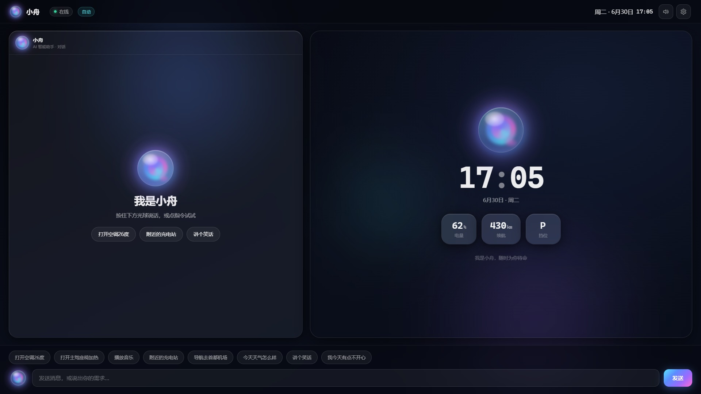
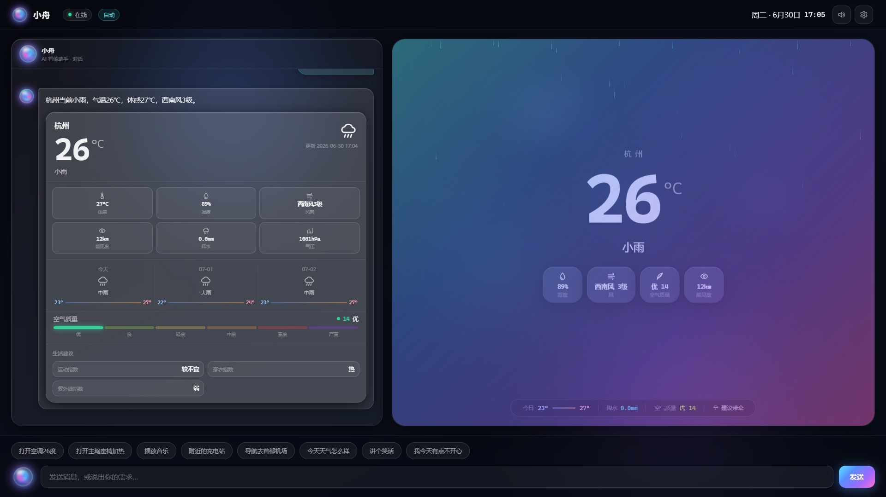
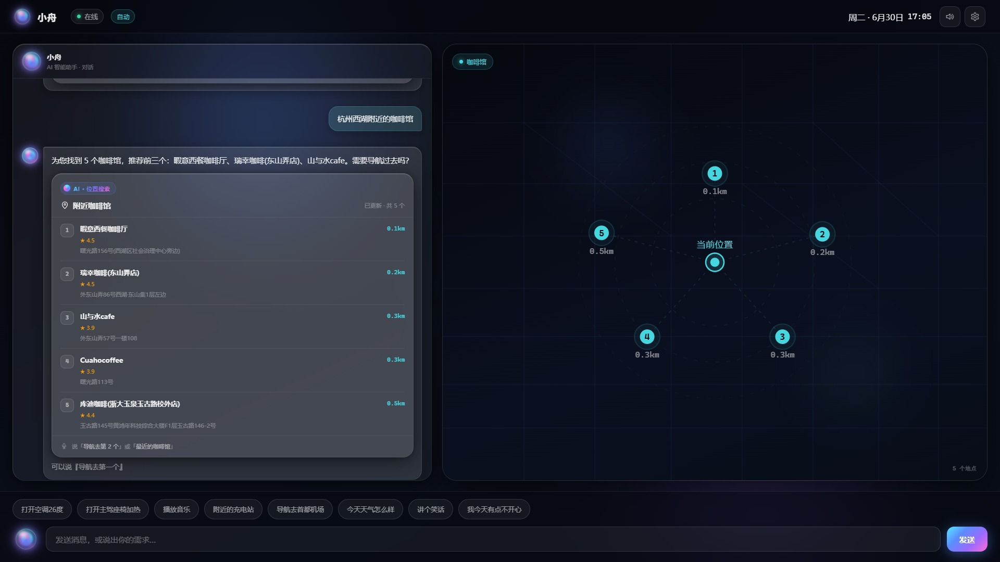
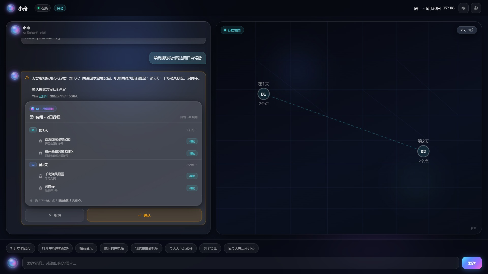
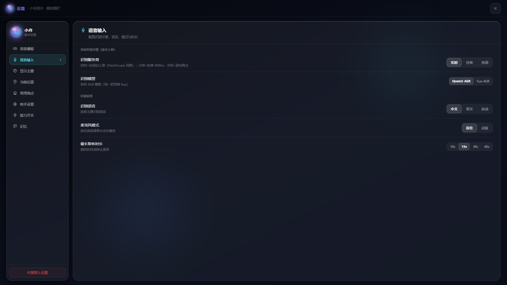

# 智能座舱 Multi-Agent 系统

云边协同的智能座舱 AI Agent 工程。系统采用分层混合编排：

- **T0 端侧快路径**：车控、媒体等高频确定性指令本地执行，离线可用。
- **T1 云端 DAG**：复杂、跨域、多意图请求由 LLM Planner 一次规划后确定性执行。
- **T2 有界循环**：需要根据中间结果调整计划的请求进入有迭代和时间预算的循环。

所有 Agent 使用统一 gRPC 契约和 Manifest，经注册中心发现。云端只生成意图与计划，
所有车控最终都必须经过端侧 VAL 校验和执行。

## 界面预览（HMI · Aurora Glass 极光液态座舱）

横屏 1920×1080 两栏（左对话流 + 右「上下文舞台」随对话切换场景）、液态玻璃材质、极光签名渐变、「小舟」光球化身；信息卡按 Figma 源逐张重建，**气泡 ↔ 卡片 ↔ 右舞台**三者联动。



| 天气（卡片 + 右舞台 WeatherStage 活场景） | 附近 POI（卡片 + 右舞台测距地图，「第N个」联动） |
|:---:|:---:|
|  |  |
| **行程规划（结构化行程卡 + 危险操作确认条 + 行程地图）** | **设置（横屏侧栏 + 语音识别引擎/模型切换）** |
|  |  |

> 截图均为**真实后端数据**（天气=和风、POI/行程=高德）。本地起栈后访问 `http://localhost:5173` 可交互体验——按住「小舟」光球即可语音**流式实时上屏**。

## 当前状态

截至 **2026-07-08**：

- Phase 1 的工程化 PoC 主干与云端中枢 P0-P3 已落地；原始 Phase 1
  计划中的量产级能力仍有明确 backlog。
- `DispatchToEdge`、T2 有界循环、确定性工具已实现；权限为规划期（catalog 过滤）+ 执行期
  （dispatch 硬拒）**同源单轨校验**（`security/permission.py::check_permission`，R2.2）。
- 端侧混合意图支持按语义组分流，本地动作与导航/媒体慢意图可在同一请求中协同执行。
- HMI 支持文字流式渲染和**服务端流式 TTS**：文本增量进、PCM 音频分片出、无缝拼播（DashScope cosyvoice/qwen + MiMo v2.5 / MiniMax 四引擎可切，首帧 <1s），无凭据无感回退句级批处理。
- **信息类 Provider 全面落地**：导航=高德 / 天气=和风(JWT) / 搜索=Exa 正文级检索(AnySearch→Bing 降级) / 新闻=Exa 优先(SerpApi 兜底) / 赛事=api-football / 股票=Tushare，真实凭证冒烟通过，无凭证回退 mock。搜索经接地合成（强制引用、无依据诚实弃权），新闻以 TTS 播报式编号速览呈现。
- **HMI 信息类 UI 卡片**：天气/股票/新闻/搜索/赛事/POI 结构化卡片（搜索/新闻为「气泡给结论、卡片给证据」），全链路 ui_card 透传。
- **复杂任务动态思考 + 过程区**：行程/深度调研/多步等按统一 `is_complex` 判据动态对 LLM
  开思考提质，HMI 气泡内嵌四阶段可折叠「过程区」（理解需求→规划步骤→执行任务→整理结果，
  行车/泊车双态、脱敏不露 reasoning）；普通车控/闲聊零过程零额外延迟。
- **记忆系统分层重构**：从 mock KV 升级为 pgvector 语义记忆——自动从对话抽取偏好/个人实体（宠物·家人称呼也能记），语义召回注入规划、闲聊记忆感知作答，主动 routine 建议经 NATS→HMI，常去地点收敛、隐私分级+一键删除；embedding 走 llm-gateway→阿里云百炼 text-embedding-v4（真语义实测，无 key 降级 lexical）。详见 `docs/design/2026-06-25-memory-system-redesign.md`。
- **上下文系统重构**：承接记忆重构后裸着的 working/core 层——统一 `ContextManager` 把 catalog（registry 语义预筛）、对话历史、长期记忆召回、结构化焦点态装配于统一 token 预算；跨轮指代靠结构化焦点态而非啃原文；敏感上下文（精确位置/电量）按 Agent manifest `context_scopes` 最小化下发。详见 `docs/design/2026-06-25-context-system-redesign.md`。
- **通讯链路量产级加固**：全链路 gRPC keepalive（共享 `runtime/grpcio.py` 工厂，空闲也 ping，根治依赖重启换 IP 后的断连/无响应）+ 全服务优雅停机 + HMI 韧性（指数退避重连/断线有界发送队列不丢消息/请求看门狗）+ 熔断接线（开路快速失败 + Dashboard 可视化）+ LLM 网关连接池/流式 stall + 依赖连接加固（Redis/PG/NATS）；并修复一处危险车控确认退化（catalog 预算裁剪误丢 edge 车控核心）。真栈韧性自愈验证：依赖换 IP 不重启依赖方即恢复（Python 侧 `_reset_channel` + Go 网关显式重连，dns:/// 自动重解析单独不可靠）。详见 `docs/design/2026-06-25-comms-link-hardening.md`。
- **行程规划结构化重构**：从「LLM 自由文本行程」升级为**结构化可执行行程对象**——LLM 只提议骨架、确定性流水线接地真实 POI + 按真实电量沿路线编织充电点 + 校验每日车程，消灭幻觉景点（对症 TravelPlanner 基准纯 LLM 规划 0.6% 通过率）；每个停靠点可一句话导航（「下一站」「导航去第二天的 X」）、支持局部改某天不漂移、在途状态查询与「时间不够」自动精简，行程状态落记忆服务跨轮存续。护城河是车辆接地 + 在途编排（而非行前研究）。详见 `docs/design/2026-06-26-trip-planner-redesign.md`。
- **信息域深度调研重构**：新建独立 `deep-research` Agent——把「LLM 提议/确定性落地」纪律下沉为四段流水线（LLM 拆多视角子问题→有界并行迭代检索→分节接地报告→渐进语音简报 + 可读报告卡），对症单轮检索的多跳天花板；联网查询分层（普通「搜一下」秒回、深问「深入调研 X」自动升档 research.run）；接地「我」（位置/画像作研究约束）、多轮深挖（「展开第 N 点」聚焦不重跑）、新闻（信源权威重排沉内容农场、相对时间归一为绝对、卡片一屏可扫读标题+摘要+来源时间）个性化与「详细讲讲第 N 条」深挖桥接、晨间主动早报雏形、**异步分钟级深调研**（明示「不急/查完告诉我」即秒级受理，后台跑更深报告越过 ~90s 同步上限，完成经 `agent.proactive` 把可读报告卡主动推回车机）、**信源质量加权**（域名权威分层：学术/官方/百科优先、权威媒体次之、内容农场下沉，报告来源与引用以最权威打头；深度异步对薄弱角度用 Exa 学术类目兜底）；检索/接地合成内核抽到 `_sdk` 与 info 共享。护城河是接地车辆 + 渐进语音 + 可落地产物（非「车机版 Perplexity」）。详见 `docs/design/2026-06-26-info-agent-deep-research-redesign.md`。
- **HMI 极光液态座舱重构 + 语音流式上屏（2026-06-30）**：座舱前端重构为「Aurora Glass · 极光液态座舱」（横屏两栏 + 右上下文舞台 + 液态玻璃 + 小舟光球 + A-8 线性图标全替 emoji），~20 张信息卡按 Figma 源逐张重建并经真后端全栈 e2e 验证（8 卡族真数据 + 过程区 + 确认条）；**语音按钮即小舟光球**，ASR 支持**流式实时上屏**（边说边在输入框逐字显示、松手定稿自动发送，失败无感回退批处理），引擎可在设置切换——DashScope 实时（`qwen3-asr-flash-realtime`/`fun-asr-realtime`，分别走 OpenAI-realtime 与 run-task 两套协议）/ MiMo 分块。详见 `docs/design/2026-06-29-figma-hmi-implementation-plan.md`、`docs/design/2026-06-30-asr-streaming-design.md`。
- **审计驱动的工程门禁、架构还债与量产硬化（R1-R3.6 全部完成，2026-07-02~04）**：按全仓审计
  [`docs/reviews/2026-07-02-repo-audit-and-roadmap.md`](docs/reviews/2026-07-02-repo-audit-and-roadmap.md)
  清完 R1（门禁与卫生 5 卡）+ R2（架构还债 5 卡）+ R3（量产硬化 6 卡，T3.1-T3.6）共 16 卡，
  **R3 至此全部完成**。
  **R1 工程门禁与卫生**：CI「绿=本地全量绿」（补齐测试目录 + 聚合 requirements +
  Go/前端构建 job）、compose `restart`+healthcheck、media action_type 判定统一、文档同步、死代码清理。
  **R2 架构还债**恢复关键承诺：①**路由兜底机制化**——新增 Agent 只靠 manifest `route_hints` 声明式
  路由、编排核心零领域 Agent/意图字面量，恢复「不改编排核心加 Agent」铁律；②**权限单轨化**——三处
  权限实现收敛为唯一 `check_permission`；③**端云持久长连**——Python `CloudClient` 单条 bidi 多路复用
  + 心跳 + 换 IP 自愈，删 Go 死代码；④**info agent 拆域**——1269 行巨类拆 `handlers/` mixin，
  `agent.py` 123 行；⑤**跨 Agent 状态键契约化**——`_sdk/shared_state` 登记 + typed helper。
  **R3 量产硬化**：①**会话鉴权**（R3.1）——静态 token 两层校验（HMI↔edge-gateway、edge↔cloud-gateway），
  env 门控默认关；②**服务间 mTLS**（R3.2）——gRPC 双向 TLS、单张共享 mesh 证书 + name override，
  env 门控默认关（**T3.1+T3.2 齐即安全链路无已知缺口**）；③**e2e 入 CI 门禁**（R3.3）——新
  nightly workflow 跑裁剪过的确定性 mock-safe 子集，`make e2e` 改本地全量清单执行器；
  ④**意图路由评测基线**（R3.4）——`test/eval_fast_intent.py`/`eval_route_hints.py` 产出端侧/
  云侧路由准确率与召回率报告，CI 新增非阻塞门禁；⑤**降级矩阵自动化**（R3.5）——新
  `test/e2e_degrade.py` 断言架构 §3.3 四行真实现状（断网/云 Planner 故障/单 Agent 故障/LLM 超时）；
  ⑥**Prometheus/OTel 导出**（R3.6）——collector 新增 `GET /metrics`（手写 Prometheus 文本格式）+
  桥接真实 OTel span 导出 + compose 首次引入 `profiles` 机制门控 Grafana 仪表盘（延迟/成功率/
  熔断状态）。各卡零回归、真栈/GitHub 实跑验证，落地记录见 `docs/design/2026-07-0{2,3,4}-*`。
- **R4.0 收尾包（2026-07-04）**：清验收复审 [`docs/reviews/2026-07-04-acceptance-review-r1-r3.md`](docs/reviews/2026-07-04-acceptance-review-r1-r3.md)
  的残留——①端云持久通道 `pause/unpause`（同 IP 冻结再解冻）自愈修复（真根因=应用层心跳强制重连时
  `_cancel_stream()` 令 `read()` 抛 `CancelledError`、被 `_run` 当任务取消打死重连循环；真栈解冻后 ~2s 自愈）；
  ②过程区 e2e 断言前复位车态使测试自足；③R2.2 单轨化后 `PermissionEngine` 死注入清理；④Grafana 面板网络
  恢复后补验（三面板经数据源代理真实出数）。详见 `docs/design/2026-07-04-r4.0-residual-cleanup.md`。
- **R4.1 路由质量主题（2026-07-04）**：产品本质是「听得懂」——① **Registry 真语义路由**：能力检索从
  sha256 伪向量换为经 llm-gateway→百炼 text-embedding-v4 的真向量（按 capability 粒度、无源诚实降级
  关键词），顺带修一处低频误路由 bug；② **语义重排**修复「语义被中文关键词打分遮蔽」——高置信语义越过
  噪声关键词 top-1（完整 ResolveAgents 路径 15/20→20/20，真栈验证）；③ **意图路由评测资产化**——飞书全量
  8590 条说法入库为 fast_intent 覆盖率评测集 + Registry Resolve 评测基线，CI 非阻塞门禁；④ **端侧扩规则 +
  对象化**——气象并入天气类 + 设置页/界面开合族（修一处既有劫持）+ 空气净化/导航播报/按键音三个新端侧
  对象（真栈 edge→VAL→action 6/6），fast_intent 覆盖率 **72.04%→76.17%**。剩余 82% 目标缺口（辅助驾驶
  ADAS 功能长尾，需 ws8 安全门控甄别的对象化）另立 R4.1b 卡待做。详见 `docs/design/2026-07-04-r4.1-routing-quality.md`
  与 `docs/design/2026-07-04-r4.1b-edge-objectification-and-nlu-decision.md`。
- **R4.2 服务端流式 TTS + barge-in（2026-07-06，真栈闭合）**：把 TTS 从「句子级增量合成 + 顺序播放」
  升级为**真·服务端 PCM 流式**——文本增量进、音频分片出，WS `/api/tts/stream`（探针硬 gate 先行），
  DashScope 双引擎经 `TTS_STREAM_PROVIDER` 可切：**cosyvoice-v3-flash**（run-task 协议，首帧 469ms，默认）/
  **qwen3-tts-flash-realtime**（realtime 协议，含北京/上海/四川方言音色）；MiMo 批处理保留为无感回退。
  **首音提速 4.7~7.2×**（批处理 3375ms→流式 469/719ms）。HMI 音色选择重设计为**「引擎→音色」两级**
  （同 ASR 引擎范式）、`pcmPlayer.mjs` PCM 分片无缝拼播、任一环节失败无感回退句级批处理；**barge-in v1**
  =播报中按光球/发新消息立即静音并向供应商传播取消。真栈：`test/e2e_tts_stream.py` + 真浏览器 CDP 三态
  （流式播放 / 无感回退 / 打断）全过。详见 `docs/design/2026-07-04-r4.2-streaming-tts-bargein.md`。
- **R4.3 语音交互前端：唤醒词 + VAD + 全双工-lite（2026-07-04/05，真栈 Docker 容器端到端验证）**：把语音从
  push-to-talk 升级为解放双手回路——`hmi/src/voiceLoop.mjs` **引擎无关状态机**（免唤醒连续对话 L1 / 播报中打断 L3 /
  误唤醒静默回收 / 本地 dismiss 与云端 F1「取消」分界，20 例 node 测）；**VAD 用 onnxruntime-web 单线程**（silero）做
  端点检测 + 打断；**唤醒词自建 sherpa-onnx KWS WASM**（生态无预构建→emscripten 从源码编，运行时 pinyin 关键词免训练，
  `scripts/build-kws-wasm.sh` 重现），接进座舱开 `COOP:same-origin`+`COEP:credentialless` 让 pthread KWS 能跑又不破坏
  跨源资源；全部 opt-in 默认关。**收尾增强（2026-07-05）**：唤醒后**人声播报**（预合成「在呢/我在/你说…」随机播，
  TTS 关回退 beep）、hands-free **识别文字实时上屏**（ghost 气泡边说边出、非说完整段）、**自定义唤醒词预设**（小舟小舟/
  你好小舟/小舟你好/你好阿段，拼音 token 对模型词表逐一核验）、**三路 mic 收敛为单路共享流**（VAD/KWS/ASR 共用一次
  getUserMedia，消除 AEC 互扰）、**KWS 播报态按 D6 抑制自触发**、**流式 ASR 失败批处理兜底**（兑现「失败回退批处理」）。
  声学质量（命中率/误唤醒/回声打断）留真麦人工验收（设计卡 §9）。**R4.3b 体验硬化（2026-07-05，真麦反馈 5 问题
  + 4 审计发现，P0-P4 全落地真栈验证，已合并 main `17e388e`）**：首唤醒双份=StrictMode×enable 竞态孤儿控制器（epoch
  代际护栏根治）、处理中不可交互=THINKING 四死锁+网关串行（App 补 turnEnded 解死锁 + 网关并发读+`{type:cancel}` 真打断）、
  无「退下吧」退出（退出词本地退场不上云）、语气词误收+半句截断（filler 双门槛 + 端点宽限合并「导航去…西溪湿地」+
  qwen3 静音尾透传治本）、唤醒即说漏字（recorder 先行 + PCM 直传前滚缓冲）。**P4 两轮真麦反馈修复**：wake 路径 pre-roll=0
  治「唤醒词被识别成同音字（小舟→小周）误上屏」、恢复唤醒提示音（删掉过度激进的 inSpeech 跳过）、退出词/filler 匹配
  鲁棒化（占据整句+去标点，容忍 ASR 噪声）、语气词/没说清不再退出聆听态（改进续问窗继续听）。后端仅 3 处加法（PCM
  直传/静音透传/网关 cancel）真栈 e2e 通过。HMI node 测 110/110；后端契约护栏 `test/e2e_voice_loop.py`（ASR 流式/PCM
  直传/vad_silence_ms + TTS round-trip，真栈 PASS）+ `test/e2e_ws.py`（cancel 用例）。详见
  `docs/design/2026-07-04-r4.3-wake-vad-fullduplex.md` 与 `docs/design/2026-07-05-r4.3b-voice-loop-hardening.md`。
- **多 LLM 源 + TTS 扩展 + 赛事国旗（2026-07-07，真栈四家全通）**：LLM 网关从「启动选单一厂商」升级为
  **进程内 provider 注册表 + 全局运行时切换**——MiMo / MiniMax-M3 / DeepSeek(v4-pro·flash) / 阿里百炼
  qwen3.7(max·plus) 四家（百炼复用现有 embedding key），一套参数化 provider 靠 token 参数/思考开关/鉴权
  覆盖各家差异，HMI 设置页「厂商→模型」两级切换、切即全局生效；embedding 解耦（切非百炼 chat 厂商不影响
  记忆召回）。**TTS 扩展**：新增 MiniMax T2A 流式 + MiMo v2.5 升流式（整段文本一次入→句级切分逐段合成
  边说边播）。**ASR 核对**：MiMo 流式仅输出文本流式、不支持实时增量音频，真实时上屏保持 DashScope。
  **赛事国旗**：后端按队名注入国旗 emoji（世界杯 2026 全部球队 + 主要国家队）+ 自托管 Twemoji Country
  Flags 字体修复 Windows Chromium 缺国旗字形退化成 ISO 双字母。真栈四家 LLM 全部真实打通、MiMo/MiniMax
  流式 TTS 出帧、世界杯赛事国旗全链路透传。详见 `docs/design/2026-07-07-llm-asr-tts-multiprovider-and-sports-flags.md`。
- **输入拒识 + 路由澄清：置信度三段式（2026-07-08，P0/P1/P2 全落地 + 真栈 CDP 验收）**：给「该不该处理、
  该给谁处理」显式建模——受话判定与歧义申告**合并进 Planner 同一次 LLM 调用**（`addressed`/`clarify`
  可选字段、fail-open、多 provider 通用）。**低置信=拒识**：hands-free 语音源（`meta.input_source=voice_*`）
  被判非受话（乘客对话/播报腔/称呼他人）时静默丢弃——不 TTS、不落对话历史、不进画像，显式输入（文本/
  push-to-talk/候选选择）**永不被拒**；连续拒识端侧自适应收紧（续问窗减半→仅唤醒词→一次成功交互即复位）。
  **中置信=澄清**：真路由歧义句出 `intent_choice` 卡问一句再执行（零会话状态，点选或说「第N个」回发消歧
  指令、深度=1 不追问；**明确句绝不反问**，反例误澄清 0/17），`_fallback` 语义 top-1 加分数门槛堵「低分硬
  执行首个能力」。**未改 proto（卡走 `ui_card` Struct）、编排核心零领域字面量、全链路 env 门控**
  （`REJECT_NON_ADDRESSED`/`CLARIFY_ENABLED` 默认 on，`=off` 一键回退）。真栈：`test/e2e_rejection.py` 2/2、
  `eval_rejection.py --live` @ mimo 误拒 3.4% / 拦截 88.9% / JSON 0%、CDP 全流程（歧义句→出卡→点第一个
  选项→消歧指令派发执行→深度=1 不再澄清）验收通过。详见 `docs/design/2026-07-07-r4.4-rejection-and-clarification.md`。
- **四模式路由与回答质量（2026-07-12，9 切片 + 收尾续修全落地）**：一句话进系统落到
  **直答 / 联网查询 / 新闻 / 深度调研**四模式的进入准确率与各链路质量整体重设计——评测先行
  （`test/eval_mode_routing.py` 122 条五桶语料 + 混淆矩阵，`--live` 真 PlanBuilder 端到端）、
  声明式判据（manifest 判别化 + Planner「时效与深度」通用段）、info.search/info.news 确定性
  route_hints 护栏（弱 LLM 误判有网兜）、**引擎级 escalate 通用机制**（Agent 声明
  `data._escalate` 改派，chitchat 误接时效题零播报自动转搜索）、chitchat 日期锚点 + depth
  分档、搜索薄证据重试 + 新鲜度加权、深调研深挖种子复用。基线 @mimo **175/177（98.9%）**、
  受控对照 @MiniMax 84.2%→95.8%。收尾续修（真机 badcase 驱动）：MiniMax `<think>` 内联剥离、
  speech 出口统一剥 markdown（判断=不上渲染，TTS 是第一消费者）、合成 JSON 截断/裸引号
  边界式抢救、赛事预测类让路搜索 + 赛果带比赛阶段。详见
  `docs/design/2026-07-12-mode-routing-and-answer-quality.md`。
- 全量 pytest：**1360 passed, 7 skipped**（单一命令 `python -m pytest --import-mode=importlib`
  一次跑通；2026-07-12 四模式路由与回答质量主题较智能提醒收官的 1306 +54。HMI `node --test` 133；R4.3/R4.4 部分为前端）。
- 端侧 smoke：**13 passed, 0 failed**；真栈 e2e：中枢断言 7/7 + 上下文 6/6 + 韧性自愈 2/2 + 行程规划 6/6 + 深度调研（深调研报告 + 多轮深挖 + 新闻深挖桥接 + 异步分钟级受理→主动推送报告卡）+ nightly GitHub 断言型 e2e（含 R3.5 降级矩阵四行）全绿；R3.6 真实 Agent 调用→`/metrics` 端到端数据链路真栈验证通过。
- Docker 全栈 **26 个服务**（含充能规划/场景编排/路况安全/深度调研等 Agent），全栈联调通过；
  另有 Prometheus/Grafana 两个可观测服务经 Compose `profiles: ["observability"]` 门控可选启用
  （`docker compose --profile observability up -d prometheus grafana`）。

详细交接状态见 [`AGENTS.md`](AGENTS.md)，工程约束见 [`CLAUDE.md`](CLAUDE.md)。

## 架构

```text
HMI
  │ WebSocket / ASR / TTS
  ▼
Edge Gateway ── Edge Orchestrator ── Fast Intent
                         │                │
                         │                └─ T0: VAL → 本地车控/媒体
                         │
                         └─ Cloud Gateway ── Cloud Planner
                                                ├─ T1 DAG Executor
                                                ├─ T2 LoopController
                                                ├─ Cloud Agents
                                                ├─ Deterministic Tools
                                                └─ DispatchToEdge → VAL
```

架构唯一真相源：
[`docs/architecture/cockpit-agent-architecture.md`](docs/architecture/cockpit-agent-architecture.md)。

## 安全铁律

1. 车控只能经 VAL 下发，LLM、Agent 和工具不得直接操作 CAN/SOME-IP。
2. LLM 只负责理解与规划，确定性 Executor/Dispatcher 负责执行。
3. 危险动作必须二次确认。
4. 新增 Agent 通过注册中心接入，不修改编排核心。
5. 密钥和 token 只放 `.env`，不得进入代码、日志或提交。
6. 修改协议先改 `proto/`，再重新 codegen；不要手改 `gen/`。

## 快速开始

依赖：Docker Desktop、Python 3.11+；本地开发另需 Go 1.24+、Node 20+、buf。

Linux/macOS：

```bash
cp .env.example .env
make proto
python test/smoke_edge.py
make up
```

Windows PowerShell：

```powershell
Copy-Item .env.example .env
./scripts/gen-proto.ps1
python test/smoke_edge.py
docker compose -f compose.yaml up --build
```

打开 [http://localhost:5173](http://localhost:5173) 使用 HMI；
[http://localhost:5174](http://localhost:5174) 打开可观测 Dashboard。未配置
`LLM_API_KEY` 时自动使用 MockProvider，基础链路仍可运行。
Dashboard 的车辆动态接口仅供本地演示；非开发环境必须设置
`DEBUG_VEHICLE_CONTROL=false`。

## 主要能力

- 62 个车控对象、150 条端侧意图 pattern，知识库驱动归一化、校验、安全门控和话术。
- 本地、云端混合多意图拆分，支持导航偏好、歌手等续接片段与主意图成组路由。
- 十二个云 Agent：导航、闲聊、周边发现（高德 POI 2.0 多类目搜索 + 详情增强）、停车支付、手册问答、行程规划、信息（天气/搜索/新闻/股票）、深度调研（多视角联网调研出带引用分节报告 + 渐进语音简报）、充能规划、场景编排（一句话造场景「创建钓鱼模式：座椅放平、氛围灯调暗」→ LLM 仅创建期编译过 VAL 词表白名单、激活/执行零 LLM + 退出真恢复到激活前状态 + 环境自适应策略求值 + 执行后对账诚实汇报/驻车补做 + 时间/低电量等询问式触发建议卡）、路况安全（含响应式主动播报）、智能提醒（自然语言创建日程/提醒/待办 + 改期/snooze/重复规则 + 到点主动触达带卡 + 右舞台日程时间轴双形态 + 跨域交接「第一场提醒我观看」→开赛前自动提醒）。
- 统一上下文装配（`ContextManager`：catalog 语义预筛 + 对话历史 + 长期语义记忆 + 结构化焦点态，统一 token 预算；敏感上下文按 manifest `context_scopes` 最小化下发）、对话记忆 + 长期语义记忆（自动学偏好/个人实体、pgvector 语义召回、可查可删）、确认/补槽续接、跨 Agent DAG、T2 自适应再规划。
- **多 LLM 源可运行时全局切换**（MiMo / MiniMax-M3 / DeepSeek v4-pro·flash / 阿里百炼 qwen3.7-max·plus，HMI 设置页两级选择「厂商→模型」，一套参数化 provider 覆盖各家差异，Mock 兜底）；embedding 独立走百炼、与 chat 厂商解耦。批处理 ASR/TTS 引擎可配（`ASR_PROVIDER`/`TTS_PROVIDER`，默认 auto：MiMo 可用走 MiMo，否则桥接流式引擎——不用 MiMo 时纯配置切走、不哑成 mock）+ **DashScope 实时流式 ASR**（qwen3/fun，识别上屏）+ **服务端流式 TTS**（cosyvoice-v3-flash / qwen3-tts-flash-realtime / MiMo v2.5 / MiniMax T2A，PCM 分片播报、barge-in）+ MiMo 分块/批处理回退，webm→wav/PCM 后端流式转码。
- 复杂任务（行程/深度调研/多步）按统一 `is_complex` 判据**动态开思考**提质 + 气泡内嵌
  「过程区」四阶段折叠展示（理解需求→规划步骤→执行任务→整理结果，行车/泊车双态、脱敏不露 reasoning）；普通车控/闲聊零过程零额外延迟。
- **输入拒识 + 路由澄清（置信度三段式）**：受话判定与歧义申告合并进 Planner 一次 LLM 调用（fail-open）——hands-free 语音嘈杂环境下非受话语句静默拒识（不打扰、不落库、不进画像，连续拒识自适应收紧到仅唤醒词、成功即复位）；真路由歧义出 `intent_choice` 卡问一句再执行、明确句绝不反问；`REJECT_NON_ADDRESSED`/`CLARIFY_ENABLED` env 门控，一键回退。
- **四模式回答（直答/联网/新闻/深调研）判据化路由**：常识直答不联网、时效事实必联网（chitchat 误接时经通用 escalate 机制零播报自动转搜索）、浏览一批走新闻、系统了解走深调研；speech 出口统一剥 markdown / 推理模型 `<think>` 内联剥离 / 合成 JSON 截断与裸引号抢救，TTS 永不念符号或半句。
- HMI（Aurora Glass 极光液态座舱）流式文字、动作卡、记忆视图、**语音流式识别上屏**、**流式 TTS 播报（引擎→音色两级选择，cosyvoice/qwen 方言/MiMo/MiniMax）**、**LLM 大脑两级切换（厂商→模型）**、赛事卡国家队国旗；
  **R4.3 免唤醒连续对话 + 播报中打断 + 唤醒词（可选预设）+ 唤醒人声播报**（浏览器本地 KWS/VAD，唤醒前音频不出浏览器，opt-in 默认关）。
- NATS 可观测事件、collector REST/WS、车辆状态 diff、端云 trace、Agent 健康/指标/熔断状态、
  debug 车辆动态与对照实验 Dashboard；collector `GET /metrics`（Prometheus 文本格式）+ 桥接
  真实 OTel span 导出，Grafana 仪表盘经 `--profile observability` 可选启用。
- **badcase 排查贯通（2026-07-10）**：session/trace 全链路 ID 贯通（HMI 每轮自生成 trace_id，
  气泡角标一键复制→dashboard 搜索直达）；`obs.turn` 轮次收口（用户原话/话术/状态/路径）+
  `obs.llm`（每跳 LLM 调用 tokens/时延/缓存/门控内容）+ `obs.log`（结构化日志按 trace 进
  collector，全服务激活）；collector SQLite 持久化（重启不丢，`OBS_RETENTION_DAYS` 保留期、
  badcase 豁免）；dashboard 重构为四视图（会话三级下钻默认页 / 总览 / 日志 / badcase 收藏夹
  含一键重放对照）；内容级采集经 `OBS_CONTENT_CAPTURE` 门控+统一脱敏（量产 off）。
  真栈验收 `test/e2e_obs.py` 16/16。
- 通讯链路韧性：全链路 gRPC keepalive + 优雅停机（依赖重启换 IP 自愈、不需重启依赖方）、
  HMI 退避重连 + 断线发送队列 + 请求看门狗、云端 Agent 熔断快速失败。

## 验证

```bash
python -m pytest --import-mode=importlib -q
python test/smoke_edge.py

cd hmi
npm test
npm run build

cd ../dashboard
npm test
npm run build
```

全栈运行后：

```bash
python test/e2e_ws.py
```

测试分布和环境说明见 [`test/README.md`](test/README.md)。

## 已知边界

- Cloud Gateway 的车辆长连接状态仍在单实例内存中，多实例需会话亲和或一致性路由。
- Registry 已实现 PgStore（PostgreSQL）持久化，内存 fallback 保留；各 Agent / edge / cloud-planner 周期重注册自愈，重启后自动补注册（无需人工）；多实例扩展仍待做。
- 导航（高德）、周边发现（高德 POI 2.0）、充电（高德）、天气（和风 JWT）已接真实 Provider 并经真实凭证冒烟通过（接入规范见
  [`docs/guides/provider-integration.md`](docs/guides/provider-integration.md)）；停车/手册仍为 mock，按环境接入。
- HTTP/MCP 外部工具尚未实现；第三方 Agent 出站白名单已由 `deploy/egress-proxy.py` 落地（CONNECT 正向代理 + 域名白名单，实测 amap 放行 / 越权域名 403）。
- 会话鉴权已由 **R3.1** 落地最小闭环：静态 token 两层校验（HMI WS `?token=` → edge-gateway 解析
  身份+`granted_scopes`、去 `user_id="u1"` 硬编码；Hello channel token → cloud-gateway 校验），env 门控
  `AUTH_REQUIRED` 默认关（配合 R2.2 `PERMISSIONS_FAIL_OPEN`）；真实 IdP/JWT 轮换/设备证书属后续。
- 轻量 span/指标/健康已接入 NATS Dashboard；**Prometheus/OTel 导出已由 R3.6 落地**（collector
  `GET /metrics` + 桥接真实 OTel span 导出 + Grafana 仪表盘，均经 `--profile observability`
  门控可选启用；Grafana 仪表盘已于 **R4.0**（2026-07-04）网络恢复后补验——三面板经数据源代理真实出数）；
  持久化 trace、告警规则、多车聚合与正式鉴权仍待实现。
- **服务端流式 TTS 已由 R4.2 落地**（2026-07-06）：WS `/api/tts/stream` 文本增量进/PCM 分片出，DashScope
  cosyvoice-v3-flash（默认）/qwen3-tts-flash-realtime 双引擎 + 批处理回退，首帧 <1s、支持 barge-in；
  句子级批处理路径保留为无凭据/失败时的无感回退，**批处理引擎已可配**（2026-07-13：`TTS_PROVIDER`/
  `ASR_PROVIDER` auto=MiMo 可用走 MiMo、否则桥接流式引擎聚 PCM 封 WAV，去 MiMo 硬绑定）。
  多音色克隆/SSML 精细控制属后续。
- 服务间 gRPC **已由 R3.2 支持双向 mTLS**（`GRPC_TLS` env 门控，默认关保持现状；`scripts/gen-certs.*`
  生成共享 mesh 证书，`GRPC_TLS=on` 全栈加密）；配合 R3.1 会话鉴权，**T3.1+T3.2 齐即安全链路无已知缺口**。
  证书轮换/per-service 证书/真实 IdP 属量产硬化后续。
- VAL 仍为 Python 模拟，真实 SOME-IP/CAN、车规资源约束和 OTA 属于后续量产阶段。

## 接手阅读顺序

1. [`AGENTS.md`](AGENTS.md)：当前进度、第一步和自检入口。
2. [`CLAUDE.md`](CLAUDE.md)：目录约定、安全红线和工程纪律。
3. [`docs/architecture/cockpit-agent-architecture.md`](docs/architecture/cockpit-agent-architecture.md)：架构唯一真相源。
4. [`docs/design/2026-06-14-cloud-central-orchestrator.md`](docs/design/2026-06-14-cloud-central-orchestrator.md)：云端中枢落地记录和后续清单。
5. [`docs/design/2026-06-15-observability-dashboard.md`](docs/design/2026-06-15-observability-dashboard.md)：可观测数据流、接口、安全边界与验收记录。
6. [`docs/dev-guide.md`](docs/dev-guide.md) 与 [`docs/conventions.md`](docs/conventions.md)：环境、端口、命名和调试。
7. 对应服务目录下的 README 和测试。
