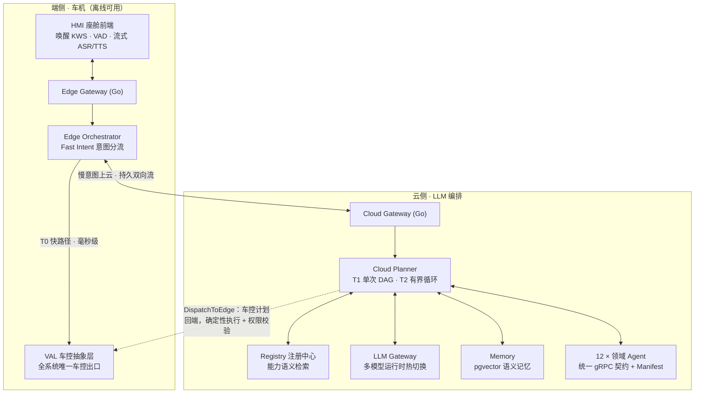

# 智能座舱 Multi-Agent 系统 · Cockpit Agent

[](https://github.com/SuperdeMan/cockpit-agent/actions/workflows/ci.yml)
[](https://github.com/SuperdeMan/cockpit-agent/actions/workflows/nightly-e2e.yml)


[](LICENSE)

> 云边协同的智能座舱 AI Agent 系统。喊一声「小舟小舟」，从毫秒级车控到多日行程规划、分钟级深度调研，一个语音入口全部完成。LLM 只负责理解与规划，确定性系统负责执行——没有任何一条车控指令由 LLM 直接下发。

**12** 个领域 Agent · **27** 个服务一键起栈 · **150** 条端侧意图 pattern / **62** 个车控对象 · 后端 **1712** 用例单命令跑通 + **33** 条旅程级语料 · 流式 TTS 首帧 **469ms** · 数据源全真实（高德 / 和风 / Exa / Tushare / api-football）

## 能做什么

| 你说 | 系统在做什么 |
|---|---|
| 「空调调到 22 度」 | 端侧快路径毫秒级执行，断网可用，全程零 LLM |
| 「打开空调，放首林俊杰，导航去公司」 | 混合多意图按语义组分流：本地车控/媒体立即执行，慢意图并行上云，同一请求协同完成 |
| 「导航去那个像春笋的大楼」 | 视觉地标 → LLM 解析官方名 → 高德真实 POI 校验后导航 |
| 「帮我规划周末去杭州的两天行程」 | LLM 提议骨架 + 确定性流水线接地真实 POI + 按真实电量沿路线编织充电站 + 校验每日车程 |
| 「创建钓鱼模式：座椅放平、氛围灯调暗」 | 一句话造场景：LLM 仅创建期编译（过 VAL 词表白名单），激活与执行零 LLM，退出恢复到激活前状态 |
| 「到公司之前提醒我交周报」 | 按导航 ETA 反算提醒时刻，一轮成单，到点主动触达 |
| 「明天第一场比赛提醒我观看」 | 赛事 Agent 与提醒 Agent 跨域交接：开赛前自动提醒 |
| 「哪天下雨就把行程换成室内」 | 按天气预报对既有行程确定性改排 |
| 「深入调研固态电池量产进展，不急，查完告诉我」 | 异步深度调研：秒级受理，后台多视角迭代检索，完成后主动推送带引用的分节报告 |

## 界面预览

HMI「Aurora Glass · 极光液态座舱」：横屏两栏（左对话流 + 右「上下文舞台」随对话切换场景）、液态玻璃材质、「小舟」光球化身；**气泡 ↔ 卡片 ↔ 右舞台**三者联动，约 20 类结构化信息卡按 Figma 源逐张重建。


| 天气（卡片 + 右舞台活场景） | 附近 POI（卡片 + 测距地图，「第N个」联动） |
|:---:|:---:|
|  |  |
| **行程规划（结构化行程卡 + 危险操作确认条）** | **设置（语音引擎 / 音色 / LLM 厂商切换）** |
|  |  |

> 截图均为**真实后端数据**（天气=和风、POI/行程=高德）。本地起栈后访问 `http://localhost:5173`，按住「小舟」光球说话即可流式实时上屏。

## 设计主张

四条不动摇的架构承诺，每一条都有测试固化：

1. **规划与执行分离**——LLM 只产出「意图/计划」，一切车控由确定性 Executor 经 VAL（车控抽象层）权限校验后下发，危险动作强制二次确认。智能可以试错，安全不能。
2. **快慢双系统**——高频、确定、安全敏感的指令留在端侧毫秒级响应、断网可用；复杂、跨域、多轮的意图上云由 LLM Planner 编排。时延与可用性是架构约束，不是优化目标。
3. **Agent 即插即用**——所有 Agent 实现统一 gRPC 契约 + Manifest 声明（能力 / 权限 / 确定性路由兜底 / 卡片优先级），经注册中心发现。**新增一个领域 Agent 不改一行编排核心代码**，这条铁律由契约测试守护。
4. **真实优先**——导航/天气/搜索/新闻/赛事/股票全部接真实数据源；外源数据卡片携带 `_prov` 溯源标记（真实性 / 来源 / 取数时间，HMI 徽章可见），严格模式 `REQUIRE_REAL_PROVIDERS=on` 拒绝任何 mock 决议。演示可以降级，不能造假。

## 系统架构



服务间同步调用走 gRPC（`proto/` 为唯一契约源），异步与主动推送走 NATS；短期状态 Redis、长期/向量 PostgreSQL + pgvector。请求按复杂度落入三层运行模型：

| 层 | 处理什么 | 形态 |
|---|---|---|
| **T0 端侧快路径** | 车控/媒体等高频确定性指令 | 规则 + 知识库，毫秒级本地执行，离线可用 |
| **T1 云端单次 DAG** | 复杂 / 跨域 / 多意图请求 | LLM Planner 一次规划，确定性引擎并行执行 |
| **T2 有界 Agentic 循环** | 需按中间结果调整计划的任务 | 迭代次数与时间预算受控，自适应再规划 |

Agent 的接入完全声明式：manifest 声明能力与权限、`route_hints` 做确定性路由兜底、`_escalate` 做执行期改派、`heavy` 标记驱动思考与过程区——编排核心对具体 Agent 零硬编码。

### 安全铁律（架构级，违反即 bug）

1. 车控只能经 VAL 下发，任何组件（含 LLM / Agent）不得直接操作 CAN/SOME-IP。
2. LLM 只负责理解与规划，确定性 Executor/Dispatcher 负责执行。
3. 危险动作（`require_confirm=true`）必须用户二次确认。
4. 新增 Agent 只通过注册中心接入，不修改编排核心。
5. 密钥只进 `.env`，不进代码、日志与提交。
6. 敏感数据（精确位置 / 车内音视频 / 支付）默认不出车，上云按 manifest `context_scopes` 最小化下发。

架构唯一真相源：[`docs/architecture/cockpit-agent-architecture.md`](docs/architecture/cockpit-agent-architecture.md)——任何与它冲突的实现都视为 bug。

## 能力全景

### 语音：全双工交互回路

从唤醒到打断全链路流式，引擎全部可切换：

- **唤醒**：浏览器本地 KWS（sherpa-onnx WASM，自建构建链），预设唤醒词「小舟小舟 / 你好小舟…」，唤醒前音频不出浏览器，唤醒后人声应答。
- **听**：silero VAD 端点检测 + DashScope 实时流式 ASR——边说边上屏、停顿定稿自动发送，失败无感回退批处理。
- **说**：服务端流式 TTS（文本增量进、PCM 分片出），cosyvoice 首帧 469ms（较批处理提速 4.7~7.2×），另有方言音色引擎；播报中随时打断（barge-in）。
- **免唤醒连续对话**：续问窗内直接接话；「退下吧」本地退场不上云。
- **拒识与澄清（置信度三段式）**：hands-free 场景下乘客对话等非受话语句静默拒识——不打扰、不落库、不进画像（内置评测误拒 3.4% / 拦截 88.9%）；真歧义句出选择卡问一句再执行，明确句绝不反问。

### 端侧：车控与混合多意图

150 条意图 pattern 覆盖 62 个车控/媒体对象（空调 / 座椅 / 车窗 / 氛围灯 / 360 环视 / 蓝牙 / 广播…），知识库驱动归一化、校验、安全门控与话术；混合多意图按语义组分流，本地动作与云端慢意图在同一请求内协同执行。

### 云端：12 个领域 Agent

| Agent | 一句话能力 |
|---|---|
| `navigation` | 高德导航：POI 检索、视觉地标解析、途经点、导航偏好 |
| `nearby` | 周边发现（高德 POI 2.0）：餐饮/酒店/景点/影院/停车/充电，价位与营业状态筛选 |
| `trip-planner` | 结构化多日行程：真实 POI 接地 + 电量感知充电编织 + 局部改排不漂移 + 在途状态 |
| `charging-planner` | 充电规划：沿途/目的地充电站、泛目的地候选二次确认 |
| `info` | 天气（和风）/ 搜索（Exa 接地合成：强制引用、无据弃权）/ 新闻 / 股票（Tushare）/ 赛事（api-football） |
| `deep-research` | 深度调研：多视角子问题 → 有界并行检索 → 带引用分节报告 + 渐进语音简报，支持异步分钟级 |
| `reminder` | 自然语言日程/提醒/待办：改期 / snooze / 重复规则、到点主动触达、跨域交接 |
| `scene-orchestrator` | 用户自定义场景：一句话创建、环境自适应策略求值、退出真恢复、执行后诚实对账 |
| `road-safety` | 路况安全与响应式主动播报 |
| `parking-payment` | 停车缴费（经统一支付网关，Agent 不持支付凭证） |
| `manual-rag` | 车主手册问答（RAG） |
| `chitchat` | 闲聊与常识直答（墙钟/日期按系统时钟确定性直答，绝不让 LLM 编时刻） |

回答模式判据化路由：一句话精确落到**直答 / 联网查询 / 新闻 / 深度调研**四模式（常识不联网、时效必联网、浏览一批走新闻、系统了解升调研），评测先行（五桶语料 + 混淆矩阵，基线准确率 98.9%）；Agent 误接时经 `_escalate` 机制零播报自动改派。

### 记忆、上下文与个性化

- **语义记忆**（pgvector）：自动从对话抽取偏好与个人实体，语义召回注入规划与闲聊；隐私分级、可查可删。
- **上下文装配**：统一 token 预算内装配能力目录（语义预筛）+ 对话历史 + 长期记忆 + 结构化焦点态（跨轮指代不靠啃原文）；敏感上下文按 manifest 最小化下发。
- **主动性**：routine 建议、晨间早报、提醒触达、深调研完成推送，统一经 NATS `agent.proactive` 到 HMI。

### 多 LLM / 多引擎运行时

- **LLM**：MiMo / MiniMax / DeepSeek / 通义千问四厂商进程内注册表，HMI 设置页运行时热切换、切换持久化；请求级 pin、429 与流式故障分类降级、健康探针；embedding 与 chat 厂商解耦。
- **ASR**：DashScope 实时流式（qwen3 / fun 双协议）+ 分块回退；**TTS**：cosyvoice / qwen3（含方言）/ MiMo / MiniMax 四引擎，「引擎 → 音色」两级选择。
- 评测报告锁定 provider（中途漂移即作废），跨模型对比可信。

### 可观测与 badcase 闭环

trace_id 从 HMI 气泡角标一键复制，贯通到每一跳 LLM 调用（tokens / 时延 / 门控内容）；collector SQLite 持久化；Dashboard 四视图——会话三级下钻、总览、日志、badcase 收藏一键重放对照，另有 LLM 消耗归属视图。Prometheus `/metrics` + OTel span 导出 + Grafana 仪表盘经 `--profile observability` 可选启用。

## 快速开始

依赖：Docker Desktop、Python 3.11+；本地开发另需 Go 1.24+、Node 20+、buf。

```bash
cp .env.example .env         # 不配任何密钥也能跑：LLM 落 MockProvider，外部数据源走 mock
make proto                   # 生成 gRPC 代码（改 proto 后必跑）
python test/smoke_edge.py    # 可选：不起 Docker 先做端侧冒烟
make up                      # 起全栈 27 个服务
```

Windows PowerShell：

```powershell
Copy-Item .env.example .env
./scripts/gen-proto.ps1
python test/smoke_edge.py
docker compose -f compose.yaml up --build -d
```

起栈后：

- **HMI 座舱** <http://localhost:5173> —— 点击/按住「小舟」光球说话，或直接打字。
- **可观测台** <http://localhost:5174> —— 会话下钻、trace、LLM 消耗归属。

注意：

- 只能从根 `compose.yaml` 启动（`make up` 已封装）；直接用 `deploy/docker-compose.yaml` 启动会丢失根 `.env`，真实 Provider 会静默回退 mock。
- 真实数据源与 LLM 凭证键见 `.env.example`；Dashboard 的车辆动态调试接口仅限本地演示，非开发环境设 `DEBUG_VEHICLE_CONTROL=false`。

## 工程与验证

测试分层金字塔，全部单命令可复现：

| 层 | 是什么 | 现状 |
|---|---|---|
| 单测 / 契约 | 全服务 pytest（编排 / Agent / 安全 / 记忆 / 网关）单命令一次跑通 | 1712 passed（2026-07-18） |
| 前端 | HMI `node --test` / Dashboard vitest | 143 / 16 |
| 评测基线 | 端侧意图覆盖（8k+ 真实说法语料）、云侧路由、四模式路由、拒识/澄清 | 报告型，CI 非阻塞门禁 |
| 单链路 e2e | WS 全链路 / 记忆 / 上下文 / 韧性自愈 / TTS 流 / 语音回路 / 降级矩阵 / 可观测 | 真栈脚本，接入 `run_e2e` |
| L3 旅程级 | 33 条语料：跨 Agent 自主执行（把事办完）× 全场景连续对话 | 回归级 15/15 常绿 |
| L4 HMI CDP | 真浏览器渲染 / 点击 → WS 帧断言 | 二次交互用例 |
| CI | push 全量（绿 = 本地全量绿）；nightly 断言型 e2e（mock 车道） | GitHub Actions |

```bash
make test                          # = python -m pytest --import-mode=importlib -q
cd hmi && npm test && npm run build
cd dashboard && npm test && npm run build

# 全栈起来后
python test/e2e_ws.py              # WS 全链路冒烟
make e2e                           # 本地全量 e2e 清单（Windows: ./scripts/run_e2e.ps1）
python test/e2e_journeys.py        # L3 旅程级（--provider 锁定评测用 LLM）
node test/hmi_cdp/run_cases.mjs    # L4 真浏览器 CDP
```

三条工程文化：

- **文档先行**：60+ 篇按日期编号的设计与落地记录（`docs/design/`），每个主题先对齐设计再动手；「架构唯一真相源」制度化。
- **badcase 驱动**：真机/真麦反馈 → Dashboard trace 下钻 → 修复 → 原句真栈复验，全环节留档。
- **铁律测试化**：「新增 Agent 不改编排核心」「危险动作必确认」等架构约定由契约测试固化，违反直接红灯。

## 目录结构

```text
proto/            gRPC 契约——所有接口的唯一真相源
gateway/          Go 接入网关（edge/ 端侧、cloud/ 云侧）
orchestrator/     edge/ 端侧编排 + FastIntent + VAL（PoC 模拟）；cloud/ 云端 LLM Planner
agents/           12 个领域 Agent；_sdk/ 公共 SDK（BaseAgent / 检索与接地内核）
llm-gateway/      LLM 多模型网关——LLM / Embedding / ASR / TTS 的唯一出口
registry/         Agent 注册中心（manifest + 能力语义检索）
memory/           记忆 / 画像服务（pgvector）
security/         权限引擎、scope 定义、内容审核、注入防护
payment-gateway/  统一支付网关（Agent 不持支付凭证）
observability/    NATS 事件出口、collector、trace / 指标
hmi/              React 座舱前端（Aurora Glass）
dashboard/        React 开发 / 演示可观测台
runtime/          共享 gRPC 运行时（keepalive / mTLS / 优雅停机）
deploy/           docker-compose / 证书生成
test/             e2e、评测基线、旅程语料、CDP 用例
docs/             架构（真相源）、设计记录、指南
```

## 文档导航

| 想了解 | 看这里 |
|---|---|
| 当前真实进展、接手第一步、自检入口 | [`AGENTS.md`](AGENTS.md) |
| 工程约定、目录规范、安全红线 | [`CLAUDE.md`](CLAUDE.md) |
| 为什么这么设计（架构唯一真相源） | [`docs/architecture/cockpit-agent-architecture.md`](docs/architecture/cockpit-agent-architecture.md) |
| 分期计划与量产 DoD | [`docs/architecture/phase1-implementation-plan.md`](docs/architecture/phase1-implementation-plan.md) |
| 各主题设计与落地记录（60+ 篇，按日期） | [`docs/design/`](docs/design/) |
| 怎么接真实 Provider（高德/和风样板） | [`docs/guides/provider-integration.md`](docs/guides/provider-integration.md) |
| 环境 / 端口 / 命名 / 错误码速查 | [`docs/dev-guide.md`](docs/dev-guide.md)、[`docs/conventions.md`](docs/conventions.md) |
| 测试分层与运行说明 | [`test/README.md`](test/README.md) |

各服务子目录另有自己的 README。

## 现状与边界

当前为 **Phase 1 工程化 PoC**：T0 / T1 / T2 运行模型、云端中枢、语音回路、记忆/上下文、可观测与旅程级验证体系均已落地。距量产的已知边界如实列出：

- **VAL 为 Python 模拟**（`orchestrator/edge/val.py`）：真实 SOME-IP/CAN 对接、车规资源约束与 OTA 属量产阶段。
- **停车 / 手册仍为 mock Provider**（严格模式默认豁免域），按环境接入。
- **单实例状态**：Cloud Gateway 车辆长连状态在单实例内存；Registry 已有 PostgreSQL 持久化与周期重注册自愈，多实例扩展待做。
- **安全能力已落地但默认关**：两层会话鉴权（`AUTH_REQUIRED`）与服务间 mTLS（`GRPC_TLS`）经 env 门控，开启即全栈生效；真实 IdP、证书轮换属后续。
- **声学层指标**（真麦命中率 / 误唤醒率）属人工验收范畴；浏览器内 KWS / VAD 链路已真机验证。
- HTTP / MCP 外部工具未实现；第三方 Agent 出站已有域名白名单正向代理。

实时状态、测试证据与待办清单以 [`AGENTS.md`](AGENTS.md) 为准。

## 许可

本项目以 [Apache License 2.0](LICENSE) 发布。
