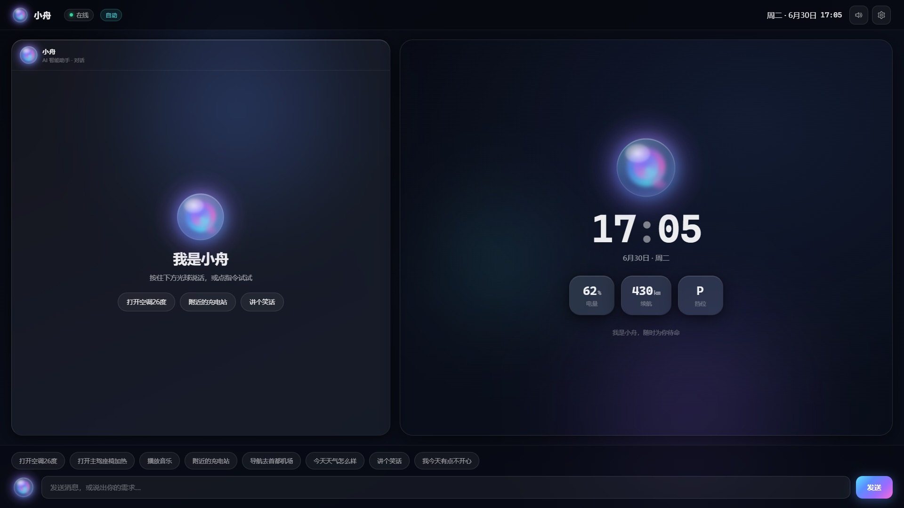
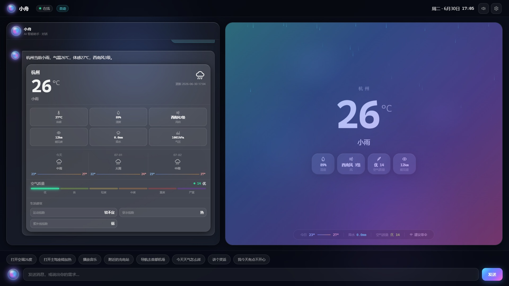
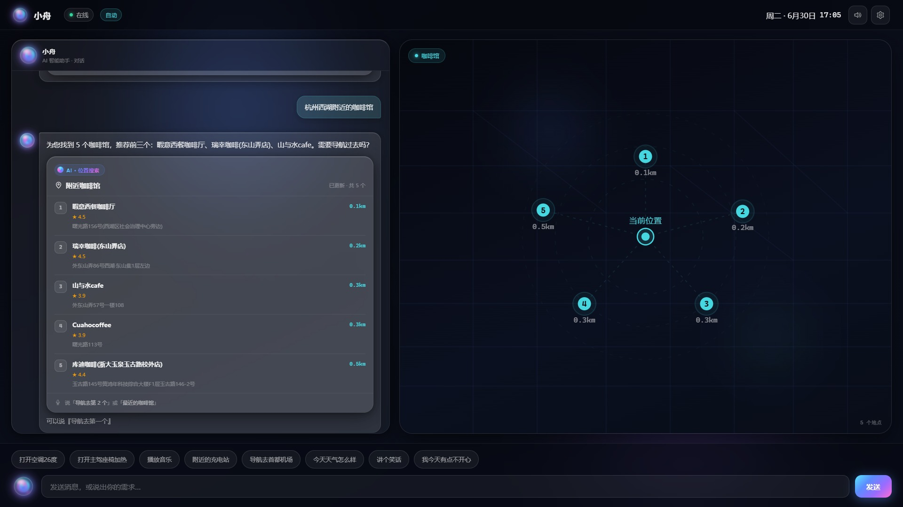
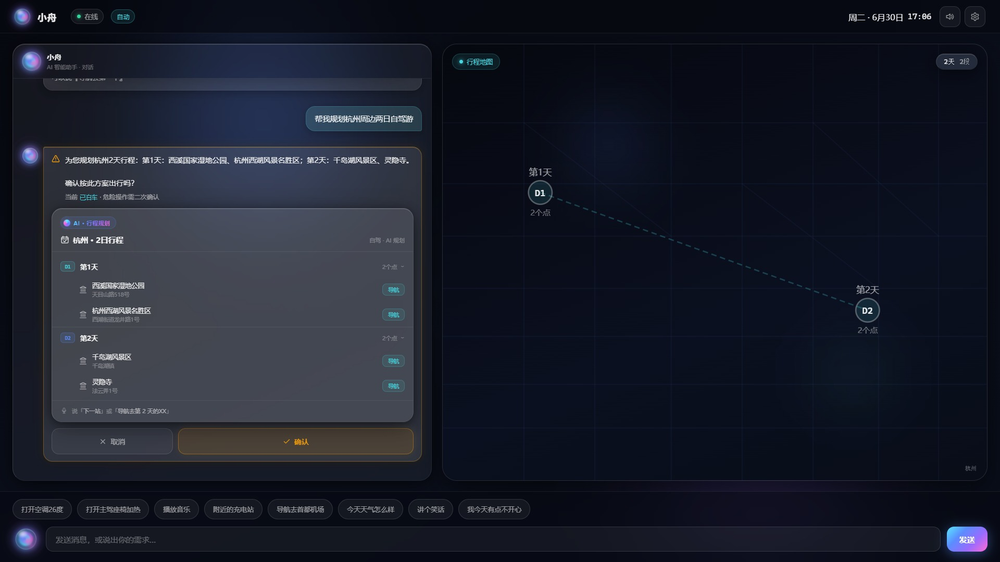
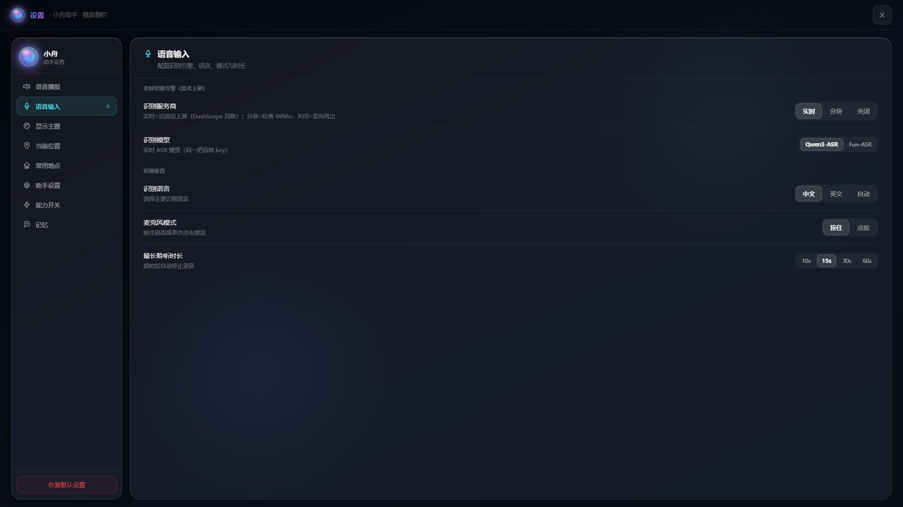
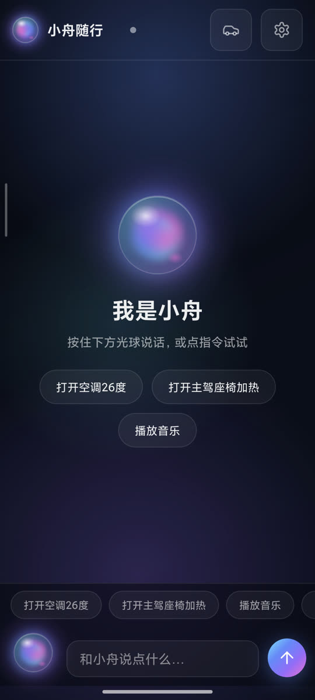
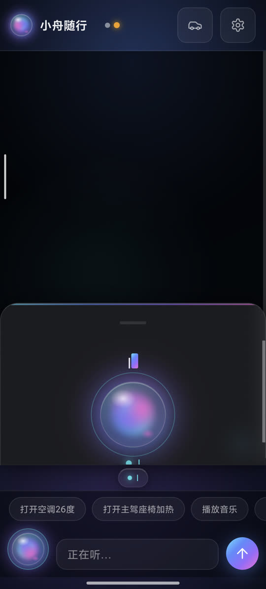
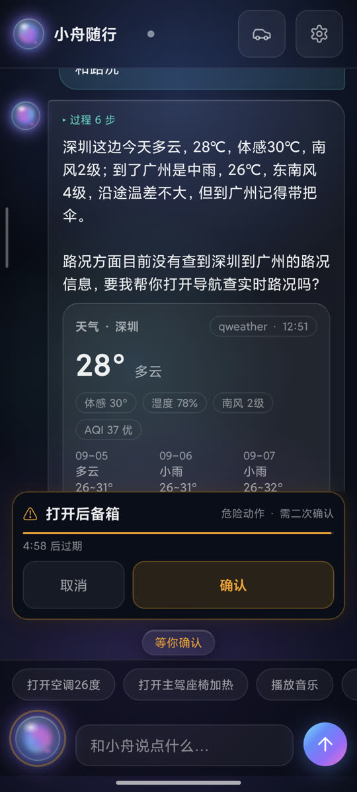
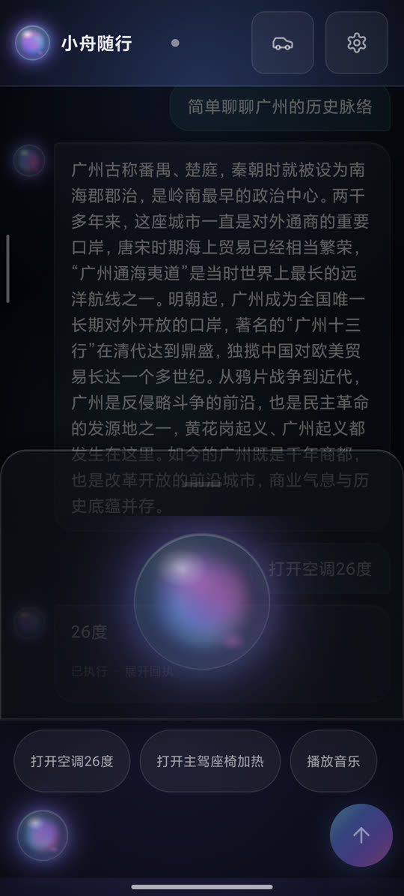
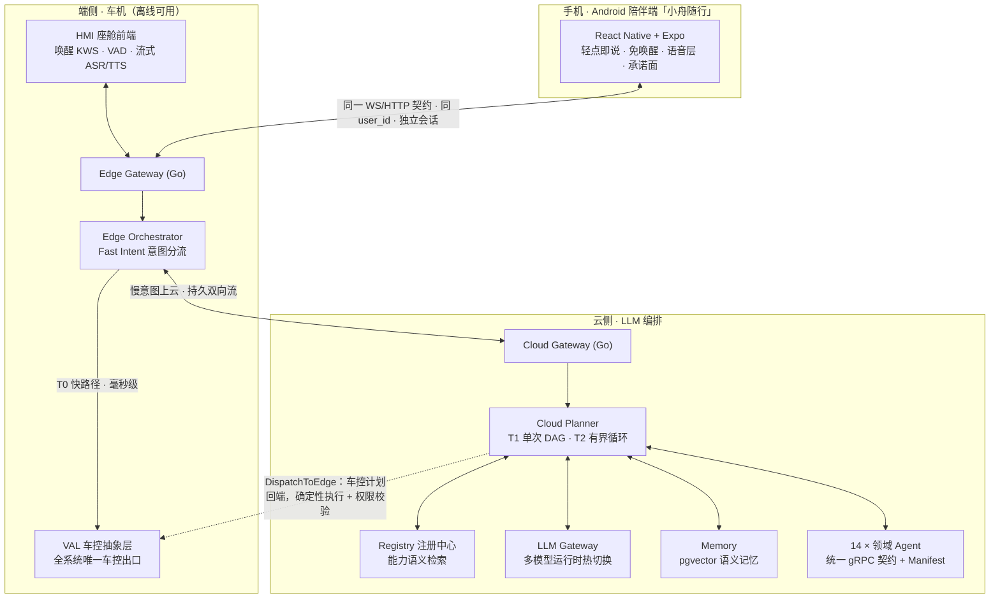

# 智能座舱 Multi-Agent 系统 · Cockpit Agent

[](https://github.com/SuperdeMan/cockpit-agent/actions/workflows/ci.yml)
[](https://github.com/SuperdeMan/cockpit-agent/actions/workflows/nightly-e2e.yml)


[](LICENSE)

> 云边协同的智能座舱 AI Agent 系统。喊一声「小舟小舟」，从毫秒级车控到多日行程规划、分钟级深度调研，一个语音入口全部完成。座舱屏上是 HMI，手机上是 Android 陪伴端「小舟随行」——两个用户端、一个后端大脑，同一个人在车里车外接着聊。LLM 只负责理解与规划，确定性系统负责执行——没有任何一条车控指令由 LLM 直接下发。

**2** 个用户端（座舱 HMI + Android 陪伴端 App）· **14** 个领域 Agent · **30** 个服务一键起栈 · **85** 条端侧 capability / **68** 个车控对象 · 后端全量门禁与当前精确计数见 [`AGENTS.md` §4.0](AGENTS.md) · **37** 条旅程级语料 · 流式 TTS 首帧 **469ms** / 端到端语音首音频 **609ms** · 数据源全真实（高德 / 和风 / Exa / Tushare / api-football）· M0a→M4 智能化升级**通过跨阶段组合总体验收**且 13 张验收主卡全部收口 · M5 数据飞轮落地——**修落域 badcase 的标准产物是数据不是正则** · 竞品高阶指令集 25 条语料逐条真栈对标（时间约束 / 真沿途 / 长期记忆消费 / 动态重规划）· 会话真实性走确定性出口——**执行入账本、审计与候选集聚合问答零 LLM，兜底话术不许声称系统做过什么**

## 能做什么

| 你说 | 系统在做什么 |
|---|---|
| 「空调调到 22 度」 | 端侧快路径毫秒级执行，断网可用，全程零 LLM |
| 「接女儿放学，顺路买杯咖啡，五点前要到学校」 | 关系图谱解析「女儿」的学校 + 真沿途咖啡候选逐家 ETA + 到达时限判定，一轮完成 |
| 「咖啡不买了，先去加油站，别迟到」 | 对**进行中导航**增量改道：删途经点、就近加油站插入，目的地与时限保持不变 |
| 「老婆喜欢吃粤菜」…数天后「晚上找地方和老婆吃饭」 | 长期记忆改变的是**结果集**（直接检回粤菜馆），不是一句「已参考您口味」的话术 |
| 「打开空调，放首林俊杰，导航去公司」 | 混合多意图按语义组分流：本地车控/媒体立即执行，慢意图并行上云，同一请求协同完成 |
| 「导航去那个像春笋的大楼」 | 视觉地标 → LLM 解析官方名 → 高德真实 POI 校验后导航 |
| 「帮我规划周末去杭州的两天行程」 | LLM 提议骨架 + 确定性流水线接地真实 POI + 按真实电量沿路线编织充电站 + 校验每日车程 |
| 「创建钓鱼模式：座椅放平、氛围灯调暗」 | 一句话造场景：LLM 仅创建期编译（过 VAL 词表白名单），激活与执行零 LLM，退出恢复到激活前状态 |
| 「到公司之前提醒我交周报」 | 按导航 ETA 反算提醒时刻，一轮成单，到点主动触达 |
| 「明天第一场比赛提醒我观看」 | 赛事 Agent 与提醒 Agent 跨域交接：开赛前自动提醒 |
| 「哪天下雨就把行程换成室内」 | 按天气预报对既有行程确定性改排 |
| 「深入调研固态电池量产进展，不急，查完告诉我」 | 异步深度调研：秒级受理，后台多视角迭代检索，完成后主动推送带引用的分节报告 |
| 「那个调研查得怎么样了」／「别查了」 | 后台长任务有账本：能问进度、能中途喊停、重启中断后诚实告知而不是假装还在跑 |
| 「（看着刚列出的店）第一家和第二家一共多少钱」 | 候选集是一等会话对象：最值 / 合计 / 序数取值三类聚合在规划**之前**确定性算出，零 LLM——系统持有的事实绝不让模型编 |
| 「你刚才都帮我做了什么」 | 执行过的动作随轮次入账本，审计追问由确定性出口作答并绑定本会话——说做过的就真做过，历史副作用不会被说成刚刚发生 |

## 界面预览

HMI「Aurora Glass · 极光液态座舱」：横屏两栏（左对话流 + 右「上下文舞台」随对话切换场景）、液态玻璃材质、「小舟」光球化身；**气泡 ↔ 卡片 ↔ 右舞台**三者联动，约 20 类结构化信息卡按 Figma 源逐张重建。



| 天气（卡片 + 右舞台活场景） | 附近 POI（卡片 + 测距地图，「第N个」联动） |
|:---:|:---:|
|  |  |
| **行程规划（结构化行程卡 + 危险操作确认条）** | **设置（语音引擎 / 音色 / LLM 厂商切换）** |
|  |  |

> 截图均为**真实后端数据**（天气=和风、POI/行程=高德）。本地起栈后访问 `http://localhost:5173`，按住「小舟」光球说话即可流式实时上屏。

### Android 陪伴端「小舟随行」

同一个后端大脑的第二个用户端（`mobile/`，React Native + Expo）：Aurora 光球是唯一状态锚，在听、在想、在播、等确认都从它和一枚状态胶囊上读；语音层从底部升起，承载「按住 / 轻点 / 唤醒」三种说话方式；危险动作确认钉在承诺面上、不随列表滚走；行车档一屏一卡、无文本输入。

| 待机 | 语音层「正在听」 | 承诺面：危险动作二次确认 | 行车档常驻层 |
|:---:|:---:|:---:|:---:|
|  |  |  |  |

> 截图取自 OPPO 测试机上的 prod 常驻包（2026-09-05，UX v2 B5 收口基线），天气卡为和风真实数据；确认条投影的是服务端挂起台账——`require_confirm` 的权威在 VAL，客户端不自己判。

## 设计主张

五条不动摇的架构承诺，每一条都有测试固化：

1. **规划与执行分离**——LLM 只产出「意图/计划」，一切车控由确定性 Executor 经 VAL（车控抽象层）权限校验后下发，危险动作强制二次确认。智能可以试错，安全不能。
2. **快慢双系统**——高频、确定、安全敏感的指令留在端侧毫秒级响应、断网可用；复杂、跨域、多轮的意图上云由 LLM Planner 编排。时延与可用性是架构约束，不是优化目标。
3. **Agent 即插即用**——所有 Agent 实现统一 gRPC 契约 + Manifest 声明（能力 / 权限 / 确定性路由兜底 / 卡片优先级），经注册中心发现。**新增一个领域 Agent 不改一行编排核心代码**，这条铁律由契约测试守护。
4. **真实优先**——导航/天气/搜索/新闻/赛事/股票全部接真实数据源；外源数据卡片携带 `_prov` 溯源标记（真实性 / 来源 / 取数时间，HMI 徽章可见），严格模式 `REQUIRE_REAL_PROVIDERS=on` 拒绝任何 mock 决议；运行期真实源失败一律**诚实降级说拿不到**，绝不回退 mock 假数据——**生产路径上一条 mock 回退都不剩**（2026-08-28 清掉最后一条：天气预警在拿不到城市时改成「用本轮定位，再没有就问一句」，而不是把演示坐标当成当前位置念出来）。演示可以降级，不能造假。
5. **一个大脑，多个端**——座舱 HMI 与 Android 陪伴端共用同一个后端：同 `user_id` 共享记忆与画像、各自独立会话、各自独立可吊销的凭证（手机档默认不含车控 scope）。两端**共享的是判据，不是 UI**：「这句话说完了没有」「响应归哪一轮」「该不该抓一帧」这类会话语义只有一份实现（`hmi/src` 纯逻辑模块经白名单台账直引，守卫测试机器守）。判据一旦分叉，同一个用户在两个端会得到两个答案，而没有任何东西会红。

## 系统架构


```mermaid
flowchart TB
    subgraph EDGE["端侧 · 车机（离线可用）"]
        HMI["HMI 座舱前端<br/>唤醒 KWS · VAD · 流式 ASR/TTS"]
        EGW["Edge Gateway (Go)"]
        EO["Edge Orchestrator<br/>Fast Intent 意图分流"]
        VAL["VAL 车控抽象层<br/>全系统唯一车控出口"]
        HMI <--> EGW
        EGW --> EO
        EO -->|"T0 快路径 · 毫秒级"| VAL
    end
    subgraph MOBILE["手机 · Android 陪伴端「小舟随行」"]
        APP["React Native + Expo<br/>轻点即说 · 免唤醒 · 语音层 · 承诺面"]
    end
    APP <-->|"同一 WS/HTTP 契约 · 同 user_id · 独立会话"| EGW
    subgraph CLOUD["云侧 · LLM 编排"]
        CGW["Cloud Gateway (Go)"]
        CP["Cloud Planner<br/>T1 单次 DAG · T2 有界循环"]
        REG["Registry 注册中心<br/>能力语义检索"]
        LLM["LLM Gateway<br/>多模型运行时热切换"]
        MEM["Memory<br/>pgvector 语义记忆"]
        AG["14 × 领域 Agent<br/>统一 gRPC 契约 + Manifest"]
        CGW --> CP
        CP <--> REG
        CP <--> LLM
        CP <--> MEM
        CP <--> AG
    end
    EO <-->|"慢意图上云 · 持久双向流"| CGW
    CP -.->|"DispatchToEdge：车控计划回端，确定性执行 + 权限校验"| VAL
```

服务间同步调用走 gRPC（`proto/` 为唯一契约源），异步与主动推送走 NATS；短期状态 Redis、长期/向量 PostgreSQL + pgvector。请求按复杂度落入三层运行模型：

| 层 | 处理什么 | 形态 |
|---|---|---|
| **T0 端侧快路径** | 车控/媒体等高频确定性指令 | 规则 + 知识库，毫秒级本地执行，离线可用 |
| **T1 云端单次 DAG** | 复杂 / 跨域 / 多意图请求 | LLM Planner 一次规划，确定性引擎并行执行 |
| **T2 有界 Agentic 循环** | 需按中间结果调整计划的任务 | 迭代次数与时间预算受控，自适应再规划 |

Agent 的接入完全声明式：manifest 声明能力与权限、`route_hints` 做确定性路由兜底、`verification` 声明执行后要对账什么、`_escalate` 做执行期改派、`heavy` 标记驱动思考与过程区——编排核心对具体 Agent 零硬编码。跨请求存活的长任务（异步深调研等）另有持久任务账本承载「干到哪了 / 还让不让它干」，接入只需调三个 SDK 函数。

用户端不止一个：座舱 HMI 走车机屏，Android 陪伴端经同一套 WS/HTTP 契约接入同一条链路——两端一脑的三条架构约束见[架构文档 §2.4](docs/architecture/cockpit-agent-architecture.md)，多端必须一致的最小契约面登记在 [`docs/conventions.md` §9.33](docs/conventions.md)。

### 安全铁律（架构级，违反即 bug）

1. 车控只能经 VAL 下发，任何组件（含 LLM / Agent）不得直接操作 CAN/SOME-IP。
2. LLM 只负责理解与规划，确定性 Executor/Dispatcher 负责执行。
3. 危险动作（`require_confirm=true`）必须用户二次确认。
4. 新增 Agent 只通过注册中心接入，不修改编排核心。
5. 密钥只进 `.env`，不进代码、日志与提交。
6. 敏感数据（精确位置 / 车内音视频 / 支付）默认不出车，上云按 manifest `context_scopes` 最小化下发。

架构唯一真相源：[`docs/architecture/cockpit-agent-architecture.md`](docs/architecture/cockpit-agent-architecture.md)——任何与它冲突的实现都视为 bug。

## 能力全景

### 语音：全双工交互回路

从唤醒到打断全链路流式，引擎全部可切换：

- **唤醒**：浏览器本地 KWS（sherpa-onnx WASM，自建构建链），预设唤醒词「小舟小舟 / 你好小舟…」，唤醒前音频不出浏览器，唤醒后人声应答。
- **听**：silero VAD 端点检测 + DashScope 实时流式 ASR——边说边上屏、停顿定稿自动发送，失败无感回退批处理。
- **说**：服务端流式 TTS（文本增量进、PCM 分片出），cosyvoice 首帧 469ms（较批处理提速 4.7~7.2×），另有方言音色引擎；播报中随时打断（barge-in）。
- **免唤醒连续对话**：续问窗内直接接话；「退下吧」本地退场不上云。
- **拒识与澄清（置信度三段式）**：hands-free 场景下乘客对话等非受话语句静默拒识——不打扰、不落库、不进画像（内置评测误拒 3.4% / 拦截 88.9%）；真歧义句出选择卡问一句再执行，明确句绝不反问。
- **端到端语音直连（可选挡位）**：闲聊与常识由语音大模型直接听直接答，首音频 **609ms**（P50）、多轮更连贯；而**需要执行或查实时信息的请求由模型自动交回确定性链**——车控没有一条路径绕过权限校验与二次确认（对抗集实测移交率 100%，含「今天真热啊，把空调开低一点」这类夹在闲聊里的动作句）；**危险动作的「确认/取消」同样永远由确定性主链裁决**——系统在等确认时，语音模型没有替你答应或取消的权力。断线自动重连并重注入上下文，连不上则整条回落常规链路。默认关：它会上传唤醒窗内的原始语音，须用户在设置里显式开启。
- **按声音区分乘员（可选挡位）**：唤醒后的第一句话边说边判断是谁在说话（说到 1.5 秒就够），每位乘员的口味、习惯、家人关系、常用地点（家/公司）与提醒各自独立（OwnerKey 数据面隔离——识别对了还要存得下来才算数）。问「你知道我是谁」叫得出名字（身份由系统直答，不交给模型编）。**认不出时一律按主驾处理**——退回的是开启这个开关之前的行为，而不是某种新的坏状态；两人声音太接近时宁可不下结论。**声纹只用于区分记忆，不作为任何权限或支付的凭证**（识别错了只该损失个性化，不该损失安全）。
- **看一看（可选挡位）**：说「那是什么 / 这是什么车」时抓一帧当前画面交多模态模型识别。**只在说这类话时抓，其余时候一帧都不采**；图像只在网关内存里活两分钟，不落盘、不进对话链、不进记忆。拿不到画面就直说拿不到，绝不对着空气编一个答案。

### 手机端：Android 陪伴端「小舟随行」

`mobile/`（React Native + Expo SDK 57，TypeScript strict，2026-08-25 起）是与座舱 HMI 共存的第二个用户端——不是把 HMI 包壳，而是移动优先重新设计的独立客户端，`hmi/` 零改动。

- **一个大脑，两个端**：同 `user_id` 共享记忆 / 画像，各自独立会话（前缀 `app-`）；独立 `AUTH_TOKENS` 条目可单独吊销，手机档默认不含 `vehicle.control`；主动消息按 user 推到所有在线端，投递凭据幂等去重。
- **共享判据，不共享 UI**：`hmi/src` 的纯逻辑会话语义层（ws 重连与离线队列、请求归属、确认台账、pcmPlayer 播放调度、免唤醒 FSM、silero 端点判据、视觉触发判据、S2S 协议翻译…）经 `@shared/*` 直引；台账 `mobile/shared-allowlist.json` + 守卫测试机器守——引台账外模块、引未到阶段模块、共享模块长出 DOM 依赖，三种漂移即红。
- **四种说法进同一张语音层**：轻点即说（说完自动收尾）、按住说话（PCM 直传流式 ASR 边说边上屏）、免唤醒（sherpa-onnx 唤醒词原生模块 + silero VAD via onnxruntime，与 HMI **同一份模型、同一组阈值**）、端到端 S2S 挡位（默认关、隐私文案在屏上、唯一工具仍是交回主链）。流式 TTS 用单个队列节点顺序吃片（修掉 FAST 轨渲染回调被压垮的「嗡嗡」），播报中随时打断；回声消除走平台 `VoiceCommunication` 输入预设。**采集事实与播放事实各只有一份声明源**：麦克风 / 摄像头在不在场读设备与上行出口，停止键跟真实播放器起止，都不由轮态或 FSM 反推。
- **三层在场（UX v2.2）**：光球是唯一状态锚（六轴事实派生单一视觉主态）+ 状态胶囊；语音层（Voice Sheet）承载实时转写、流式回答与主卡，收起后沉淀进对话记录；承诺面（Focus Dock）把危险动作确认、待补槽、长任务进度、离线队列钉在输入框上方，带倒计时与到期留痕——确认策略只投影 VAL，UI 不自己发明车速门禁。另有执行回执、follow-up chips、隐私栏（麦 / 摄像头 / 定位在场 + 最近一次激活的只读日志）。
- **形态**：窗口尺寸类 × 折叠姿态（原生 `foldstate` 模块，tabletop / book）× 行车档（Edge 按 VAL 标注的 `driving` 驱动：56dp 触控目标、一屏一卡压缩、无文本输入）；平板与横屏「左对话右舞台」，舞台是会话里已有事实的第二视图，不向后端取数。
- **卡片与地图**：卡型注册表从 `hmi/src/types.ts` 派生并双向守卫，`card_group` 按 `display_priority` 取主卡，未知卡型渲兜底卡绝不 null，`_prov` 溯源徽章；车况面板；高德地图 SDK——**没有 key 时插件根本不挂**（manifest 无 meta-data、地图入口不出现），「可降级」是这个意思而不是点进去报错；长按图标 App Shortcuts「说话 / 车况」。
- **工程与取证**：Expo CNG（`android/` 不入库，`app.config.ts` + config plugins 是原生配置唯一真相源）；dev / staging / prod 三档变体（prod 禁 cleartext、只留云栈 FQDN 预设）；prod release **常驻包**内嵌 bundle 脱离 USB / Metro，设置页底行的构建身份 `v0.1.0 · prod · <sha> · <时刻>` 是「设备跑的是哪份代码」的唯一读数；唤醒词 / VAD 的原生件与模型不入 git，缺件时构建**明确失败**而不是静默出一个没有唤醒词的 APK；改 `node_modules` 一律 `patch-package`；CI 每 push 跑 tsc + jest（含白名单守卫），APK 走手动档工作流；Maestro e2e 9 条流（offline / online / manual 三档 tag）；两台真机角色固定（OPPO = 测试机、Xiaomi 折叠屏 = 对照机），结论标机型、证据绑包身份。

### 端侧：车控与混合多意图

85 条端侧 capability 覆盖 68 个车控/媒体对象（空调 / 座椅 / 车窗 / 氛围灯 / 360 环视 / 蓝牙 / 广播…），知识库驱动归一化、校验、安全门控与话术；混合多意图按语义组分流，本地动作与云端慢意图在同一请求内协同执行。另有 35MB 端侧语义 NLU 以影子模式在线（4.8ms/条给出真概率，只观测不执行——放量是产品决策，数据尺已备好）。

### 云端：14 个领域 Agent

| Agent | 一句话能力 |
|---|---|
| `navigation` | 高德导航：POI 检索、视觉地标/俗称解析、途经点（人称与常用地点经关系图谱/画像解析）、到达时限 ETA 判定、路线偏好、**进行中路线增量改道** |
| `nearby` | 周边发现（高德 POI 2.0）：餐饮/酒店/景点/影院/停车/充电，价位与营业状态筛选 |
| `trip-planner` | 结构化多日行程：真实 POI 接地 + 电量感知充电编织（含跨城长途段）+ 主题/多城市保序/点名必去点三路入池 + 局部改排不漂移 + 在途状态 |
| `charging-planner` | 充电规划：沿途/目的地充电站、泛目的地候选二次确认 |
| `info` | 天气（和风）/ 搜索（Exa 接地合成：强制引用、无据弃权）/ 新闻 / 股票（Tushare）/ 赛事（api-football） |
| `deep-research` | 深度调研：多视角子问题 → 有界并行检索 → 带引用分节报告 + 渐进语音简报，支持异步分钟级 |
| `reminder` | 自然语言日程/提醒/待办：改期 / snooze / 重复规则、到点主动触达、跨域交接 |
| `scene-orchestrator` | 用户自定义场景：一句话创建、环境自适应策略求值、退出真恢复、执行后诚实对账 |
| `road-safety` | 路况安全与响应式主动播报 |
| `parking-payment` | 停车缴费：查费只读、缴费经统一支付网关出扫码付款码（支付宝当面付/微信 Native 双渠道，Agent 不持支付凭证；金额以订单快照为单一真相） |
| `manual-rag` | Xiaomi SU7 真实车主手册 RAG：hash绑定`.mrag`图文包；历史`9a3b6f2f`整本验收章节187/187、视觉35/35，雨刮/“背宝剑”各3/3带图；LLM瞬时失败有界重试后保留真实PDF卡并诚实降级 |
| `chitchat` | 闲聊与常识直答（墙钟/日期按系统时钟确定性直答，绝不让 LLM 编时刻） |
| `vision` | 看一看：对着窗外问「那是什么」，抓当前画面单帧交多模态模型识别（图像只在网关内存活两分钟，不落盘、不进对话链） |
| `mcp-bridge` | 受控 MCP 生态桥：一个 Agent 承载 N 个外部 MCP server，**人工准入 + 版本锁定 + schema 指纹**三重锁定；写操作有确认闸、请求指纹幂等、账本落账、超时不确定口径与补偿声明。已接入**麦当劳/瑞幸官方 MCP 复合工作流**（stdio+streamable_http 双传输）：自然语言选店/选品/规格 → 确定性预览计价 → 确认后创建未支付订单 → 安全支付入口 → 查单；瑞幸另支持再次确认取消，麦当劳无远程取消。两家另有**只读当店菜单**（`luckin.menu` / `mcd.menu`，带真实价格与商品图，图链域名走精确白名单，不合规静默退回纯文字）。系统不代用户最终付款。演示商户仍以卡片与话术恒标注。 |

回答模式判据化路由：一句话精确落到**直答 / 联网查询 / 新闻 / 深度调研**四模式（常识不联网、时效必联网、浏览一批走新闻、系统了解升调研），评测先行（五桶语料 + 混淆矩阵；留存基线 **175/177=98.9%**，2026-07-12 MiMo 历史批次，不代表当前主/对比模型）；Agent 误接时经 `_escalate` 机制零播报自动改派。

规划知识按需供给（`skills/`）：多日行程、导航顺路、条件依赖、充电分流这类**组合判据**以声明式文件供给 Planner——词法+语义双通道检索注入（fail-open 回词法），每份知识自带 golden 经 CI 门禁与真栈 A/B、逐 skill 消融验证「真的让规划变对了」；加规划知识=投一个文件，不改编排核心。

落域准确率靠**数据**增长，不靠人写正则：一条 `话术 → 正确落域` 的范例投进 `skills/exemplars/`，检索后作 few-shot 影响 Planner 判断——它是权威链最软层，**不做硬路由**，所以写错只是噪声而不是事故（确定性 `route_hints` 在 LLM 之后硬改写计划，写错会把模型判对的结果踩掉）。配套的是**规则的出口**：对每条 hint 的命中语料做跨模型双臂裸跑，「模型自己已经会了」的规则出退役提案；规则已经历多轮退役，也会因生产反例恢复。当前声明数以各 manifest 和 `python test/eval_route_hints.py` 的机械读数为准，不在入口文档硬编码。落域质量另有分布级尺子（canonical/paraphrase 拆列 + 分域混淆矩阵），与只防倒退的回归闸分开。

### 记忆、上下文与个性化

- **语义记忆**（pgvector）：自动从对话抽取偏好与个人实体，语义召回注入规划与闲聊；隐私分级、可查可删。
- **上下文装配**：统一 token 预算内装配能力目录（语义预筛）+ 对话历史 + 长期记忆 + 结构化焦点态（跨轮指代不靠啃原文；候选集与执行事实是焦点态的一等成员）；敏感上下文按 manifest 最小化下发。
- **主动性有治理层**：七路主动（routine / 场景触发 / 路况播报 / 提醒到点与到地 / 深调研完成 / 晨间早报 / 低电量顺路建议）先过**统一主动引擎**——情境断言在投递时刻复核、跨生产方去重、驾驶负荷高时攒着说、同窗到达的合并成一条，再经 NATS 到 HMI。治理器缺席即自动回落直发，不会静默吞掉用户显式约定的提醒。

### 多 LLM / 多引擎运行时

- **LLM**：MiMo / MiniMax / DeepSeek / 通义千问四厂商进程内注册表，HMI 设置页运行时热切换、切换持久化；HMI 每个业务帧也携带所选 provider/model 的请求级 pin（启动不再靠重放全局切换恢复），429 与流式故障分类降级、**跨厂商备份档**（active 厂商整链耗尽后兜底一跳，pinned 请求恒不跨）、健康探针；embedding 与 chat 厂商解耦。
- **ASR**：DashScope 实时流式（qwen3 / fun 双协议）+ 分块回退；**TTS**：cosyvoice / qwen3（含方言）/ MiMo / MiniMax 四引擎，「引擎 → 音色」两级选择。
- 评测报告锁定 provider（中途漂移即作废），跨模型对比可信。

### 可观测与 badcase 闭环

trace_id 从 HMI 气泡角标一键复制，贯通到每一跳 LLM 调用（tokens / 时延 / 门控内容）；collector SQLite 持久化；Dashboard 四视图——会话三级下钻、总览、日志、badcase 收藏一键重放对照，另有 LLM 消耗归属视图。Prometheus `/metrics` + OTel span 导出 + Grafana 仪表盘经 `--profile observability` 可选启用。

## 快速开始

依赖：Python 3.11+；`target=local` 的完整真栈才需要 Docker Desktop。本地开发另需 Go 1.24+、Node 20+、buf。
真栈支持**本地 / 云端两档**（仓库根 `dev-stack.local` 声明目标，统一入口 `scripts/dev_stack.py`
提供 status / deploy / verify / hmi）；新克隆缺省即 `target=local`，下述本地步骤开箱可用。
云档操作与切换红线见 [`docs/dev-guide.md`](docs/dev-guide.md) §可切换真栈。

```bash
cp .env.example .env         # 不配任何密钥也能跑：LLM 落 MockProvider，外部数据源走 mock
make proto                   # 生成 gRPC 代码（改 proto 后必跑）
python test/smoke_edge.py    # 可选：不起 Docker 先做端侧冒烟
make up                      # 起全栈 30 个服务
```

Windows PowerShell：

```powershell
Copy-Item .env.example .env
./scripts/gen-proto.ps1
python test/smoke_edge.py
docker compose -f compose.yaml up --build -d
```

起栈后：

- **HMI 座舱** <http://localhost:5173> —— 点击/按住「小舟」光球说话，或直接打字。
- **可观测台** <http://localhost:5174> —— 会话下钻、trace、LLM 消耗归属。

注意：

- 只能从根 `compose.yaml` 启动（`make up` 已封装）；直接用 `deploy/docker-compose.yaml` 启动会丢失根 `.env`，真实 Provider 会静默回退 mock。
- 真实数据源与 LLM 凭证键见 `.env.example`；Dashboard 的车辆动态调试接口仅限本地演示，非开发环境设 `DEBUG_VEHICLE_CONTROL=false`。

## 工程与验证

测试分层金字塔，全部单命令可复现：

| 层 | 是什么 | 现状 |
|---|---|---|
| 单测 / 契约 | 全服务 pytest（编排 / Agent / 安全 / 记忆 / 网关 / 共享运行时）单命令一次跑通 | 当前精确 SHA / passed / skipped 只查 `AGENTS.md` §4.0；现跑 `make test`，不要从 README 复制历史数字 |
| 前端 | HMI `npm test && npm run build` / Dashboard `npm test && npm run build` | 以命令本次输出为准；README 不维护易腐计数 |
| Android 陪伴端 | `mobile/` tsc strict + jest（共享白名单守卫 / 会话状态机 / 发送路由 / 语音链 / 在场派生 / 卡片契约）；Maestro e2e 9 条流（offline 2 · online 5 · manual 2）；真机取证以 prod 常驻包的构建身份为锚 | 单测与类型检查以 `cd mobile && npm run typecheck && npm test` 本次输出为准；e2e 前提与读数只在 `mobile/e2e/README.md`；当前批次的设备证据看 `AGENTS.md` §4.2 |
| 评测基线 | 端侧意图覆盖（8k+ 真实说法语料）、云侧路由、四模式路由、拒识/澄清、L0–L3 对抗落域 | 对比/参考基线 **147/147**，L1/L2 各 2×3 独立进程，资格 `eligible=True`（DeepSeek / `f0af9c0`）；MiniMax 主模型同口径 **141/147、eligible=False**，不可混写成跨模型全绿（其余报告型基线见 `docs/reviews/eval/README.md`） |
| 单链路 e2e | WS 全链路 / 记忆 / 上下文 / 韧性自愈 / TTS 流 / 语音回路 / 降级矩阵 / 任务账本 / 执行对账 / 主动治理 / 声纹 / 视觉 / S2S | 真栈脚本，接入 `run_e2e`（Windows/Linux 清单一致） |
| L3 旅程级 | 37 条语料：跨 Agent 自主执行（把事办完）× 全场景连续对话 | 回归级 15/15 常绿（红灯单条重跑定性制） |
| L4 HMI CDP | 真浏览器渲染 / 点击 → WS 帧断言 | 二次交互用例 |
| CI 阻断门禁 | 四条**确定性**门禁（零 LLM / 零网络）：skill 契约、范例契约、意图对抗 L0 strict、**能力完整性**（新增一个车控能力漏一处即红）| 全部 blocking，见 `.github/workflows/ci.yml` |
| CI | push 全量（绿 = 本地全量绿）；nightly 断言型 e2e（**mock 车道 = 不经过模型判断的那部分**——端侧快路径 / 兜底 Agent / 确定性解析 / 协议层；模型路由类断言归 live 车道）+ nightly 自进化流水线（badcase 挖掘 → 归因 → 门禁） | GitHub Actions + Task Scheduler |

```bash
make test                          # = python -m pytest --import-mode=importlib -q
make gate-intent-l0                # 意图对抗 L0 门禁（strict）——本地与 CI 唯一入口
cd hmi && npm test && npm run build
cd dashboard && npm test && npm run build
cd mobile && npm run typecheck && npm test                              # Android 陪伴端：tsc strict + jest（含共享白名单守卫）
maestro test --no-reinstall-driver --include-tags offline mobile/e2e/   # Android e2e 离线档；online 档需 target=cloud + 真机在 tailnet

# 全栈起来后
python test/e2e_ws.py              # WS 全链路冒烟
make e2e                           # 本地全量 e2e 清单（Windows: ./scripts/run_e2e.ps1）
python test/e2e_journeys.py        # L3 旅程级（--provider 锁定评测用 LLM）
node test/hmi_cdp/run_cases.mjs    # L4 真浏览器 CDP
```

三条工程文化：

- **文档先行**：119 篇按日期编号的设计与落地记录（`docs/design/`，截至 2026-09-08），每个主题先对齐设计再动手；「架构唯一真相源」制度化。
- **badcase 驱动**：真机/真麦反馈 → Dashboard trace 下钻 → 修复 → 原句真栈复验，全环节留档。
- **铁律测试化**：「新增 Agent 不改编排核心」「危险动作必确认」等架构约定由契约测试固化，违反直接红灯。

## 目录结构

```text
proto/            gRPC 契约——所有接口的唯一真相源
gateway/          Go 接入网关（edge/ 端侧、cloud/ 云侧）
orchestrator/     edge/ 端侧编排 + FastIntent + VAL（PoC 模拟）；cloud/ 云端 LLM Planner
agents/           14 个领域 Agent；_sdk/ 公共 SDK（BaseAgent / 检索与接地内核 / 任务账本）
skills/           Planner 智能供给声明式载体：guides/ 领域组合判据、policies/ 跨域软约束、
                  exemplars/ **落域范例库**（话术→正确落域的数据，权威链最软层）——投文件即生效，全部进 CI 门禁
llm-gateway/      LLM 多模型网关——LLM / Embedding / ASR / TTS 的唯一出口
registry/         Agent 注册中心（manifest + 能力语义检索）
memory/           记忆 / 画像服务（pgvector）
security/         权限引擎、scope 定义、内容审核、注入防护
payment-gateway/  统一支付网关（Agent 不持支付凭证）
proactive/        统一主动引擎——「该不该现在打扰驾驶员」的唯一裁决点
observability/    NATS 事件出口、collector、trace / 指标
hmi/              React 座舱前端（Aurora Glass）
mobile/           Android 陪伴端 App「小舟随行」（React Native + Expo）——与座舱共存的第二个用户端，
                  同一后端大脑、同 user_id 共享记忆；只读引用 hmi/src 的纯逻辑模块（白名单台账 + 守卫）；
                  modules/ 下两个极窄原生模块（kws 唤醒词、foldstate 折叠姿态），原生件与模型不入库
dashboard/        React 开发 / 演示可观测台
runtime/          共享运行时（gRPC keepalive / mTLS / 优雅停机 + 主动消息出口），
                  以及**端云共用的确定性判定**（时区墙钟 / 指令极性 / 中文时间词 /
                  营业时间 / 安全信号 / 问句形态 / 意图读写效果）——同一件事只许一份实现
deploy/           docker-compose / 证书生成
test/             e2e、评测基线、旅程语料、CDP 用例
docs/             架构（真相源）、设计记录、指南
```

## 文档导航

| 想了解 | 看这里 |
|---|---|
| 接手第一步、红线、自检入口 | [`AGENTS.md`](AGENTS.md) |
| 当前 release、QA 证据与剩余活项 | [`docs/reviews/2026-08-30-qa-closeout-handoff.md`](docs/reviews/2026-08-30-qa-closeout-handoff.md) |
| 工程约定、目录规范、安全红线 | [`CLAUDE.md`](CLAUDE.md) |
| 为什么这么设计（架构唯一真相源） | [`docs/architecture/cockpit-agent-architecture.md`](docs/architecture/cockpit-agent-architecture.md) |
| 分期计划与量产 DoD | [`docs/architecture/phase1-implementation-plan.md`](docs/architecture/phase1-implementation-plan.md) |
| 各主题设计与落地记录 | [`docs/design/README.md`](docs/design/README.md) |
| 怎么接真实 Provider（高德/和风样板） | [`docs/guides/provider-integration.md`](docs/guides/provider-integration.md) |
| 怎么跑意图落域对抗测试、怎么修落域 badcase | [`docs/guides/intent-adversarial-testing.md`](docs/guides/intent-adversarial-testing.md) |
| Android 陪伴端：装包、连云栈、常驻包与两台真机角色 | [`mobile/README.md`](mobile/README.md) |
| Android 为什么是独立客户端、三层在场怎么设计 | [`选型与实施计划`](docs/design/2026-08-23-hmi-android-app-plan.md)、[`UX v2.2 三层在场`](docs/design/2026-08-29-mobile-ux-v2-presence-redesign.md) |
| Android 完整评审与当前修复批次（AR01–AR11） | [`完整评审`](docs/reviews/2026-09-07-android-ux-full-review.md)、[`分批处理建议`](docs/design/2026-09-07-android-review-remediation-batches.md) |
| Android 构建、低内存排查、设备取证与跨工具交接 | [`docs/guides/android-build-and-device-validation.md`](docs/guides/android-build-and-device-validation.md) |
| 环境 / 端口 / 命名 / 错误码速查 | [`docs/dev-guide.md`](docs/dev-guide.md)、[`docs/conventions.md`](docs/conventions.md) |
| 测试分层与运行说明 | [`test/README.md`](test/README.md) |

各服务子目录另有自己的 README。

## 现状与边界

当前为 **Phase 1 工程化 PoC**：T0 / T1 / T2 运行模型、云端中枢、语音回路、记忆/上下文、可观测与旅程级验证体系均已落地。距量产的已知边界如实列出：

- **VAL 为 Python 模拟**（`orchestrator/edge/val.py`）：真实 SOME-IP/CAN 对接、车规资源约束与 OTA 属量产阶段。
- **停车仍为 mock Provider**；手册使用真实Xiaomi SU7 v2图文包，历史`9a3b6f2f`的整本
  章节187/187、视觉35/35已闭合。原36题完整真栈仍只在旧release`434a046`闭合；`9a3b6f2f`当轮
  有7条旧表述被联网前安全预检拒绝，本次未重跑整批，不能转借成当前36/36。停车与手册不得混写成同一条mock边界。
- **单实例状态**：Cloud Gateway 车辆长连状态在单实例内存；Registry 已有 PostgreSQL 持久化与周期重注册自愈，多实例扩展待做。
- **安全能力已落地，本地开发档默认关**：两层会话鉴权（`AUTH_REQUIRED`）与服务间 mTLS（`GRPC_TLS`）经 env 门控，开启即全栈生效——云端真栈档已实际开启会话鉴权（`AUTH_TOKENS` 畸形条目 fail-closed）；真实 IdP、证书轮换属后续。
- **声学层指标**（真麦命中率 / 误唤醒率）属人工验收范畴；浏览器内 KWS / VAD 链路已真机验证。
- **MCP 生态桥已接真实商户，但仍是 PoC 账号模型**：麦当劳/瑞幸官方复合工作流已打通到“创建未支付订单、展示受控支付入口、查单”，瑞幸可再次确认取消；不执行最终付款，麦当劳官方工具面无远程取消。写工具不可自动重放，支付链接经桥与 payment-gateway 双层 host 白名单。两家凭证当前都是服务级全局 token/账号，只允许网关权威 scope 下的已认证主用户使用；多乘员独立商户账号、token 自动刷新、通用 HTTP 工具面均未产品化。商户与支付 host 必须由运行时安全配置提供，空配置 fail-closed。
- **Android 陪伴端是 PoC 前台交互档**：不做后台保活与厂商推送，主动消息只在 App 前台送达；账号仍是静态 `AUTH_TOKENS` 条目（引导页手填云栈 FQDN + token，经 Tailscale 接入）、debug 签名（高德 key 绑包名 + 签名指纹）；M5 生产化（推送 / 正式鉴权 / 正式签名与 OTA / 崩溃监控 / 商店合规）未启动，其中公网接入、账号体系、离线投递三项是后端工作。
- **Android 2026-09-07 完整评审 R01–R15 未全部关闭**：AR01 确认与取消、AR02 采集与隐私、AR03 停播与横屏的客户端修复已合入并在真机取到主证据，但三批都**未整批签收**（完整设备矩阵、多段段链、S2S 自答、主动消息播报、盲听等格仍缺输入通道）；AR04–AR11 未启动。已知边界：ESLint 门禁未闭合；唤醒词真人基线未达既定目标；`driving-landscape` 只有对照机外屏够得到，支持范围待 AR10 裁；设备矩阵只有一台测试机 + 一台折叠屏对照机，无真平板；声纹在手机端刻意不做。

接手规则以 [`AGENTS.md`](AGENTS.md) 为准；当前 release、QA 证据与活项以
[`QA 当前交接页`](docs/reviews/2026-08-30-qa-closeout-handoff.md) 为准。

## 许可

本项目以 [Apache License 2.0](LICENSE) 发布。
