# 智能座舱 Multi-Agent 系统 · Cockpit Agent

[](https://github.com/SuperdeMan/cockpit-agent/actions/workflows/ci.yml)
[](https://github.com/SuperdeMan/cockpit-agent/actions/workflows/nightly-e2e.yml)


[](LICENSE)

> 云边协同的智能座舱 AI Agent 系统。喊一声「小舟小舟」，从毫秒级车控、多日行程与补能规划、车书问答，到商户点单和分钟级深度调研，一个语音入口办完。座舱屏上是 HMI，手机上是 Android 陪伴端「小舟随行」，两个端共用一个后端大脑。
>
> **LLM 只负责理解与规划，确定性系统负责执行与对账**：没有一条车控指令由模型直接下发；车况、时间、执行记录这类系统自己持有的事实，也不交给模型去编。

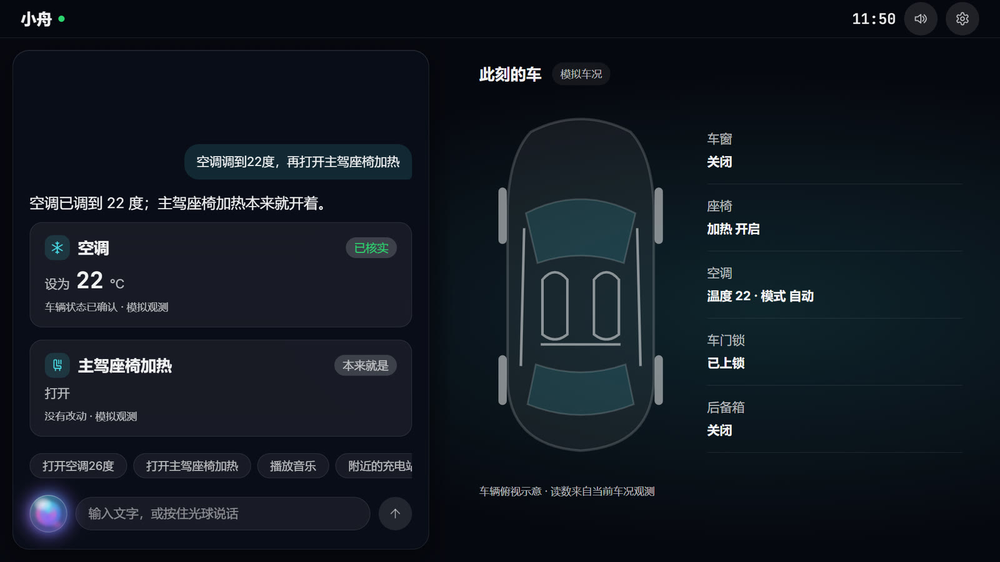

<sub>座舱 HMI（Visual v2）。一句话两项车控，各自带执行证据：空调「已核实」——状态满足，且观测归属这一次操作；座椅加热「本来就是」——动作前就已满足，不算这次办成的。右侧舞台只显示观测到的读数，并标明是模拟车况。截图取自本机视觉夹具，见[界面预览](#界面预览)。</sub>

**现状**：Phase 1 工程化 PoC。后端与两个客户端在云端真栈持续运行，只发布 `main` 上可追溯的精确 SHA；车控由模拟 VAL 验证（车态观测已签名，来源仍标「模拟」），未接实车总线。正在向 [v2 可验证 Agent Runtime](#v2-可验证-agent-runtime) 演进；当前 release 与 QA 读数只在 [QA 交接](docs/reviews/2026-08-30-qa-closeout-handoff.md)维护。

[亮点](#亮点) · [能做什么](#能做什么) · [界面](#界面预览) · [架构](#系统架构) · [v2](#v2-可验证-agent-runtime) · [能力全景](#能力全景) · [快速开始](#快速开始) · [工程与验证](#工程与验证) · [文档](#文档导航) · [边界](#现状与边界) · [English](#english-summary)

## 亮点

1. **规划与执行分离，确认绑定到这一次操作。** LLM 只产出意图和计划；确定性 Executor 经权限、能力契约与 VAL（车控抽象层）执行。`require_confirm` 的权威来自能力声明，不来自模型；确认绑定车辆、步骤、能力版本与最终参数，带服务端期限、只能消费一次——双击、语音加点按、跨端重放都不会让动作执行两遍。
2. **快慢双系统。** 高频、确定、安全敏感的指令留在端侧（T0），毫秒级执行、断网可用；复杂、跨域、多轮的请求上云，由 Planner 一次规划成 DAG（T1）或在预算内循环再规划（T2）。一句话里混着车控和慢意图时按语义组分流，本地动作不等云端。
3. **说做过的，就真做过。** 车端写操作与商户写工具在副作用之前先落持久准入记录，账本不可用就拒绝；车端执行前先写操作日志，重启不重放。结果把「回执 / 状态满足 / 观测归属 / 已核实」分开记——动作前就满足的不算「已完成」。挂起、重连、换端时，完整答案和证据随 ResultBundle 一起保留。
4. **事实不编，降级不造假。** 外源数据带 `_prov` 溯源，严格模式拒绝任何 mock；车况逐信号带时效与来源并经 Ed25519 签名，读不到就说读不到，不会按 50% 估一个电量。时间、候选集、执行记录由确定性出口作答，生产路径上没有回退假数据的分支。
5. **Agent 即插即用。** 14 个云端领域 Agent 和端侧车控/媒体能力，统一用 gRPC 契约 + Manifest（Capability 契约 v2）声明，经 Registry 发现。新增 Agent 不改一行编排核心，这条由契约测试守着。
6. **一个大脑，两个端。** 座舱 HMI 与 Android「小舟随行」共享记忆和画像，各自独立会话与凭证。两端共享的是判据，不是 UI：「这句话说完了没有」「回应归哪一轮」「该不该抓一帧」只有一份实现，白名单台账加守卫测试防止分叉。
7. **全双工语音，隐私默认最小化。** 本地唤醒、流式识别与合成、播报中打断、免唤醒续聊。可选的端到端语音只有一个工具：把要执行的请求交回确定性主链。声纹只用于区分乘员的记忆，不参与任何授权；摄像头只在你问「那是什么」时抓一帧。
8. **用证据做工程。** 四道零 LLM、零网络的 blocking 门禁，过万条单测与契约测试，旅程级真栈验证；release、测试与产物各自绑定 SHA，邻近提交的读数不转借。每个主题先写设计再动手，badcase 从 trace 到原句复验全程留档。

## 能做什么

| 场景 | 你说 | 系统在做什么 |
|---|---|---|
| 车控与安全 | 「空调调到 22 度」 | 端侧快路径毫秒级执行，断网可用，全程零 LLM |
| | 「打开空调，放首林俊杰，导航去公司」 | 混合多意图按语义组分流：车控、媒体在本地立即执行，导航并行上云，同一轮办完 |
| | 「打开后备箱，再告诉我空调有哪些模式」 | 后备箱进入二次确认（服务端期限、绑定这一次操作），手册答案照常完整送达，不会被挂起吞掉 |
| | 「创建钓鱼模式：座椅放平、氛围灯调暗」 | 一句话造场景：模型只在创建时编译（过 VAL 词表白名单），激活与执行零 LLM，退出时恢复到激活前 |
| 出行与能源 | 「接女儿放学，顺路买杯咖啡，五点前要到学校」 | 关系图谱解析「女儿」的学校，真沿途咖啡候选逐家算 ETA，判定能否按时到，一轮完成 |
| | 「咖啡不买了，先去加油站，别迟到」 | 对进行中的导航增量改道：删途经点、插入加油站，目的地与时限不变 |
| | 「导航去黄鹤楼」（人在深圳） | 近处有借名的同名店、外地有本体时列出两个候选让你选，不会悄悄把你导到楼下的同名饭馆 |
| | 「换一个充电站」 | 在当前路线上原位换掉那个补电点，目的地不动；新加的途经点会插在多绕路最少的位置 |
| | 「帮我规划周末去杭州的两天行程」 | 模型提议骨架，确定性流水线接地真实 POI，按电量沿路线编织充电站并校验每日车程 |
| 知识与信息 | 「胎压报警是怎么回事」 | 车书原文带条件与原图作答；只解释告警，不宣布故障已排除；证据对不上就弃权 |
| | 「深入调研固态电池量产进展，不急，查完告诉我」 | 秒级受理，后台多视角检索，完成后主动推送带引用、标明数据缺口的分节报告；中途能问进度、能喊停 |
| | 「（看着刚列出的店）第一家和第二家一共多少钱」 | 候选集是一等会话对象：最值、合计、序数取值在规划之前确定性算出，零 LLM |
| 记忆与服务 | 「老婆喜欢吃粤菜」……几天后「晚上找地方和老婆吃饭」 | 长期记忆改变的是结果集（直接检回粤菜馆），而不是一句「已参考您的口味」 |
| | 「到公司之前提醒我交周报」 | 按导航 ETA 反算提醒时刻，到点主动触达 |
| | 「在瑞幸点一杯拿铁，到店自取」 | 官方 MCP 工作流：选店选品 → 确定性计价预览 → 确认后创建未支付订单 → 受控支付入口；系统不代你付款 |
| | 「你刚才都帮我做了什么」 | 执行过的动作逐轮入账，追问由确定性出口作答，历史副作用不会被说成刚刚发生 |

## 界面预览

### 座舱 HMI · Visual v2

横屏 1920×1080：对话面板加随对话切换的情境舞台；泊车 / 行车两档，行车档是只读投影（无输入框、一屏一答）；深浅两套主题与四档字阶；危险动作确认条钉在对话上方，倒计时取服务端期限；每张卡片都标注数据来源。

| 天气一轮：卡片 + 舞台活场景（浅色） | 危险动作：确认条 + 服务端期限 |
|:---:|:---:|
| 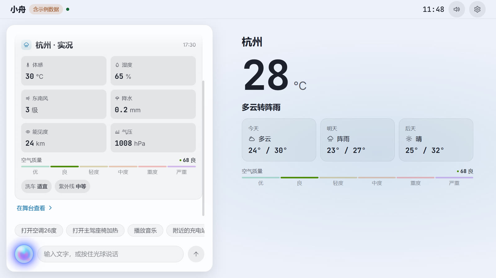 | 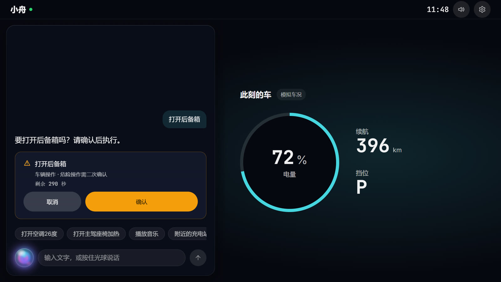 |
| **深度调研报告：引用、置信度、数据缺口** | **行车档：只读投影 + 答案条** |
| 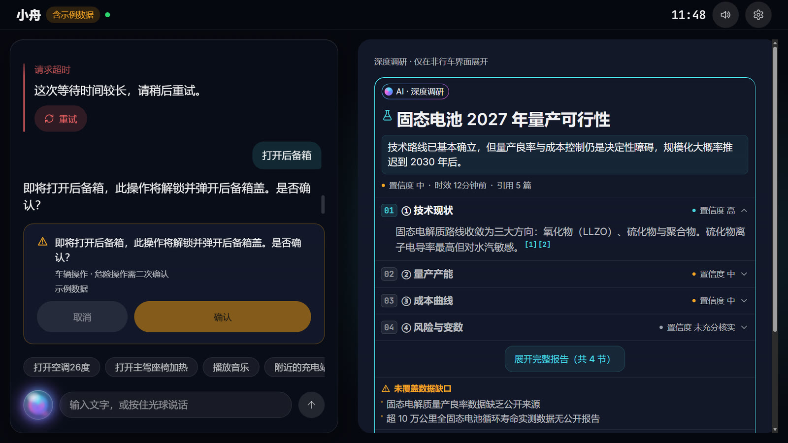 | 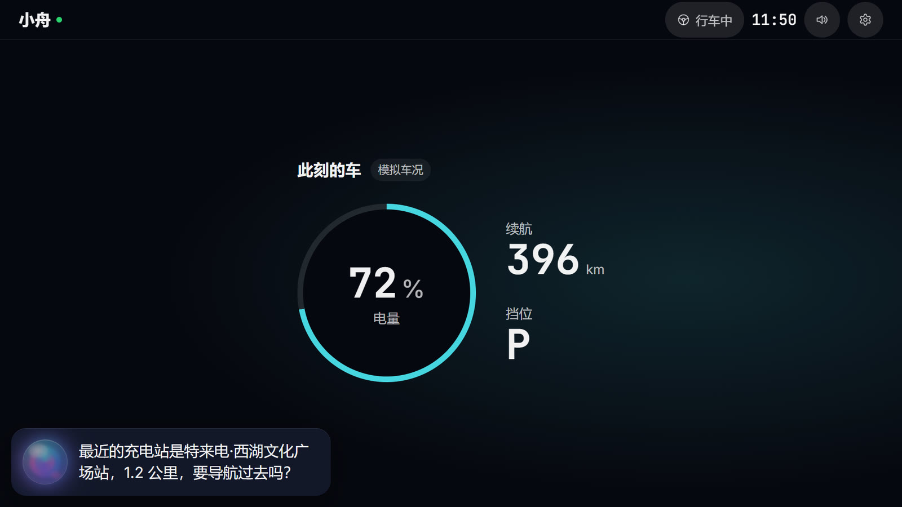 |

<sub>2026-10-10 用本机 Vite + 无头 Edge 截取，网关在浏览器内 mock、不连任何后端；画面上的「含示例数据」「模拟车况」角标是界面自己对来源的标注。复现方式见 [`test/hmi_cdp/`](test/hmi_cdp/README.md)，不连后端的预览参数见 [`hmi/README.md`](hmi/README.md)。</sub>

### Android 陪伴端「小舟随行」· Visual v3

同一个后端大脑的第二个用户端（`mobile/`，React Native + Expo）。一屏只有一颗光球作状态锚；回答不套气泡，卡片和追问 chip 跟在答案末尾，「数据来源 · 展开回执」可追溯；危险动作确认钉在输入框上方的承诺面，带倒计时与到期留痕；行车档一屏一卡、没有文本输入；折叠屏展开后是左对话、右舞台。

| 待机 | 天气一轮（和风实时数据） | 危险动作二次确认 |
|:---:|:---:|:---:|
| 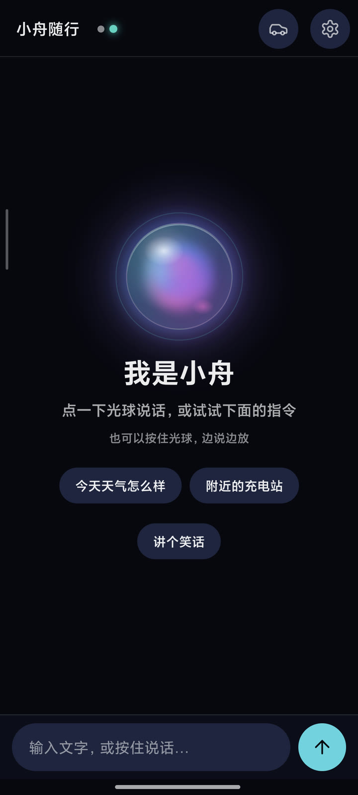 | 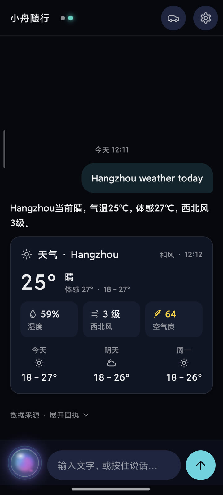 | 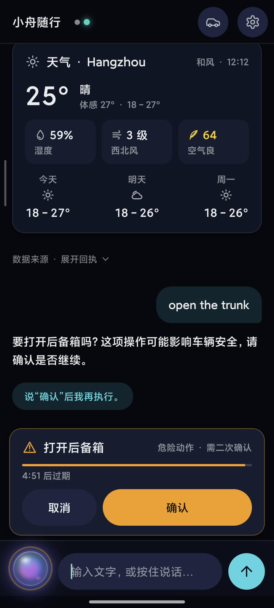 |

<p align="center">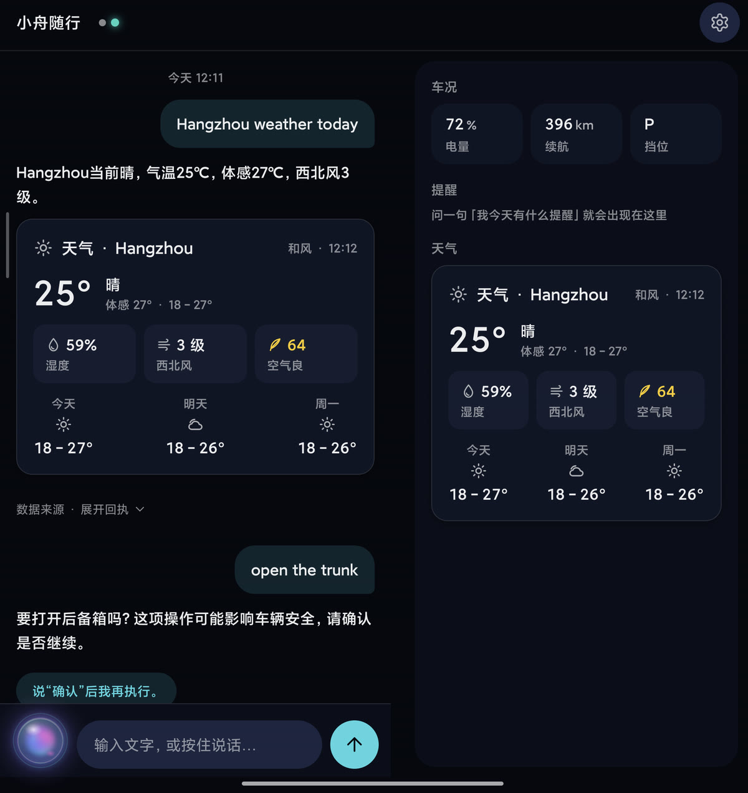</p>

<sub>Xiaomi MIX Fold 4 真机截图（2026-10-10，常驻包 `v0.1.0 · prod · 7d6141afe`，连云端真栈），前三张为外屏、最后一张为展开后的内屏，状态栏已裁。问句经 adb 注入，只能输入英文，回答与卡片仍为中文。确认条投影的是服务端挂起台账，截图后已当场取消，没有执行任何车控；车况为模拟来源。</sub>

### 可观测台 · Visual v2

| 轮次检查器：一轮请求的共轴时间线 | 实况：指令台、本句链路、车况与 Agent 健康 |
|:---:|:---:|
| 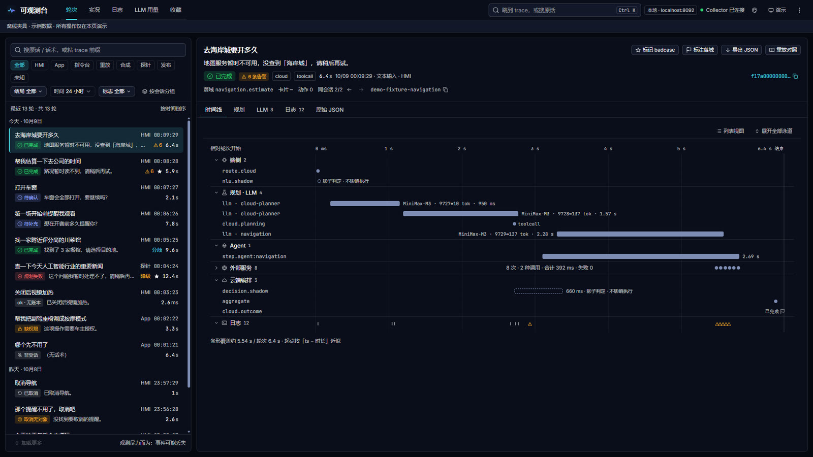 | 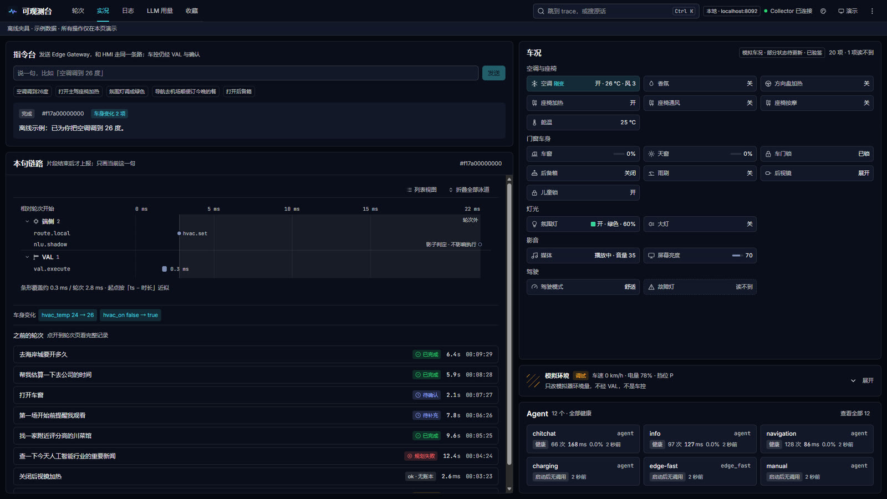 |

<sub>离线夹具（示例数据），由 `node dashboard/visual-qa.mjs` 截取。trace_id 从 HMI 气泡一路贯通到每一跳 LLM 调用；端侧 NLU、Decide 这类影子判定在时间线上单列，并标注「不影响执行」。</sub>

## 系统架构

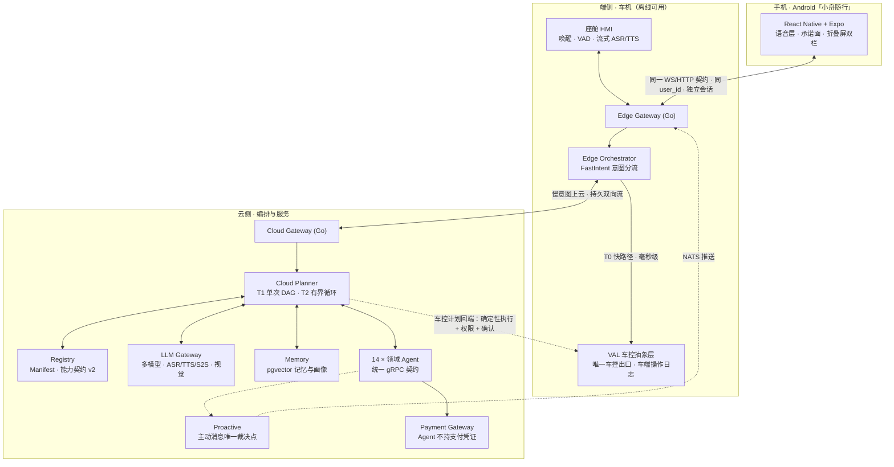
```mermaid
flowchart TB
    subgraph EDGE["端侧 · 车机（离线可用）"]
        HMI["座舱 HMI<br/>唤醒 · VAD · 流式 ASR/TTS"]
        EGW["Edge Gateway (Go)"]
        EO["Edge Orchestrator<br/>FastIntent 意图分流"]
        VAL["VAL 车控抽象层<br/>唯一车控出口 · 车端操作日志"]
        HMI <--> EGW
        EGW --> EO
        EO -->|"T0 快路径 · 毫秒级"| VAL
    end
    subgraph MOBILE["手机 · Android「小舟随行」"]
        APP["React Native + Expo<br/>语音层 · 承诺面 · 折叠屏双栏"]
    end
    APP <-->|"同一 WS/HTTP 契约 · 同 user_id · 独立会话"| EGW
    subgraph CLOUD["云侧 · 编排与服务"]
        CGW["Cloud Gateway (Go)"]
        CP["Cloud Planner<br/>T1 单次 DAG · T2 有界循环"]
        REG["Registry<br/>Manifest · 能力契约 v2"]
        LLM["LLM Gateway<br/>多模型 · ASR/TTS/S2S · 视觉"]
        MEM["Memory<br/>pgvector 记忆与画像"]
        AG["14 × 领域 Agent<br/>统一 gRPC 契约"]
        PRO["Proactive<br/>主动消息唯一裁决点"]
        PAY["Payment Gateway<br/>Agent 不持支付凭证"]
        CGW --> CP
        CP <--> REG
        CP <--> LLM
        CP <--> MEM
        CP <--> AG
        AG --> PAY
        AG -.-> PRO
    end
    EO <-->|"慢意图上云 · 持久双向流"| CGW
    CP -.->|"车控计划回端：确定性执行 + 权限 + 确认"| VAL
    PRO -.->|"NATS 推送"| EGW
```

服务间同步调用走 gRPC（`proto/` 是唯一契约源），异步与主动推送走 NATS；短期状态在 Redis，长期与向量数据在 PostgreSQL + pgvector。请求按复杂度落入三层运行模型：

| 层 | 处理什么 | 形态 |
|---|---|---|
| **T0 端侧快路径** | 车控、媒体等高频确定性指令 | 规则 + 知识库，毫秒级本地执行，离线可用 |
| **T1 云端单次 DAG** | 复杂、跨域、多意图请求 | Planner 一次规划，确定性引擎并行执行 |
| **T2 有界 Agentic 循环** | 需要按中间结果调整计划的任务 | 迭代次数与时间预算受控，自适应再规划 |

Agent 接入完全声明式：manifest 声明能力、权限、上下文需求与卡片优先级，`route_hints` 只做弱模型的确定性兜底，`_escalate` 做执行期改派，`heavy` 驱动思考与过程区——编排核心对具体 Agent 零硬编码。跨请求存活的长任务（异步深调研等）有持久任务账本承载「干到哪了 / 还让不让它干」。多端必须一致的最小契约面登记在 [`docs/conventions.md` §9.33](docs/conventions.md)，两端一脑的架构约束见[架构文档 §2.4](docs/architecture/cockpit-agent-architecture.md)。

### 安全铁律（架构级，违反即 bug）

1. 车控只经 VAL 下发；任何组件（含 LLM / Agent）不得直接操作 CAN/SOME-IP。
2. LLM 只产意图和计划，确定性 Executor 负责执行，并经过权限、VAL 与确认。
3. `require_confirm=true` 必须二次确认，权威来自能力声明或受控配置，不信 LLM。
4. 端到端语音模型没有执行通道，唯一的工具是 `escalate` 回文本主链。
5. 只响应（`response_only`）能力不得返回动作、确认或补槽，冲突在派发前拒绝。
6. 新增 Agent 只经 Registry 接入，不改编排核心。
7. 精确位置、车内音视频、支付默认最小化；声纹不参与权限、VAL、确认或支付。
8. 密钥只进根 `.env`，不进代码、提交、日志与文档。

架构唯一真相源：[`docs/architecture/cockpit-agent-architecture.md`](docs/architecture/cockpit-agent-architecture.md)，与它冲突的实现视为 bug。

## v2 可验证 Agent Runtime

目标是让系统说得清四件事：用户要了什么、计划承接了什么、实际发生了什么、还有什么在等待或无法确认。做法是在原位扩展现有的 Step、会话状态、任务账本、Verifier 和 Manifest/Registry，不另起一套「任务大脑」；每个工作包都从一处实测缺口出发，上线前用注入缺陷证明测试真的会红。

以「打开后备箱」为例，一次写操作现在要过这些关：

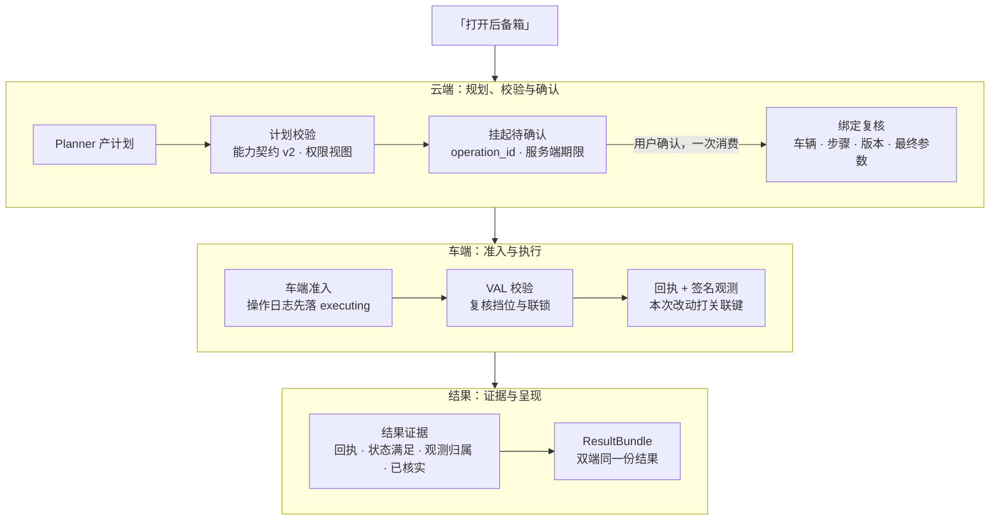
```mermaid
flowchart TB
    S["「打开后备箱」"] --> CLOUD
    subgraph CLOUD["云端：规划、校验与确认"]
        direction LR
        P["Planner 产计划"] --> C["计划校验<br/>能力契约 v2 · 权限视图"]
        C --> W["挂起待确认<br/>operation_id · 服务端期限"]
        W -->|"用户确认，一次消费"| B["绑定复核<br/>车辆 · 步骤 · 版本 · 最终参数"]
    end
    CLOUD --> EDGE
    subgraph EDGE["车端：准入与执行"]
        direction LR
        L["车端准入<br/>操作日志先落 executing"] --> V["VAL 校验<br/>复核挡位与联锁"]
        V --> O["回执 + 签名观测<br/>本次改动打关联键"]
    end
    EDGE --> RESULT
    subgraph RESULT["结果：证据与呈现"]
        direction LR
        E["结果证据<br/>回执 · 状态满足 · 观测归属 · 已核实"] --> R["ResultBundle<br/>双端同一份结果"]
    end
```

| 工作包 | 解决什么 | 状态 |
|---|---|---|
| 步骤范围与任务身份 | 每一步只读该读的原话片段；任务和目标的身份由服务端分配，不采信模型自报的覆盖关系 | 首版已部署 |
| 结果契约 ResultBundle | 一句话里有的在等确认、有的已答完：完整答案、卡片与引用跨挂起、重连和换端保留 | 首版已部署 |
| 能力契约 v2 | 效果、参数值域、版本与上下文需求受控声明；接收方校验版本，契约摘要不授予权限 | 已部署 |
| 可信车态 | 逐车辆、逐信号带时效与质量，Ed25519 来源签名；过期不补 0，新信号不刷新旧信号 | 已部署（来源仍为模拟） |
| 权限化上下文视图 | 模型只看到「主体有权、接收方需要」的交集；撤权后晚到的结果不复活 | Cloud / Agent 路径已部署 |
| 持久准入 · 确认绑定 | 车端写能力与商户写工具在副作用前落准入记录，账本不可用即拒绝；确认一次消费，绑定车辆、步骤、版本与参数 | 已部署 |
| 结果证据 · 车端操作日志 | 有回执不等于生效，状态满足不等于本次导致；车端执行前落日志、重启不重放，云端超时后按记录收口 | 已部署 |
| 记忆与身份治理 | 记忆 / 声纹端点只认 token 主体；删除让在途写入同代际失效；没认出的声音只读普通偏好；一个偏好只保留一个现行说法 | 已部署 |
| MCP 委托与外源隔离 | 共享商户账号在卡片上如实标注，订单句柄只给持有人；第三方文本不当权威；工具指纹在调用期复核，出口只走代理 | 已部署 |
| 能源与健康闭环 | 车况不编、带时效与来源；选站理由可追溯；原位换站；解释告警不宣布故障已排除 | 已部署 |
| 核心旅程冻结 | 目标 200 条旅程 × 5 次独立运行，≥95% 的旅程五次全达标；安全必过集不允许新增误执行 | 建设中（清单与运行器已落地） |
| Jev 判别层（可选） | 作为可弃权的排序 / 复核建议接入，不授权、不执行 | 网关契约已实现，缺省关闭 |
| 端侧有界规划 T1e · 真实车辆驱动 · 量产账号 | 端侧小模型规划、OEM / AAOS 驱动、多车身份与 ACL | 未开始 |

排期与状态以[路线图](docs/roadmap.md)为准；目标边界见 [v2 目标架构](docs/architecture/cockpit-agent-v2-target-architecture.md)，可领取的工作包见[实施方案](docs/design/2026-09-26-cockpit-agent-v2-implementation-plan.md)。

## 能力全景

### 语音：全双工交互回路

- **唤醒**：浏览器内本地 KWS（sherpa-onnx WASM，自建构建链），预设「小舟小舟 / 你好小舟」等唤醒词，唤醒前音频不出浏览器。
- **听**：silero VAD 端点检测 + DashScope 实时流式识别（Qwen3-ASR / Fun-ASR），边说边上屏、停顿定稿自动发送；也可选 MiniMax、MiMo 整句识别，流式不可用时回落批处理。
- **说**：服务端流式 TTS（文本增量进、PCM 分片出），CosyVoice / Qwen3（含北京话、上海话、四川话）/ MiMo / MiniMax 四个引擎，「引擎 → 音色」两级选择；播报中随时打断。
- **免唤醒续聊与拒识**：续问窗内直接接话，「退下吧」本地退场；乘客之间的闲聊等非受话语句静默拒识，不打扰、不落库；真有歧义才出选择卡，明确的句子绝不反问。
- **端到端语音（可选，默认关）**：闲聊与常识由语音大模型直接听直接答；需要执行或查实时信息的请求由模型交回确定性主链，危险动作的确认 / 取消永远由主链裁决。开启后会上传唤醒窗内的原始语音，须用户在设置里显式同意。
- **按声音区分乘员（可选）**：每位乘员的口味、家人关系、常用地点与提醒各自隔离；认不出时按主驾处理；声纹不作为任何权限或支付凭证。
- **看一看（可选）**：只在说「那是什么」这类话时抓一帧交多模态模型；图像只在网关内存里存活两分钟，不落盘、不进对话链、不进记忆，拿不到画面就直说。

### 手机端：Android 陪伴端「小舟随行」

- **一个大脑，两个端**：同 `user_id` 共享记忆与画像，各自独立会话和可单独吊销的凭证，手机档默认不含车控 scope；主动消息推到所有在线端，投递幂等去重。
- **共享判据，不共享 UI**：`hmi/src` 的纯逻辑会话层（重连与离线队列、请求归属、确认台账、播放调度、免唤醒状态机、端点与视觉触发判据、结果选择器……）经 `@shared/*` 直引；台账 `mobile/shared-allowlist.json` 加守卫测试，引用台账外模块、共享模块长出 DOM 依赖都会当场红。
- **三层在场**：光球是唯一状态锚；语音层承载实时转写、流式回答与主卡；承诺面把危险确认、待补槽、长任务进度和离线队列钉在输入框上方——确认策略只投影服务端台账，客户端不自己发明门禁。
- **形态**：窗口尺寸 × 折叠姿态 × 行车档；行车档 56dp 触控目标、一屏一卡、无文本输入；平板与展开的内屏是左对话、右舞台，舞台只是会话已有事实的第二视图，不另外取数。
- **工程与取证**：Expo CNG（`android/` 不入库，`app.config.ts` 是原生配置唯一真相源）；dev / staging / prod 三档变体；prod 常驻包设置页底行的构建身份是「设备跑的是哪份代码」的唯一读数；唤醒词与 VAD 的原生件缺失时构建明确失败；CI 每次 push 跑 tsc + eslint + jest，APK 走手动工作流；Maestro e2e 在 ColorOS 与 HyperOS 真机上跑通。

### 端侧：车控与混合多意图

端侧能力覆盖空调、座椅、车窗、氛围灯、门锁、后备箱、媒体等对象；`orchestrator/edge/knowledge/commands.yaml` 是对象、操作、风险与端侧意图的唯一声明源，归一化、校验、安全门控与话术都由它驱动，新增一个车控能力漏一处就会被能力完整性门禁拦下。混合多意图按语义组分流，本地动作与云端慢意图在同一请求内协同；「低于 20% 就提醒我」这类条件句整句上云，不会被拆开就地执行。端侧语义 NLU 以影子模式运行，只观测不执行（模型文件不入库，新克隆只走规则）。

### 云端：14 个领域 Agent

| Agent | 一句话能力 |
|---|---|
| `navigation` | 高德导航：城市范围内综合排序的具名地点、借名歧义消解、俗称与门牌地址、途经点（人称与常用地点经关系图谱解析）、到达时限、进行中路线增量改道与原位换站 |
| `nearby` | 周边发现（高德 POI 2.0）：餐饮 / 酒店 / 景点 / 停车 / 充电，价位与营业状态筛选 |
| `trip-planner` | 结构化多日行程：真实 POI 接地 + 电量感知充电编织 + 主题 / 多城市保序 / 点名必去点 + 局部改排不漂移 |
| `charging-planner` | 充电规划：沿途与目的地补电，到站估算与选站理由可追溯，读不到电量就如实说 |
| `info` | 天气（和风）/ 搜索（Exa 接地合成：强制引用、无据弃权）/ 新闻 / 股票（Tushare）/ 赛事（api-football） |
| `deep-research` | 深度调研：多视角子问题 → 有界并行检索 → 带引用、标明数据缺口的分节报告，支持异步 |
| `reminder` | 自然语言日程 / 提醒 / 待办：改期、稍后提醒、重复规则，按时间、ETA 或到地触发 |
| `scene-orchestrator` | 自定义场景：一句话创建、环境自适应、退出真恢复、执行后对账；问「露营模式是什么」只讲不做 |
| `road-safety` | 路况安全与响应式主动播报 |
| `parking-payment` | 停车缴费：查费只读，缴费经统一支付网关出付款码（支付宝 / 微信），金额以订单快照为准 |
| [`manual-rag`](agents/manual_rag/README.md) | 车书问答（Xiaomi SU7 真实图文手册）：口语召回、来源与数值校验、已登记告警按原文保留条件，证据失配时弃权 |
| `chitchat` | 闲聊与常识；墙钟和日期由系统时钟直答；本车功能问句交给有把握的手册 |
| `vision` | 看一看：单帧多模态识别 |
| `mcp-bridge` | 受控 MCP 桥：人工准入 + 版本锁定 + schema 指纹。已接麦当劳 / 瑞幸官方 MCP 工作流（选店选品 → 计价预览 → 确认下单 → 支付入口 → 查单），写操作有确认闸、请求指纹幂等与持久准入；系统不代用户付款 |

**规划知识按需供给**（`skills/`）：多日行程、导航顺路、条件依赖、充电分流这类组合判据以声明式文件供给 Planner，词法 + 语义双通道检索注入；每份知识自带 golden，经 CI 门禁与真栈 A/B 验证「真的让规划变对了」——加规划知识是投一个文件，不改编排核心。落域准确率靠范例数据增长（`skills/exemplars/`，权威链最软层，写错只是噪声），而不是人写正则；确定性 `route_hints` 另有退役机制，「模型自己已经会了」的规则会被提案移除。

### 记忆、上下文与主动性

- **语义记忆**（pgvector）：从对话中抽取偏好与个人实体，带权偏好与关系边，语义召回注入规划与闲聊；显式修改胜过旧偏好，可查可删，删除让在途写入同代际失效。
- **上下文装配**：统一 token 预算内装配能力目录、对话历史、长期记忆与结构化焦点态（候选集和执行事实是一等成员），跨轮指代不靠啃原文；模型输入按权限投影。
- **主动治理**：提醒到点与到地、场景触发、路况播报、深调研完成、晨间早报、低电量顺路建议、记忆 routine 等主动消息，都先过统一主动引擎——投递时刻复核情境、跨生产方去重、驾驶负荷高时延后、同一时间窗的合并成一条。

### 多模型运行时

- **LLM**：MiMo / MiniMax / DeepSeek / 通义千问四家进程内注册表，HMI 设置页运行时热切换并持久化；每个业务帧带请求级 provider/model pin；429 与流式故障分类降级、跨厂商备份档、健康探针；embedding 与 chat 解耦，视觉另有独立档位。
- **语音引擎**：ASR 与 TTS 都可切换（见上文「语音」）；端到端语音走 DashScope 实时全模态模型。
- **评测可信**：评测报告锁定 provider，中途漂移即作废，跨模型对比才可比。

### 可观测与 badcase 闭环

trace_id 从 HMI 气泡一键复制，贯通到每一跳 LLM 调用（tokens / 时延 / 门控内容）；collector 持久化并提供只读查询，健康与指标之外的调试面需要运维令牌。可观测台五个视图：轮次（检查器、共轴时间线、badcase 一键重放对照）、实况、日志、LLM 用量、收藏。collector 常开 `/metrics`；Prometheus + Grafana 经 `--profile observability` 启用，OTel 导出由 `OTEL_EXPORTER_OTLP_ENDPOINT` 打开。

## 快速开始

依赖：Python 3.11+；本地完整真栈需要 Docker Desktop。本地开发另需 Go 1.24+、Node 20+（Android 端用 Node 22）、buf。

```bash
cp .env.example .env         # 不配任何密钥也能跑：LLM 落 MockProvider，外部数据源走 mock
make proto                   # 生成 gRPC 代码（改 proto 后必跑）
python test/smoke_edge.py    # 可选：不起 Docker 先做端侧冒烟
make up                      # 起全栈 30 个服务
```

Windows PowerShell：

```powershell
Copy-Item .env.example .env
./scripts/gen-proto.ps1
python test/smoke_edge.py
docker compose -f compose.yaml up --build -d
```

起栈后：

- **座舱 HMI** <http://localhost:5173>：按住「小舟」光球说话，或直接打字。
- **可观测台** <http://localhost:5174>：轮次下钻、trace、LLM 用量。

注意：

- 只能从根 `compose.yaml` 启动（`make up` 已封装）；直接用 `deploy/docker-compose.yaml` 会丢掉根 `.env`，真实 Provider 会静默回退 mock。
- 真实数据源与 LLM 凭证的键名见 `.env.example`；可观测台的车辆调试写接口仅限本地演示，非开发环境设 `DEBUG_VEHICLE_CONTROL=false`。
- 不起后端也能看界面：HMI 有 `?demo`、`?card-gallery`、`?settings` 视觉夹具，可观测台有 `?fixture=` 离线夹具。
- 真栈分本地 / 云端两档：仓库根 `dev-stack.local` 声明目标（新克隆缺省 `local`），统一入口 `python scripts/dev_stack.py`（target show / status / deploy / verify / hmi / dashboard）。云档操作与红线见 [`docs/dev-guide.md`](docs/dev-guide.md)。

## 工程与验证

| 层 | 内容 | 入口 |
|---|---|---|
| 单测 / 契约 | 全服务 pytest：编排、Agent、安全不变量、记忆、网关、共享运行时；跨进程声明源对账 | `make test` |
| CI 阻断门禁 | skill 契约、范例契约、意图对抗 L0 strict、能力完整性——零 LLM、零网络 | 见下方命令 |
| 前端 | HMI / 可观测台单测与生产构建；无头浏览器视觉与交互回归（离线夹具） | `npm test && npm run build` |
| Android | tsc strict + eslint + jest（共享白名单守卫、会话状态机、语音链、卡片契约）；Maestro e2e；真机证据绑定 APK 身份 | `npm run typecheck && npm test` |
| 评测 | 意图对抗 L0–L3、云侧路由、四模式路由、拒识与澄清、手册召回；报告锁定 provider | [`docs/reviews/eval/`](docs/reviews/eval/README.md) |
| 真栈 E2E | `run_e2e` 清单（`remote_safe` / `remote_mutating` 分级）、L3 旅程、v2 核心旅程（只读 / 合成写 / 模拟车三条车道） | `make e2e`、`scripts/probe_v2_baseline.py` |
| 发布 | 只部署 `main` 可达的精确 SHA：dry-run → 人工授权 apply → 独立 status / verify；证据按 SHA 登记 | `scripts/dev_stack.py` |

CI 每次 push 跑六个作业（E2E 契约、Python 3.11/3.12 单测、意图评测与四道门禁、Go 构建测试、Android、前端），nightly 定时跑断言型 E2E。自进化流水线（`scripts/evolve.py`：badcase 挖掘 → 归因 → 补丁提案 → 评测门禁 → 日报）按需或经计划任务触发，只出提案、不自动改仓库。

```bash
make test                               # 全量 pytest（并行；固定口径见 AGENTS.md §6）
python test/eval_skills.py              # 四道 blocking 门禁
python test/eval_exemplars.py
python scripts/check_intent_gate.py
python test/eval_capability_integrity.py
cd hmi && npm test && npm run build
cd dashboard && npm test && npm run build
cd mobile && npm run typecheck && npm test

# 全栈起来后
python test/e2e_ws.py                   # WS 全链路冒烟
make e2e                                # 本地全量 E2E 清单（Windows: ./scripts/run_e2e.ps1）
python test/e2e_journeys.py             # L3 旅程级（--provider 锁定评测用 LLM）
node test/hmi_cdp/run_cases.mjs         # L4 真浏览器 CDP
```

四条工程纪律：

- **文档先行**：每个主题先对齐设计再动手，`docs/design/` 下已有 180 多篇按日期编号的设计与落地记录；架构文档是唯一真相源。
- **badcase 驱动**：真机 / 真麦反馈 → 可观测台 trace 下钻 → 修复 → 原句真栈复验；修复要用注入缺陷证明测试真的会红。
- **铁律测试化**：「新增 Agent 不改编排核心」「危险动作必确认」「只响应能力不得动作」等架构约定由契约测试固化，违反直接红灯。
- **证据不转借**：release SHA、测试 SHA 与产物分栏登记；自动 PASS 之外，还要读话术、动作、卡片、trace 与清理结果。

## 目录结构

```text
proto/            gRPC 契约——所有接口的唯一真相源
gateway/          Go 接入网关（edge/ 端侧、cloud/ 云侧）与车态观测校验
orchestrator/     edge/：FastIntent、端侧编排、VAL（PoC 模拟）与车控知识库
                  cloud/：Planner、Context、Loop、Executor、Aggregator
agents/           14 个领域 Agent；_sdk/ 公共 SDK（BaseAgent、检索与接地内核、任务账本）
skills/           Planner 软知识：guides/ 组合判据、policies/ 跨域软约束、exemplars/ 落域范例库
llm-gateway/      LLM / Embedding / ASR / TTS / S2S / 视觉调用的唯一出口
registry/         Agent 注册中心（Manifest、能力契约、PostgreSQL 持久化）
memory/           记忆、画像、关系与建议准入（pgvector）
runtime/          跨服务唯一判据：时间、极性、问句、安全信号、能力契约、车态信封、操作准入、执行证据……
security/         权限引擎、scope、内容审核、注入防护
payment-gateway/  统一支付网关（Agent 不持支付凭证）
proactive/        统一主动引擎——「该不该现在打扰驾驶员」的唯一裁决点
observability/    NATS 事件出口、collector、trace / 指标
hmi/              React 座舱前端（Visual v2）
mobile/           Android 陪伴端「小舟随行」（React Native + Expo，Visual v3）
dashboard/        React 可观测台（Visual v2）
deploy/           本地 Compose；cloud/ 云端发布，host/ 共用主机维护，Prometheus / Grafana 配置
scripts/          codegen、构建、部署、迁移、探针
test/             E2E、评测基线、旅程语料、CDP 用例
docs/             架构（真相源）、设计记录、评审交接、指南、研究
```

## 文档导航

| 想了解 | 看这里 |
|---|---|
| 接手第一步、红线、自检入口 | [`AGENTS.md`](AGENTS.md) |
| 工程约定、目录规范、安全红线 | [`CLAUDE.md`](CLAUDE.md) |
| 为什么这么设计（架构唯一真相源） | [`docs/architecture/cockpit-agent-architecture.md`](docs/architecture/cockpit-agent-architecture.md) |
| v2 目标架构 / 路线图 / 可领取工作包 | [目标架构](docs/architecture/cockpit-agent-v2-target-architecture.md) / [路线图](docs/roadmap.md) / [实施方案](docs/design/2026-09-26-cockpit-agent-v2-implementation-plan.md) |
| 当前 release、QA 证据与剩余活项 | [`docs/reviews/2026-08-30-qa-closeout-handoff.md`](docs/reviews/2026-08-30-qa-closeout-handoff.md) |
| 各主题设计与落地记录 | [`docs/design/README.md`](docs/design/README.md) |
| 环境、端口、命名、错误码 | [`docs/dev-guide.md`](docs/dev-guide.md)、[`docs/conventions.md`](docs/conventions.md) |
| 测试分层与运行说明 | [`test/README.md`](test/README.md) |
| 接真实 Provider（高德 / 和风样板） | [`docs/guides/provider-integration.md`](docs/guides/provider-integration.md) |
| 意图落域对抗测试与 badcase 修法 | [`docs/guides/intent-adversarial-testing.md`](docs/guides/intent-adversarial-testing.md) |
| Figma 设计稿落地与前端设计系统 | [`docs/guides/figma-design-system-rules.md`](docs/guides/figma-design-system-rules.md) |
| Android：装包、连云栈、两台真机 | [`mobile/README.md`](mobile/README.md)、[构建与取证指南](docs/guides/android-build-and-device-validation.md) |
| Android 剩余待办（设备、真人与生产化） | [`docs/design/2026-09-14-android-remaining-todos.md`](docs/design/2026-09-14-android-remaining-todos.md) |
| 研究与对标 | [`docs/research/README.md`](docs/research/README.md) |

各服务子目录另有自己的 README，改某个服务前先读它。

## 现状与边界

当前为 **Phase 1 工程化 PoC**：T0 / T1 / T2 运行模型、云端中枢、语音回路、记忆与上下文、可观测、旅程级验证和 v2 首批契约都已落地，并在云端真栈运行。距量产的已知边界如实列出：

- **车辆**：VAL 是 Python 模拟（`orchestrator/edge/val.py`）；车态观测已 Ed25519 签名，但来源仍标 `simulated`。真实 CAN/SOME-IP、AAOS / OEM 驱动、车规资源约束与 OTA 属于后续阶段。
- **身份与账号**：两层会话鉴权与服务间 mTLS 经 env 门控（本地开发档默认关，云端已开会话鉴权）；账号仍是静态、可吊销的 token，量产账号体系、多车 ACL、全局撤销与证书轮换都还没做。
- **商户与支付**：麦当劳 / 瑞幸接的是官方 MCP，但商户凭证是服务级共享账号（卡片如实标注）；系统只创建未支付订单并给出受控支付入口，不代用户付款；停车仍是 mock Provider。
- **部署形态**：单台云主机 + Docker Compose；Cloud Gateway 的车辆长连状态在单实例内存，Registry 已持久化，多实例与 K8s 属于目标态。
- **Android**：前台交互 PoC，不做后台保活与厂商推送，主动消息只在 App 前台送达；debug 签名；正式鉴权、推送、签名与 OTA、崩溃监控、商店合规都未启动。设备与真人验收看[剩余待办总表](docs/design/2026-09-14-android-remaining-todos.md)。
- **声学与真人验收**：真麦命中率、误唤醒率等属于人工验收范畴，尚未签收。
- **v2 未完成项**：核心旅程冻结（200 × 5）仍在建；Jev 判别层、端侧有界规划（T1e）、车端日志的后台同步与补偿都未实现。
- **QA 仍非全绿**：当前 release、测试读数与剩余活项以 [QA 交接](docs/reviews/2026-08-30-qa-closeout-handoff.md)为准，README 不维护易腐的数字。

## English summary

**Cockpit Agent** is a cloud–edge multi-agent system for an in-car voice assistant called *Xiaozhou*. One voice entry point covers millisecond vehicle control, multi-day trip and charging plans, owner's-manual Q&A, merchant ordering and asynchronous deep research. It has two clients, an in-car HMI (React) and an Android companion app (React Native + Expo), sharing one backend.

- **LLMs plan, deterministic code executes.** Every vehicle command goes through a vehicle abstraction layer (VAL). Dangerous actions need a second confirmation that is bound to the vehicle, step, capability version and final parameters, and can be used only once.
- **Fast and slow paths.** Frequent, safety-sensitive commands run on the edge in milliseconds and work offline. Complex requests go to a cloud planner that runs a single DAG (T1) or a bounded loop (T2).
- **Claims need evidence.** Writes are admitted durably before any side effect. Results keep acknowledgement, state match, attribution and verification apart, so a state that was already true does not count as done. Vehicle observations are signed and expire per signal.
- **Plug-in agents.** 14 cloud agents plus edge capabilities are declared in manifests (capability contract v2) and discovered through a registry, so the orchestrator core never changes for a new agent.
- **Engineering by evidence.** Four deterministic blocking CI gates, over ten thousand unit and contract tests, journey-level end-to-end runs, and releases pinned to exact commits.

Status: a Phase 1 engineering proof of concept running on a cloud stack, with a simulated VAL. The roadmap toward a *verifiable agent runtime* (v2) is in [`docs/roadmap.md`](docs/roadmap.md). Most documentation is in Chinese.

## 许可

本项目以 [Apache License 2.0](LICENSE) 发布。
