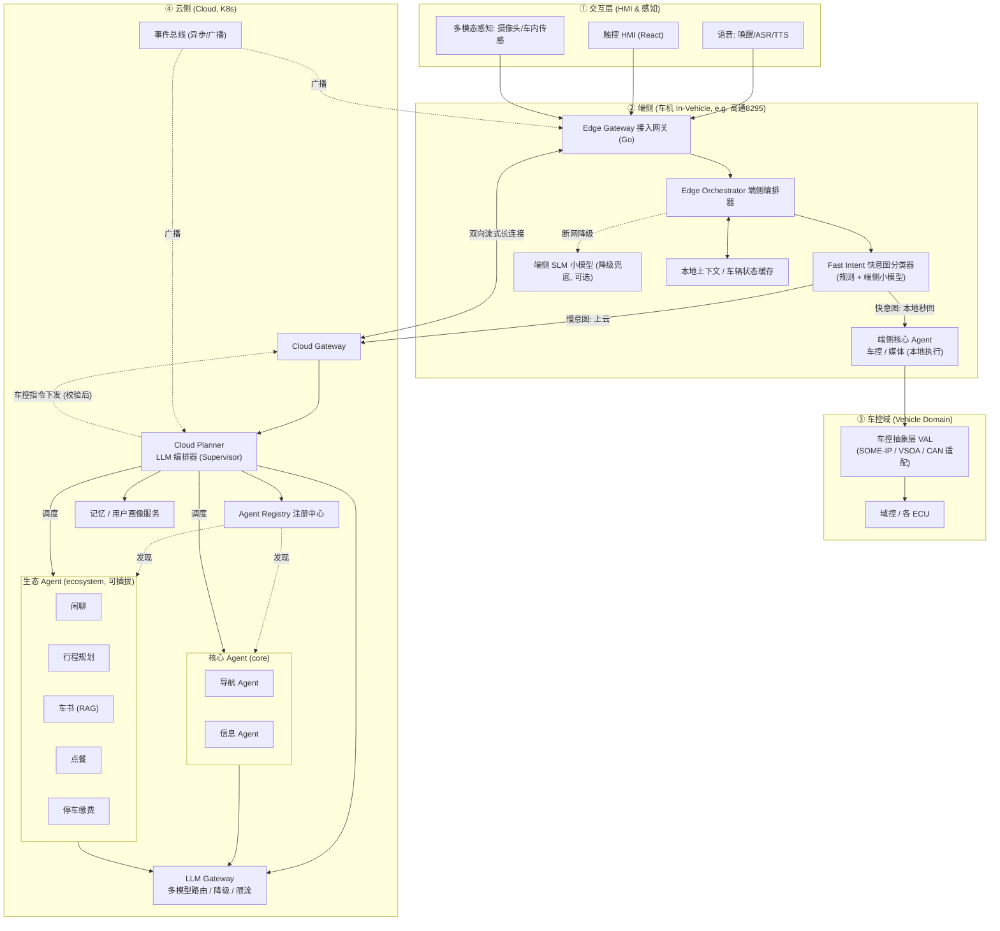
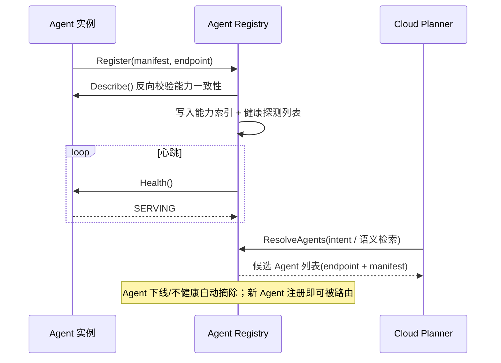
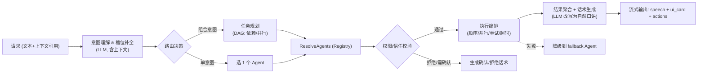
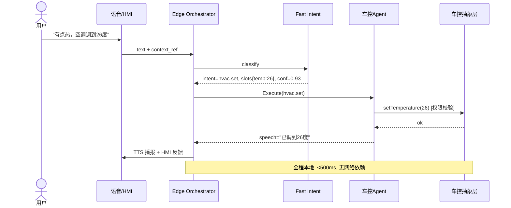
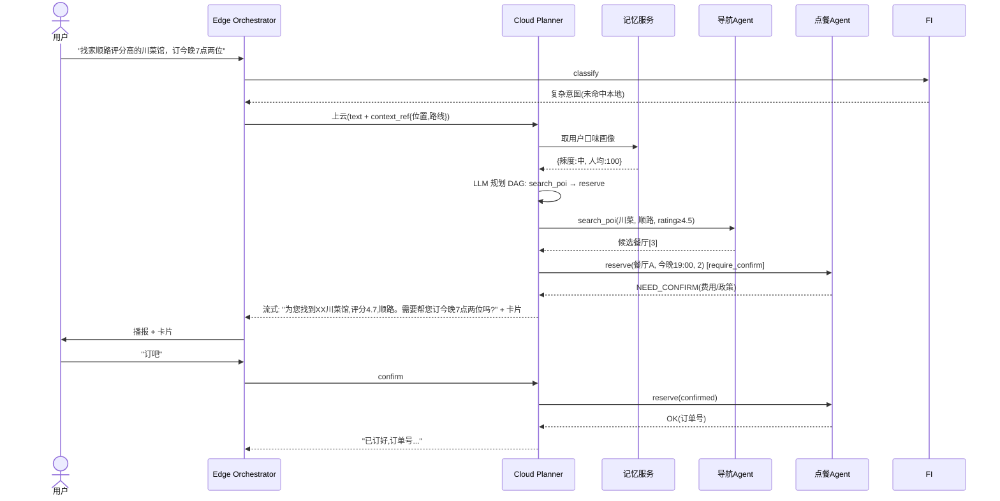
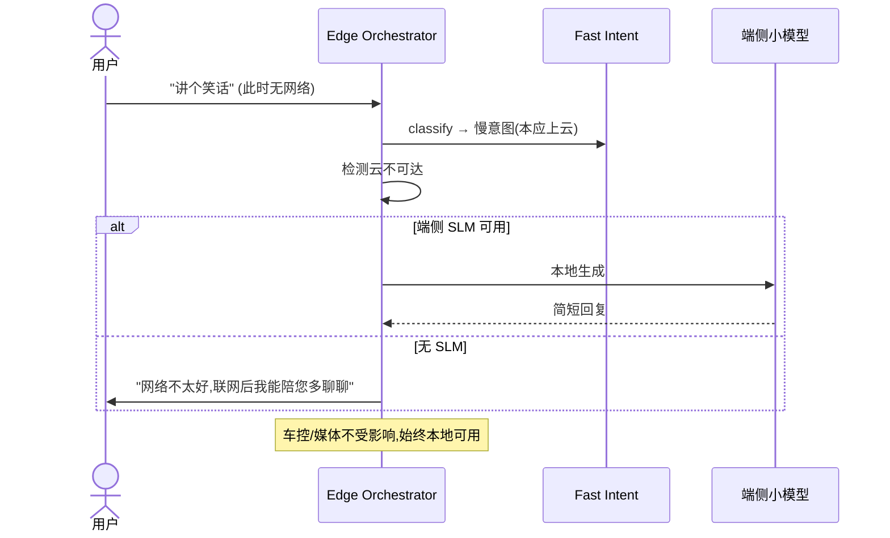

# 智能座舱 Multi-Agent 架构设计方案

> 版本：v1.1（当前架构基线）
> 日期：2026-06-14
> 读者对象：架构师、后端/端侧/算法开发、HMI 开发、测试、项目经理
> 范围：座舱 AI Agent 系统的整体架构、组件职责、接口契约、数据流、安全、选型、部署、分阶段落地路线
> 实现说明：当前仓库完成的是该架构的工程化 PoC 主干；文中的 K8s、持久化注册、
> 真实 Provider、mTLS、正式沙箱、完整 OTel 与真实 VAL 等仍是目标态。实现现状和
> 差距以 `AGENTS.md` 与 `phase1-implementation-plan.md` 顶部说明为准。

---

## 0. 一页速读（TL;DR）

- **架构范式**：分层混合编排（Hierarchical Hybrid）。端侧"快系统"负责高频、确定性、安全敏感指令（车控/媒体）的毫秒级本地执行与离线兜底；云侧"慢系统"用 LLM Planner 编排复杂、多轮、跨域组合意图。
- **Agent 生态**：所有 Agent 实现统一 gRPC 契约 + 声明 Manifest，经注册中心即插即用。分为 `core`（系统内置、安全敏感）与 `ecosystem`（可插拔、可第三方：点餐/停车/车书/行程/闲聊等）两类，安全等级不同。
- **云边协同**：意图分级路由（Fast Intent 端侧 / Cloud Planner 云侧），断网降级到端侧小模型 + 规则。
- **技术栈**：Go（接入网关，高并发/WebSocket）+ Python（编排器与各 Agent，AI 生态最好）+ gRPC（服务间同步调用）+ 事件总线（异步/广播/车控事件）+ React（座舱 HMI）。
- **落地节奏**：Phase 0 PoC（端到端跑通一条链路）→ Phase 1 工程化（全能力域 + 注册生态 + 可观测）→ Phase 2 量产（车规适配、降级、安全、OTA）。

---

## 1. 设计目标与约束

### 1.1 业务目标
1. 用户用自然语言（语音为主、触控/多模态为辅）完成座舱内绝大多数任务：车控、导航、娱乐、信息、以及不断扩展的生态服务（点餐、停车缴费、车书问答、行程规划、闲聊等）。
2. 支持**跨 Agent 的组合意图**（一句话触发多个 Agent 协作完成一个目标）。
3. 生态可持续扩展：新增一个 Agent **不修改编排核心代码**，通过注册接入。

### 1.2 关键约束（架构硬约束，按优先级）
| 优先级 | 约束 | 含义 |
|---|---|---|
| P0 | **安全** | 车控类操作必须确定性执行、可权限校验、危险操作二次确认，绝不交由 LLM 自由决策直接下发 |
| P0 | **时延** | 高频指令（车控/媒体）端到端 < 500ms 且离线可用；复杂云端意图首响 < 1.5s |
| P0 | **可用性/降级** | 断网、云端故障时，车控/媒体/基础问答仍可用（端侧兜底） |
| P1 | **可扩展性** | Agent 即插即用，编排核心对 Agent 数量与种类无感 |
| P1 | **隐私合规** | 敏感数据（位置、车内音视频、支付）默认不出车；上云数据最小化、可审计 |
| P2 | **可量产** | 车规适配（SoC 算力约束、SOA/CAN 对接、OTA、资源占用、稳定性） |

### 1.3 非目标（YAGNI，本期不做）
- 不做完全自主的 AGI 式 Agent 自由协商（多 Agent 群聊式自组织）——量产不可控。
- 不自研 ASR/TTS/LLM 基础模型——通过 Gateway 接入成熟方案，保留可替换性。
- 不做跨车队的多车协同。
- 第一版不做端侧大模型微调闭环（端侧仅用现成小模型 + 规则）。

---

## 2. 总体架构

### 2.1 分层架构图



### 2.2 核心组件职责清单

| 组件 | 部署 | 语言 | 职责 | 一句话边界 |
|---|---|---|---|---|
| **Edge Gateway** | 端 | Go | 接入语音/HMI/感知，会话保持，端云长连接，本地限流 | 所有交互的入口；不含业务逻辑 |
| **Edge Orchestrator** | 端 | Python/C++* | 端侧编排：调 Fast Intent，决定本地处理 or 上云，本地结果聚合，降级控制 | 端侧大脑；只做路由与降级决策 |
| **Fast Intent** | 端 | 规则+小模型 | 把用户输入快速分类为「快意图/慢意图」并抽槽位，给置信度 | 只判类型与槽位，不执行 |
| **车控/媒体端侧 Agent** | 端 | Python/C++* | 高频确定指令的本地执行 | 确定性执行，经 VAL 操作车身 |
| **VAL 车控抽象层** | 端 | C++ | 屏蔽 SOME-IP/VSOA/CAN 差异，统一车控 API，权限/安全校验 | 唯一能碰车身信号的层 |
| **Cloud Gateway** | 云 | Go | 端云通道服务端，鉴权，会话路由，流式下发 | 云侧入口 |
| **Cloud Planner** | 云 | Python | 复杂意图理解、任务规划、多 Agent 编排、结果聚合与话术生成 | 云侧大脑；编排不执行 |
| **LLM Gateway** | 云 | Python/Go | 多模型路由、Prompt 管理、缓存、限流、降级、成本与配额 | 所有 LLM 调用的唯一出口 |
| **Agent Registry** | 云 | Go/Python | Agent 注册/发现/健康，能力索引（供路由用） | Agent 黄页 |
| **核心/生态 Agent** | 云 | Python | 各自领域的能力实现，实现统一 Agent 契约 | 单一职责，可独立部署/测试 |
| **记忆/画像服务** | 云 | Python | 短期会话上下文、长期用户画像、车辆上下文 | 上下文的唯一真相源 |
| **事件总线** | 云+端 | NATS/Kafka | 异步事件、车控状态广播、主动服务触发 | 解耦异步与广播 |

> \* 端侧编排器与端侧 Agent 的语言：PoC 阶段可用 Python 快速验证；量产阶段对时延/资源敏感的部分（VAL、Fast Intent 推理）建议 C++/Rust，详见 §11、§14。

---

## 3. 端云职责切分（云边协同核心）

云边协同的本质是**意图分级路由**：不是所有请求都上云，也不是所有都本地。

### 3.1 意图分级

| 级别 | 典型例子 | 处理位置 | 时延目标 | 依赖网络 |
|---|---|---|---|---|
| **L0 即时控制** | 开空调、关车窗、调座椅、上一首、暂停 | 端侧 Fast Intent + 端侧 Agent | < 500ms | 否 |
| **L1 简单查询** | 现在几点、剩余电量、当前导航还有多远 | 端侧（命中本地数据）| < 500ms | 否 |
| **L2 单域复杂** | "导航去最近的快充站"、"放点适合下雨天的歌" | 云侧单 Agent | < 1.5s 首响 | 是 |
| **L3 跨域组合** | "找家顺路评分高的川菜馆订今晚的位" | 云侧 Planner 编排多 Agent | < 2s 首响 + 流式 | 是 |
| **L4 开放对话/知识** | 闲聊、车书问答、行程建议 | 云侧（RAG/LLM）| < 2s 首响 | 是 |

### 3.2 路由决策（端侧 Fast Intent 的判定逻辑）

```
输入(文本+上下文)
  → Fast Intent 分类
      ├─ 命中本地意图白名单 且 置信度 ≥ θ_high  → 本地执行 (L0/L1)
      ├─ 命中本地意图 但 置信度 ∈ [θ_low, θ_high) → 本地执行 + 异步上云校验
      └─ 未命中 / 置信度 < θ_low / 显式复杂句式 → 上云 (L2/L3/L4)
  网络不可用时:
      → 强制走端侧 SLM + 规则，能力降级（仅车控/媒体/基础问答），明确告知用户
```

- `θ_high`、`θ_low` 为可调阈值（配置下发），初期建议 0.85 / 0.5，依据线上意图准确率调优。
- **本地意图白名单**：由各端侧 Agent 在端侧注册时声明（见 §4.4），编排器据此构建。

### 3.3 降级策略矩阵

| 故障 | 表现 | 降级行为 |
|---|---|---|
| 断网 | 云不可达 | 车控/媒体正常；复杂意图回复"网络不可用，已为您本地处理基础指令"；可选端侧 SLM 兜底简单问答 |
| 云 Planner 故障 | 网络通但编排挂 | LLM Gateway 直连单 Agent 兜底；或返回澄清话术 |
| 某 Agent 故障 | 单领域不可用 | Planner 跳过该 Agent，降级到 `fallback`（如 chitchat）并告知用户 |
| LLM 超时 | 首响超 budget | 流式占位 + 重试到备用模型（LLM Gateway 负责） |

---

## 4. Agent 模型与契约（架构的可扩展性基石）

### 4.1 Agent 分类

| 类别 | trust_level | 例子 | 特点 |
|---|---|---|---|
| **core（核心）** | `system` / `first_party` | 车控、媒体、导航、信息、语音 | 系统内置，可碰敏感能力（车控），随系统发版 |
| **ecosystem（生态）** | `first_party` / `third_party` | 点餐、停车缴费、车书、行程规划、闲聊 | 可插拔，独立发版，第三方可接入，权限受限沙箱 |

不同 trust_level 对应不同的权限上限与审核要求（见 §9）。

### 4.2 统一 Agent 契约（gRPC）

所有 Agent（无论 core/ecosystem，无论端/云）实现同一份 gRPC 服务定义，这是"即插即用"的前提。

```proto
// proto/cockpit/agent/v1/agent.proto
syntax = "proto3";
package cockpit.agent.v1;

// 每个 Agent 都必须实现的统一服务契约
service Agent {
  rpc Describe (DescribeRequest) returns (AgentManifest);          // 上报能力清单(供注册/路由)
  rpc Execute  (ExecuteRequest)  returns (ExecuteResponse);        // 同步执行一个意图
  rpc ExecuteStream (ExecuteRequest) returns (stream ExecuteEvent);// 流式执行(长任务/流式话术)
  rpc Health   (HealthRequest)   returns (HealthResponse);         // 健康检查
}

message ExecuteRequest {
  string request_id = 1;
  string session_id = 2;
  Intent intent     = 3;                 // 已识别意图与槽位
  ContextRef context = 4;                // 上下文引用(按需取，不全量传)
  repeated ModalityRef modalities = 5;   // 多模态输入引用(音频/图像URI)
  map<string, string> meta = 6;          // trace_id、locale、vehicle_id 等
}

message Intent {
  string name = 1;                       // 命名空间化: "navigation.search_poi"
  map<string, string> slots = 2;         // 槽位
  float confidence = 3;
  string raw_text = 4;
}

message ExecuteResponse {
  enum Status { OK = 0; NEED_CONFIRM = 1; NEED_SLOT = 2; FAILED = 3; REJECTED = 4; }
  Status status = 1;
  string speech = 2;                     // 给 TTS 的播报话术
  google.protobuf.Struct ui_card = 3;    // 给 HMI 的结构化卡片(可选)
  repeated AgentAction actions = 4;      // 需执行的动作(如车控指令、跳转)
  string follow_up = 5;                  // 多轮追问/澄清提示
  ErrorInfo error = 6;
}

message AgentAction {
  string type = 1;          // "vehicle.control" | "navigate" | "play" | "open_app" ...
  google.protobuf.Struct payload = 2;
  bool require_confirm = 3; // 危险动作需用户二次确认
}

message ExecuteEvent {     // 流式: 边想边说边做
  oneof event {
    string speech_delta = 1;       // 流式话术增量
    AgentAction action = 2;
    ExecuteResponse final = 3;     // 终态
  }
}
```

> 说明：`ContextRef` 与 `ModalityRef` 用"引用"而非全量传值——上下文与多模态原始数据由记忆服务/对象存储托管，Agent 按需拉取，降低传输量并满足隐私边界（见 §7、§9）。

### 4.3 Agent Manifest（能力声明，路由与治理的依据）

每个 Agent 用一份声明式 Manifest 描述自己。注册中心据此建立**能力索引**，Planner 据此做**语义路由**。

```yaml
# agents/food-ordering/manifest.yaml
agent_id: food-ordering
version: 1.2.0
display_name: 点餐助手
category: ecosystem
trust_level: third_party
deployment: cloud            # edge | cloud
latency_budget_ms: 2000
fallback: chitchat           # 失败/拒绝时的降级 Agent

capabilities:
  - intent: food.search_restaurant
    description: 按菜系/位置/评分/价格搜索餐厅
    slots: [cuisine, location, rating_min, price_level, party_size]
    examples: ["找家川菜馆", "附近有什么好吃的", "人均一百以内的火锅"]
  - intent: food.reserve
    description: 预订餐厅座位
    slots: [restaurant_id, datetime, party_size]
    require_confirm: true     # 涉及承诺/费用，需二次确认

requires_permissions:         # 见 §9 权限模型
  - location.read
  - payment.invoke
  - network.external

# 端侧 Agent 额外声明本地意图白名单(用于 Fast Intent)
edge_intents: []
```

**路由如何用 Manifest**：Planner 把所有已注册 Agent 的 `capabilities`（intent + description + examples）作为可选"工具"提供给 LLM 做工具选择/规划；`trust_level` + `requires_permissions` 决定能否被调用与是否需确认；`latency_budget_ms` 用于超时与降级。

### 4.4 Agent 注册与发现



- **注册方式**：Agent 启动自注册（gRPC/HTTP 调 Registry），或经声明式部署（manifest 随容器部署被 Registry sidecar 上报）。
- **版本与灰度**：同一 `agent_id` 多版本并存，Registry 支持按 `vehicle_group` / 灰度比例路由。
- **生态接入**：第三方 Agent 提供符合契约的服务端点 + Manifest + 通过安全审核，即可上线，**不触碰编排核心代码**。

---

## 5. 编排器设计

编排是"双脑"：端侧 Edge Orchestrator（快、确定）与云侧 Cloud Planner（强、灵活）。

### 5.1 Edge Orchestrator（端侧编排器）
职责（只做决策与降级，不做复杂业务）：
1. 接收 Edge Gateway 来的标准化输入（文本 + 上下文引用）。
2. 调 Fast Intent 分类，按 §3.2 决策本地处理 or 上云。
3. 本地处理：调端侧 Agent → 经 VAL 执行 → 聚合结果 → 出话术。
4. 上云：建立/复用流式通道，转发请求，接收云端流式结果并驱动 TTS/HMI。
5. 降级控制：网络/云端异常时切端侧兜底。
6. 端侧多轮的短期上下文维护（最近 N 轮，本地缓存）。

### 5.2 Cloud Planner（云侧编排器 / Supervisor）



关键设计点：
- **规划用 LLM + 工具调用范式**：Agent 的 `capabilities` 即"工具"。Planner 让 LLM 输出一个**任务计划（DAG）**：哪些 Agent、顺序/并行、Agent 间参数依赖。
- **执行与规划分离**：LLM 只负责"规划"（决定调谁、传什么），实际"执行"由确定性的 Executor 完成（带超时/重试/熔断）。**LLM 不直接产生车控信号**——车控类 action 一律回流到端侧 VAL 经权限校验后执行（见 §9.1）。
- **结果聚合**：多 Agent 结果由 LLM 改写成连贯的口语化播报 + 结构化卡片，保证体验一致。
- **多轮与澄清**：缺槽位（`NEED_SLOT`）或需确认（`NEED_CONFIRM`）时，生成追问，挂起任务状态等待用户回复。

### 5.3 为什么"规划/执行分离"是 P0 安全要求
让 LLM 直接调用车控接口（function calling 直连车身）在量产不可接受：幻觉、注入攻击会变成真实的车辆动作。本设计中 LLM 的输出永远是"计划/意图"，所有副作用动作（尤其 `vehicle.control`）都要经过确定性的、可审计的 Executor + VAL 权限层（见 §9）。

---

## 6. 核心数据流与时序（典型场景）

### 6.1 场景 A：车控指令（端侧快路径，离线可用）



### 6.2 场景 B：跨域组合意图（云端 Planner 编排多 Agent）



### 6.3 场景 C：断网降级



---

## 7. 上下文与记忆

记忆服务是"上下文的唯一真相源"，分三层：

| 层 | 内容 | 存储 | 生命周期 | 隐私 |
|---|---|---|---|---|
| **会话上下文（短期）** | 最近 N 轮对话、当前任务状态、待补槽位 | Redis（云）+ 本地缓存（端） | 会话级（超时清理） | 端侧优先，敏感片段不上云 |
| **车辆上下文** | 实时车辆状态（车速、电量、位置、HVAC 状态…） | 端侧实时缓存，云侧按需快照 | 实时 | 位置等敏感，最小化上云 |
| **长期记忆 / 用户画像** | 偏好（口味、常去地点、音乐口味）、习惯、历史 | 云侧画像库（向量+结构化） | 持久（可遗忘/导出/删除） | 显式授权、可审计、可删除 |

设计要点：
- **上下文按引用传递**：Execute 请求只带 `context_ref`，Agent 按需向记忆服务拉取所需片段（最小权限）。
- **车书 Agent 的 RAG 知识库**属于"领域知识"而非用户记忆，单独建库（车型手册向量库）。
- **可遗忘**：用户可一键清除画像（合规要求），记忆服务提供删除/导出接口。

---

## 8. 通信与协议

| 通信场景 | 机制 | 理由 |
|---|---|---|
| Agent 调用、编排器↔Agent、Registry | **gRPC**（proto 强类型，支持流式） | 强契约、高性能、跨语言（Go/Python） |
| 端↔云 | **gRPC 双向流 over QUIC/HTTP2**（断线重连、心跳） | 流式话术下发、低时延、弱网友好 |
| 异步事件 / 车控状态广播 / 主动服务触发 | **事件总线（NATS（推荐，轻量） 或 Kafka）** | 解耦、广播、削峰、主动场景 |
| HMI↔Edge Gateway | **WebSocket（语音流/事件）+ REST（控制）** | 前端友好、实时 |

事件总线 Topic 设计（示例）：
```
vehicle.state.changed       # 车辆状态变化(车速/电量/挡位...)广播
agent.lifecycle.registered  # Agent 注册/下线
session.event               # 会话事件
proactive.trigger           # 主动服务触发(如低电量提醒充电)
```

> proto 文件组织见 §13 目录结构；完整 proto 在代码骨架阶段产出。

---

## 9. 安全、权限与合规

### 9.1 车控安全（P0，重中之重）
- **唯一执行路径**：所有车身控制只能经 **VAL（车控抽象层）** 下发，VAL 是唯一能碰 SOME-IP/CAN 的组件。
- **LLM 不直连车控**：Planner/Agent 产出的是 `AgentAction(type=vehicle.control)` 的"意图"，由端侧确定性 Executor 提交给 VAL，VAL 做：① 指令合法性校验（范围/状态机）② 权限校验 ③ 安全态校验（如行驶中禁止某些操作）。
- **危险动作二次确认**：`require_confirm=true` 的动作（如开/关某些功能、涉及费用）必须用户显式确认。
- **安全态约束**：与车辆安全相关的操作遵循车辆功能安全要求（行驶状态门控、速度门控等），具体清单由车控域定义。

### 9.2 Agent 权限模型
- 权限以**能力点（permission scope）**声明（如 `location.read`、`payment.invoke`、`vehicle.control.hvac`、`network.external`）。
- Agent 在 Manifest 中 `requires_permissions` 声明所需权限；运行时由 Planner/网关做**强制校验**，越权调用直接 `REJECTED`。
- `trust_level` 决定权限上限：`third_party` 默认禁用 `vehicle.control.*`、强制网络出口白名单、运行在隔离沙箱。

### 9.3 数据隐私与合规
- **数据不出车默认原则**：车内音视频、精确位置等默认端侧处理；上云走最小化（如只传文本意图、模糊位置）。
- **可审计**：所有上云数据、Agent 调用、车控动作留链路追踪（trace）。
- **用户可控**：画像可查看/导出/删除；麦克风/摄像头有硬件级开关与状态指示。

### 9.4 LLM 安全
- Prompt 注入防护：用户输入与系统指令隔离；Agent 工具调用参数做 schema 校验。
- 内容安全：LLM Gateway 接入内容审核；车控相关输出走"白名单动作"而非自由文本解析。

---

## 10. 可观测性与质量

- **链路追踪**：`trace_id` 从 HMI → Edge → Cloud → Agent 全链路贯穿（OpenTelemetry）。
- **指标**：意图识别准确率、路由命中率（本地/云）、各 Agent 时延/成功率、LLM token/成本、降级触发率。
- **日志**：结构化日志，敏感字段脱敏。
- **评测体系**：
  - 意图分类：标注集 + 离线准确率/召回。
  - 端到端：场景化测试集（车控/导航/组合意图/降级）回归。
  - Agent 质量：每个 Agent 自带契约测试（Describe/Execute 黄金用例）。

---

## 11. 技术选型

| 领域 | 选型 | 理由 | 可替换项 |
|---|---|---|---|
| 接入网关 | **Go**（gin/grpc-go + gorilla/websocket） | 高并发、WebSocket、低内存 | — |
| 编排器/Agent | **Python**（FastAPI + grpcio + LangGraph/自研编排） | AI 生态最好，LLM/工具编排成熟 | 时延敏感端侧件可 Rust |
| Agent 间通信 | **gRPC + protobuf** | 强契约、跨语言、流式 | — |
| 事件总线 | **NATS（推荐）** / Kafka | NATS 轻量适合车云；Kafka 适合大数据量 | 二选一，按规模 |
| LLM | **云端 Claude / GPT 系（经 LLM Gateway）** | 能力强；Gateway 屏蔽差异、可多模型降级 | 任意，Gateway 抽象 |
| 端侧小模型 SLM | 端侧量化小模型（如 Qwen/Phi 量化版，跑在 8295 NPU） | 离线兜底 | 视 SoC NPU |
| ASR/TTS | 端侧流式 ASR + 云端增强；TTS 流式 | 低时延、离线兜底 | 厂商方案可替换 |
| 意图分类(Fast Intent) | 规则引擎 + 轻量分类模型（端侧） | 确定性 + 低时延 | — |
| 记忆/画像 | Redis（短期）+ PostgreSQL + 向量库（pgvector/Milvus） | 成熟 | — |
| RAG（车书） | 向量库 + 重排 | 车型手册问答 | — |
| 车控抽象 | **C++**（对接 SOME-IP/AUTOSAR AP / VSOA / CAN） | 车规、实时 | 依平台 |
| HMI | **React + TypeScript**（车机 WebView/原生混合） | 复用 web 生态 | 视座舱方案 |
| 部署 | 云：K8s + Helm；端：容器/原生进程 + OTA | 标准化 | — |
| 可观测 | OpenTelemetry + Prometheus + Grafana + Loki/Tempo | 标准 | — |

---

## 12. 部署架构

### 12.1 云侧（K8s）
- 每个 Agent、Planner、LLM Gateway、Registry、记忆服务独立 Deployment + Service。
- 水平扩展：无状态服务（Planner/Agent）按负载扩缩；有状态（记忆/向量库）独立运维。
- 多环境：dev / staging / prod，配置经 ConfigMap/Secret，灰度经 Registry 路由。

### 12.2 端侧（车机）
- Edge Gateway / Edge Orchestrator / Fast Intent / 端侧 Agent / VAL 以进程（或容器，视车机 OS）部署。
- 资源约束：明确各组件内存/CPU/NPU 预算（量产阶段产出资源画像）。
- **OTA**：端侧组件、规则配置、阈值、本地意图白名单支持 OTA 下发（红线：OTA 配置变更需走发布流程，不在本设计内自动变更）。

### 12.3 端云通道
- 双向流式长连接（心跳、断线重连、指令幂等）。
- 鉴权：车辆设备证书 + 会话 token。

---

## 13. 工程目录结构（目标态与当前映射）

```
car-agent/
├─ CLAUDE.md                      # 项目规则(约束先行)
├─ docs/
│  └─ architecture/               # 本设计文档及拆分
├─ proto/                         # 所有 gRPC 契约(单一真相源)
│  └─ cockpit/
│     ├─ agent/v1/agent.proto
│     ├─ orchestrator/v1/...
│     └─ registry/v1/...
├─ gateway/                       # Go: Edge Gateway + Cloud Gateway
│  ├─ edge/
│  └─ cloud/
├─ orchestrator/
│  ├─ edge/                       # 端侧编排器 + Fast Intent
│  └─ cloud/                      # Cloud Planner
├─ llm-gateway/                   # LLM 多模型网关
├─ registry/                      # Agent 注册中心
├─ memory/                        # 记忆/画像服务
├─ agents/                        # 所有 Agent(统一脚手架)
│  ├─ _sdk/                       # Agent SDK(Base 类/契约实现/测试夹具)
│  ├─ vehicle/                    # 车控(core)
│  ├─ media/                      # 媒体(core)
│  ├─ navigation/                 # 导航(core)
│  ├─ info/                       # 信息(core)
│  ├─ chitchat/                   # 闲聊(eco)
│  ├─ trip-planner/               # 行程规划(eco)
│  ├─ manual-rag/                 # 车书(eco)
│  ├─ food-ordering/              # 点餐(eco)
│  └─ parking-payment/            # 停车缴费(eco)
├─ vehicle-abstraction/           # C++: VAL 车控抽象层
├─ hmi/                           # React 座舱前端
├─ deploy/                        # Helm/compose/k8s 清单
│  ├─ docker-compose.yaml         # 本地一键起(PoC)
│  └─ helm/
├─ scripts/                       # 构建/codegen/proto 生成
└─ test/                          # 端到端场景测试集
```

当前 PoC 将车控/媒体端侧能力与 Python 模拟 VAL 放在 `orchestrator/edge/`；
尚未创建目标态的 `agents/vehicle/`、`agents/media/`、`agents/info/` 和
`vehicle-abstraction/`。不要因目录示意图而误判这些独立模块已经存在。

**每个 Agent 的内部结构（统一模板）**：
```
agents/<name>/
├─ manifest.yaml          # 能力声明
├─ src/                   # 业务实现(实现 Agent 契约)
├─ prompts/               # 该 Agent 的 prompt(如需 LLM)
├─ tests/                 # 契约测试 + 黄金用例
├─ Dockerfile
└─ README.md              # 做什么/怎么用/依赖什么
```

---

## 14. 分阶段落地路线

### Phase 0 — PoC（验证主干，约 2-3 周）
**目标**：端到端跑通"一条链路"，证明架构可行。
- 范围：HMI(简版) → Edge Gateway → Edge Orchestrator(Fast Intent 规则版) → 云端 Planner(基础) → LLM Gateway → 1 个 core Agent(导航 或 车控模拟) + 1 个 eco Agent(闲聊)。
- 通信：gRPC + docker-compose 本地起。车控用**模拟 VAL**（不接真车）。
- 验收：① 车控类指令本地秒回（模拟）② 一句复杂意图云端编排成功 ③ 断网降级提示正确。
- 交付：可运行 demo + 契约 proto 定稿。

### Phase 1 — 工程化（约 6-10 周）
**目标**：补齐全能力域 + 可插拔生态 + 可观测。
- Agent Registry 注册/发现/健康全功能；Agent SDK 成型，按模板接入全部 core + 首批 eco（点餐/停车/车书/行程）。
- 记忆/画像服务、上下文按引用、多轮澄清、结果聚合话术。
- 端云双向流式通道、降级矩阵、权限模型、链路追踪、评测集。
- 验收：全能力域可用；新增一个 Agent 不改编排核心；端到端场景回归通过。

### Phase 2 — 量产（持续）
**目标**：车规适配、稳定性、安全、OTA。
- VAL 对接真实车控（SOME-IP/CAN）、安全态门控、功能安全评估。
- 端侧时延敏感件 C++/Rust 化、资源画像达标、端侧 SLM 离线兜底。
- 第三方 Agent 安全沙箱与审核流程、灰度发布、OTA 配置下发。
- 隐私合规闭环（数据最小化、可删除、可审计）、压测、混沌测试。
- 验收：满足量产时延/可用性/安全/资源指标。

---

## 15. 风险与未决项

| # | 风险/未决项 | 影响 | 建议 |
|---|---|---|---|
| R1 | 端侧 SoC 算力（NPU）能否跑可用 SLM | 离线体验 | Phase 1 早期做端侧模型基准测试，定 SLM 规格 |
| R2 | 车控信号协议（SOME-IP/CAN）由谁提供、何时就绪 | 车控落地 | Phase 0 用模拟 VAL 解耦；尽早对齐车控域接口 |
| R3 | LLM 编排时延与成本 | 体验/成本 | LLM Gateway 缓存 + 小模型分流 + 流式首响 |
| R4 | 第三方 Agent 安全边界 | 安全 | 沙箱 + 权限白名单 + 审核，Phase 2 落地 |
| R5 | 意图分类阈值调优依赖真实数据 | 路由准确 | 建标注与回流闭环，阈值可 OTA |
| R6 | 端侧编排器语言选型（Python vs C++/Rust） | 时延/工期 | PoC 用 Python，量产敏感件重写 |

---

## 附录 A：关键命名约定
- Intent 命名空间：`<domain>.<action>`，如 `hvac.set`、`navigation.search_poi`、`food.reserve`。
- Permission scope：`<resource>.<action>[.<sub>]`，如 `vehicle.control.hvac`、`location.read`。
- Agent ID：kebab-case，如 `food-ordering`。

## 附录 B：与既有 car-agent 资产的关系
本方案与历史 car-agent 工作（gRPC 微服务、Go 网关、Python Agent、React 前端）在技术栈上一致，可复用其工程经验；主要增量是：**云边分层混合编排**、**统一 Agent 契约 + 注册生态**、**规划/执行分离的车控安全模型**。
