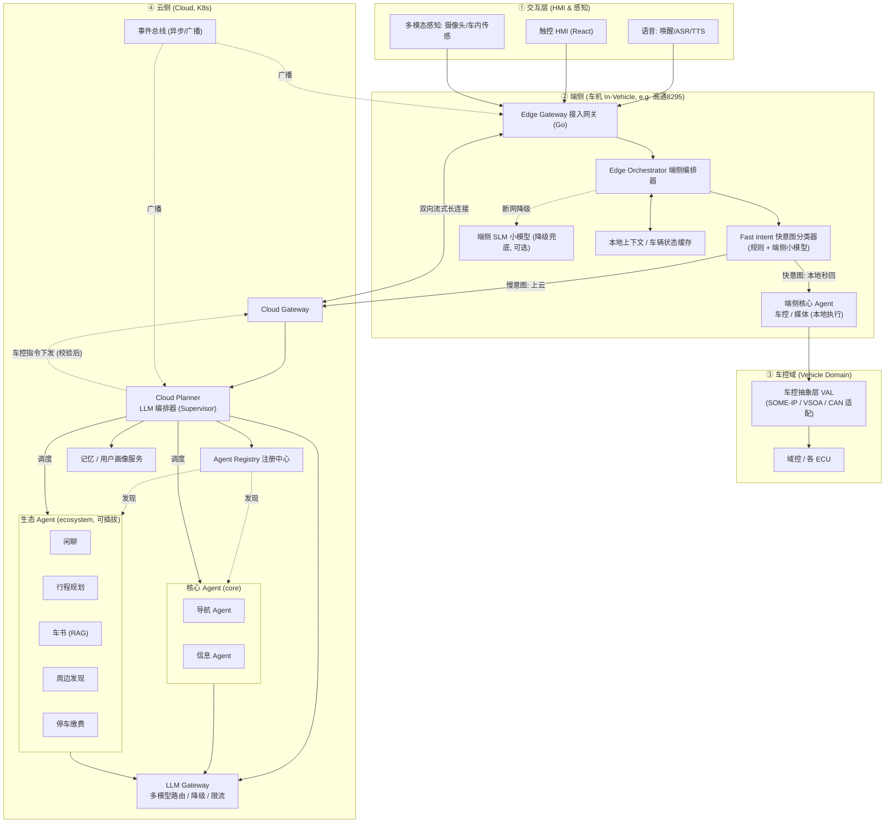
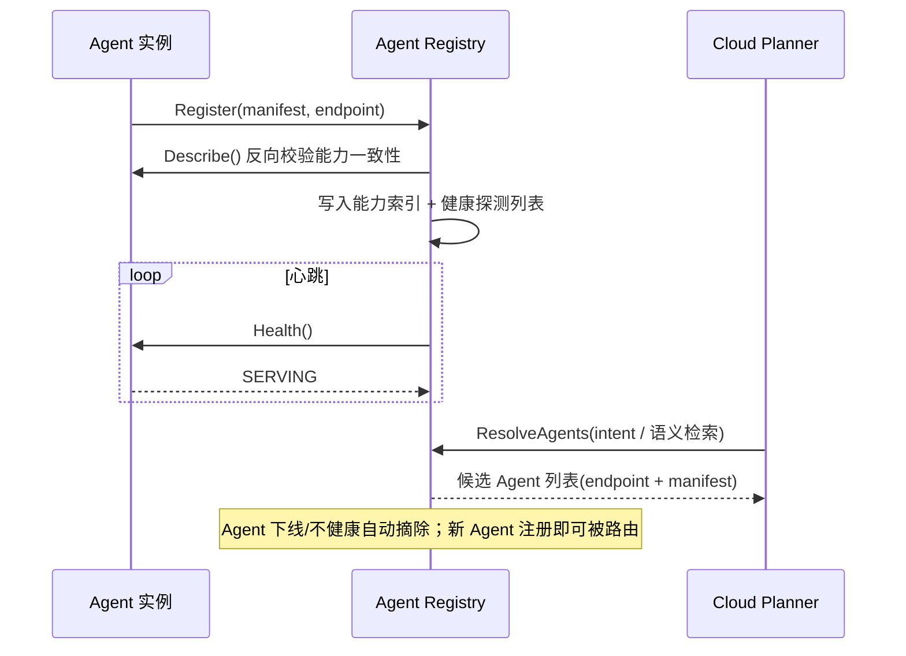
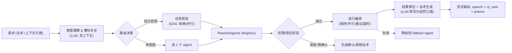
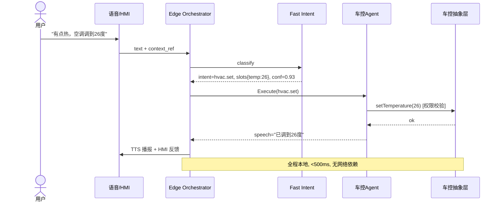
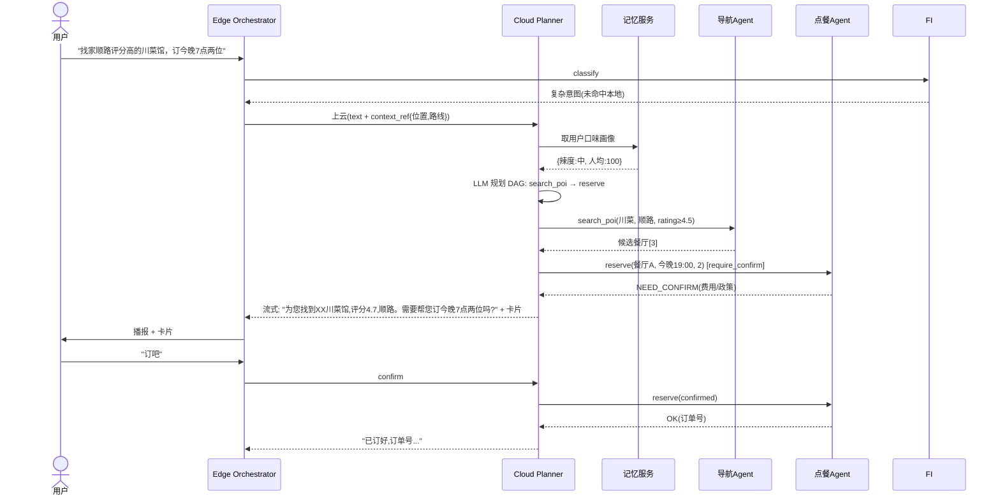
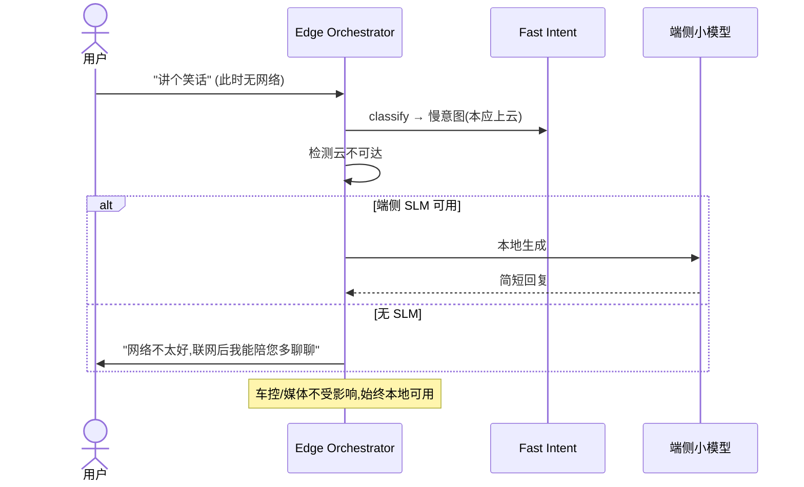

# 智能座舱 Multi-Agent 架构设计方案

> 版本：v1.38（当前架构基线；版本规则见文末「附录 C：版本记录」）
> 日期：2026-08-25（v1.38 定稿归档——验收证据本身也必须事务化、可闭环）
> 读者对象：架构师、后端/端侧/算法开发、HMI 开发、测试、项目经理
> 范围：座舱 AI Agent 系统的整体架构、组件职责、接口契约、数据流、安全、选型、部署、分阶段落地路线
> 实现说明（2026-07-18 校准）：当前仓库完成的是该架构的工程化 PoC 主干；持久化注册
>（Registry PgStore）、首批真实 Provider（高德/和风/Exa/Tushare/api-football）、服务间
> mTLS 与会话鉴权（env 门控默认关）、Prometheus/OTel 导出均已落地；文中的 K8s、正式
> 沙箱、真实 VAL（SOME-IP/CAN、车规适配）仍是目标态。实现现状和差距以 `AGENTS.md`
> 与 `phase1-implementation-plan.md` 顶部说明为准。

---

## 0. 一页速读（TL;DR）

- **架构范式**：分层混合编排（Hierarchical Hybrid）。端侧"快系统"负责高频、确定性、安全敏感指令（车控/媒体）的毫秒级本地执行与离线兜底；云侧"慢系统"用 LLM Planner 编排复杂、多轮、跨域组合意图。
- **Agent 生态**：所有 Agent 实现统一 gRPC 契约 + 声明 Manifest，经注册中心即插即用。分为 `core`（系统内置、安全敏感）与 `ecosystem`（可插拔、可第三方：周边发现/停车/车书/行程/闲聊等）两类，安全等级不同。
- **云边协同**：意图分级路由（Fast Intent 端侧 / Cloud Planner 云侧），断网降级到端侧小模型 + 规则。
- **技术栈**：Go（接入网关，高并发/WebSocket）+ Python（编排器与各 Agent，AI 生态最好）+ gRPC（服务间同步调用）+ 事件总线（异步/广播/车控事件）+ React（座舱 HMI）。
- **落地节奏**：Phase 0 PoC（端到端跑通一条链路）→ Phase 1 工程化（全能力域 + 注册生态 + 可观测）→ Phase 2 量产（车规适配、降级、安全、OTA）。

---

## 1. 设计目标与约束

### 1.1 业务目标
1. 用户用自然语言（语音为主、触控/多模态为辅）完成座舱内绝大多数任务：车控、导航、娱乐、信息、以及不断扩展的生态服务（周边发现、停车缴费、车书问答、行程规划、闲聊等）。
2. 支持**跨 Agent 的组合意图**（一句话触发多个 Agent 协作完成一个目标）。
3. 生态可持续扩展：新增一个 Agent **不修改编排核心代码**，通过注册接入。

### 1.2 关键约束（架构硬约束，按优先级）
| 优先级 | 约束 | 含义 |
|---|---|---|
| P0 | **安全** | 车控类操作必须确定性执行、可权限校验、危险操作二次确认，绝不交由 LLM 自由决策直接下发 |
| P0 | **时延** | 高频指令（车控/媒体）端到端 < 500ms 且离线可用；复杂云端意图首响 < 1.5s |
| P0 | **可用性/降级** | 断网、云端故障时，车控/媒体/基础问答仍可用（端侧兜底） |
| P1 | **可扩展性** | Agent 即插即用，编排核心对 Agent 数量与种类无感 |
| P1 | **隐私合规** | 敏感数据（位置、车内音视频、支付）默认不出车；上云数据最小化、可审计 |
| P2 | **可量产** | 车规适配（SoC 算力约束、SOA/CAN 对接、OTA、资源占用、稳定性） |

### 1.3 非目标（YAGNI，本期不做）
- 不做完全自主的 AGI 式 Agent 自由协商（多 Agent 群聊式自组织）——量产不可控。
- 不自研 ASR/TTS/LLM 基础模型——通过 Gateway 接入成熟方案，保留可替换性。
- 不做跨车队的多车协同。
- 第一版不做端侧大模型微调闭环（端侧仅用现成小模型 + 规则）。

---

## 2. 总体架构

### 2.1 分层架构图


```mermaid
flowchart TB
    subgraph UI["① 交互层 (HMI & 感知)"]
        Voice["语音: 唤醒/ASR/TTS"]
        Touch["触控 HMI (React)"]
        Sensor["多模态感知: 摄像头/车内传感"]
    end

    subgraph EDGE["② 端侧 (车机 In-Vehicle, e.g. 高通8295)"]
        EdgeGW["Edge Gateway 接入网关 (Go)"]
        EdgeOrch["Edge Orchestrator 端侧编排器"]
        FastIntent["Fast Intent 快意图分类器<br/>(规则 + 端侧小模型)"]
        EdgeAgents["端侧核心 Agent<br/>车控 / 媒体 (本地执行)"]
        EdgeLLM["端侧 SLM 小模型 (降级兜底, 可选)"]
        LocalCtx["本地上下文 / 车辆状态缓存"]
    end

    subgraph VEH["③ 车控域 (Vehicle Domain)"]
        VAL["车控抽象层 VAL<br/>(SOME-IP / VSOA / CAN 适配)"]
        ECU["域控 / 各 ECU"]
    end

    subgraph CLOUD["④ 云侧 (Cloud, K8s)"]
        CloudGW["Cloud Gateway"]
        Planner["Cloud Planner<br/>LLM 编排器 (Supervisor)"]
        LLMGW["LLM Gateway<br/>多模型路由 / 降级 / 限流"]
        Registry["Agent Registry 注册中心"]
        Memory["记忆 / 用户画像服务"]
        Bus["事件总线 (异步/广播)"]

        subgraph CORE["核心 Agent (core)"]
            NavA["导航 Agent"]
            InfoA["信息 Agent"]
        end
        subgraph ECO["生态 Agent (ecosystem, 可插拔)"]
            ChatA["闲聊"]
            TripA["行程规划"]
            ManualA["车书 (RAG)"]
            NearA["周边发现"]
            ParkA["停车缴费"]
        end
    end

    Voice & Touch & Sensor --> EdgeGW
    EdgeGW --> EdgeOrch --> FastIntent
    FastIntent -->|"快意图: 本地秒回"| EdgeAgents --> VAL --> ECU
    FastIntent -->|"慢意图: 上云"| CloudGW
    EdgeOrch -.->|"断网降级"| EdgeLLM
    EdgeOrch <--> LocalCtx
    CloudGW <-->|"双向流式长连接"| EdgeGW
    CloudGW --> Planner
    Planner --> LLMGW
    Planner --> Registry
    Planner --> Memory
    Registry -.发现.-> CORE & ECO
    Planner -->|"调度"| CORE & ECO
    CORE & ECO --> LLMGW
    Planner -.->|"车控指令下发 (校验后)"| CloudGW
    Bus -.广播.-> Planner & EdgeGW
```

### 2.2 核心组件职责清单

| 组件 | 部署 | 语言 | 职责 | 一句话边界 |
|---|---|---|---|---|
| **Edge Gateway** | 端 | Go | 接入语音/HMI/感知，会话保持，端云长连接，本地限流 | 所有交互的入口；不含业务逻辑 |
| **Edge Orchestrator** | 端 | Python/C++* | 端侧编排：调 Fast Intent，决定本地处理 or 上云，本地结果聚合，降级控制 | 端侧大脑；只做路由与降级决策 |
| **Fast Intent** | 端 | 规则+小模型 | 把用户输入快速分类为「快意图/慢意图」并抽槽位，给置信度 | 只判类型与槽位，不执行 |
| **车控/媒体端侧 Agent** | 端 | Python/C++* | 高频确定指令的本地执行 | 确定性执行，经 VAL 操作车身 |
| **VAL 车控抽象层** | 端 | C++ | 屏蔽 SOME-IP/VSOA/CAN 差异，统一车控 API，权限/安全校验 | 唯一能碰车身信号的层 |
| **Cloud Gateway** | 云 | Go | 端云通道服务端，鉴权，会话路由，流式下发 | 云侧入口 |
| **Cloud Planner** | 云 | Python | 复杂意图理解、任务规划、多 Agent 编排、结果聚合与话术生成 | 云侧大脑；编排不执行 |
| **LLM Gateway** | 云 | Python/Go | 多模型路由、Prompt 管理、缓存、限流、降级、成本与配额 | 所有 LLM 调用的唯一出口 |
| **Agent Registry** | 云 | Go/Python | Agent 注册/发现/健康，能力索引（供路由用） | Agent 黄页 |
| **核心/生态 Agent** | 云 | Python | 各自领域的能力实现，实现统一 Agent 契约 | 单一职责，可独立部署/测试 |
| **记忆/画像服务** | 云 | Python | 短期会话上下文、长期用户画像、车辆上下文 | 上下文的唯一真相源 |
| **事件总线** | 云+端 | NATS/Kafka | 异步事件、车控状态广播、主动服务触发 | 解耦异步与广播 |

> \* 端侧编排器与端侧 Agent 的语言：PoC 阶段可用 Python 快速验证；量产阶段对时延/资源敏感的部分（VAL、Fast Intent 推理）建议 C++/Rust，详见 §11、§14。

---

## 3. 端云职责切分（云边协同核心）

云边协同的本质是**意图分级路由**：不是所有请求都上云，也不是所有都本地。

### 3.1 意图分级

| 级别 | 典型例子 | 处理位置 | 时延目标 | 依赖网络 |
|---|---|---|---|---|
| **L0 即时控制** | 开空调、关车窗、调座椅、上一首、暂停 | 端侧 Fast Intent + 端侧 Agent | < 500ms | 否 |
| **L1 简单查询** | 现在几点、剩余电量、当前导航还有多远 | 端侧（命中本地数据）| < 500ms | 否 |
| **L2 单域复杂** | "导航去最近的快充站"、"放点适合下雨天的歌" | 云侧单 Agent | < 1.5s 首响 | 是 |
| **L3 跨域组合** | "找家顺路评分高的川菜馆订今晚的位" | 云侧 Planner 编排多 Agent | < 2s 首响 + 流式 | 是 |
| **L4 开放对话/知识** | 闲聊、车书问答、行程建议 | 云侧（RAG/LLM）| < 2s 首响 | 是 |

> **实现对应（2026-07-18 校准）**：当前实现把上述分级落地为三层运行模型——**T0 端侧快路径**（L0/L1，毫秒级本地执行、离线可用）、**T1 云端单次 DAG**（L2/L3/L4 一次规划后确定性执行）、**T2 有界 Agentic 循环**（需按中间结果调整计划时进入，迭代次数与时间预算受控）。该术语与 `AGENTS.md`、README 同源，详见 `docs/design/2026-06-14-cloud-central-orchestrator.md`。

### 3.2 路由决策（端侧 Fast Intent 的判定逻辑）

```
输入(文本+上下文)
  → Fast Intent 分类
      ├─ 命中本地意图白名单 且 置信度 ≥ θ_high  → 本地执行 (L0/L1)
      ├─ 命中本地意图 但 置信度 ∈ [θ_low, θ_high) → 本地执行 + 异步上云校验
      └─ 未命中 / 置信度 < θ_low / 显式复杂句式 → 上云 (L2/L3/L4)
  网络不可用时:
      → 强制走端侧 SLM + 规则，能力降级（仅车控/媒体/基础问答），明确告知用户
```

- `θ_high`、`θ_low` 为可调阈值（配置下发），初期建议 0.85 / 0.5，依据线上意图准确率调优。
- **本地意图白名单**：由各端侧 Agent 在端侧注册时声明（见 §4.4），编排器据此构建。

> **实现对应（2026-07-30 校准，M5 P3a；2026-08-01 P3 收尾更新）**：上述双阈值伪码写下半年后
> **第一次拿到真概率**——端侧语义 NLU（`orchestrator/edge/nlu.py`，4 层中文 encoder ONNX，
> 35MB/4.8ms）已建成**识别侧**，产出真 softmax 置信度；但**执行侧刻意未接**，挡位停在
> `EDGE_NLU_MODE=shadow`（只算不用）。**`on` 挡位刻意不存在**：θ 按 transfer 车道标定到
> 85% 覆盖须付出约 1% 请求识别成错对象的代价（三闸挡危险动作、挡不住「合法但不是用户要的
> 动作」），放量前提与开工判据见 `AGENTS.md` §4.0 P3b 卡。当前生产路由仍由 1727 行规则
> `fast_intent` 承担，置信度仍是硬编码字面量——本节伪码的完整兑现在 P3b。
>
> **影子的观测面（P3 收尾补完）**：判定落独立 `nlu.shadow` span，四条路径全挂
> （`path`=local/multi/mixed/cloud——**误接与漏接必须分得开**，误接发生在本地快路径且
> 危险得多），响应后 fire-and-forget 不占秒回；`nlu_vs_rule` **四态**
> （agree/differ/rule_miss/unmapped）；`nlu_gate` 记 θ 双阈值会落哪一档（**只记不用**）。
> ⚠ 四态之所以曾经名不副实：模型输出的是**语料标签空间**的中文对象、规则输出的是**它自己
> 那套** object（95 个、38 个连 VAL 都没有），直接比字符串使 `agree` 不可达——同一件事的
> 三套命名由 `orchestrator/edge/knowledge/nlu_objects.yaml` 等价类台账归并（人裁一次、
> 机器守不许悄悄漏）。**「A 与 B 一致吗」这类判定，先问「A 和 B 是同一个空间里的量吗」。**

### 3.3 降级策略矩阵

| 故障 | 表现 | 降级行为 |
|---|---|---|
| 断网 | 云不可达 | 车控/媒体正常；复杂意图回复"网络不可用，已为您本地处理基础指令"；可选端侧 SLM 兜底简单问答 |
| 云 Planner 故障 | 网络通但编排挂 | LLM Gateway 直连单 Agent 兜底；或返回澄清话术 |
| 某 Agent 故障 | 单领域不可用 | Planner 跳过该 Agent，降级到 `fallback`（如 chitchat）并告知用户 |
| LLM 超时 | 首响超 budget | 流式占位 + 重试到备用模型（LLM Gateway 负责） |

> **实现说明（R3.5，`test/e2e_degrade.py` 自动化验证后如实记录，非本表原意）**：
> 实际降级话术与上表措辞有出入——断网是"网络不太好，复杂请求暂时无法处理，不过车内控制依然可以
> 正常使用"（`orchestrator/edge/server.py`），云 Planner 故障是"云端处理异常，请稍后重试"
> （`gateway/cloud/main.go`）。"LLM Gateway 直连单 Agent 兜底"未实现（纯 aspiration）。"某 Agent
> 故障降级到 fallback" 仅适用于**规划期**（LLM 完全无法产出计划时的全局兜底），**执行期**单个
> Agent 调用失败不会重路由到 chitchat，而是该步标 FAILED、DAG 其余步骤继续（`executor.py` 不因
> 单步失败中断）。"LLM 超时" 的"重试到备用模型"对非流式 `Complete()` 成立；流式
> `CompleteStream()` 自 2026-07-17 起**首 token 前**同样按档位链降级（首 token 后不切，
> 半段话术不可拼接——R3.5 记录的缺口已由运行时硬化 P1 兑现，见 §8.1）。其余差异
> （executor 错误信息丢失等）属已知技术债，详见
> `docs/design/2026-07-03-r3.5-degrade-matrix-e2e.md` §6。

---

## 4. Agent 模型与契约（架构的可扩展性基石）

### 4.1 Agent 分类

| 类别 | trust_level | 例子 | 特点 |
|---|---|---|---|
| **core（核心）** | `system` / `first_party` | 车控、媒体、导航、信息、语音 | 系统内置，可碰敏感能力（车控），随系统发版 |
| **ecosystem（生态）** | `first_party` / `third_party` | 周边发现、停车缴费、车书、行程规划、闲聊 | 可插拔，独立发版，第三方可接入，权限受限沙箱 |

不同 trust_level 对应不同的权限上限与审核要求（见 §9）。

### 4.2 统一 Agent 契约（gRPC）

所有 Agent（无论 core/ecosystem，无论端/云）实现同一份 gRPC 服务定义，这是"即插即用"的前提。

```proto
// proto/cockpit/agent/v1/agent.proto
syntax = "proto3";
package cockpit.agent.v1;

// 每个 Agent 都必须实现的统一服务契约
service Agent {
  rpc Describe (DescribeRequest) returns (AgentManifest);          // 上报能力清单(供注册/路由)
  rpc Execute  (ExecuteRequest)  returns (ExecuteResponse);        // 同步执行一个意图
  rpc ExecuteStream (ExecuteRequest) returns (stream ExecuteEvent);// 流式执行(长任务/流式话术)
  rpc Health   (HealthRequest)   returns (HealthResponse);         // 健康检查
}

message ExecuteRequest {
  string request_id = 1;
  string session_id = 2;
  Intent intent     = 3;                 // 已识别意图与槽位
  ContextRef context = 4;                // 上下文引用(按需取，不全量传)
  repeated ModalityRef modalities = 5;   // 多模态输入引用(音频/图像URI)
  map<string, string> meta = 6;          // trace_id、locale、vehicle_id 等
}

message Intent {
  string name = 1;                       // 命名空间化: "navigation.search_poi"
  map<string, string> slots = 2;         // 槽位
  float confidence = 3;
  string raw_text = 4;
}

message ExecuteResponse {
  enum Status { OK = 0; NEED_CONFIRM = 1; NEED_SLOT = 2; FAILED = 3; REJECTED = 4; }
  Status status = 1;
  string speech = 2;                     // 给 TTS 的播报话术
  google.protobuf.Struct ui_card = 3;    // 给 HMI 的结构化卡片(可选)
  repeated AgentAction actions = 4;      // 需执行的动作(如车控指令、跳转)
  string follow_up = 5;                  // 多轮追问/澄清提示
  ErrorInfo error = 6;
}

message AgentAction {
  string type = 1;          // "vehicle.control" | "navigate" | "play" | "open_app" ...
  google.protobuf.Struct payload = 2;
  bool require_confirm = 3; // 危险动作需用户二次确认
}

message ExecuteEvent {     // 流式: 边想边说边做
  oneof event {
    string speech_delta = 1;       // 流式话术增量
    AgentAction action = 2;
    ExecuteResponse final = 3;     // 终态
  }
}
```

> 说明：`ContextRef` 与 `ModalityRef` 用"引用"而非全量传值——上下文与多模态原始数据由记忆服务/对象存储托管，Agent 按需拉取，降低传输量并满足隐私边界（见 §7、§9）。

### 4.3 Agent Manifest（能力声明，路由与治理的依据）

每个 Agent 用一份声明式 Manifest 描述自己。注册中心据此建立**能力索引**，Planner 据此做**语义路由**。

```yaml
# 教学示意（假想的第三方点餐 Agent，用于展示 require_confirm/支付权限等字段全貌）；
# 真实清单见 agents/<name>/manifest.yaml，接入样板参考 agents/nearby/、agents/navigation/
agent_id: food-ordering
version: 1.2.0
display_name: 点餐助手
category: ecosystem
trust_level: third_party
deployment: cloud            # edge | cloud
latency_budget_ms: 2000
fallback: chitchat           # 失败/拒绝时的降级 Agent

capabilities:
  - intent: food.search_restaurant
    description: 按菜系/位置/评分/价格搜索餐厅
    slots: [cuisine, location, rating_min, price_level, party_size]
    examples: ["找家川菜馆", "附近有什么好吃的", "人均一百以内的火锅"]
  - intent: food.reserve
    description: 预订餐厅座位
    slots: [restaurant_id, datetime, party_size]
    require_confirm: true     # 涉及承诺/费用，需二次确认

requires_permissions:         # 见 §9 权限模型
  - location.read
  - payment.invoke
  - network.external

# 端侧 Agent 额外声明本地意图白名单(用于 Fast Intent)
edge_intents: []
```

**路由如何用 Manifest**：Planner 把所有已注册 Agent 的 `capabilities`（intent + description + examples）作为可选"工具"提供给 LLM 做工具选择/规划；`trust_level` + `requires_permissions` 决定能否被调用与是否需确认；`latency_budget_ms` 用于超时与降级。

### 4.4 Agent 注册与发现


```mermaid
sequenceDiagram
    participant A as Agent 实例
    participant R as Agent Registry
    participant P as Cloud Planner
    A->>R: Register(manifest, endpoint)
    R->>A: Describe() 反向校验能力一致性
    R->>R: 写入能力索引 + 健康探测列表
    loop 心跳
        R->>A: Health()
        A-->>R: SERVING
    end
    P->>R: ResolveAgents(intent / 语义检索)
    R-->>P: 候选 Agent 列表(endpoint + manifest)
    Note over R: Agent 下线/不健康自动摘除；新 Agent 注册即可被路由
```

- **注册方式**：Agent 启动自注册（gRPC/HTTP 调 Registry），或经声明式部署（manifest 随容器部署被 Registry sidecar 上报）。
- **版本与灰度**：同一 `agent_id` 多版本并存，Registry 支持按 `vehicle_group` / 灰度比例路由。
- **生态接入**：第三方 Agent 提供符合契约的服务端点 + Manifest + 通过安全审核，即可上线，**不触碰编排核心代码**。

---

## 5. 编排器设计

编排是"双脑"：端侧 Edge Orchestrator（快、确定）与云侧 Cloud Planner（强、灵活）。

### 5.1 Edge Orchestrator（端侧编排器）
职责（只做决策与降级，不做复杂业务）：
1. 接收 Edge Gateway 来的标准化输入（文本 + 上下文引用）。
2. 调 Fast Intent 分类，按 §3.2 决策本地处理 or 上云。
3. 本地处理：调端侧 Agent → 经 VAL 执行 → 聚合结果 → 出话术。
4. 上云：建立/复用流式通道，转发请求，接收云端流式结果并驱动 TTS/HMI。
5. 降级控制：网络/云端异常时切端侧兜底。
6. 端侧多轮的短期上下文维护（最近 N 轮，本地缓存）。

### 5.2 Cloud Planner（云侧编排器 / Supervisor）


```mermaid
flowchart LR
    In["请求 (文本+上下文引用)"] --> NLU["意图理解 & 槽位补全<br/>(LLM, 含上下文)"]
    NLU --> Route{"路由决策"}
    Route -->|"单意图"| Single["选 1 个 Agent"]
    Route -->|"组合意图"| Plan["任务规划<br/>(DAG: 依赖/并行)"]
    Plan --> Resolve["ResolveAgents (Registry)"]
    Single --> Resolve
    Resolve --> Perm{"权限/信任校验"}
    Perm -->|"通过"| Exec["执行编排<br/>(顺序/并行/重试/超时)"]
    Perm -->|"拒绝/需确认"| Confirm["生成确认/拒绝话术"]
    Exec --> Agg["结果聚合 + 话术生成<br/>(LLM 改写为自然口语)"]
    Agg --> Out["流式输出: speech + ui_card + actions"]
    Exec -.失败.-> Fallback["降级到 fallback Agent"]
```

关键设计点：
- **规划用 LLM + 工具调用范式**：Agent 的 `capabilities` 即"工具"。Planner 让 LLM 输出一个**任务计划（DAG）**：哪些 Agent、顺序/并行、Agent 间参数依赖。
- **执行与规划分离**：LLM 只负责"规划"（决定调谁、传什么），实际"执行"由确定性的 Executor 完成（带超时/重试/熔断）。**LLM 不直接产生车控信号**——车控类 action 一律回流到端侧 VAL 经权限校验后执行（见 §9.1）。
- **结果聚合**：多 Agent 结果由 LLM 改写成连贯的口语化播报 + 结构化卡片，保证体验一致。
- **多轮与澄清**：缺槽位（`NEED_SLOT`）或需确认（`NEED_CONFIRM`）时，生成追问，挂起任务状态等待用户回复。

### 5.2.1 Planner 的三条智能供给通道与规则治理（2026-07-24 定稿归档；2026-07-26 Skill 层闭环；2026-07-29 范例库与规则退役合入；2026-08-04 依赖归一留账）

Planner 的智能供给全部声明式化，且**规则第一次有了出口**（设计详见 `docs/design/2026-07-24-eva-benchmark-intelligence-upgrade.md` 与 `docs/design/2026-07-28-intent-accuracy-data-flywheel.md`）。三条通道按权威链由硬到软：`route_hints`（LLM **之后**确定性改写）> `skills/`（LLM 之前的**知识**）> `skills/exemplars/`（LLM 之前的**数据**，最软）：

1. **规划知识 Skill 层（`skills/`，M0b；2026-07-26 补全闭环）**：领域组合知识与跨域判据从中央 system prompt 外迁为声明式文件——`guides/`（领域组合知识+few_shots，预筛 top-K 按需注入）、`policies/`（跨域规划**软约束**，常驻注入）、`workflows/`（v2 预留）。`SKILLS_MODE=off|shadow|canary|full`（默认 full）；中央 `_PLANNER_BASE` 只余通用规划契约。**加规划知识=投 skill 文件，不改编排核心**——与 route_hints（LLM 之后的确定性纠错）互补：skill 是 LLM 之前的知识供给。权威链（软硬分层）：VAL/payment/Runtime Policy > Capability Manifest > Plan Validator > PlannerPolicyPack（软）> PlanningGuide（软）。
   - **检索双通道（2026-07-26）**：`SKILLS_RETRIEVAL=lexical|hybrid`（默认 hybrid）——词法命中（keywords 显式信号）恒保留，语义通道以 guide `description` 向量余弦**补位** paraphrase（经 llm-gateway Embed，与 registry 语义路由同源；**fail-open** 回词法不堵规划）。档位与阈值（0.40）由 paraphrase 语料阈值扫描拍板（词法 0/11 → hybrid 11/11、零新增噪声），兑现 M0b「embedding 升级由召回数据决定」的悬空承诺。
   - **知识必须可证有效**：skill 自带 golden（`expect_intents` AND/`expect_any`/`expect_not`，项支持 `a|b` 容忍）经 `eval_skills` 三车道消费——离线检索门禁进 GitHub CI，live 车道（真 planner+真 LLM）以 `SKILLS_MODE=off` A/B 对照量化知识增益（首跑 Δ=+5/10）。`plan.skills` 归因名单反映**真实注入**（检索通道 `@lex`/`@vec`、超预算 `!clipped`）。
   - **分层边界的实证**：skill（LLM 前知识）教对了也会被 `policy: replace` 的 route_hint（LLM 后纠错）盖掉——live 车道首跑即抓到 nearby 设施发现 hint 的 guard 缺口踩掉 charging.find；holdout 车道次日再抓到 reminder「叫我」hint 劫持无「要是/如果」标记的条件句。凡「知识不生效」的 badcase，先查 hint 层再改知识。**分工口径（2026-07-27 采样方差实证）**：教科书形态用 route_hints 钉死（canonical 不该靠温度采样），skill 知识管 paraphrase 泛化。
   - **全生命周期闭合（2026-07-27 评审补强；同日二批补齐挂起链与归因）**：T2 再规划按 `plan.skills` 名单**继承**初规划注入的同一份知识（条件依赖类知识的决策恰发生在再规划轮），且**跨挂起成立**——`plan.skills` 随 `pending_plan` 持久化，补槽/确认恢复后的再规划不失忆；loader 对坏文件全面 fail-open（结构性坏文件跳过、非法标量回默认、重名先到者胜、改坏沿用 last-known-good；env 垃圾值回默认告警不崩启动）而 eval 文件级校验在 CI 是**阻断步**——运行时保知识可用性、门禁保主干整洁；golden 增 `holdout`（防 few-shot 原句自证）与 `expect_complexity`（adaptive 类知识的核心主张可断言），live 报告按 in-sample/holdout 拆分，**逐 skill 消融车道**做 per-guide 因果归因（full/off 分不清「知识的功」还是「hint 的功」；Δ=0 自动提示查 hint 覆盖）。hint 层教训沉淀：SOC 词形对手机/耳机等**设备**同样成立——replace hint 的 guard 必须排除非车辆主语（评审二批抓到的回归）。
   - **受限计划归一（2026-08-04）**：对“两步已选对，模型却随机漏 `depends_on/slot_refs`”这一窄类，guide 可声明 `plan_repairs`。它不是第四条路由通道：只能连接计划里已存在且唯一的 producer/consumer，不新增 intent、不覆盖已有槽位值，`shadow/off/!clipped` 资产不生效，多步歧义不猜。实际作用记入 `plan.skill_effects` 与 `cloud.planning.skill_effects`，不得把归一后绿灯计为模型原生正确；后续 manifest / validator / Runtime Policy / VAL 权威链不变。
2. **落域范例库（`skills/exemplars/`，M5 P1；2026-07-29 合入）**：Planner 的**第三条供给通道**，装的不是知识而是**数据**——一条 `话术 → 正确落域` 的记录，检索后作 few-shot 进 prompt。定位是权威链的**最软层**（在 PlanningGuide 之下）：只影响 LLM 判断，**不做任何硬路由**。
   - **它解决的是「改进循环的产物」问题**：在此之前，修一个落域 badcase 的标准产物是**正则**（`route_hints`），而规则只进不出——没有任何流程会问「这条 hint 模型现在自己会了吗」。范例把标准产物换成数据：**hint 写错是事故**（模型判对了也被 `replace` 踩掉），**范例写错只是噪声**（占了预算，删一行就没了）。故一个 badcase 三选一的默认答案是范例。
   - **机制整体复用 Skill 层范式**（hybrid 双通道检索 / 预算硬帽 / fail-open / `plan.exemplars` 归因 / T2 与挂起继承），Embed 出口与失败冷却与 skills **共用一份**（`orchestrator/cloud/embedding.py`——网关挂了两条通道一起回落词法，而不是各超时一次）。差异只在词法侧：范例文本仅 5-15 字，裸 Dice 会被功能词 bigram 支配，故用**语料自身的 IDF 加权**——不建停用词表（那是又一个只进不出的手工规则），投一个范例文件权重即自动重算。
   - **三个来源**：manifest 199 条 `examples` 一次性盘活（此前是死资产：不进 planner prompt，只喂 registry 打分）、badcase 标注一键转化（消费 `turns.gold_intents` 标注载体）、evolve 第四类提案（`route_error`/`slot_error` 默认产**范例草案**而非 regex 草案，原 bigram 拼 pattern 生成器随之退役——这是提案可应用率从 0% 起飞的路径）。
   - **一条实测出来的限度**：「一次修复自动传播到同族说法」**成立的前提是语料密度，不是单条范例的魔力**。首测中新范例修好的是它自己那个形态（精确锚），paraphrase 是被**已有范例 + 语义通道**接住的。飞轮的价值随条数增长，早期别指望单条见效。
3. **规则的出口：hint 退役流水线（M5 P2；2026-07-29）**——补上架构此前的结构性缺口「规则只进不出」。对每条 hint 的命中语料做**双臂裸跑**（A 臂全量、B 臂只摘这一条，评测侧过滤 agent 列表实现，**零运行时改动**）；B 臂仍落对 ⇒ 模型+范例已自己会了 ⇒ 退役。首轮把 `route_hints` 从 32 条降到 **12 条**。
   - **判定纪律（两条都是被数据逼出来的，不是设计时想到的）**：①**证据必须覆盖全部命中句**——抽 3 句时判 27 条可退役，覆盖全部命中语料后降到 21 条；**抽样的偏差方向是固定的：命中面越大越容易被放行，而那恰是风险最高的一批**。②**必须跨 provider 取交集**——单档跑出来的候选只证明那一档会，而 hint 的存在理由正是「弱 LLM 会漏/误路由」；实测两档交集把 3 条单档候选挡在门外。
   - **退役的代价必须记账**：这些召回断言原本是**阻断 pytest**，退役后保护改为端到端口径进 live 车道——**从「CI 阻断」降级为「人工触发」**。这不是可以忽略的细节，是退役换来的真实成本。
   - **安全面不由路由评测裁决**：`require_confirm=true` 的能力其 hint 一律不退（治理⑥）——**路由评测不构成安全证据**。
4. **落域指标 RoutingBench（M5 P2）**——兑现 §10 许诺过的「意图识别准确率/路由命中率」。四个离线 eval 是**回归闸**（防倒退，天天绿），不是**分布尺**（量进步）；RoutingBench 把散落语料统一到「话术→期望落域」口径，出 canonical/paraphrase 拆列与分域混淆矩阵。**读它必须配着三条限制**：语料可用量有限且**被排除的条数是隐藏分母**（每次报告都印）、域分布严重偏斜（前三域占七成，N1 涨不等于车控导航变好）、canonical 高分主要说明语料已被用来修过系统。
5. **结构化规划输出（`submit_plan`，M1a）**：规划轮经原生 function calling 强制输出合法 Plan JSON（单一 `submit_plan` 工具、named tool_choice，`PLANNER_TOOLCALL=on|off` 默认 on），替代文本补全+脆弱 JSON 截取。schema 顶层=既有计划协议、**不含 `require_confirm`**（确认权在 capability manifest ∨ action ∨ VAL 硬层，LLM 无权降级）；协议失败轮内降级，最坏调用数与旧路径持平。**降级链路按失败形态分两条（2026-08-10 校准）**：模型**能说话但没用工具**（有 content 无 tool_calls）→ 同轮文本抢救 + **重试一次工具通道**（`PLANNER_TOOLCALL_SALVAGE_RETRY=on|off` 默认 on），重试仍不成则回落抢救结果（`plan_mode=toolcall_salvage_kept`）；**协议异常 / provider 不认 tools**（无 content）→ 直接退 JSON 路径，这一档是弱 tool-calling 厂商的可用性保障。gate L1 双臂实测 MiniMax 走成 toolcall 由 51.3% 升至 85.5%（p=2.3e-08），墙钟 +38.5%。承载走既有 `CompleteRequest.tools`/`CompleteResponse.tool_calls` Struct 字段（V1 不改 proto；V2 真 agentic tool loop 需 proto 演进）。
   - 实施教训（V2 设计约束）：tool schema 与输出指令会三向改变模型输出分布（可选字段诱发多填、无说明 object 诱发少填、"写全"指令诱发编造占位值）——凡改 schema 必过旅程级行为对照。

### 5.2.2 执行治理：Task Ledger 与 Outcome Verifier（2026-07-25 定稿归档）

规划期声明式化（§5.2.1）之后，**执行期**补齐两件解锁件（设计详见 `docs/design/2026-07-25-m2-task-ledger-outcome-verifier-rfc.md`）：

1. **Task Ledger（跨轮持久任务账本）**——「谁在替用户干活、干到哪了、还让不让它干」的唯一权威记录。
   - **分层不重叠**：`SessionState`（Redis）盖对话挂起窗（确认/补槽，秒-分钟）；Ledger（PG 表 `task_ledger`）盖**任务生命周期**（分钟-小时、跨会话跨重启）。存储否决 Redis 选 PG，因为「跨重启诚实」正是它的核心价值。
   - **落点在 SDK 侧**（`agents/_sdk/ledger.py`，挂 `BaseAgent.self.ledger`）：执行权本来就在 Agent 侧，登记权同侧则心跳/销单/预算都是进程内调用，无跨服务一致性问题。**接入长任务=调 `open`/`heartbeat`/`close` 三个函数，编排核心零改动**。v2 若编排器主动派发长任务，它成为同一存储契约的另一个客户端，消费面平移。
   - **cancel 走拉模式**：置态 + 心跳搭车读状态，后台任务自行收尾——不跨进程强杀、不建新推送通道。取消延迟上限 ≈ 一次心跳。
   - **预算与 deadline 是强制不是声明**：`budget` 里的 deadline/调用次数上限由心跳就地判定并截停，写 `stop_reason` 供区分「你叫停的 / 超时停了 / 预算用尽」三种话术。这把 Background 档守卫从口头承诺变成机制。
   - **中断诚实报告**：崩溃/重启后 active 任务永不心跳 → 查询侧惰性判 `orphaned` → 答「查到一半中断了，要不要重新查」。**v1 刻意不做 checkpoint 自动续跑**（重跑成本低于序列化中间态）。
   - **降级姿态**：PG 不可达时账本静默禁用，Agent 照常执行任务，只是受理话术不承诺可停可问。**刻意不做内存兜底**——承诺「可查询」而重启后答不上来，比没有账本更不诚实。
   - 契约登记：`docs/conventions.md` §9.6。

2. **Outcome Verifier（执行后对账）**——解「步骤 OK ≠ 结果达成」：车控步 VAL 层可能没落地、查询步可能拿了空数据，两者今天都以"成功"落地。
   - **声明式是铁律**：期望由 `capability.verification` 声明（proto `Capability` field 7），中央只实现通用求值器，**不得出现任何 agent_id/intent 字面量分支**——否则会长成第二个 `fast_intent.py`。与 route_hints 把领域路由知识搬回 Agent 是同一条哲学，由源码断言契约测试钉死。
   - v1 两个求值器：`schema`（`data_keys` 存在且非空，对症"空结果假 OK"）、`state_match`（对车况镜像逐键比对，对症"VAL 说成功、状态没落地"）。
   - **三态语义**：SAT 通过 / UNSAT 进 `on_fail` / **UNKNOWN 不定罪**（观测缺失≠没做成，防假警）。
   - `on_fail`：`report`（保持 **OK** 状态 + `data["_verify"]` 保留键 → 聚合器确定性拼接诚实口径，遵 R9 §9.5）、`retry`（**只对 `require_confirm=false` 的步开放**——副作用永不重放）。
   - 挂点是 executor 尾链（`dispatch → _to_result → 确认兜底闸 → 对账`）**外加两条流式直通路径**（engine D0 / loop T2）显式调用，且流式路径不重试（话术已流出）。
   - 求值源：`orchestrator/cloud/state_mirror.py` 只读订阅 NATS `vehicle.state.changed`（与 gateway/edge、collector、scene 三处镜像同源同形态），fail-open。

二者就位后，T2 有界循环预算由单值升级为按 `plan.complexity` **分档**（Interactive / Complex；Background 归 Ledger 语义不占循环预算），并落**重复副作用防抖**（`(intent, 解析后 slots)` 指纹撞上即回填、动作不重发）——对症"replan 对已完成步骤失忆而重复产出同一动作"，比原设想的"副作用步不进循环体"精准（不阉割 T2 对副作用任务的编排能力）且可测。

**执行治理的验收硬化（2026-07-26 总体验收合入）**——四条跨阶段组合面上被抓出并修正的语义，
从此是架构承诺（契约测试钉死，验收报告 `docs/reviews/2026-07-26-acceptance-review-m0a-m4.md`）：

1. **确认权只随「确认」注入**：挂起恢复分两种语义——wait_confirm 恢复（用户真说了「确认」）
   才注入 `confirmed` 标记；**补槽恢复绝不注入**（补槽答案「拿铁」不是确认，注入等于让危险步
   在用户从未见过金额/后果的情况下直接执行）。补槽重跑后照常二次挂起等真正的确认。
2. **超时 ≠ 失败**：步骤超时时 Agent 可能已执行完、只是响应没回来（副作用已发生）。超时结果
   同样打防抖指纹，同一 T2 循环内同指纹**不盲目重发**、回填诚实的「没拿到结果、没有重复执行、
   请核实」；真失败（Agent 明确报错=确定没做成）仍允许重跑——两类失败的重试语义相反，混同
   任一方向都错（重发→重复副作用；不重发→失败被复用成假成功）。
3. **一切旁路路径与主路径同闸**：流式直通（engine D0 / loop T2）不经 executor 尾链，故确认
   兜底闸（M0a）与 Verifier（M2）都必须在两条旁路上**显式对齐**——「声明了机制」不等于
   「机制覆盖了所有执行路径」，挂点必须枚举全部路径（M2 首验与本次验收各抓到一条漏网）。
4. **挂起态是防抖指纹的载体**：确认/补槽挂起横跨轮次，恢复侧的字段白名单必须携带
   `fingerprint`——否则任何跨过一次挂起的副作用步，其防抖在恢复轮静默失效。

### 5.2.3 槽值保真：下发前的原话回查（v1.28，QA 卡 Q12）

规划/执行分离解决的是「谁有权产生副作用」；它不解决**「产生副作用时用的那个值对不对」**。
planner 产出的槽值是**自由文本的转述**，而转述会丢限定词——下游拿到的是一个
**看起来完全合法**的值，没有任何东西能发现它比原话少了信息。真栈原样：
「明天下午四点提醒我开会，**三点半**再提醒我一次」→ `time_text="明天三点半"`
（日留下了、段位丢了）→ 落成**次日 03:30**，而话术说的是「下午 15:30」。

- **判据是「比原话少了什么」，不是「有没有值」**。落点 `runtime/slot_fidelity.py`
  （唯一实现），在 `executor._resolve_slot_refs` 里接线——那是**下发前的最后一道**，
  三条执行路径（executor 尾链 / engine D0 / loop T2）都经过它。
- **逐维补，不是整值判**。要求「整个槽值是裸时刻」的首版对 `明天三点半` 直接放行
  ——**防御要一路防到真正会被拿去用的那个维度**（CLAUDE.md §6 的时间版）。
- **三道闸任一不成立就原样返回**：值必须是可解析的时间短语形态；它必须能在原话里
  **唯一定位**；限定词只能取自紧邻或同句更早的一个**带时刻的**时间短语
  （「早上跑完步，提醒我三点半吃药」里的「早上」修饰的是跑步，不继承）。
  贴着 `周三`/`15号` 这类本机制不解析的日期词时**整体让路**——回填错等于系统替用户
  改了他说的话，比不回填糟得多。
- **服务端权威解析出来的槽位（`_trusted_slot_refs`）跳过**：那些值不是转述，
  拿原话覆盖它们等于取消 provenance。

同批把 §5.2.2 第 3 条「一切旁路路径与主路径同闸」补成第三次应验，且形态是新的：
`loop.py` **传了函数却漏了 `ctx`**——跨轮门店锚定、城市补全、本机制在 T2 单步流式
那条路上**静默不生效**。**「挂点被调用了」和「挂点拿到了它要的东西」是两件事**，
症状完全相同（无日志、无报错、只是不发生）。修法照旧不是「下次记得」，
是把覆盖面变成断言：每个 `_resolve_slot_refs` 调用点必须三个参数，注入验红过。

配套一并收敛的是**中文时间词的三份实现**（reminder `timeparse` / `_sdk timewindow` /
info `weather`），唯一声明落 `runtime/cntime.py`。收敛当场照出三个活缺陷：
`早晨八点` 在一份里是 08:00、另一份是 **20:00**；`晚上12点` 在一份里是次日零点、
另一份留在**中午**；`晚上12:00` 与 `晚上12点` 在**同一份实现里**给两个答案。
英文日词（`tomorrow`）进同一张表，`weather.py` 因此不再把「扫不到日词」与
「说的是今天」合成一个 `return 0`——那是 I-041 的完整根因。

### 5.2.4 省略式开关的确定性消解（v1.29，QA 卡 Q7）

「打开天窗」之后说「不用了，关掉」——**这一句要做什么，完全由「上一个对象 × 这个动作」
决定，没有任何需要模型判断的东西**。交给 LLM 只是引入方差：同一句话三次取样给出三种结果，
其中一次是**声称「好的，已为您关闭天窗」而 action 为空**（说了没做）、一次**反向执行**。

- **事实源是执行账本，不是新存储**（`conventions.md` §9.24）。
  （⚠ 2026-08-19 校正：原文还写着「§5.2.5」，而当时**根本没有 §5.2.5 这一节**——执行账本只在版本记录 v1.27 里。悬空编号的代价在下一人占用它时才兑现：v1.30 新增的 **§5.2.5 是候选集聚合问答**，读者点过去会看到另一件事。**判据：引用一个还不存在的编号 = 给未来埋一条错引用；新增编号前先搜它被引用过没有。**）焦点态
  （`update_focus`）**只由云侧规划轮构建**，端侧本地快路径那 40% 的车控动作一个都不在里面
  ——所以「从焦点取对象」这条路对最常见的车控轮次天然失效。真正的事实源是 Q6 已经落库的
  轮次 `actions`；缺的只是**读侧**（同一个 proto 的两份客户端实现，一份读了一份没读）。
- **同轮那半走端云 meta**。混合路径下端侧先执行本地那半、把剩下的碎片上云，而碎片可能
  **没有对象**（「关闭空调然后打开，按顺序执行」上云的是「打开，按顺序执行」——对象在
  同一轮的**另一个组**里）。端侧把本轮真执行掉的动作名随请求带上；**入口每轮先剥同名键**，
  它是执行器签发的内部事实，不是客户端输入。
- **确定性消费方是一条计划出口**（`plan_mode=focus_deterministic`），零 LLM。
  三样东西各有确定来源、缺一即 fail-open 回正常规划：**对象**来自执行账本、
  **操作**来自本轮原话的显式开关词、**能力**来自权限过滤后的 catalog 且必须唯一。
  产出的是普通 `Plan`，照常过步骤校验 / Executor / VAL / `require_confirm`
  ——**不是绕过执行链，是不让模型参与一个它无从判断的选择**。

> **判据：「把事实写进 prompt」和「让事实决定结果」是两件事。** 中途取过一次干净读数
> ——只补事实源、不做确定性接管时，跨轮那条已经稳定正确，而同轮那条**仍然 0/3**，
> 且失败形态从「我不能帮你执行操作」变成「您想把空调温度设成多少？」：
> **模型确实看见对象了，但动作没落对。**

边界与代价：判据是 `fullmatch` 且**不含任何对象词/领域词**——放宽后「打开周杰伦的歌」
会被上一轮车控焦点劫持成另一个对象的动作。焦点采用**「刷新」而非「填空」**语义
（最近执行事实赢，并清掉账本证不了的位置/agent 字段）：只填空会把「取不到对象」变成
**「稳定用陈旧对象」**，那更糟。契约 `docs/conventions.md` §9.26。

### 5.2.5 候选集上的聚合问答（v1.30，QA 卡 Q2）

用户看过一份候选列表之后问「哪家最晚关门」「这两个一共多少钱」——**答案已经在系统
手里**（`Focus.candidate_sets` 的结构化 items），需要的是**算**，不是想。

**它不该落给任何 Agent，因为落到哪个都是错的**：产出那份列表的 Agent（`nearby.search`）
会重搜一遍、答的是**新一批**；详情能力（`nearby.detail`）只看得见一个；兜底闲聊手里
根本没有那些数，只能编。**这不是路由问题**——没有任何一个 Agent 站在能回答它的位置上。

⇒ 判定与回答都放在**编排层、plan 构建之前**（`orchestrator/cloud/candidate_query.py`，
确定性纯函数、零 LLM、零网络）。它与既有的「零候选时确定性弃权」守卫**方向相反、
判据同源**，构成同一个判据面的正反两半：

| 方向 | 条件 | 结果 |
|---|---|---|
| 负 | 引用了候选，**而一份都没有** | 诚实弃权（防编造） |
| 正 | 引用了候选，**而候选就在手里** | 确定性回答（防瞎猜） |

**判据必须三段同时成立**，因为这条短路看见的是全部流量、命中即整轮不进 Planner：
① 在引用当前候选（词表通道**或**「句中点到 ≥2 个候选项名字」的名字通道——后者从候选集
派生，不是又一张词表）；② 算子与维度**一起**匹配（分开匹会让「附近最近的加油站」这种
新检索命中「距离/最小」）；③ 不是新检索。没有指示词的说法（「最晚关门的呢」）**刻意
不劫持**——宁可漏说法，不误伤。

**数据不全时仍由它确定性回答**（「这份列表没带营业时间」），不回落 LLM：回落等于把
一个「我没有数据」的问题交回去让它编，而那正是要消灭的形态。覆盖不全时把覆盖度一起
说出来（「9/10 家带营业时间」），别让部分读起来像全部。

**算子有三种，第三种是两条守卫之间的缝补上的**（v1.32）：最值、合计、**序数取值**
（「第 N 个多少钱」）。前两种只认聚合，而零候选那条弃权守卫只在**一份都没有**时触发
——于是「**有候选的单项查询**」两头都不管。真栈实证：菜单卡就在上一轮，
「第七个多少钱」落到兜底闲聊，**商品名和价格都被编了出来**。
⇒ **凡是「系统持有的事实」，判据面就得是闭合的**；留一条缝，模型就会从那条缝里
编一个出来。第三种算子唯一的收窄手段是**序数与维度问句必须紧邻**
（「第二天第一个**景点**多少钱」问的是行程内部，序数后是实质名词就放行）
——同一条「算子与维度一起匹配」的纪律，只是这次用在序数上。

**两条支撑性纪律**（它们是这一节真正的前提，缺一条能力就是空的）：

1. **候选项白名单是与产生方的契约，字段名不许猜。** 白名单里每个键都必须是某个产生方
   真的产出的名字，否则「声明留住了营业时间」而实际一个字都没留——**而这种缺陷会被
   测试自己的 fixture 掩盖**（fixture 一起用了那个不存在的字段名，断言当然过）。
2. **可被指代的候选必须进 `data`，不能只进 `ui_card`。** `ui_card` 是给人看的终点，
   `data` 是给下游消费的结构化事实。只进前者 = 这份候选对系统不存在。

契约与逐条判据：`docs/conventions.md` §9.1b / **§9.27**。

### 5.2.6 候选集下发面：文本入口与按钮入口收敛（v1.31，QA 卡 Q10）

§5.2.5 处理的是「对这份候选做聚合」——那类问题**没有 Agent 站在能回答它的位置上**，
所以拦在编排层。本节处理的是另一半：「我要这份候选里的**那一项**」——这类问题
**必须**落到 Agent（下单要过商户的选品、核价、规格链），编排能给的是**指到哪一项**。

**真栈把立卡时的说法改了两处，两处都改变了该做什么**：

1. 卡上写「按钮路径带结构化引用」——**并没有**。按钮送出的也只是一句中文；
   v1.31 时是 `在<门店>点一份<商品全名>`，v1.37 起菜单选项带上可读序号
   `在<门店>点第 N 个：<商品全名>`，仍不是客户端 product_code。
2. 卡上写「文本路径靠 LLM 从原话解析」而实测**它经常是对的**——焦点块早就把
   `最新候选=1:甲/2:乙…` 渲染进 prompt。但那里只有 **5** 项而菜单有 20 款：
   「第七个」在 prompt 里根本不存在，真栈稳定 0/3。

⇒ 判据由此确定：**序数落到哪一项是系统持有的事实，不该让 LLM 数**——
与「墙钟不让 LLM 答」「执行账本不让 LLM 重构」同一条。

机制是一条**按 `context_scopes` 门控的下发通道**（与 G8 活动路线同款）：编排把最新
那一组候选的**最小投影**注入声明了 `candidates` scope 的步，Agent 侧做确定性翻译，
**之后按钮与语音都先闭合到同一个候选项，再进入同一条商户链**。

三条纪律，每条都有它挡住的具体事故：

1. **默认投影只留序号与名字，菜单可额外留有界商品 id。**「哪些事实值得跨轮留住」与「哪些字段可以离开编排」是
   两个问题——桥是第三方信任级、连位置 scope 都没有，候选集不能成为绕过那条声明的
   第二条路；而营业时间/价格那些字段的消费方在编排自己这一侧。
   `*.menu` 是唯一例外：真栈证明同一官方菜单可以有两项**展示名逐字相同**，名字已不
   是身份；nearby/POI 仍不下发 id，位置权限边界逐字不变。
2. **id 只能由服务端候选铸造，且必须对新鲜菜单再校验。** Agent 入口先删除 planner/
   客户端同名保留槽，确定性消解后才写入；工作流重新读取当前门店菜单，只在其中按
   code 精确匹配。过期、换店或伪造 id 一律不命中。
3. **翻不准就不翻。** 命中多项且原话没有唯一序数时仍交回商户既有的追问链。
   **一个算错的确定性答案比不答更糟**——它没有 LLM 那种不确定信号，用户会照着付钱。
4. **归属只认产出这份候选的域。** 否则「先查附近的瑞幸」之后一句「点第一个」
   会把一个地图 POI 名当成商品名——那是**用户从没说过的商品**。

哪个槽吃候选集由能力声明（`servers.yaml` 的 `candidate_slot`）——加一家商户改表不改
主循环。挂点在能力分发的**唯一入口**，且只对「选品/看菜单」生效：确认与取消靠草稿
token 寻址，那条路上的商品早已核价定死。

契约与逐条判据：`docs/conventions.md` **§9.28**。

### 5.3 为什么"规划/执行分离"是 P0 安全要求
让 LLM 直接调用车控接口（function calling 直连车身）在量产不可接受：幻觉、注入攻击会变成真实的车辆动作。本设计中 LLM 的输出永远是"计划/意图"，所有副作用动作（尤其 `vehicle.control`）都要经过确定性的、可审计的 Executor + VAL 权限层（见 §9）。

---

### 5.2.7 能力缺席：从「声明了」到「可达」是一条五段链（v1.33，QA 卡 Q8）

前面几节讲的是**有能力但答错**；这一节讲的是**能力面上根本没有那一侧**时会发生什么。

#### 就近误执行，以及它的签名

Planner 只能在**当前能力清单**里选工具。清单上没有对应能力时，它不会说「我不会」，
而是挑一个最近的：真栈实测「从深圳市民中心到深圳北站开车多远多久」被挑成
`navigation.navigate_to` 并**真的开始导航**；「静音」被挑成 `volume.dec`；
「打开双闪」三次取样分别落 `power_mode.set`、`lane_assistance.close`、**`hvac.off`**。

⇒ **方差本身就是能力缺席的签名。** 同一句话每次落到**不同**的错误工具，说明它不是
某个工具描述写得像，而是根本没有正确答案可选——这与「模型抖动」在读数上长得一样，
但处置完全不同：前者要补能力，后者归档案化。判据：**看它错得一不一致**。

#### 五段链：任何一段断了，用户看到的都是「不支持」或答非所问

端侧车控从声明到可达要同时成立五件事：

| 段 | 断了会怎样 | 真实事故 |
|---|---|---|
| ① 知识库有这个**对象** | 规则认得出名字，但对象不存在 ⇒ 名字进不了本地意图集 ⇒ 整句上云 ⇒ 就近误执行 | 双闪：生成器 family 表把 `warning_light` 并进了 `headlight` |
| ② 对象声明了这条 **intent**（`edge_intents`）| 能力不可达且**无任何报错** | 除雾能力那次（B4 的立项理由） |
| ③ 端侧规则产得出**结构化命令** | 单句/复合句走不同的路 | Q13 两个分类出口不一致 |
| ④ 那条命令过得了 VAL **校验** | 端侧秒回「暂不支持哦」 | 方向盘加热：规则产 `operate=open`，而对象的 `operates` 是 `[set,inc,dec]` |
| ⑤ 有专属**状态键与话术** | 执行了但对不上账 / 用户听不出做了什么 | 方向盘加热关闭答「开了」 |

**B4 的能力完整性门禁覆盖 ①②⑤，不覆盖 ③④。** 它逐条跑的是
`edge_call.decode_intent`（云侧计划面）那一个产出方，而且直接调 `_simulate`、
**跳过校验**。于是「声明齐全、名字也对、就是过不了校验」这一族对门禁完全不可见——
方向盘加热在这条缝里活了很久。

⇒ 通用判据：**门禁走的是执行流水线的一段，不是整条。写完一道门禁要问的不是
「它查得对不对」，而是「真实那条路上，它没走到的是哪几段」。**

#### 两条与它成对的纪律

- **「有几个产出方」和「校验走了哪一个」是两个问题。** 同一个 intent 由两处产出
  结构化命令时，门禁只走其中一条就等于另一条没被守。修法不是要求两个产出方逐字
  相同（实测大量良性差异），而是要求**每一个产出方的产出都过同一道校验**。
- **放开一条被误吞的路，必须同时给它落点。** 「取消导航」原本被前置取消闸吞成
  「当前没有待确认的操作」；把判据收窄让它能进规划之后，如果能力面上仍没有
  `navigation.cancel`，它就会掉进就近误执行——**把一个错换成另一个错**。

### 5.2.8 指代到人：占位与具名是同一个实体，救济路径要闭合（v1.34，person-pickup 卡）

前一节讲能力面上**没有**那一侧；这一节讲能力面上**有**、判据面也有，
但它们**各自只覆盖自己那条路**时会发生什么——真栈症状是「接孩子」把车导去了
1582km 外的同名小学，而系统全程没有一句不确定。

#### 一、匿名占位与具名是同一个人

关系图谱里「无名的人」以称谓自身作实体名（`女儿--family-->女儿`）。用户后来说
「我女儿叫小雨」，于是又有了 `小雨--family-->女儿`。**同一个人在库里有两个 subject**，
而一跳解析按「命中几个实体」判歧义 ⇒ 数成两个人 ⇒ 从此对这个称谓**永久返回
「我不知道」**，尽管地点边就在旁边。

> **判据：用户给这个人起了名字，不该让能力退化。**
> 合并的只是**人的分组**——占位不算独立的人、具名主体 ≥2 才是真歧义；
> 而「地点必须唯一，否则宁可问」那道安全闸**一个字不能动**：
> 两个具名孩子两所学校仍然是「问一句」。**放宽识别不等于放宽授权。**

#### 二、判据对**槽值**成立，不代表对**整句原话**成立

「目的地是不是只是个人称」的判据是「剥掉人称与填充词后还剩不剩实质内容」。
它对槽值是对的（「孩子的学校」→ 剩空 → 解析；「孩子学校旁边的星巴克」→ 剩内容
→ 不改写）。把同一条判据套到整句原话上就天然失效——**复合请求必然有剩余内容**，
于是「接爸妈去吃饭」「带我去接孩子放学，顺便找家麦当劳」这类句形永不触发。

> **修法不是放宽那条判据，是换挂点。** 放宽会连带毁掉它对槽值的正确性；
> 换挂点（走到「这个目的地我接不着」之后再回退人称）让给了具体地点的复合句
> 一个字都不受影响。**一条判据在 A 处对、在 B 处错时，先问它是不是被搬错了地方。**

#### 三、救济路径也要有判据面，否则它自己就是缺陷源

目的地接地有一条既有救济路径：就近候选的名字校验不过 → **去偏置全国重搜**
（为「虹桥机场」这类全国序靠前的地标而设）。校园族没进类目锚词表时，
这条救济路径会做一件很糟的事：拒掉 4km 外**官方名多了「教育集团」四个字**的正主，
然后从全国序里捞回一个**逐字同名**的外省学校交差。

三条判据由此收敛：

- **救济路径必须与它救济的那道校验共享判据面**（名字 + 类目），
  否则它捞回来的东西比被拒掉的还差。
- **top1 不能受一条比后面所有候选都严的判据**——集内双匹配从第二名开始扫，
  等于排第一的候选（就近序最靠前的那个）永远没机会用主干规则被接住。
- **来源查不清不等于不能防。** 修完前两条之后仍有低频复发，而全部容器日志里
  那个外省地名**零命中**、直连 provider 复测也复现不出来。此时该加的不是第四层
  判据面，而是一道**产品语义**的闸：接人是本地差事，命中结果远到不合常理就
  **问一句**——它不依赖那一跳从哪来。⚠ 这道闸只对接送句生效，且认不出（无定位）
  就不判、不回落成拒绝。

#### 四、同一件事的两份存储，谁赢决定你看见哪个 bug

同一条事实同时活在 `memory_relation`（带城市、正确）与 `memory_item`（无城市）里。
planner 读的是后者 ⇒ 下发无城市的槽值；一跳解析读的是前者 ⇒ 但它被①那个歧义
判据卡死。**两条路各自坏在不同的地方，症状却都是「接错人」**——只修一条，
另一条会在下一次采样里把同一个 bug 原样端回来。

> `memory_item` 的 supersede 按「新的取代旧的」，会让同一件事**越记越少**
> （实据：一条 `person.child` 链四跳从「用户的女儿在深圳市南山实验小学上学」
> 磨成「用户有一个女儿」）。关系边侧 2026-08-16 已定过相反的规则——
> **保留信息最全的那条，不是最新的**。两侧规则不一致本身就是账，
> 但不能直接搬：偏好类记忆（「以后不吃辣了」）就该新的赢。已单独立卡。

### 5.2.9 能力槽位的值域契约：声明了 ≠ 可达（v1.35，QA 卡 Q12 规格维 / B6 §4）

§5.2.7 讲能力面上**没有**那一维；这一节讲能力面上**有**那一维、planner 也填对了，
但**我们声明的值域本身是猜的**时会发生什么——真栈症状是用户说「少冰」，系统答
「这款饮品不支持"少冰"」，而 HMI 预览卡上**正画着一个「少冰」按钮**，商家也确实
提供这一档。

#### 一、猜出来的值域是一种不会报错的死亡

槽位声明齐全、planner 三次取样全部填对（`ice=少冰` / `ice=去冰` / `milk=燕麦奶`），
下游也确实在按商家权威数据校验——唯一的问题是**它查错了组**。写死在实现里的
「槽名→官方规格组名」映射是照常见叫法写的：`ice→{冰量,冰度,加冰}` 在瑞幸**一个
都不存在**（冰/少冰/去冰/热全是**「温度」组**的取值），`milk→{奶底,奶类,乳基底,
奶制品}` 同样全部落空（真名是 奶基/奶/奶油）。

⇒ 三个规格槽**结构性死亡两个多月**，全程零报错：每一层看起来都在正常工作，
拒绝话术也很得体（「我没有替你猜其他规格」）。**「诚实地拒绝」掩盖了「根本查不到」。**

> **判据：凡是「外部系统持有的值域」，我们这一侧的声明必须有一道机器闸对着真机。**
> 光把它写进契约不够——写进契约的仍然可以是猜的。

#### 二、一份声明，两个消费方，才算真收敛

映射表原本只有一个消费方时，它是「一处硬编码」；有了第二个（预览卡的可改规格
chip）之后，它是**一致的错误**：两处读同一张坏表，于是同时错、错得一模一样，
看起来毫无异常——卡上画出「少冰」按钮，点下去必然失败，而那段代码的注释
恰恰写着「把改不动的组做成按钮就是给用户一个必然失败的入口」。

收敛到唯一声明（`servers.yaml` 的 `input_schema`）之后，这种自相矛盾在结构上
不可能。**删掉那张表的理由不是「少一处硬编码」，是让两个消费方无法各自跑偏。**

#### 三、翻译可以，换档不行

用户说「不加糖」而官方项名是「不另外加糖」——这是**语义等价的翻译**，写进
`aliases` 是对的。用户说「半糖」而档位是 标准甜/少甜/少少甜/微甜/不另外加糖——
**没有哪一档等于半糖**，替他挑一个就是替他改了他说的话。正确行为是**诚实拒绝
并把商家的可选项说出来**：可选项本来就在手上（官方 `productAttrs`，权威且新鲜），
让用户再猜一次是没有理由的。

配套闸有两道：别名的**键必须是官方项名**（方向搞反会把用户说法当官方名去匹配，
症状与猜错组名完全一样）；别名的**值不得恰好等于另一个官方项名**（那会把用户
说的 A 悄悄换成 B，而两者都真实存在——这种错在真栈上完全看不出来）。

#### 四、同一个组被两个槽指向时，胜负要写在契约里

瑞幸没有独立的冰量组，于是 `temperature` 与 `ice` 必然同指「温度」。真栈实测
「来一杯冰美式去冰」planner 产的正是 `temperature=冰` + `ice=去冰`：两个槽都往
同一个组里写。**「两个槽都写了」不等于「用户自相矛盾」**——首版打算冲突即拒，
那会把一句意思毫不含糊的话拒掉。判据落成契约里的 `precedence`，让位的那一维
打日志不静默。若不写，最终落哪一项取决于遍历顺序——**那是巧合不是判据**。

#### 五、孪生形态：契约比原话少了一维

§5.2.3 管「**槽值**比原话少了什么」。同一批翻出它的另一半：planner 产出
`size: 大杯`，而那个能力**根本没有 `size` 槽**，于是这个值一路走到下发、被下游
当未知键忽略，**全程没有任何一处会报错**。判据只用能力自己的声明
（`declared_slots`，零领域词），契约为空时不判；**只观测不改值**——删掉它不会让
用户拿回那个规格，硬塞给下游反而是拿模型编的键去撞外部接口。它回答的是另一个
问题：**模型往契约外面塞过东西吗**——那是补能力的线索。

### 5.2.10 候选集的「哪一组」：指代要闭合到组这一维（v1.36，QA I-030）

§5.2.5 把「系统持有的事实绝不让 LLM 答」落到了候选集**里面的第 N 项**。
这一节讲它**外面**还剩的一维：手里有好几份候选时，这句话在说**哪一份**。

#### 一、答错组比编造更难被发现

真栈形态：两家菜单都在会话里，用户说「**麦当劳**的第二个多少钱」，系统绑到最新
那一组，**零方差地**答出「「生椰拿铁」16 元」——那是瑞幸的第二个。

**商品名是真的、价格是真的、语气是确定的，没有任何一处对不上。** I-052 那类编造
还能靠「这个商品根本不存在」抓出来；这一条只有知道用户问的是哪家的人才看得出错。
⇒ 按「哪条错得更严重」排序，它排在立卡时写的「跨组比较做不了」（答非所问）前面。

> 根因是同一句话的第三次兑现：**凡是「系统持有的事实」，判据面就得是闭合的。**
> 第 7.5 步那次是「聚合算子与零候选守卫之间留了一条缝，模型从缝里编了一个价格」；
> 这次判据面上**根本没有「哪一组」这一维**——于是编的不是模型，是短路自己。
> **多一份候选就是多一维，维度不闭合，确定性只是把错答得更笃定。**

#### 二、这一组该叫什么，只有产生方知道

编排看不出 `mcd.menu` 那一组该叫「麦当劳」；把「麦当劳→mcd」写进编排核心正是
R2.1 明令禁止的那类硬编码。所以组标签走保留键 `_candidate_label`，**判据与
`_fallback` 逐字同源**（「搜的和他说的是不是一回事，只有产生方知道」）。

而产生方其实早有这个词——`ui_card.merchant`=「麦当劳」、`ui_card.keyword`=「川菜馆」
——只是从没给过下游。**这与「菜单只进 `ui_card` 从没进过候选集」是同一个形状**：
`ui_card` 是给人看的，`data` 是给下游消费的结构化事实，**而用户恰恰是照着卡上
那个词点的名**。所以两处必须是同一个值（共用常量、契约测试断言两处相等），
不是各写一份字面量。

#### 三、新增一维的安全形态：零命中必须逐字退回旧行为

组指代的三条规则里，第一条才是它能安全上线的理由——**没声明标签的产生方、没点名
的句子，一个字都不变**。命中多组时主组在**命中集内**取，且 N5「兜底不得顶替点名
那份」原样继承：**多一维筛选不该把旧判据丢掉**。

跨组算子同理：它要求的条件比现状**更严**（≥2 个组标签 + 每组各点到恰好一项），
所以误伤面不因它扩大。**给一条看到全部流量的短路加能力，正确形态是「加一道更严的
入口」而不是「放宽既有的口子」。**

#### 四、编排知道这一步姓什么，但不知道用户嘴里的那个词姓什么

同一个「哪一组」，两个面的判据不一样，故意分开：

| 面 | 谁在问 | 判据 |
|---|---|---|
| 云侧确定性问答 | 用户这句话在说哪一组 | **组标签**（产生方声明，从候选集派生） |
| 下发给 Agent | 这一步该拿哪一组 | **结构、零领域词**：步的 intent 域 == 组的 `source_intent` 域 |

合成一条会逼编排去认识商户名。分开之后两边各自都不需要领域知识。

#### 五、纯函数绿 ≠ 那条路径会走到它（第四次）

八处反向验证里，第一处「把挂点改回旧口径」跑出来是 **0 个用例**——判据全都验过了，
**接线从来没验过**。而本仓早就把这句话写在那个测试文件的开头，我是在它下面又欠了
一次。⇒ 新增判据时，**「谁会红」要和「判据对不对」一起设计**。

同批第二条：那几条接线测试首版把 `capability_ref` 写死成 `cap_0001`，而编号按
字典序不是声明序 ⇒ 装置自己把两家配反了，读数指向一个**不存在的缺陷**。
**装置和被测系统要用同一份口径**（同「A/B 之前先证明两臂真的不同」）。

### 5.2.11 尾部方差闭环：确定事实不经过模型转述（v1.37，MiniMax QA 复验）

探索式 QA 已收过多轮后，剩余红灯不再是「系统完全没有这项能力」，而是同一句话
重复采样时偶发丢掉一个**系统本来就知道的确定事实**：明确说「解锁」，goal/slot 都对，
却选成 `door_lock.close`；说菜单「第一个」，模型把序数转成多项共有的展示名；一句
话里同一事项两个提醒时刻，被随机规划成两步、一步或零步；刚折叠后视镜说「再展开」，
对象与方向在执行历史里都有，仍被转成天窗或反向动作。

这些不是需要模型继续思考的开放语义。**模型可以发现候选意图，但不能改写原话已经
明确给出的极性、系统持有的候选身份、同一句业务提交的基数，以及执行账本里的焦点。**

#### 一、确定性纠偏不绕过安全流水线

门锁原话极性由 edge-vehicle 自己的窄 `route_hints` 闭合；后视镜省略动作产出普通
`Plan`。两者之后仍完整经过 capability 校验、Executor、Runtime Policy、VAL 与
`require_confirm`。这里收回的是**分类权**，不是执行权——危险动作仍只到确认边界，
LLM 仍不能直连车控。

#### 二、展示名不是身份，身份必须在权威域里重新成立

同一官方菜单允许重名时，「翻成规范名」已经不足以定位。候选下发只对 `*.menu`
携带有界商品 id；保留槽在 Agent 入口先剥掉，再由服务端候选项写回；商户工作流还要
重新读取当前门店菜单并按 code 精确匹配。这样既保住文本/按钮同路，又不把客户端输入、
陈旧候选或 POI id 提升成商户写路径的权威事实。

#### 三、一个用户提交只能对应一个原子业务提交

「明天下午四点提醒我开会，三点半再提醒一次」不是两个互不相干的 planner step，
而是一个含两个写入项的业务意图。`reminder.create_batch` 在 Agent 内重新解析并验证
两个不同的未来时刻，`add_many` 对 PostgreSQL 用同一事务、对内存态在全部校验后一次
更新；任一项无效时**一条也不落**。话术与落库数量因此不再可能分叉。

#### 四、尾部 route hint 只表达结构边界，不收编自然语言

本批仍有四类 MiniMax 重复采样残余需要硬落域：车辆告警后的继续驾驶追问、账号级
进行中任务查询、无品牌历史订单查询，以及「接/送亲属 + 明确顺路词 + 停靠类别」。
它们只由对应 Agent 在 manifest 声明整句/有界结构，命中后仍走既有能力；否定、疑问、
提醒、平台帮助、设备控制等反例逐条钉住。宽泛 paraphrase 继续由 exemplar/LLM 负责。

这类 hint 上线必须同时具备：**真实重复采样证据、正向结构、反向误伤集、命中归因**；
退役仍走 §5.1 的全命中语料双臂与跨 provider 交集，不把本次 MiniMax 证据外推成所有
模型永久需要这条规则。

### 5.2.12 验收证据也必须收口到同一事务（v1.38，MiniMax QA 闭环）

系统行为修到尾部后，最危险的假绿不再来自“完全没测”，而来自**证据只覆盖事务的一半**：
起跑时 release 正确，不代表 250+ 轮后仍是同一 SHA；collector 先到 turn、后到 agent/LLM，
不代表第一份非空 JSON 就是终态；车态键缺失时补一个语义默认值，不代表知道真实前态；页面
写了 MiniMax 设置，不代表服务端实际按请求级 pin 执行。

#### 一、相邻上下文必须有同源时序

`Focus.last_intent` 不再与“整个 history 里最近一个 action”抢同一格。云侧焦点记录
`origin_exchange_id`；现代历史只消费最新 exchange 的动作。端侧本地轮用一次性、入口防伪的
`previous_local_exchange + actions` 桥接 memory 异步落库窗口，并以 TTL/LRU 限界。于是旧车控
不能覆盖更新的股票/天气焦点，端侧电量查询也会切断信息追问；但紧邻本地 `sunroof.open`
仍能让“关掉”确定性续接。

#### 二、真栈报告必须绑定完整运行区间

长会话与 HMI C14 都在开始和结束调用统一 `dev_stack status`，同时要求 `target=cloud`、
exact 40 位 release SHA、5/5 healthy；任一端漂移则整份报告失效。每个业务帧显式携带
`llm_provider=minimax / llm_model=MiniMax-M3`，collector 还必须证明实际 LLM call
`pinned=true`、无 fallback。HMI 再向下证明 MiniMax TTS start/text/finish、PCM 非静音、
AudioBuffer 起播/自然结束和 barge-in cancel + source.stop，不能以“页面出现回复”替代。

#### 三、分布式观测要等连续稳定，不能抢第一份快照

Edge 的 local intent 与 cloud planning intent 按 trace 无序合并；agent 调用与 engine-only
lifecycle 都有明确 owner span。探针只接受 exact trace、终态 status、合法 route、非空 intent
及 agent/lifecycle owner，并对 turn/spans/llm_calls 指纹做两次连续稳定读取。这样晚到的
非 MiniMax、unpinned 或 fallback 调用不会因为第一拍 `llm_calls=[]` 被漏掉。

#### 四、测试产生的副作用必须可证明归零

所有 persona 开始前取得 VAL 发布的完整权威车态，不用默认值冒充；异常业务 session 立即关闭，
恢复动作走新的 cleanup session，终态按基线目标连续回读。商户预览即使 UI 卡丢失也无条件执行
owner/session 原子清理并要求 after=0；提醒、导航与挂起操作同样以服务端 closed id/真实卡 id
收口。**停止复用不确定 session 与清理已知副作用是两件事，前者不能成为放弃后者的理由。**

这套原则也约束验收工具自身：隐私 inventory 可以在 `os.walk(topdown=True)` 进入生成目录前
剪枝，但 source pattern 大小写不敏感、排除目录严格精确，通用 `build/dist/coverage` 只能在
已知生成前缀剪，不能造一个未来可藏真实 source 的全局命名空间。

---

## 6. 核心数据流与时序（典型场景）

### 6.1 场景 A：车控指令（端侧快路径，离线可用）


```mermaid
sequenceDiagram
    actor U as 用户
    participant V as 语音/HMI
    participant EO as Edge Orchestrator
    participant FI as Fast Intent
    participant VA as 车控Agent
    participant VAL as 车控抽象层
    U->>V: "有点热，空调调到26度"
    V->>EO: text + context_ref
    EO->>FI: classify
    FI-->>EO: intent=hvac.set, slots{temp:26}, conf=0.93
    EO->>VA: Execute(hvac.set)
    VA->>VAL: setTemperature(26) [权限校验]
    VAL-->>VA: ok
    VA-->>EO: speech="已调到26度"
    EO->>V: TTS 播报 + HMI 反馈
    Note over EO,VAL: 全程本地, <500ms, 无网络依赖
```

### 6.2 场景 B：跨域组合意图（云端 Planner 编排多 Agent）


```mermaid
sequenceDiagram
    actor U as 用户
    participant EO as Edge Orchestrator
    participant CP as Cloud Planner
    participant Mem as 记忆服务
    participant Nav as 导航Agent
    participant Food as 点餐Agent
    U->>EO: "找家顺路评分高的川菜馆，订今晚7点两位"
    EO->>FI: classify
    FI-->>EO: 复杂意图(未命中本地)
    EO->>CP: 上云(text + context_ref{位置,路线})
    CP->>Mem: 取用户口味画像
    Mem-->>CP: {辣度:中, 人均:100}
    CP->>CP: LLM 规划 DAG: search_poi → reserve
    CP->>Nav: search_poi(川菜, 顺路, rating≥4.5)
    Nav-->>CP: 候选餐厅[3]
    CP->>Food: reserve(餐厅A, 今晚19:00, 2) [require_confirm]
    Food-->>CP: NEED_CONFIRM(费用/政策)
    CP-->>EO: 流式: "为您找到XX川菜馆,评分4.7,顺路。需要帮您订今晚7点两位吗?" + 卡片
    EO->>U: 播报 + 卡片
    U->>EO: "订吧"
    EO->>CP: confirm
    CP->>Food: reserve(confirmed)
    Food-->>CP: OK(订单号)
    CP-->>EO: "已订好,订单号..."
```

> 注（2026-07-18 校准）：本场景为教学示意（预订类 Agent 未接入）。当前仓库真实的同型链路：「顺路找餐厅」由导航×周边发现出候选、`waypoint_choice` 二次选择后并入途经点；涉费/危险动作的真实确认样例为停车缴费与场景创建（`require_confirm` 机制同图）。

### 6.3 场景 C：断网降级


```mermaid
sequenceDiagram
    actor U as 用户
    participant EO as Edge Orchestrator
    participant FI as Fast Intent
    participant SLM as 端侧小模型
    U->>EO: "讲个笑话" (此时无网络)
    EO->>FI: classify → 慢意图(本应上云)
    EO->>EO: 检测云不可达
    alt 端侧 SLM 可用
        EO->>SLM: 本地生成
        SLM-->>EO: 简短回复
    else 无 SLM
        EO->>U: "网络不太好,联网后我能陪您多聊聊"
    end
    Note over EO: 车控/媒体不受影响,始终本地可用
```

---

## 7. 上下文与记忆

记忆服务是**对话历史与长期画像**的真相源，分三层；**临时任务态（挂起 plan / 待确认 / 待补槽）与焦点态归编排器**（`orchestrator/cloud/session.py` 的 `SessionState`，非 memory 服务），由编排器侧 `ContextManager` 统一读写门面协调（见 [`docs/design/2026-06-25-context-system-redesign.md`](../design/2026-06-25-context-system-redesign.md) §4 归属表）：

| 层 | 内容 | 存储 | 生命周期 | 隐私 |
|---|---|---|---|---|
| **会话上下文（短期）** | 最近 N 轮对话（memory 服务）；当前任务状态、待补槽位、焦点态（编排器 `SessionState`）| Redis（云）+ 本地缓存（端） | 会话级（超时清理） | 端侧优先，敏感片段不上云 |
| **车辆上下文** | 实时车辆状态（车速、电量、位置、HVAC 状态…） | 端侧实时缓存，云侧按需快照 | 实时 | 位置等敏感，最小化上云 |
| **长期记忆 / 用户画像** | 偏好（口味、常去地点、音乐口味）、习惯、历史 | 云侧画像库（向量+结构化） | 持久（可遗忘/导出/删除） | 显式授权、可审计、可删除 |

设计要点：
- **working/core 装配层**：每个规划轮由编排器 `ContextManager` 把 catalog（registry 语义预筛 top-K）、对话历史、长期记忆召回、焦点态在**统一 token 预算**下按优先级装配成 Planner 上下文；初规划与再规划（T2 replan）复用同一装配。详见上述上下文重构设计稿。
- **活动任务的会话状态经结果保留键声明**（v1.25，G8）：Agent 用 `AgentResult.data` 的 `_route_session` 类保留键把「正在进行的任务」（如本次导航的目的地/途经点/时限/策略）交给焦点态，编排通用消费不认识领域字段；出口两个且分工固定——**prompt 只渲染名字与约束、绝不渲染坐标**（防模型转述时自己编），结构化事实经 `step.meta` 按 `context_scopes` 门控下发给消费 Agent（LLM 与客户端都写不到）。增量修改类意图（「途经点不去了/换条路」）据此有对象可指，做增量改道而非全新任务。契约 `docs/conventions.md` §9.1。
- **上下文按引用传递**：Execute 请求只带 `context_ref`，Agent 按需向记忆服务拉取所需片段（最小权限）；敏感片段（精确位置等）按 Agent manifest 声明的 `context_scopes` 最小化下发，未声明不发。
- **车书 Agent 的 RAG 知识库**属于"领域知识"而非用户记忆，单独建库（车型手册向量库）。
- **可遗忘**：用户可一键清除画像（合规要求），记忆服务提供删除/导出接口。

### 7.1 记忆图谱：带权偏好与关系边（2026-07-25 定稿归档）

长期记忆从「条目库」升级为「**带权偏好 + 关系边**」（设计详见
`docs/design/2026-07-25-m2-memory-graph-rfc.md`）。对症的是：偏好没有强度与时间维度
（「上个月随口说过一次想吃辣」与「每周三次点川菜」在召回里同权），实体之间没有关系边
（家人、常去地点互相孤立，「带我去接孩子放学」这类长链路无从接地）。

1. **偏好加权与衰减**——**加列不建新表**：`memory_item` 增 `weight`/`evidence_count`/
   `half_life_days`/`consent`。字段级对照后真缺口只有前三个，其余（predicate、confidence、
   `source_turn_ids` 证据溯源、`superseded_by` 冲突、privacy_level、occupant_id）本表已有；
   另建一张偏好表会推翻「分层记忆单表、kind 区分」的既有决策，且 supersede/隐私分级/
   GDPR 级联/召回打分都要重写一遍。
   - 强度 = `clamp(base(provenance) + 重复证据加成) × 时间衰减`。**显式偏好不衰减**
     （用户明说的偏好不因时间推移而失效）；Agent 推断类默认 90 天半衰期。
   - 巩固期语义从「等价→跳过」改为「**等价→加权**」——跳过让重复出现完全不留痕，
     正是「说过一次 vs 每周三次」同权的根因；就地更新**不刷新 `valid_from`**（那是衰减
     基准，刷新等于把陈年偏好洗成新的），冲突 supersede 时新条目**继承旧证据链**。
   - **存量兼容是硬约束**：`weight<=0`（升级前的全部条目与非语义记忆）一律回退
     `confidence` 口径，召回打分与上下文渲染逐字不变。

2. **关系边**——独立表 `memory_relation`（subject 不是当前用户、查询模式是**按实体名双向
   精确查**而非语义相似召回，与偏好是两类东西）。`rel` 为**封闭词表**
   （family / place_of / works_at / lives_at / owns / prefers_brand），词表外一律丢弃不猜。
   v1 只存边 + **一跳**查询，不做多跳推理、图算法、自动实体消歧。
   - **消费面先于存储面**：v1 只认有明确消费方的边——人称地点解析
     （「去接孩子放学」→ family 定人 → place_of 定地点）、召回注入升级、routine 加权。
     **查不到或有歧义一律诚实追问**，绝不用相似度猜（导航到错地方比查不到更糟）。

3. **生命周期强制项**：证据溯源（派生偏好可追到原始轮次）、`consent` 字段（敏感画像的
   授权来源）、冲突沿用谓词等价类 supersede，以及——**级联删除是红线**：合规硬删必须
   同事务删除关系边，否则家人关系与孩子学校（恰恰是最敏感的部分）会留在库里，那是
   假删除；导出接口同样必须包含关系边（**导出与删除必须对称**）。

4. **情绪信号刻意不进记忆层**：会话级情绪（短 TTL、不入长期画像、长期情绪画像需显式
   授权）本质是**会话态而非记忆**。它由 Planner 同轮附带输出、随 Final 结果透传给 HMI
   用于选择 TTS 情感参数，零存储零治理成本；若日后确需长期情绪画像，另按授权模型立项。

5. **声纹模板独立成表 `voiceprint`（M4 P4）**——与偏好那次「加列不建表」的结论相反，
   判据同样是字段级对照：声纹与记忆条目**没有一个共用字段**（无 predicate/text/confidence/
   supersede/召回语义），且 `memory_item.embedding` 服务于语义召回、维度与模型都不同，
   混进去必然污染召回。同 `memory_relation` 的理由结构。
   - 用 `REAL[] + dim` 而非 `vector(N)`：模板数量以「一辆车的乘员」计，全表余弦是微秒级、
     不需要 ANN 索引；而 `vector` 的维度写死在 DDL 里，换模型就要迁表。
   - **`model` 不匹配的模板视为失效**并提示重录——绝不拿旧模型的向量跟新模型的比余弦，
     那个数字不在同一个尺度上。
   - **级联删除同为红线**：声纹是生物特征，留在库里比留关系边更严重。
   - **名字必须同时落记忆**（`identity.name`）：只写 `voiceprint` 表的话，
     那张表除了识别比对**没有任何消费方会去读**——用户问「你知道我是谁」就答不出来。
     **存下来 ≠ 用得上**：新增一张表时先问「谁会读它」。

**G6/G7 演进（2026-08-14 EVA 二轮定稿归档）**：

- **「关于谁」与极性入列**：`memory_item.subject`（本人空串 / 家人 canonical 亲属称谓）
  与 `polarity`（like|dislike 闭集）。subject 与 `occupant_id` **正交**——后者是说话人，
  前者是内容指向（「我爸不喜欢空调太冷」= occupant 是我、subject=爸爸）；此前这个指向
  只活在自然语言字符串里，确定性代码读不出。冲突 supersede 与 Recall 均按 subject 收窄。
- **消费面原则（比字段更重要）**：存得下 ≠ 用得上——本仓两次实证「存了没人用」
  （`route.avoid_highway` 谓词教了抽取、全仓零消费方；`prefers_brand` 关系边同款）。
  每加一个记忆维度必须**同批交付确定性消费出口**，并配「记忆改变了行为」的断言
  （不是「记忆被注入了」）。本批四个出口：口味→检索前置（修「已参考您口味」只进话术
  的假个性化）、route.\* →路线策略、导航轨迹 episodic、历史指代放开 episodic 召回。
  **方向已编码在谓词名里的族（route.avoid_\*）消费方不得再按 polarity 过滤**——抽取把
  「不要走高速」标成 dislike 是合理语义，双重过滤会自己打架（真栈实锤后撤销）。
- **消费面的门禁本身也是消费面的一部分**（v1.26，E5）：记忆条目的 `scope` 与
  `predicate` **都由 LLM 写、都会漂**，任何一路单独当召回门禁都会静默漏掉整族记忆——
  真栈实锤：`place.avoid`／`poi.dislike`／`restaurant.no_queue` 三条 scope 明明是
  `profile.taste`，只因谓词没有 `taste.` 前缀，而消费方的 scope∧前缀是 **AND**，
  就永远进不了口味消费面（同一件事的另外两条证据一直是死的）。定式两条：消费侧按
  **scope 一路 + 谓词一路的并集**召回（同人称→地点的 `place_of ∪ works_at ∪ lives_at`），
  写入侧靠 `_PRED_CANON` 归一 + 抽取 prompt 钉死命名空间收敛源头。**查「存了没用上」时，
  三个过滤器（scope／谓词／subject）要逐个排，不能只看条目在不在库里。**
- **偏好要匹配到「关于谁」才能用**（v1.26，E2）：话里提到了人 ≠ 这条记忆是关于那个人的。
  「和老婆吃饭」命中「父母腿脚不便」并据此重排，属于假个性化的另一种形态——
  消费前必须按 `subject` 或称谓同义词把记忆与话里那个人对上，泛指（老人/长辈）才放宽。
- **记忆的主动出口是询问不是执行**：抽取当轮识别的未来事件（event_time 确定性校验：
  可解析、在未来、90 天内）→ 经主动治理器发**询问式**提醒建议卡（「要到时候提前提醒
  你吗？」，按钮 send_text 回发正常语音链）。零执行权红线在记忆侧同样成立：不自动建
  reminder，契约由用户点头建立；只在抽取当轮建议一次——memory 无定时器是刻意的。

契约细则（列语义、强度公式、封闭词表、级联红线、声纹判定与透传管道）登记在
`docs/conventions.md` §9.7 与 §9.11。

### 7.2 主动服务治理：唯一裁决点（2026-07-25 定稿归档）

「服务找人」的难点不是**产生**建议，而是**决定要不要现在说**。治理层缺席时，多个生产方
各自直发主动消息、各自节流、跨生产方零协调——三个 Agent 同时想说话，用户就被打扰三次。

**统一主动引擎**（服务 `proactive/`）是**「该不该现在打扰驾驶员」的唯一裁决点**：
生产方发 `agent.proactive.request`，治理器裁决后发既有 `agent.proactive`（下游网关与 HMI 零改动）。

| 设计承诺 | 内容 |
|---|---|
| **可以随时死掉** | 生产方走 NATS request/ack，**没人 ack 就直发老主题**。治理器故障 = 逐字回落到它上线前的行为，绝不静默吞掉用户显式约定的提醒。停容器即一键回退 |
| **单条字节级兼容** | 单条通过 = 剥掉治理键后原样转发——新机制不给既有链路引入任何行为差异 |
| **零领域字面量** | 优先级/情境断言/去重键/TTL 全由生产方在信封里声明；中央不含任何 agent_id/type 分支（与 route_hints / capability.verification 同一条哲学，源码断言测试钉死） |
| **不改写事实、零执行权** | 合并只做确定性拼接，全程零 LLM；产物只有话术 + 建议卡，执行永远经用户显式指令走正常语音链路 |

六道闸：情境断言投递期复核（三态，**unsat 与 unknown 一律丢**——生产方声称的前提证实不了
就不替它说）→ 跨生产方去重 → 免打扰时段 → 驾驶负荷延后 → 全局频控 → 同窗合并。

> **两处 unknown 判据方向相反，刻意如此**：闸 1 的 unknown 丢弃，因为那是**生产方自己声称**
> 的前提，无法证实就不该替它说；驾驶负荷闸的 unknown **放行**，因为「读不到车速」不是
> 「用户在忙」的证据——用缺数据定罪，会让治理器每次重启后的冷启动窗口静默吞掉一切。

**生产侧防抖与中央治理是两层，不互斥**：Agent 自身的节流管「同一件事别连着说」，
中央治理管「不同 Agent 之间别撞车」。新增主动生产方 = 拿到 NATS 连接后调
`runtime/proactive.publish_proactive` 并声明优先级，治理器与网关都不用改。

**验收修正（2026-07-26）**：① `dedup_key` 的语义是**触发实例**而非条目——提醒 snooze 保留
原条目 id，只按 id 去重会把「过 5 分钟再叫我」的第二次触发在去重窗内静默吞掉（直接违反
「绝不静默吞掉用户显式约定的提醒」），故 key 必须拼入触发时刻：同一次触发的重投判重、
跨次触发必不同。② 投递失败也要发裁决事件（`dropped/publish_error`），否则该消息在观测面
既非 delivered 也非 dropped、直接消失。③ **消费端（HMI）朗读与 S2S 模型音频的互斥是
HMI 侧责任**（两个播放器互不知情、同放即混音，且主动 TTS 的生命周期回调会误推语音 FSM。
M-C 收口后校准 2026-08-02：验收当时的止血是 S2S 进行中一律只出气泡；网关透传 `priority`
之后已升级为按档仲裁——`critical` 抢话直读、`user_contract` 排队待 S2S 空窗补播、其余仍
只出气泡，见 `hmi/src/proactiveSpeech.mjs`）；治理器侧按 `s2s_speaking` 情境位延后仍是
完整方案，已立卡未做。

契约细则（主题、信封、优先级四档、六道闸判据）登记在 `docs/conventions.md` §9.8。

### 7.3 生态接入：受控 MCP 桥（2026-08-12 商户工作流增补）

外部生态（点咖啡/订票类交易闭环）的接入成本不在协议，而在**治理**。为每个外部服务写一个
gRPC Agent 成本过高；动态放行注册又把准入权交给了外部。折中是**一个 `mcp-bridge` Agent
承载 N 个 MCP server，接入永远是人工准入**：

- **三重锁定**：server 版本逐字相等 + tool 白名单（server 多提供的直接忽略）+ tool schema 指纹。
  外部服务改了接口 → **拒载并告警**，重新人工审，不自动接受。
- **写操作生命周期五项缺一不接**：幂等键（= **请求指纹**，不得用每次都新的 task id）、
  订单状态机（复用 `task_ledger`，不建新表）、timeout/cancel（超时报“不确定”，写调用
  `retry_policy=never`，禁止凭猜测重放）、可达补偿（瑞幸再次确认取消；麦当劳官方无取消，
  只能放弃未支付并等待商户关闭）、审计。确认前远程写调用必须为零。
- **复合工作流隔离 LLM 与官方低层参数**：Planner 只产 `mcd.order` / `luckin.order` 等复合
  intent；桥内 `MerchantWorkflow` 用官方只读结果确定性构造嵌套商品/规格参数、金额与成功判定，
  Redis TTL 草稿保存预览并在确认时原子消费。官方低层写工具 `expose=false`，跨步引用只接受
  Executor 注入的可信 provenance，不能靠用户文本或 Planner 自填 code。草稿按
  `merchant_draft` 登记为可删除个人数据：value 不留 user/session 明文；确认消费同时建立共享
  Redis 操作租约。Memory 全量 ForgetUser 只额外协调商户草稿与 Planner 挂起/焦点两类短期状态：
  租约在飞时返回 pending，释放后重试并证明 owner 数据清零才 ACK。10 分钟 TTL 只是故障兜底；
  这不是 Task Ledger、支付、可观测或外部商户订单的全跨域删除 saga。
- **响应与支付入口均 fail-closed**：官方业务 envelope 用声明式 `success_predicate` 判成功，
  `result_map` 只归一订单号/状态/金额；原始长响应不进入话术。支付 URL 必须同时命中桥侧 server
  host 白名单和 payment-gateway 运行时白名单并成功登记，否则清除全部链接，只引导官方 App。
  展示支付入口不代表已支付，本系统不代用户执行最终付款。
- **权限**：一律 `trust_level: third_party`（硬上限表自动禁高危车控/精确位置/摄像头麦克风）；
  涉钱走 payment-gateway，Agent 不持凭证；写操作 `require_confirm`（M0a 中央闸强制落实）。
- **MCP 只做生态桥**：内部核心能力保持 gRPC 强类型低延迟，不迁 MCP。
- **演示数据永远标出来**：`demo` server 的产出打 `_prov.mode=mock` + 卡片角标 + 话术前缀。
  演示不是问题，把演示装成真实才是（与 §9.5 数据真实性铁律同源）。
- **当前账号边界**：麦当劳/瑞幸凭证是服务级全局 token/账号，只允许网关权威 scope 下的
  已认证主用户进入写流程；声纹或客户端 meta 不构成授权。多乘员独立商户账号、token 自动刷新
  与支付 host 的量产配置治理均后置；缺失时能力诚实缺席或链接 fail-closed。

契约细则（准入清单字段、锁定语义、生命周期强制项）登记在 `docs/conventions.md` §9.9。

### 7.4 形态接入：端到端语音（S2S）与确定性链的分工（2026-07-25 定稿归档）

端到端语音模型（听感与时延代际优于三段式 ASR→LLM→TTS）带来一个架构问题：**它天生想把
「听、想、答、做」一起包掉**，而「做」必须留在确定性链上。分工按四条硬约束定：

- **两端两个契约，换厂商不动上层**：对上是本侧事件协议（HMI 只认这层，永不随厂商变），
  对下是 `BaseS2SProvider` 抽象（每厂商一实现）。「先锁协议不锁厂商」在代码上就是这个形状。
- **三层状态机，我们侧权威**：HMI 语音 FSM（用户可感知状态的唯一权威）× 会话层（provider
  连接/轮次对账/重连）× 编排执行层（一切副作用）。**下层事件永远只是上层的输入，不直接驱动
  上层迁移**——否则 provider 的 `response.created` 会和本侧刚判定的 barge-in 撞成「打断了却又
  开始说」。推论：**本侧权威要靠「不给它输入」实现，不能靠约定**（故 SPEAKING 期不推流，
  provider 的自主打断就无从发生）。
- **provider session = 可丢弃缓存**：对话历史唯一真相源在本侧 memory；重连 = 新 session +
  近 N 轮摘要重注入。任何时刻杀掉 provider 会话都无损——这是重连、厂商切换、A/B 的共同地基。
- **单一出口 `escalate`，不注 capability 清单**：S2S 会话内**没有任何执行通道**。模型唯一的
  工具是把用户原话交回文本主链，此后 planner 校验 / 权限 / VAL / `require_confirm` 闸逐字全量
  生效。**S2S 是新的「话筒」，不是新的规划入口。** 不注入能力清单是因为 tool schema 会三向
  改变模型输出分布，而语音轮不过 planner 校验、没有旅程级护栏可兜；单工具把判定权压缩成二元
  （自答 or 移交），错误面只剩「该移交没移交」——它的最坏结果是「口头答应没办事」（体验事故），
  **绝无「没确认就执行」（安全事故不可能）**。
- **域灰度 = 收放工具描述的边界，不是运行时拦截**：判定点必须在模型生成前的工具选择；生成后
  拦截必然截断已播出的音频。灰度门槛是漏移交率（对抗集实测）而非主观感受。
- **通道拓扑的代价必须补偿**：S2S 会话走音频面直连（不经端网关代理，省一跳延迟与断点），
  代价是主链看不见这些轮次 → **文本副产品回灌 memory/obs 是强制项**，否则语音轮成为记忆与
  可观测的黑洞（自进化也随之失明）。被打断的轮次**只回灌已播出的部分**——模型生成完的全文
  不是用户听到的内容。
- **隐私口径的变化点要显式呈现**：三段式只上行定稿文本，S2S 上行原始音频（且仅在唤醒后的
  交互窗内）。故默认挡位是三段式，端到端需用户在设置里显式选择。

打断在这套分工下是**三层不同语义**（听感 / 在飞任务 / 工具调用中），混为一谈必出双播或幽灵
执行。其中最反直觉的一条：**工具调用中被打断 ≠ 回滚**——丢掉的只是播报权，已进确认链的动作
由确认链自己收束（用户打断常是为了补充，不是反悔）。

**验收硬化（2026-07-26）——确认链的「回路侧」与身份粒度**：

- **「确认/取消」必须有被保证送达确认闸的机制，不能指望模型判对**。主链挂起确认时，S2S
  会话对这个状态一无所知——把「确认」留给语音模型，它会当闲聊自答（「好的已确认」而后备箱
  没开；取消腿更险：「已为您取消」而挂起还活着）。兑现方式与「权威靠不给输入实现」同构：
  **确认窗内本侧一切定稿强制走确定性主链**并取消 provider 在飞生成（D5-2 红线在 S2S 挡位的
  兑现），工具描述的确认轮引导只是第二道防线。执行侧红线（S2S 无执行通道）守住≠回路闭合，
  两侧都要有机制。
- **身份是唤醒粒度，不是会话粒度**：S2S 会话常驻，而「谁在说话」每次唤醒都可能变。会话建立
  时的静态快照会把自答轮的记忆全记给一个人——说话人身份经独立上行帧随声纹识别落地即更新、
  唤醒窗结束归位默认身份，记忆回灌按当前说话人隔离（classic/逃逸轮走请求 meta，本就正确）。

契约细则（对上事件协议、执行分工、打断三层、回灌口径、型号红线）登记在 `docs/conventions.md` §9.10。

---

### 7.5 形态接入：身份与视觉（声纹 / 单帧图像，2026-07-26 定稿归档）

S2S 之后的两个形态接入，架构上各自只回答一个问题：**「这句话是谁说的」** 与
**「用户眼前是什么」**。两者共用同一条纪律——**新增的感知只能扩大个性化，不得扩大权限，
也不得扩大数据驻留**。

- **身份识别与授权是两件事（红线）**：说话人身份（`occupant_id`）只准进记忆域，
  **绝不进权限判定、VAL、确认闸与支付**。理由不止「声纹可被录音重放」——把识别接进授权，
  会让「认错人」的后果从「看到别人的口味偏好」升级成「替别人花钱、开车门」。一个可以
  40% 概率认不出的信号，不该成为安全判据。由源码级断言测试钉死。
- **模型面与数据面分家**：向量提取归模型出口（llm-gateway），模板存储与比对归记忆域
  （memory）。**生物特征模板绝不下发到无状态服务**——扩散出去就删不干净，而 GDPR 硬删
  级联是已立的红线。反过来，数据服务也不该长出模型依赖。**级联的边界是「一切个人数据」
  不止长期记忆**（2026-07-26 验收补口）：会话原文（对话逐字记录）同样是个人数据——须有
  TTL（默认 7 天）且随 ForgetUser 级联清除；长期记忆删了、原始对话永久留存，那不是删除
  是搬家。
- **识别的失败模式必须是「退回今天」**：认不出、分不开、话太短——一律落回默认身份
  （既有语义），而不是造一个新的空身份。**新能力的降级目标应当是它上线之前的行为**，
  这样「能力不可用」在产品上等价于「这个能力还没上线」，而不是一种新的坏状态。
- **感知的门控在采集侧**：视觉单帧默认不采，只有用户显式问出「那是什么」这类话才抓一帧。
  「后端判断需要图再回头拍」是既慢又错的形态——它把门控挪到了数据已经产生之后。
- **引用而非内容穿越系统边界**：图像本体只在网关内存里活两分钟，跨服务流动的是一个短 TTL
  的引用。这既是性能考虑（meta 撑爆），更是隐私考虑——**进了对话链的东西会进日志、进采集、
  进记忆**，而这三者的生命周期都远长于「问一句那是什么」。
- **拿不到就说拿不到，不要静默降级成另一件事**：引用失效时若只把文本发给多模态模型，
  它会对着空气答「看不清，画面有点模糊」——**假装看到了**。诚实降级的边界不只在「数据源
  失败」，也在「输入不完整」。
- **能力性 pin 优先于会话级偏好**：看图必须打到能看图的模型，不能跟随用户切换的聊天大脑。
  档位解析对不认识的模型名是静默回落，故这类"能力硬约束"要独立成档而非塞进通用档——
  否则一次瞬时失败就会打到一个做不了这件事的模型上，**且不会有任何报错**。
- **建库与查询必须同源采集**（2026-07-27 真机补口）：对信道敏感的模型（声纹嵌入、任何
  向量匹配），**注册用的采集链路与识别用的必须逐字相同**。真机实测同一批人：注册走
  MediaRecorder(webm/opus 有损)、识别走原始 16k PCM，同人余弦 0.73→0.48 **系统性差 0.2**，
  阈值卡在中间，且探针会塌向别人的模板——两个人被认成同一个。**类型系统看不出这个区别**
  （两端都是「音频」），只能靠源码级契约钉住采集参数与编码格式一致。推论：**自证功能必须
  走被证的那条路**——设置页「试一试」曾走更干净的通路，于是主链路已经认错人时它照样显示
  「听出来了」，唯一的自证手段成了假证人。
- **阈值不能拿代理数据标定**（同上）：合成 TTS 音色彼此共享信道特征、异人余弦高达 0.65，
  逼得阈值上抬到 0.62；真人真麦的异人分离度好得多（0.12），阈值反而该下放到 0.45。
  **代理数据不只是「不够准」，它可能把方向标反。** 任何用代理数据标定的常量，
  上线后必须在真实分布上复标一次，且判定分数要**留痕可查**（否则无从复标）。
- **系统已经知道的事实，不要交给 LLM 回答**（2026-07-27 真机补口，本仓库第三次撞同一条：
  墙钟 / 日期锚 / 说话人身份）：声纹已经认出这轮是谁，而车里只有一个会话、说话人会换——
  上一轮刚管别人叫过「阿灵」，这一轮 system 明写着泓舟，模型照样答「你是阿灵呀，刚才不是
  说了嘛」。**加强提示词实测无效**（两个方向各两次全错）：**system 提示打不过对话历史**，
  历史更近、更像既成事实。判据一句话：**这个答案系统已经知道了吗？知道就别问模型。**
- **祈使指令不接受「不是在跟你说话」的判定**（同上，R4.4 受话判定的边界修正）：
  「记住，我女儿叫小满」被判 `addressed=false` → 静默短路，用户**说了、没回、也没记**
  （拒识轮按设计不落库）。且它是间歇的——同一句某次连拒三次、换一批又只拒一条，
  是模型判定的方差。**用户用祈使句直接对助手下指令，这件事不需要模型判断**：
  句首祈使前缀确定性判为受话，其余仍由模型判。同族于上一条。

契约细则（声纹判定四态与阈值口径、透传管道、GDPR 级联；视觉帧引用、采集门控、权限分级）
登记在 `docs/conventions.md` §9.11 / §9.12。

#### 7.5.1 OwnerKey：从「知道谁在说话」到「数据面记得下来」（M-B，2026-08-01）

P4 把 `occupant_id` 从 HMI 贯到了 Cloud、Agent SDK 与 `AppendTurnRequest`。
但那整条链只存在于**请求控制面**：Redis 里的 Turn 仍只有 `role/text/ts`，
`profile.places` 读侧恒取 primary、写侧是共享 KV，reminder 全域零 occupant。
后果不是「识别不出说话人」——**是识别对了也存不下来**：同一 cabin session 换个人说话，
上一位的话会按当前说话人归档，而且在记忆里留下持久脏数据（修好识别不会自动修好数据，
这条 P4 真机第四批已经付过一次学费）。

M-B 把归属落到数据面，统一为 `OwnerKey = (user_id, occupant_id)`。四条判据值得单独记住：

- **空 occupant = primary，但绝不等于共享。** 共享必须由独立数据类型或显式 scope 表达
  ——靠缺省表达共享正是这一批缺陷的共同成因。同理 `GetSession.scope` 不传即
  `OWNER_ONLY`，跨乘员读取必须显式声明。
- **普通读写落 primary，owner 级删除缺 occupant 一律拒绝。** 两者的不对称是刻意的：
  读错一次只是少看到东西，删错一次是把别人的数据一起删了。
- **归属判定不交给 LLM。** 巩固窗口在进 extractor **之前**就按 owner 切好——模型看到的
  只是一段文本，它没有能力也不该负责判断这段话是谁说的。
- **全局扫描可以跨 owner，消费必须先分组。** `claim_due`/`claim_location` 由时钟与围栏
  驱动、与会话无关，跨 owner 原子领取是对的；但**一条 speech/card 只能属于一个人**，
  `items[0].user_id` 不能代表混合 owner 集合——此前两人同秒到点时，一个人会听到另一个
  人的提醒，整条消息还被记在第一个人名下。

兼容口径是**有损但方向收窄**：旧 Turn、旧 reminder、无主写入统一归 primary（不按文本、
时间或声纹猜），归了不可自动恢复，但绝不会变成「谁都能读」。
红线不变：`occupant_id` 仍只进记忆域，不参与任何鉴权、确认或 VAL 判定。
契约细则登记 `docs/conventions.md` §9.13。

---

## 8. 通信与协议

| 通信场景 | 机制 | 理由 |
|---|---|---|
| Agent 调用、编排器↔Agent、Registry | **gRPC**（proto 强类型，支持流式） | 强契约、高性能、跨语言（Go/Python） |
| 端↔云 | **gRPC 双向流 over QUIC/HTTP2**（断线重连、心跳） | 流式话术下发、低时延、弱网友好 |
| 异步事件 / 车控状态广播 / 主动服务触发 | **事件总线（NATS（推荐，轻量） 或 Kafka）** | 解耦、广播、削峰、主动场景 |
| HMI↔Edge Gateway | **WebSocket（语音流/事件）+ REST（控制）** | 前端友好、实时 |

> **实现现状（2026-07-02，PoC，与上表目标态的已知偏差，接手者以此为准）**：
> ① 端↔云为**进程内单条持久 gRPC 双向流 + corr_id 多路复用 + 15s 心跳 + 指数退避重连**
>    （R2.3；`orchestrator/edge/cloud_client.py`，每次重连重建 channel 走 `dns:///` 重解析换 IP
>    自愈，在途请求断连快速失败由上层降级）。原 `gateway/edge/main.go` 内未实例化的持久
>    ChannelClient 已作为死代码删除。
> ② 端云长连由 **Edge Orchestrator（Python）** 持有，非架构图中的 Edge Gateway（A3 组件漂移）；
>    HMI→编排为 WS→edge-orchestrator gRPC 直连。
> ③ HMI 的 **ASR/TTS/流式识别直连 llm-gateway HTTP(50059)**（`VITE_AUDIO_API_URL`），
>    绕过 Edge Gateway（「Edge Gateway 是所有交互入口」为目标态）。
> 详见 `docs/design/2026-07-02-r2.3-edge-cloud-persistent-channel.md`；鉴权（目标态）见审计 R3.1。

当前 PoC 已用 NATS 接通轻量可观测旁路，Topic 如下：
```
vehicle.state.changed       # VAL 状态 diff / 启动快照
obs.span                    # 端云路由、规划、执行、聚合 span（自动携带 session_id）
obs.metric                  # Agent 调用数、时延、错误率
obs.agent.health            # Registry 主动健康探测结果
obs.turn                    # 轮次收口：一次 Handle 一条（原话/话术/状态/路径，badcase 排查核心）
obs.llm                     # LLM 调用（llm-gateway 唯一出口收口：模型/tokens/时延/缓存/门控内容）
obs.log                     # 结构化日志（WARNING+ 与带 trace 的 INFO，防自激励）
obs.debug.vehicle.set       # 仅开发环境量：车速/电量/挡位/位置
```

`observability-collector` 订阅这些事件：内存聚合供实时 WS 推流，并把
turns/spans/llm_calls/logs 落 SQLite 持久化（`OBS_RETENTION_DAYS` 保留期、badcase 豁免），
经 REST 提供给独立 `dashboard`（会话→轮次→详情三级下钻）。事件不改 gRPC 契约；
完整 payload 与安全边界见 `docs/design/2026-06-15-observability-dashboard.md`（首版）与
`docs/design/2026-07-10-dashboard-badcase-observability-redesign.md`（badcase 贯通）。

### 8.1 LLM 网关多模型运行时（2026-07-17 定稿归档）

所有 LLM 调用的唯一出口（§2.2）在多厂商注册表之上的**调用语义契约**
（定稿并入自 `docs/design/2026-07-17-llm-runtime-hardening.md`，含决策卡与落地记录）：

- **注册表与「单一大脑」**：`llm_runtime.py` 按 env 装配已配置 key 的厂商
  （mimo/minimax/deepseek/qwen/anthropic-legacy），一套参数化 `OpenAICompatibleProvider`
  覆盖各家差异；全局 active 经 `POST /api/llm/provider` 切换、所有服务共用，
  **持久化 Redis `llm:active`**——重启/重建恢复上次选择，不回落 env 默认。
- **档位与降级**：调用方传档位哨兵（`""`=primary / `"@fast"`）而非具体模型名，按
  serving 厂商词表解析；同厂商 primary→fast 降级链。**429 单独分类**：
  Retry-After ≤ `LLM_429_WAIT_CAP_S`(2s) 且预算余量足→等一次重试同模型，否则跳过
  剩余档位映射 `RESOURCE_EXHAUSTED`（客户端 SDK 只对 UNAVAILABLE 做重连重试）；
  请求性 4xx→`INVALID_ARGUMENT`、超时→`DEADLINE_EXCEEDED`。流式首 token 前按档位链
  降级、首 token 后不切（§3.3 注）。
- **请求级 pin（meta 契约）**：`meta.llm_provider`（可选 `meta.llm_model`）逐请求指定
  厂商——WS 入口 `meta` 整链透传（cloud prefs 白名单→Agent ExecuteRequest.meta→SDK
  contextvar；planner/aggregator 经 engine 入口 contextvar），pin 到未配置厂商
  fail-closed。消费方：评测锁定（`e2e_journeys.py --provider`，漂移=报告作废）与
  dashboard 重放跨厂商 A/B。
- **健康与探针**：调用路径被动滚动窗口记账（`health.py`），`GET /api/llm/providers`
  附 health 块（HMI 设置页健康点）；`POST /api/llm/probe` 按需体检。**刻意无周期探活**。
  **跨厂商自动 failover 刻意未建**（与「单一大脑」确定性冲突；设计存档，真实厂商
  事故才建）。
- embedding 与 chat 解耦（`LLM_EMBED_*` 独立），切厂商不影响记忆语义召回。

---

## 9. 安全、权限与合规

### 9.1 车控安全（P0，重中之重）
- **唯一执行路径**：所有车身控制只能经 **VAL（车控抽象层）** 下发，VAL 是唯一能碰 SOME-IP/CAN 的组件。
- **LLM 不直连车控**：Planner/Agent 产出的是 `AgentAction(type=vehicle.control)` 的"意图"，由端侧确定性 Executor 提交给 VAL，VAL 做：① 指令合法性校验（范围/状态机）② 权限校验 ③ 安全态校验（如行驶中禁止某些操作）。
- **危险动作二次确认**：`require_confirm=true` 的动作（如开/关某些功能、涉及费用）必须用户显式确认。
- **安全态约束**：与车辆安全相关的操作遵循车辆功能安全要求（行驶状态门控、速度门控等），具体清单由车控域定义。

### 9.2 Agent 权限模型
- 权限以**能力点（permission scope）**声明（如 `location.read`、`payment.invoke`、`vehicle.control.hvac`、`network.external`）。
- Agent 在 Manifest 中 `requires_permissions` 声明所需权限；运行时由 Planner/网关做**强制校验**，越权调用直接 `REJECTED`。
- `trust_level` 决定权限上限：`third_party` 默认禁用 `vehicle.control.*`、强制网络出口白名单、运行在隔离沙箱。

### 9.3 数据隐私与合规
- **数据不出车默认原则**：车内音视频、精确位置等默认端侧处理；上云走最小化（如只传文本意图、模糊位置）。
- **可审计**：所有上云数据、Agent 调用、车控动作留链路追踪（trace）。
- **用户可控**：画像可查看/导出/删除；麦克风/摄像头有硬件级开关与状态指示。

### 9.4 LLM 安全
- Prompt 注入防护：用户输入与系统指令隔离；Agent 工具调用参数做 schema 校验。
- 内容安全：LLM Gateway 接入内容审核；车控相关输出走"白名单动作"而非自由文本解析。

### 9.5 数据真实性（provider 决议契约与卡片 provenance，2026-07-17 定稿归档）

「栈起来了」≠「栈是真的」——mock 是 CI/离线开发的合法公民，要治理的是**静默**
（定稿并入自 `docs/design/2026-07-17-data-authenticity-governance.md`；契约登记
`docs/conventions.md` §9.3/§9.4，接入规范 `docs/guides/provider-integration.md`）：

- **决议三铁律**：① 默认 env（无凭证）→ mock，CI/离线照跑；② 显式 real 意图
  （vendor env 显式非 mock，或配了该域凭证）+ 构造失败 → **fail-fast 启动即炸**，
  绝不静默回退 mock；③ 运行期真实源失败 → **诚实降级说拿不到**（FAILED 话术），
  绝不改供 mock 假数据（假 POI 可能被导航过去）。铁律③的运行期回退清扫历经三批
  （2026-07-17 news/nearby → 2026-07-24 M0a navigation/charging → **2026-07-26 验收
  抓到漏网第四家 trip-planner**，nightly badcase「重复占位站点」正是假 POI 充数的产物
  形态）；`_fallback` 字段结构性删除 + `not hasattr` 回归锁是根除的标准形态。
- **决议可审计**：每个 Provider 工厂收口输出统一行
  `provider[<domain>]=<vendor>(real)|mock`（`agents/_sdk/provenance.py::log_resolution`，
  顺带给 provider 盖来源章），全栈 `docker compose logs | grep "provider\["` 一屏审计。
- **严格栈**：`REQUIRE_REAL_PROVIDERS=on`（默认 off）时任何 mock 决议拒绝启动，含
  llm-gateway 侧 llm/embed/asr/tts 四闸；豁免域 `REQUIRE_REAL_EXEMPT`
  （默认 `parking,knowledge`——停车数据源 ETCP 未接真、车书暂无真实实现）。
  `payment` 自 2026-08-11 真实化起是**独立决议域且不进豁免**（网关内自实现同口径
  决议行 `provider[payment]=…`，conventions §9.17）。
- **卡片 provenance**：外源数据 ui_card 统一携带保留键
  `_prov={mode: real|cached|degraded|mock, vendor, fetched_at, note?}`（Struct 免 proto），
  HMI 徽章渲染（mock 醒目/degraded 灰/real 小字来源·取数时间）；13 卡族已覆盖，
  trip_itinerary（停靠点级 grounded 布尔）、research_report（sources+权威编号）与
  内部数据卡**刻意不标**（已有更强或不适用的证据链）。
- **泄漏探针**：`test/e2e_strict_stack.py`（run_e2e 清单内）——真栈三问断言外源卡
  `_prov` 全非 mock，防「演示数据其实是假的」回归。

---

## 10. 可观测性与质量

- **链路追踪**：`trace_id` 从 HMI → Edge → Cloud → Agent 全链路贯穿（OpenTelemetry）。
- **指标**：意图识别准确率、路由命中率（本地/云）、各 Agent 时延/成功率、LLM token/成本、降级触发率。
- **日志**：结构化日志，敏感字段脱敏。
- **当前 PoC 实现**：端/云关键节点把 span、指标、健康和车辆状态 diff
  best-effort 发布到 NATS；collector 内存聚合最近链路，Dashboard 实时展示。
  NATS 不可用时主链路不受影响。**badcase 排查贯通（2026-07-10）**：session/trace 全链路
  ID 贯通（HMI 每轮自生成 trace_id、气泡可复制直达 dashboard）、`obs.turn`/`obs.llm`/
  `obs.log` 内容级事件（`OBS_CONTENT_CAPTURE` 门控+统一脱敏）、collector SQLite 持久化
  与会话/轮次/日志检索 API、dashboard 四视图（会话下钻/总览/日志/badcase 收藏夹+重放）；
  Prometheus `/metrics` + OTel 桥接由 R3.6 落地（`--profile observability` 门控）；
  `obs.llm` 自 2026-07-17 增 `provider`/`requested_tier`/`pinned` 归属字段
  （collector `llm_calls` 落 `provider` 列——「哪个脑答的」按 trace 可审计）。
- **目标态差距**：告警、多车/多租户与正式鉴权（含 collector 鉴权边界）、采样与容量治理
  仍属于后续量产工作。
- **评测体系**：
  - 意图分类：标注集 + 离线准确率/召回。
  - 端到端：场景化测试集（车控/导航/组合意图/降级）回归。
  - Agent 质量：每个 Agent 自带契约测试（Describe/Execute 黄金用例）。
  - **评测可信度（2026-07-17）**：真 LLM 评测经 `--provider` 锁定 active 厂商 +
    逐旅程漂移守卫（漂移=报告作废退出码 1，且拦 `--write-baseline` 防混脑基线）；
    数据真实性经严格栈冒烟 + mock 泄漏探针把关（§9.5）。
  - **意图落域基线（2026-08-09 校准）**：L1/L2 采样不是同进程重复，而是公开 parent
    串行编排每层 2 个独立进程 × 3 样本；Planner 只提交请求级不透明 `capability_ref`，
    parent 从全部 repetition 重算 raw hallucination/escape/fallback 与 worker 身份。只有干净
    SHA、固定 provider/assets/gold、完整 L1+L2+L3 且 `eligible=True` 才能写
    `baseline_intent_adversarial.{json,md}`；两文件分别经临时文件原子替换，第二文件失败时
    回滚，但不承诺进程强杀下的跨文件事务。L3 还绑定单一新鲜报告、原始 Base64 字节及其
    SHA-256、当前 run/provider/lock/claim、受限时间窗与精确四段相对路径；畸形同级报告不会被
    静默忽略。当前正式对比/参考基线为 `f0af9c0` / DeepSeek all-layer 147/147。主模型 MiniMax
    在同一 SHA 的同口径结果为 141/147、`eligible=False`，
    两者不得平均或互相替代。该基线只量意图理解与落域，不量 Agent 业务结果和外部内容质量。
    报告是 fail-closed 审计证据而非数字签名：能改仓库与整套未签名 JSON 的主体仍可协同重写，
    最终信任根是 Git 提交、代码审查与远端历史。

---

## 11. 技术选型

| 领域 | 选型 | 理由 | 可替换项 |
|---|---|---|---|
| 接入网关 | **Go**（gin/grpc-go + gorilla/websocket） | 高并发、WebSocket、低内存 | — |
| 编排器/Agent | **Python**（FastAPI + grpcio + LangGraph/自研编排） | AI 生态最好，LLM/工具编排成熟 | 时延敏感端侧件可 Rust |
| Agent 间通信 | **gRPC + protobuf** | 强契约、跨语言、流式 | — |
| 事件总线 | **NATS（推荐）** / Kafka | NATS 轻量适合车云；Kafka 适合大数据量 | 二选一，按规模 |
| LLM | **云端 Claude / GPT 系（经 LLM Gateway）** | 能力强；Gateway 屏蔽差异、可多模型降级 | 任意，Gateway 抽象 |
| 端侧小模型 SLM | 端侧量化小模型（如 Qwen/Phi 量化版，跑在 8295 NPU） | 离线兜底 | 视 SoC NPU |
| ASR/TTS | 端侧流式 ASR + 云端增强；TTS 流式 | 低时延、离线兜底 | 厂商方案可替换 |
| 意图分类(Fast Intent) | 规则引擎 + 轻量分类模型（端侧） | 确定性 + 低时延 | — |
| 记忆/画像 | Redis（短期）+ PostgreSQL + 向量库（pgvector/Milvus） | 成熟 | — |
| RAG（车书） | 向量库 + 重排 | 车型手册问答 | — |
| 车控抽象 | **C++**（对接 SOME-IP/AUTOSAR AP / VSOA / CAN） | 车规、实时 | 依平台 |
| HMI | **React + TypeScript**（车机 WebView/原生混合） | 复用 web 生态 | 视座舱方案 |
| 部署 | 云：K8s + Helm；端：容器/原生进程 + OTA | 标准化 | — |
| 可观测 | OpenTelemetry + Prometheus + Grafana + Loki/Tempo | 标准 | — |

---

## 12. 部署架构

### 12.1 云侧（K8s）
- 每个 Agent、Planner、LLM Gateway、Registry、记忆服务独立 Deployment + Service。
- 水平扩展：无状态服务（Planner/Agent）按负载扩缩；有状态（记忆/向量库）独立运维。
- 多环境：dev / staging / prod，配置经 ConfigMap/Secret，灰度经 Registry 路由。

### 12.2 端侧（车机）
- Edge Gateway / Edge Orchestrator / Fast Intent / 端侧 Agent / VAL 以进程（或容器，视车机 OS）部署。
- 资源约束：明确各组件内存/CPU/NPU 预算（量产阶段产出资源画像）。
- **OTA**：端侧组件、规则配置、阈值、本地意图白名单支持 OTA 下发（红线：OTA 配置变更需走发布流程，不在本设计内自动变更）。

### 12.3 端云通道
- 双向流式长连接（心跳、断线重连、指令幂等）。
- 鉴权：车辆设备证书 + 会话 token。

> **实现现状（2026-07-02，PoC）**：端云通道已为**持久多路复用 bidi + 15s 心跳 + 断线重连**
> （R2.3，持久客户端在 Edge Orchestrator，见 §8 实现现状）；**鉴权尚未落地**——Hello 仅带
> vehicle_id（`gateway/cloud/main.go` 注「PoC 简单通过」）、WS `CheckOrigin` 全放行、
> `user_id="u1"` 硬编码。会话鉴权最小闭环见审计 R3.1。

---

## 13. 工程目录结构（目标态与当前映射）

```
car-agent/
├─ CLAUDE.md                      # 项目规则(约束先行)
├─ docs/
│  └─ architecture/               # 本设计文档及拆分
├─ proto/                         # 所有 gRPC 契约(单一真相源)
│  └─ cockpit/
│     ├─ agent/v1/agent.proto
│     ├─ orchestrator/v1/...
│     └─ registry/v1/...
├─ gateway/                       # Go: Edge Gateway + Cloud Gateway
│  ├─ edge/
│  └─ cloud/
├─ orchestrator/
│  ├─ edge/                       # 端侧编排器 + Fast Intent
│  └─ cloud/                      # Cloud Planner
├─ llm-gateway/                   # LLM 多模型网关
├─ registry/                      # Agent 注册中心
├─ memory/                        # 记忆/画像服务
├─ observability/                 # NATS 事件出口 + collector
├─ agents/                        # 所有 Agent(统一脚手架)
│  ├─ _sdk/                       # Agent SDK(Base 类/契约实现/测试夹具)
│  ├─ vehicle/                    # 车控(core)
│  ├─ media/                      # 媒体(core)
│  ├─ navigation/                 # 导航(core)
│  ├─ info/                       # 信息(core)
│  ├─ chitchat/                   # 闲聊(eco)
│  ├─ trip-planner/               # 行程规划(eco)
│  ├─ manual-rag/                 # 车书(eco)
│  ├─ nearby/                     # 周边发现(eco, 原点餐域重构)
│  ├─ parking-payment/            # 停车缴费(eco)
│  └─ ...                         # 另有 deep_research/reminder/charging_planner/scene_orchestrator/road_safety 等，现共 12 个云 Agent
├─ vehicle-abstraction/           # C++: VAL 车控抽象层
├─ hmi/                           # React 座舱前端
├─ dashboard/                     # React 可观测仪表盘
├─ deploy/                        # Helm/compose/k8s 清单
│  ├─ docker-compose.yaml         # 本地一键起(PoC)
│  └─ helm/
├─ scripts/                       # 构建/codegen/proto 生成
└─ test/                          # 端到端场景测试集
```

当前 PoC 将车控/媒体端侧能力与 Python 模拟 VAL 放在 `orchestrator/edge/`；
尚未创建目标态的 `agents/vehicle/`、`agents/media/` 和 `vehicle-abstraction/`
（`agents/info/` 已落地）。不要因目录示意图而误判端侧独立模块已经存在；
另有 `security/`、`payment-gateway/`、`runtime/`（共享 gRPC 运行时）等
当前已存在的顶层目录未画入上图，职责见 `CLAUDE.md` §3。

**每个 Agent 的内部结构（统一模板）**：
```
agents/<name>/
├─ manifest.yaml          # 能力声明
├─ src/                   # 业务实现(实现 Agent 契约)
├─ prompts/               # 该 Agent 的 prompt(如需 LLM)
├─ tests/                 # 契约测试 + 黄金用例
├─ Dockerfile
└─ README.md              # 做什么/怎么用/依赖什么
```

---

## 14. 分阶段落地路线

### Phase 0 — PoC（验证主干，约 2-3 周）
**目标**：端到端跑通"一条链路"，证明架构可行。
- 范围：HMI(简版) → Edge Gateway → Edge Orchestrator(Fast Intent 规则版) → 云端 Planner(基础) → LLM Gateway → 1 个 core Agent(导航 或 车控模拟) + 1 个 eco Agent(闲聊)。
- 通信：gRPC + docker-compose 本地起。车控用**模拟 VAL**（不接真车）。
- 验收：① 车控类指令本地秒回（模拟）② 一句复杂意图云端编排成功 ③ 断网降级提示正确。
- 交付：可运行 demo + 契约 proto 定稿。

### Phase 1 — 工程化（约 6-10 周）
**目标**：补齐全能力域 + 可插拔生态 + 可观测。
- Agent Registry 注册/发现/健康全功能；Agent SDK 成型，按模板接入全部 core + 首批 eco（周边发现/停车/车书/行程）。
- 记忆/画像服务、上下文按引用、多轮澄清、结果聚合话术。
- 端云双向流式通道、降级矩阵、权限模型、链路追踪、评测集。
- 验收：全能力域可用；新增一个 Agent 不改编排核心；端到端场景回归通过。

### Phase 2 — 量产（持续）
**目标**：车规适配、稳定性、安全、OTA。
- VAL 对接真实车控（SOME-IP/CAN）、安全态门控、功能安全评估。
- 端侧时延敏感件 C++/Rust 化、资源画像达标、端侧 SLM 离线兜底。
- 第三方 Agent 安全沙箱与审核流程、灰度发布、OTA 配置下发。
- 隐私合规闭环（数据最小化、可删除、可审计）、压测、混沌测试。
- 验收：满足量产时延/可用性/安全/资源指标。

---

## 15. 风险与未决项

| # | 风险/未决项 | 影响 | 建议 |
|---|---|---|---|
| R1 | 端侧 SoC 算力（NPU）能否跑可用 SLM | 离线体验 | Phase 1 早期做端侧模型基准测试，定 SLM 规格 |
| R2 | 车控信号协议（SOME-IP/CAN）由谁提供、何时就绪 | 车控落地 | Phase 0 用模拟 VAL 解耦；尽早对齐车控域接口 |
| R3 | LLM 编排时延与成本 | 体验/成本 | LLM Gateway 缓存 + 小模型分流 + 流式首响 |
| R4 | 第三方 Agent 安全边界 | 安全 | 沙箱 + 权限白名单 + 审核，Phase 2 落地 |
| R5 | 意图分类阈值调优依赖真实数据 | 路由准确 | 建标注与回流闭环，阈值可 OTA |
| R6 | 端侧编排器语言选型（Python vs C++/Rust） | 时延/工期 | PoC 用 Python，量产敏感件重写 |

---

## 附录 A：关键命名约定
- Intent 命名空间：`<domain>.<action>`，如 `hvac.set`、`navigation.search_poi`、`reminder.create`。
- Permission scope：`<resource>.<action>[.<sub>]`，如 `vehicle.control.hvac`、`location.read`。
- Agent ID：kebab-case，如 `charging-planner`。

## 附录 B：与既有 car-agent 资产的关系
本方案与历史 car-agent 工作（gRPC 微服务、Go 网关、Python Agent、React 前端）在技术栈上一致，可复用其工程经验；主要增量是：**云边分层混合编排**、**统一 Agent 契约 + 注册生态**、**规划/执行分离的车控安全模型**。

## 附录 C：版本记录

> **版本规则**：**内容性设计合入**（新增/改写章节、主题定稿归档）bump 次版本并记入本表；**实现状态校准**（已落地项移出目标态、修正现状映射注等）不 bump，只在正文对应处加「（YYYY-MM-DD 校准）」注。
>
> ⚠ **本表行序不是单调的**（历史遗留：尾段 v1.29–v1.32 为降序，v1.33 起又接回升序），**按版本号 Ctrl+F 查，别按位置找**。2026-08-22 洁癖整理时确认过：重排整表的收益低于它的风险，因此选择**如实说明而不是假装有序**。

| 版本 | 日期 | 内容 |
|---|---|---|
| v1.38 | 2026-08-25 | 内容性合入（MiniMax-only QA 闭环）：新增 **§5.2.12 验收证据也必须收口到同一事务**。焦点用 exchange 同源时序解决旧 action/新业务域互相覆盖与 memory 落库竞态；长会话/C14 用 start+end exact release、逐请求 MiniMax pin、连续稳定 trace/intent/agent/LLM 与浏览器 PCM 证据消灭半截快照假绿；异常业务 session 与独立 cleanup session 分离，车态/草稿/提醒/导航按权威终态归零；隐私 inventory 以可剪枝 walker 消除生成目录税，同时保持大小写 source 覆盖与精确排除，禁止建立全局隐藏命名空间。契约 `conventions.md` §8/§9.9/§9.26，运行手册 `test/hmi_cdp/README.md`。 |
| v1.37 | 2026-08-24 | 内容性合入（MiniMax-only 探索式 QA 复验）：新增 **§5.2.11 尾部方差闭环：确定事实不经过模型转述**。重复采样抓到四类同源残余：危险门锁原话极性被反向 intent 覆盖、同名官方商品把序数身份压成展示名、同一事项双时刻被随机拆成一步/两步、执行历史里的后视镜焦点被转成别的对象。落地判据：① 纠偏只收回确定事实的分类权，普通 Plan 仍完整过 capability/Executor/Runtime Policy/VAL/二次确认；② `*.menu` 才下发有界商品 id，保留槽先剥后由服务端候选重铸，并在当前门店新鲜菜单内二次校验；③ 同一用户提交用 `reminder.create_batch` + `add_many` 原子整组写，话术与落库数量不能分叉；④ route hint 只声明 Agent 自己的窄结构，必须同批有真实重复采样、反向误伤集与命中归因，宽泛 paraphrase 仍归 exemplar/LLM，退役仍须全命中双臂与跨 provider 交集。契约 `conventions.md` §2 / §9.28 |
| v1.0 | 2026-05-29 | 初版设计稿（待评审）：整体架构、组件职责、契约、数据流、安全、选型、部署、分阶段路线 |
| v1.1 | 2026-06-15 | 定为当前架构基线（Phase 1 实施基线） |
| v1.2 | 2026-07-17 | 内容性合入：§8.1 LLM 网关多模型运行时、§9.5 数据真实性（provider 决议契约与卡片 provenance）两主题定稿归档 |
| v1.3 | 2026-07-24 | 内容性合入：§5.2.1 规划知识 Skill 层（M0b）与结构化规划输出 submit_plan（M1a）定稿归档 |
| v1.4 | 2026-07-25 | 内容性合入：§5.2.2 执行治理——Task Ledger（跨轮持久任务账本、拉模式 cancel、预算强制、中断诚实报告）与 Outcome Verifier（声明式执行后对账、三态不定罪）定稿归档，含 T2 分档与重复副作用防抖 |
| v1.5 | 2026-07-25 | 内容性合入：§7.1 记忆图谱——带权偏好（加列不建新表、显式偏好不衰减、等价即加权）与关系边（封闭词表、一跳解析、消费面先于存储面）定稿归档，含生命周期强制项与「级联删除红线/导出对称」；情绪信号明确划归会话态不入记忆层 |
| v1.6 | 2026-07-25 | 内容性合入：§7.2 主动服务治理——唯一裁决点（fail-open 可随时死掉、单条字节级兼容、零领域字面量、六道闸与**两处 unknown 判据方向相反的理由**）+ §7.3 受控 MCP 桥（三重锁定准入、写操作生命周期五项、演示数据诚实标注）定稿归档 |
| v1.7 | 2026-07-25 | 内容性合入：§7.4 形态接入——端到端语音（S2S）与确定性链的分工（两端两个契约换厂商不动上层、三层状态机本侧权威且**权威靠不给输入实现**、provider session=可丢弃缓存、**单一出口 escalate 不注 capability 清单**、域灰度=收放工具描述、通道拓扑代价须以文本回灌补偿、隐私口径变化点显式呈现）定稿归档，含打断三层语义与「工具调用中被打断≠回滚」 |
| v1.8 | 2026-07-26 | 内容性合入：§7.5 形态接入——身份与视觉（**身份识别与授权是两件事**=声纹不作鉴权因子红线、模型面与数据面分家=生物特征模板不下发无状态服务、**降级目标应是能力上线前的行为**、感知门控在采集侧、**引用而非内容穿越系统边界**、拿不到就说拿不到不静默降级成另一件事、能力性 pin 优先于会话级偏好）定稿归档 |
| v1.9 | 2026-07-26 | 内容性合入（M0a→M4 总体验收的架构级修正，验收报告 `docs/reviews/2026-07-26-acceptance-review-m0a-m4.md`）：§5.2.2 执行治理硬化四条（**确认权只随「确认」注入**=补槽恢复不注 confirmed、**超时≠失败**=超时步防重发且与真失败重试语义相反、**旁路路径与主路径同闸**=流式直通挂点须枚举全部执行路径、挂起态携带防抖指纹）；§7.4 确认链回路侧（**「确认/取消」须有被保证送达确认闸的机制**=确认窗内定稿强制走主链，与「权威靠不给输入实现」同构）与**身份是唤醒粒度不是会话粒度**（occupant 上行帧）；§7.2 dedup_key=触发实例语义 + 投递失败发裁决事件 + HMI 端 S2S 交互中主动消息不出声；§7.3 超时口径不承诺不存在的入口 + 补偿现状诚实标注；§7.5 GDPR 级联边界扩至会话原文（TTL+ForgetUser 级联）；§9.5 铁律③清扫记至第三批（trip-planner）与根除标准形态 |
| v1.10 | 2026-07-26 | 内容性合入：§5.2.1 Skill 层闭环补全——检索双通道（词法恒保留+语义补位 paraphrase、fail-open 回词法；档位与阈值由 paraphrase 语料扫描拍板=兑现「embedding 升级由召回数据决定」）、知识可证有效（golden expect 三键经 eval 三车道消费、live A/B 对照 Δ=+5、`plan.skills` 归因诚实 `@通道`/`!clipped`、few_shots 实装）、**分层边界实证**（skill 教对了会被 replace hint 盖掉——「知识不生效」先查 hint 层） |
| v1.11 | 2026-07-27 | 内容性合入（外部评审六项裁决后采纳）：§5.2.1 Skill 层全生命周期闭合——**T2 再规划知识继承**（按 `plan.skills` 名单重渲染，条件依赖类知识的决策恰发生在再规划轮）、运行时/门禁双轨（loader 全面 fail-open+last-known-good vs eval 文件级校验 CI 阻断）、golden `holdout`/`expect_complexity`（in-sample/holdout 拆分报告防原句自证）、**canonical 归 hint / paraphrase 归知识的分工口径**（采样方差实证：教科书形态不该靠温度采样） |
| v1.12 | 2026-07-27 | 内容性合入（评审二批四项全采纳，同日）：§5.2.1——T2 继承**跨挂起**（`plan.skills` 随 `pending_plan` 持久化，v1.11「全生命周期」宣称在挂起链上补真）、**逐 skill 消融车道**（per-guide 因果归因：full/off 分不清知识与 hint 的功，Δ=0 自动提示查 hint 覆盖；n=1 信息性）、env 垃圾值不崩启动、**replace hint guard 须排除非车辆主语**（SOC 词形对设备同样成立——「手机快没电找地方充」误接车辆找桩的回归教训） |
| v1.13 | 2026-07-27 | 内容性合入（声纹面真机第二~四批 + 乘员维度盘点，记录 `docs/design/2026-07-25-m4-p4-voiceprint-vision-rfc.md` §11.7-§11.9）：§7.5 补四条——**建库与查询必须同源采集**（注册 webm/opus vs 识别原始 PCM，同人余弦系统性差 0.2 且探针塌向别人模板；推论=**自证功能必须走被证的那条路**）、**阈值不能拿代理数据标定**（合成音色把方向标反：真人异人分离度好得多，阈值反该下放）、**系统已经知道的事实不交给 LLM 回答**（本仓库第三次；**system 提示打不过对话历史**）、**祈使指令不接受「不是在跟你说话」的判定**（R4.4 受话判定边界修正）。另：乘员维度盘点结论（places/提醒/记忆面板/端侧轮次四处未接 occupant）立卡在 AGENTS.md |
| v1.14 | 2026-07-29 | 内容性合入（数据飞轮 M5 P1+P2）：§5.2.1 扩为 Planner 三通道与规则治理——**落域范例库**（把「修 badcase 的产物」从正则换成数据，最软层、hint 写错是事故范例写错只是噪声、IDF 加权而非停用词表、语料密度才是泛化前提）、**hint 退役流水线**（补上「规则只进不出」的结构性缺口，32→12；判定两条纪律=证据覆盖全部命中句·跨 provider 取交集；**退役把召回保护从 CI 阻断降级为人工触发**须记账；require_confirm 不由路由评测裁决）、**RoutingBench 落域指标**（兑现 §10 许诺；读它必须配三条限制=隐藏分母·域偏斜·canonical 高分的来源） |
| v1.15 | 2026-07-30 | 内容性合入（数据飞轮 M5 P3a + P2 收口）：§3.2 补实现对应——**端侧语义 NLU 识别侧建成**（双阈值伪码首次拿到真 softmax 概率；两车道评测 holdout 95.8% vs transfer 64.9%，**校准的单调性是同分布性质**）、**执行侧刻意未接**（`on` 挡位不存在：θ=0.8 达 85% 覆盖的代价是 ~1% 请求识别成错对象，三闸挡不住「合法但不是用户要的动作」——产品决策，挡位停 shadow）；P2 收口=跨域边界裁定台账 `skills/exemplars/boundaries.yaml`（**相似度不能机械判定冲突**：假冲突可比真冲突更像，人裁一次、机器只管不许悄悄新增），规则存量 12→10。补注时间晚于落地半日：2026-07-30 全量评审抓出「P3a 未进架构文档」记账缺陷，本行即修正产物 |
| v1.16 | 2026-08-01 | 内容性合入（验收余项 M-B 多乘员数据隔离）：§7.5 补 **OwnerKey=(user_id, occupant_id)** 这一层——M4 P4 把 occupant 贯到了请求控制面，M-B 把它落到数据面（**识别对了却存不下来等于没识别**）。四条判据入册：**空 occupant=primary 但绝不等于共享**（靠缺省表达共享正是这批缺陷的成因）／**普通读写落 primary、owner 级删除缺 occupant 一律拒绝**（读错少看到东西，删错是把别人的数据一起删了）／**归属判定不交给 LLM**（抽取窗口在进 extractor 之前按 owner 切好）／**全局扫描可跨 owner、消费必须先分组**（一条 speech/card 只能属于一个人，`items[0].user_id` 不能代表混合 owner 集合）。契约 `docs/conventions.md` §9.13 |
| v1.17 | 2026-08-01 | 内容性合入（验收余项 M-C 可靠触达）：§6 主动链补投递生命周期——**`publish 成功 ≠ 用户收到`**。`proactive_delivery` 账本 + **落库后才 ack**（ack 是所有权移交，之后生产方不再重发）+ `delivery_id` 随信封走 + HMI 回执销账 + 断线补投 + 重启恢复（与补投共用同一份账）。三条判据入册：**只有 `presented` 是通知合同完成**（网关 write 成功不能被提升为「用户看见了」）／**「注释里的理由要看它依赖的前提还成不成立」**（闸5「窗口是小时级延后没意义」——窗口是滑动的；M3「主动消息生命周期以秒计」——那描述的是 advisory，被当成了四档的性质）／**确定失败不许被世界状态翻案**（Verifier 只纠正 transport-uncertain，且不改 status、不伪造成功话术）。契约 `docs/conventions.md` §9.8 可靠投递段 |
| v1.18 | 2026-08-01 | 内容性合入（验收余项 M-D 外部生态，13 张主卡清零）：MCP 查单/取消/补偿真实可达 + Task Ledger 原子幂等 + provider tool-calling 能力位。三条判据入册：**「声明存在」不等于「能用」**（`compensate_tool` 被准入校验查了存在性、写进了文档、还有测试断言，唯独没有一条路径能调到它——校验的是声明，没人校验可达性；同族：`nlu.theta_*` 零消费方、skills `few_shots` 文档有代码不读）／**先有能力再有话术**（承诺「查一下我的订单」而入口不存在时先撤承诺，能力接入后才加回来）／**外部系统是它自己状态的真相源**（不建 `mcp_operation` 本地镜像——「有哪些单」问账本、「状态如何」问商户，镜像就是第二真相源）。契约 `docs/conventions.md` §9.9 |
| v1.19 | 2026-08-01 | 内容性合入（数据飞轮 M5 P3 收尾）：§3.2 影子观测面补完——**四条路径全挂**（`path` 分开误接与漏接，误接发生在本地快路径且危险得多；响应后 fire-and-forget 不占秒回）、`nlu_vs_rule` **三态→四态**（补 `unmapped`：无金标不装懂）、`nlu_gate` 只记不用。**一条判定纪律入册**：「A 与 B 一致吗」先问「**A 和 B 是同一个空间里的量吗**」——影子拿语料中文标签与规则自有 object 直接比字符串，`agree` 状态在生产里从未出现过，而 P3b 的错对象率正要拿这一档当分母；三套命名由 `orchestrator/edge/knowledge/nlu_objects.yaml` 等价类台账归并（人裁一次、机器守不许悄悄漏，同 boundaries 台账形态）。另一条负结果：**「多给点信息总不会更差」不是证据**——78 条端侧判别化描述渲进 planner catalog 跨两档 Δ=0 零翻面而每次规划 +1462 字符，收益实际在 **registry 语义兜底**（泛化描述下「打开空调」的 top-1 是 scene-orchestrator，而那是 LLM 失败时的兜底规划路径），证据 `docs/reviews/eval/edge_capability_desc_ab.md` |
| v1.20 | 2026-08-04 | 内容性合入：§5.2.1 增 Skill 受限 `plan_repairs`——只给已有唯一步骤补数据依赖，不新增 intent/覆盖真值，不改权威链；`plan.skill_effects` 单列留账，防止确定性后处理冒充模型原生正确。来源为意图落域对抗 gate 中 `cp.dep.menu-then-order` 在 guide/few-shot 在场时仍随机漏接的真栈证据 |

| v1.22 | 2026-08-11 | 内容性合入（支付基础设施真实化四批，`d964e1d`/`94f7afc`/`4a5cab0`/`6f06b41`）：§7.3/ws6 §2 的 payment-gateway 从孤儿 mock 接成真——支付宝当面付（沙箱可联调）/微信 v3 Native 双渠道自实现签名验签、9 态状态机（**Capture=确认后亮码**非同步扣款，captured 由轮询 worker 推进）、`confirm_token` 幂等重取时序（编排刻意不持久化 step.meta，token 不出 Agent 栈）、`PAYMENT_REAL_SCENES` 场景白名单 fail-closed（防 mock 金额走真渠道收真钱）、merchant_hosted 商户收银登记（商户是真相源只做过期收口）。§7.3 受控 MCP 桥解封 streamable_http（仅官方商户远程端点）：麦当劳（29 工具真机核实）/瑞幸（8 工具）v1 只读激活，补偿两态（`abandon_unpaid`/`tool`）被两家各占其一验证；两家下单归二期（编排结构化参数能力面）。§9.5 豁免拆分：payment 独立决议域不进豁免。真实联调抓修支付宝网关 **GBK 响应验签 bug**（全 ASCII 侥幸绿、MockTransport 结构性盖不住——「真实接入」验收价值的标本）。端到端体验层：`speech_mode: summarize`（商户返回「给 LLM 读的文档」不逐字进话术）。设计全文 `docs/design/2026-08-11-payment-infrastructure-and-merchant-mcp.md` |
| v1.21 | 2026-08-11 | 内容性合入（外部评审末两批 B5/B6）：§5.2.1 的降级链路补上**声明层**——13 条重试/守卫规则从主循环的 if/elif 收敛为 `orchestrator/cloud/retry_policy.py` 的表（**加重试规则=改表不改主循环**，同 skill 层那条哲学；`plan_modes` 口径逐字不变以保既有读数可比，归因新增 `retry_policies` 一列）；D0/T2 流式判定统一到 `stream_state.py`（**判定抄两份正是 B1 那个 bug 的成因**——推进逻辑也必须共享，不只是判定函数），顺带把 D0「动作已发出却丢 final 时邀请用户重发」的同族缺陷补掉、`_outcome_uncertain` 接Outcome Verifier readback 并复用既有指纹（**不新造 command_id**）。§3.2 增第二个 shadow：**可执行性形态判定**（`actionability.py`）——裸对象澄清族三条检索式修法全败之后的第四条路，判据原文「**检索是内容通道，而裸对象是形态判据**」；主链零行为变化由源码断言钉死，REJECT 声明但 v1 不产出。三条判据入册：**分母挑得越干净假阳性越好看**（首版 0/472 是把端侧 ingress 挡在分母外，诚实分母是 4/574）／**确定性判据的 p 值分母是人为的**／**「代码里 import 得到」和「镜像里拷进去了」是两件事**（真栈全量重建抓到 collector 与proactive 两个服务 import 了 `runtime.profile` 却没 `COPY runtime`，加闸后 40 小时无症状，覆盖面断言已补到 Docker 层）|
| v1.24 | 2026-08-14 | 内容性合入（EVA 指令集二轮对标六批，`51c4992`…`15eac3c`）：§7.1 增 G6/G7 演进——`memory_item.subject`（关于谁，与 occupant 说话人维度**正交**）与 `polarity`（闭集）入列 + **消费面原则**（存得下≠用得上：每加记忆维度须同批交付确定性消费出口并配「记忆改变了行为」断言；方向编码在谓词名里的族不得再按极性过滤）+ **记忆的主动出口是询问不是执行**（未来事件→询问式提醒建议卡，零执行权在记忆侧同样成立）。能力面同批：navigation `arrive_by` 时限求解/真沿途采样/多途经保序/route_pref→高德 strategy（该参数此前全仓从未使用）、landmark 俗称与自然地物扩域（城市约束最高优先）、nearby 类目扩展与「餐饮默认仅饮食信号下成立」的诚实追问。真栈 13 轮探针 + 批 F 三修的取证与判据见 `docs/design/2026-08-14-eva-round2-implementation.md` §8；目的地接地「就近包含误伤」家族立卡待修（`2026-08-14-dest-grounding-containment-card.md`） |
| v1.23 | 2026-08-12 | 内容性合入：§7.3 将麦当劳/瑞幸从只读工具推进为受控复合工作流——Planner 只见复合 intent，官方低层工具隐藏并由确定性 codec 构造嵌套参数；Redis TTL 草稿 + 原子确认消费、Task Ledger/single-flight `local_at_most_once`、写 no-retry/timeout uncertain、声明式业务成功谓词与结果白名单、支付链接双层 host 白名单共同闭合。两家均到创建未支付订单/支付入口/查单，瑞幸支持再次确认取消，麦当劳无远程取消；明确不执行最终付款。服务级全局商户账号与运行时 host 配置保留为 PoC 边界。设计全文 `docs/design/2026-08-12-merchant-mcp-full-flow.md` |

| v1.25 | 2026-08-15 | 内容性合入（EVA 二轮余项 P3 簇三 RFC，`74e6beb`/`d26705e`/`63a565b` + 边界收口 `03f7e33`）：§7 增**会话状态保留键**设计要点——G8 导航路线会话（`_route_session` → `Focus.active_route`，三条纪律复用门店锚定先例：粘性接力不续期/prompt 只渲染名字绝不渲染坐标/消费方限龄；`navigation.reroute` 增量改道，「途经点不去了/换条路/改去 Y」只动被点名项、其余约束保持并重出时限判定）。trip 侧两刀：G4 主题检索步（LLM 只产名字候选、高德接地 `name_matches` 校验后入池——池的封闭纪律不变、入池来源多一路；「跟着《X》游 Y」落域与出行判定同批打通）与 G9 多城市化（`Trip.cities` 保口述序 + `Day.city` + **跨天衔接 leg**——此前天与天之间不建驾驶段，充电编织对跨城长途是盲的、SoC 递推断开；v1 刻意不做顺路重排序）。落域面新增两条边界裁定入台账：`navigation-trip.reroute-vs-modify`（「不去 X 了」否定框架两侧）与 `chitchat-reminder.statement-vs-request`（顺嘴陈述未来事件由 G7 询问式 offer 接、planner 抢答成 reminder NEED_SLOT 是双通道抢话+挂起黑洞）。设计全文 `docs/design/2026-08-15-g8-navigation-route-session.md` / `-g4-trip-theme-retrieval.md` / `-g9-trip-multi-city.md` |

| v1.26 | 2026-08-15 | 内容性合入（EVA 余项立卡 E1–E5，`docs/design/2026-08-15-eva-backlog-cards-e1-e5.md`）：§7.1 增两条记忆消费面要点——**消费面的门禁本身也是消费面的一部分**（scope 与 predicate 都由 LLM 写、都会漂，任何一路单独当召回门禁都会静默漏掉整族；定式=消费侧 scope∪谓词两路并集、写入侧归一表+prompt 收敛源头）与**偏好要匹配到「关于谁」才能用**（「和老婆吃饭」命中「父母腿脚不便」是假个性化的另一形态）。能力面同批：G1 的镜像半边**事件时刻反推用餐窗**（时刻解析下沉 `agents/_sdk/timewindow.py` 唯一实现；路上预留是**明说的假设**、必须念出来；按入座时刻筛营业中用的是真实 `opentime_today`）、G5 属性维（停车便利=半径停车场计数**近似**、无障碍/排队**没有数据就说没有**，探测面有界 K=4 串行）、多城行程的**确定性归城校正**（+ 顺延不得把停靠点塞进下一座城那天、点名 POI 不得混进城市序、多城未指定天数按城数）。方差面维持档案化，新增只读探针 `scripts/probe_plan_variance.py` 给「偶发」补分母 |
| v1.27 | 2026-08-16 | 内容性合入（探索式 QA 轮阶段 3，卡 `docs/design/2026-08-15-qa-exploratory-root-cause-cards.md`）：**三条都是「系统持有的事实绝不让 LLM 答」在新面上的兑现**。① **执行事实账本**（Q6）——「刚才实际执行了什么」此前没有可查询的事实源（`task_ledger` 只收 research/mcp_order），载体选**会话轮次的 `actions` 字段**而非新表（写入量先量清楚：38 天 763 个动作、有动作轮仅 24%；TTL/ltrim/OwnerKey/幂等键全部复用既有），**必须同时覆盖 local/cloud/mixed**（纯 local 轮不上云，40% 的动作云侧看不到），绑定按 `exchange_id` 不按位置猜。契约 `conventions.md` §9.24。② **订单引用的会话范围**（Q10）——查单/取消一旦不绑会话就会把**历史**副作用搬进当前上下文，与「刚刚发生」无法区分（QA 轮那个被推翻的 P0 正是这么产生的）；三档范围从原话判、零 LLM，误判代价不对称故 SESSION 词表刻意窄；回落规则只许一处定义（本仓有三处同构的账本查找循环）。契约 §9.23。③ **记忆出处披露**（Q5 残余）——真记忆没有出处，在用户眼里与幻觉不可区分；判据两半（回答与记忆有 ≥3 字公共内容 **且** 那段不在用户这句话里），缺第二半就退化成假个性化。契约 §9.25。**跨三条的通用纪律**：确定性前置/后处理必须在 `handle` 与 `handle_stream` **两条路径共用唯一入口**——本仓已为「只在 handle 里加闸」踩过三次，注释挡不住第三次，源码级守卫才行 |

| v1.28 | 2026-08-16 | 内容性合入（探索式 QA 轮 Q12，同一张卡）：新增 **§5.2.3 槽值保真——下发前的原话回查**。规划/执行分离管的是「谁有权产生副作用」，管不了「产生副作用时用的那个值对不对」：planner 的槽值是自由文本转述，丢了限定词之后下游拿到的是一个**看起来完全合法**的值（`time_text="明天三点半"` → 次日 03:30，而话术说「下午 15:30」）。判据是**比原话少了什么**、**逐维补**（要求整值是裸时刻的首版对「日留下、段位丢了」直接放行），三道闸（形态／唯一定位／来源必须是带时刻的时间短语）任一不成立即原样返回，服务端权威解析出的槽位跳过。同批：§5.2.2 第 3 条「一切旁路路径与主路径同闸」第三次应验且形态是新的——`loop.py` **传了函数却漏了 ctx**，挂点被调用了但拿不到它要的东西，症状与「漏了一条路」完全相同；覆盖面变成断言（每个调用点必须三个参数）。配套收敛**中文时间词的三份实现**到 `runtime/cntime.py`，当场照出三个活缺陷（`早晨八点` 两份实现 08:00 vs **20:00**、`晚上12点` 次日零点 vs **中午**、`晚上12:00` 与 `晚上12点` 在同一份实现里两个答案），英文日词进同一张表后 `weather.py` 不再把「扫不到日词」与「说的是今天」合成一个 `return 0`（I-041 完整根因） |
| v1.33 | 2026-08-19 | 内容性合入（探索式 QA 轮卡 Q8，接手第 8 步）：新增 **§5.2.7 能力缺席：从「声明了」到「可达」是一条五段链**。真栈把两处定性改了——「方向盘加热不可达」不是缺入口，是**端侧快路径与云侧计划面这两个产出方，对同一个 intent 产出了不同形状的 VAL 命令**（`operate=open` vs `set`+`enabled`；`mode=height` vs `attr=height`），而 B4 门禁只走其中一个产出方、且**跳过校验那一段**；「双闪被映射为大灯」也不是别名问题，是生成器的 family 表把 `warning_light` 并进了 `headlight` ⇒ 知识库里根本没有这个对象 ⇒ 整句上云 ⇒ 就近误执行，三次取样分别落 `power_mode.set` / `lane_assistance.close` / **`hvac.off`**（要开双闪把空调关了）。⇒ 三条判据：① **方差本身是能力缺席的签名**——同一句话每次落到*不同*的错误工具，说明没有正确答案可选，与「模型抖动」读数相同而处置相反，判据是**看它错得一不一致**；② **门禁走的是执行流水线的一段，不是整条**——写完一道门禁要问的是「真实那条路上它没走到的是哪几段」，不是「它查得对不对」；③ **放开一条被误吞的路，必须同时给它落点**（把「取消导航」从裸取消闸里放出来却不补 `navigation.cancel`，是把一个错换成另一个错）。配套契约 `conventions.md` **§9.29**（五段链与④校验那一段的两条新断言）、**§9.30**（G7 offer 准入）、§9.1 新保留键 `_route_session_end`、§9.3b 两个形态标记 |
| v1.34 | 2026-08-20 | 内容性合入（person-pickup 卡，AGENTS §4.1 ②）：新增 **§5.2.8 指代到人：占位与具名是同一个实体，救济路径要闭合**。真栈把卡上三处定性都改了——① **「接孩子接到济南 1582km」不是 provider 乱返回，是我们自己那条去偏置全国重搜捞上来的**（直连高德复测：同一个词带 near 只出深圳的学校，济南那条**只在 near=None 时出现**）；② `resolve_person_place` 对「女儿」「孩子」**早已永久返回 None**——`女儿--family-->女儿`（无名占位）与 `小雨--family-->女儿`（具名）被数成两个人；③ 卡上写的「planner 转述丢了城市」**不成立**，丢城市的是 `memory_item` 本身（planner 日志逐字为证），history §48.3 那个「究竟召回了哪一条边」的悬案到此闭合：**召回的不是边**。⇒ 四条判据：① **用户给这个人起了名字，不该让能力退化**（合并的只是人的分组，「地点必须唯一否则问」那道安全闸一个字没动——放宽识别不等于放宽授权）；② **一条判据在 A 处对、在 B 处错时，先问它是不是被搬错了地方**（「剥完还剩不剩」对槽值对、对整句原话天然失效，修法是换挂点不是放宽）；③ **救济路径必须与它救济的那道校验共享判据面**，且 **top1 不能受一条比后面所有候选都严的判据**；④ **来源查不清不等于不能防**——低频复发且全部日志零命中时，该加的是一道产品语义的闸（接人是本地差事，远到不合常理就问一句），不是第四层判据面。真栈 10/24 → **41/45**。配套：`skills/exemplars/navigation.yaml` 两条接送复合句范例 + `boundaries.yaml` 一条跨域裁定 |
| v1.36 | 2026-08-22 | 内容性合入（探索式 QA 轮 I-030 跨组，Q2 最后一条残余）：新增 **§5.2.10 候选集的「哪一组」：指代要闭合到组这一维**。卡上写的是「跨组比较做不了」（答非所问），取证形态严重一档——两家菜单并存时「**麦当劳**的第二个多少钱」被绑到最新那组，**零方差地**答出瑞幸的第二个：商品名与价格都真实存在、没有任何一处对不上，**比编造更难被发现**。四条内容：① **多一份候选就是多一维，判据面不闭合，确定性只是把错答得更笃定**（第 7.5 步那句话的第三次兑现）；② 组标签走保留键 `_candidate_label`、判据与 `_fallback` 同源——**产生方早把这个词渲染在卡上给用户看了**（`ui_card.merchant`/`keyword`），而用户正是照它点的名，所以两处共用一个常量、断言相等而不是断言字面量；③ **给看到全部流量的短路加能力，正确形态是「加一道更严的入口」而不是「放宽既有的口子」**——零命中逐字退回旧行为、跨组算子要求 ≥2 组标签且每组恰好一项、N5 在命中集内原样继承；④ **编排知道这一步姓什么，但不知道用户嘴里的「麦当劳」姓什么**——云侧按组标签选组、下发面按 intent 域选组，两份判据故意分开，合成一条会逼编排去认识商户名。另留一条方法论：八处反向验证的第一处露出「挂点零测试」，**纯函数绿 ≠ 那条路径会走到它**（第四次，且是在写着这句话的文件里欠的）。契约 `conventions.md` §9.32 |
| v1.35 | 2026-08-21 | 内容性合入（探索式 QA 轮 Q12 规格维 / B6 §4 `input_schema` 落地）：新增 **§5.2.9 能力槽位的值域契约：声明了 ≠ 可达**。§5.2.7 讲能力面**没有**那一维，本节讲**有那一维、planner 也填对了，而我们声明的值域本身是猜的**——真栈症状是用户说「少冰」被答「这款饮品不支持“少冰”」，而 HMI 卡上**正画着一个「少冰」按钮**、商家也确实提供这一档。根因：写死在实现里的「槽名→官方规格组名」映射照常见叫法写成，`ice→{冰量,冰度,加冰}` 在瑞幸**一个组名都不存在**（冰档位是「温度」组的取值），`milk` 的四个名字同样全部落空 ⇒ 三个规格槽**结构性死亡两个多月、全程零报错**——「诚实地拒绝」掩盖了「根本查不到」。四条内容：① **凡是「外部系统持有的值域」，我们这一侧的声明必须有一道机器闸对着真机**（写进契约的仍然可以是猜的；台账 + 单向门禁，第一次跑就抓到了写门禁的人）；② **一份声明要有两个消费方才算真收敛**——下单链与预览卡 chip 此前读同一张坏表，于是同时错、错得一致，看起来毫无异常；③ **翻译可以、换档不行**（「不加糖」→「不另外加糖」是等价翻译，「半糖」→「少甜」是替用户改话），定不下来就**把商家可选项说出来**；④ 同一组被两个槽指向时**胜负写在契约里**（`precedence`）——「两个槽都写了」不等于「用户自相矛盾」。另收一条 §5.2.3 的孪生形态：**契约比原话少了一维**（planner 产 `size: 大杯` 而能力没有这个槽 ⇒ 静默丢弃）。契约 `conventions.md` §9.31 |
| v1.32 | 2026-08-19 | 内容性合入（Q10 残余批复跑掀开）：§5.2.5 增第三种算子**序数取值**。**它是被两条守卫之间的缝暴露出来的**——最值/合计那条只认聚合算子，零候选弃权那条只在一份都没有时触发，于是「**有候选的单项查询**」两头都不管；真栈里菜单卡就在上一轮，「第七个多少钱」落到兜底闲聊，**商品名和价格都被编了出来**。⇒ 通用判据：**凡是「系统持有的事实」，判据面就得是闭合的**——留一条缝，模型就会从那条缝里编一个出来。收窄手段只有一个：**序数与维度问句必须紧邻**（「第二天第一个景点多少钱」序数后是实质名词 ⇒ 放行给 Planner），同一条「算子与维度一起匹配」的纪律用在序数上。另一条判据：**越界要说系统记得多少，不能说「列表只有 N 项」**——候选集裁 10 项而卡片渲染 20 项，后者是**用一句确定的话说错一件事**，比不答更糟。契约 `conventions.md` §9.27 |
| v1.31 | 2026-08-19 | 内容性合入（探索式 QA 轮 Q10 残余，接手第 7 步）：新增 **§5.2.6 候选集下发面：文本入口与按钮入口收敛**。**真栈把立卡时的两处说法都改了**——按钮路径并不带结构化引用（它送出的也只是一句中文），文本路径也不是完全不通（焦点块早就渲染了前 5 项候选，模型自己数就能碰对）。真正的缺口是**渲染只有 5 项而菜单有 20 款**：「第七个」在 prompt 里根本不存在，真栈稳定 0/3。⇒ 判据落成**序数落到哪一项是系统持有的事实，不该让 LLM 数**（同「墙钟不让 LLM 答」）。机制是一条按 `context_scopes` 门控的下发通道（同 G8 活动路线），Agent 侧确定性翻译成商家原名，此后两条入口逐字同路。三条纪律：① **投影只留序号与名字**——「值得跨轮留住」与「可以离开编排」是两个问题，第三方信任级的消费方连位置 scope 都没有，候选集不能成为绕过它的第二条路；**也刻意不下发 id**，否则两个入口重新分叉、只是反了个方向；② **翻不准就不翻**（命中多项交回既有追问链）——一个算错的确定性答案比不答更糟；③ **归属只认产出这份候选的域**，否则地图 POI 名会被当成商品名。契约 `conventions.md` §9.28 |
| v1.30 | 2026-08-19 | 内容性合入（探索式 QA 轮 Q2 残余，同一张卡）：新增 **§5.2.5 候选集上的聚合问答**。「哪家最晚关门」「这两个一共多少钱」的答案已经在系统手里，**落给任何一个 Agent 都是错的**——产出列表那个会重搜答新一批、详情那个只看得见一个、兜底闲聊手里没有那些数只能编；**这不是路由问题**，没有任何 Agent 站在能回答它的位置上。⇒ 判定与回答放在编排层 plan 构建之前，与既有「零候选时确定性弃权」守卫**方向相反、判据同源**，构成同一判据面的正反两半。三条内容：① 判据三段同时成立（引用当前候选／算子+维度一起匹配／不是新检索），因为这条短路看见全部流量、命中即整轮不进 Planner，**宁可漏说法不误伤**；② **数据不全时仍由它确定性回答**，不回落 LLM——回落等于把「我没有数据」交回去让它编；③ 两条支撑纪律：**白名单是与产生方的契约、字段名不许猜**（猜错时「声明留住了营业时间」而实际一个字没留，且**这种缺陷会被测试自己的 fixture 掩盖**），**可被指代的候选必须进 `data` 不能只进 `ui_card`**（后者是给人看的终点，只进它等于这份候选对系统不存在）。通用判据：**一个算错的确定性答案比不答更糟**——它没有 LLM 那种不确定信号。契约 `conventions.md` §9.27 |
| v1.29 | 2026-08-17 | 内容性合入（探索式 QA 轮 Q7 残余，同一张卡）：新增 **§5.2.4 省略式开关的确定性消解**。「打开天窗」→「不用了，关掉」要做什么，完全由「上一个对象 × 这个动作」决定，**没有需要模型判断的东西**——交给 LLM 三次取样给出三种结果，其中一次**声称已关闭而 action 为空**（说了没做）、一次反向执行。三条内容：① **事实源是执行账本不是焦点态**——`update_focus` 只由云侧规划轮构建，端侧本地快路径那 40% 的车控动作一个都不在焦点里，「从焦点取对象」对最常见的车控轮次天然失效；缺的只是**读侧**（同一个 proto 的两份客户端实现，一份读了一份没读）。② **同轮那半走端云 meta**：混合路径上云的碎片可能没有对象（对象在同一轮的**另一个组**里），端侧带上本轮真执行掉的动作名，**入口每轮先剥同名键**——它是执行器签发的内部事实、不是客户端输入。③ **消费方是一条计划出口**（`plan_mode=focus_deterministic`，零 LLM），对象/操作/能力三样各有确定来源、缺一 fail-open，产出普通 `Plan` 照常过步骤校验 / Executor / VAL / `require_confirm`。**通用判据：「把事实写进 prompt」和「让事实决定结果」是两件事**——只补事实源时跨轮那条已稳定正确、而同轮那条仍 0/3，失败形态变成「您想把空调温度设成多少？」（看见对象了但动作没落对）。边界：判据 `fullmatch` 且**不含任何对象词/领域词**（放宽后「打开周杰伦的歌」会被旧焦点劫持）；焦点采**刷新而非填空**语义（只填空会把「取不到对象」变成「稳定用陈旧对象」，那更糟）。契约 `conventions.md` §9.26 |

> 校准记录（不 bump）：2026-07-02/03/10 同步 R1-R3 落地现状；2026-07-18 实现说明、§3.1 T0-T2 运行模型对应、点餐→周边发现、§13 目录映射校准；2026-08-02 附录 C 版本表整理（两表合一、按版本排序，无内容变化）；2026-08-09 §10 评测可信度同步跨进程意图基线落地状态。
