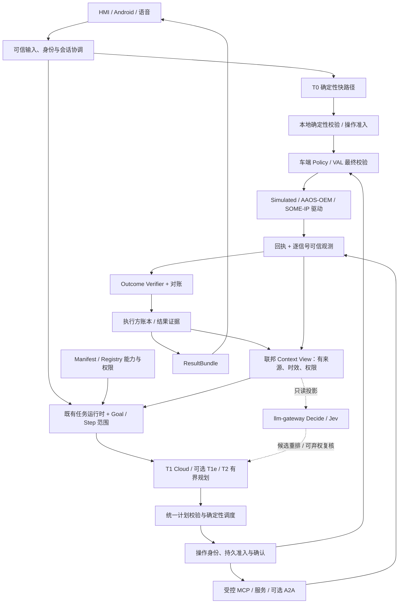

# Cockpit Agent v2 目标架构与迁移边界

> 日期：2026-09-26。状态：**规划采用，目标态未实现**。
> 本文是[架构主文](cockpit-agent-architecture.md)的目标态分册；当前事实以代码和 QA 交接为准。
> 排期只维护在[路线图](../roadmap.md)，任务拆解只维护在[实施方案](../design/2026-09-26-cockpit-agent-v2-implementation-plan.md)。
> 依据：[v2 RFC](../research/2026-09-26-cockpit-agent-v2-upgrade-rfc.md)、[Jev 研究](../research/2026-09-25-cockpit-agent-jev-integration-plan.md)。

## 1. 设计决策

| 决策 | 采用方案 | 明确边界 |
|---|---|---|
| D01 执行复杂度与位置分开 | T0 确定性快路径；T1 一次有界计划；T2 有界循环；T1e 是 T1 的端侧部署档 | T1e 尚未实现；不复制安全判据或引入端侧自由循环 |
| D02 复用已有运行时 | 扩展 Step、SessionState、SDK Ledger、Verifier、Manifest/Registry | 不另建“任务大脑”、第二会话状态机、第二重试器 |
| D03 语义证据与授权分开 | 原话/来源服务端持有；步骤输入投影、goal 关系和模型解释可校验可撤回 | Jev、模型 goal、S2S interpretation、外源内容都不能授权 |
| D04 联邦上下文 | 车态、Memory、执行方账本、导航/商户各自权威；按权限生成视图 | 不建一个复制全部数据、自己演化的 World State 数据库 |
| D05 执行证据分层 | ACK、当前状态满足、操作被观测、验证完成分列 | 不支持因果关联时只报告状态满足；UNKNOWN 不转成成功 |
| D06 模型判别是可选建议 | llm-gateway 内增加独立 Decide；Jev 固定版本、任务校准、允许弃权 | 不注册业务 Agent，不进入聊天模型选择器，不影响 T0/取消 |
| D07 先兼容再迁移 | 新字段有明确旧值语义、读写能力协商、持久化往返及版本矩阵 | 不为赶进度让旧节点静默丢授权字段后执行 |
| D08 车辆执行权留车端 | Policy/VAL 在执行点读可信新鲜状态，后接可替换驱动 | 云端确认不能覆盖本地联锁；手机不直连车辆总线 |

## 2. 目标数据流

下图虚线是可选判别建议；实线表示目标主链。图中新增契约尚未上线。

“统一”指契约与判据统一，不表示所有流量必须经过云端。离线 T0 的操作准入与日志在车端；
Jev 和云 PG 不成为快路径依赖。每条写路径必须枚举其实际首次 dispatch 点，不能只验证最终 Plan。

## 3. 语义、任务与结果契约

### 3.1 原位扩展的数据对象

| 对象 | 已有落点 | 拟新增语义 / 信任来源 |
|---|---|---|
| Capability | proto、Manifest、SDK loader、Registry | 收严 effect；类型/单位/区域/车型/版本、前置条件、幂等/验证策略；来自受控声明 |
| Task / Goal | Plan、SessionState、SDK Ledger | 稳定任务/goal 身份、来源 turn/span、revision、状态和结果引用；服务端分配身份 |
| Step | `orchestrator/cloud/models.py` | `input_scope`、稳定 goal 关系、能力版本、view/operation 引用；沿 `step_record` 统一往返 |
| Operation | 既有确认/执行链、Ledger 增量 | 独立 UUID、主体/车辆/参数/版本绑定、一次确认、提交/对账状态；执行方权威 |
| ResultBundle | StepResult、task_frame、WS/卡片 | completed/pending/failed/unknown 的事实集合、完整答案/引用、revision；执行结果生成 |
| Context View | WorkingSet + 现有各权威服务 | 请求级投影、读取状态、逐项来源/时效/权限、pinned 事实；禁止自建事实写入 |
| DecisionSnapshot | 拟由 Context/WorkingSet 派生 | 当前任务所需的最小只读投影与状态绑定；不额外拉一份历史 |

这些名称是目标语义，尚不是可调用接口；字段号、枚举与兼容默认值须在各任务的契约 PR 冻结。
既有 `Step.kind=agent|tool|edge_fast` 与 `deployment` 继续使用，v2 不发明第四种业务调度分支。

### 3.2 Goal 与授权的边界

当前 `Plan.goals/Step.covers` 是模型可选输出，`covers` 不进 `step_record`，`PLANNER_GOALS` 默认 off。
CA2-03 先引入服务端稳定 ID 和来源关系；旧记录没有精细分解时按“旧任务/未知覆盖”恢复，
不得从已有步骤倒推“用户只要求这些”。涉及语义分解的准确性另外评测，不能用全空/全覆盖骗过完整性指标。

`origin_text` 保留步骤起点；`safety_origin_text` 保留服务端授权原点；`input_scope` 只限定业务读取范围。
补槽/改口产生新 revision；未改的目标身份保持、被撤销的关系保留终态，旧确认失效。
服务端持有的原话全文、否定/条件关联和已执行事实不因 prompt 压缩、重排或分句而消失。

### 3.3 结果集合先于话术

“打开后备箱，再告诉我空调有哪些模式”可以同时有 pending 后备箱与 completed 手册回答。
挂起、重连、下一轮追问与客户端切换都应保留完整答案、证据卡和引用；短 TTS 是投影，不能覆盖完整事实。
两端共享结果语义与选择器，各自实现 UI；流式 delta/终态按同一任务、步骤和 revision 对齐，
已发布事实不得被晚到的旧 revision 改写。旧客户端继续收到兼容字段；需要新确认契约的动作对不支持客户端拒绝或升级提示。

## 4. 可信车辆状态与联邦视图

当前 `vehicle.state.changed` 及 Cloud 镜像是 PoC 单车模型：整包 `_updated_at` 和 180 s 陈旧阈值。
v2 增加认证映射得出的 tenant/user/vehicle 绑定，以及 source、source_epoch、source_seq、
observed_at、可信 received_at、quality、单位、逐信号有效期、可选 operation_id 和 provenance。

生产者、NATS 路由/ACL、网关、Cloud/scene 镜像、collector、HMI 车态和 Verifier 必须按同一版本迁移。
旧无车辆身份消息只能进入显式配置的单车仿真兼容车道，不能自动绑定到“当前用户的车”；
缺少新鲜度/质量的观测用于解释时明示未知，不能用于放行安全写操作。

同源 epoch/seq 处理乱序、重复与重启；多源不能比较裸 seq，按受控来源优先级和时钟容差处理。
新电量消息不能刷新旧挡位时效。执行许可用的车速/挡位临近执行由车端重读，读取失败拒绝相关写。
具体 TTL 和前置条件由车型接口/风险分析给出，不从 PoC 的 180 s 直接继承。

Memory 仍拥有偏好/关系，执行方拥有任务/操作，导航/商户拥有各自真实状态；
Context View 只组合授权后的事实。`found/none/unavailable/off` 分开，pinned 的约束、待办和执行事实不参与模型淘汰。

## 5. 持久准入、确认与对账

已有短步骤指纹用于同参复用，不能作为操作身份或授权凭证。一次真实提交使用独立 operation UUID；
能力版本、计划 revision、主体、车辆、参数摘要与期限共同绑定确认，原子消费后不能跨端重放。

目标状态可细分为 planned、awaiting_approval、admitted、submitted、applied/observed、verified，
另有 failed/cancelled/unknown；这是拟定生命周期，不擅自替换现有 StepStatus 枚举。
需要持久承诺的任务在副作用前写入准入记录，落账失败拒绝；只读、可丢失且如实告知的实验任务才可 best-effort。
车端离线日志实现同一操作契约，云端只做有协调的同步/索引。

采用至少一次投递、接收端幂等与恢复对账。有 ACK 不等于生效，目标状态满足不等于本次动作导致它；
不支持幂等/查单的接口在超时后进入 unknown，不能盲目重试。补偿属于新的受控动作，仍需相应权限/确认。
恢复先查询执行方，后决定继续；取消、停止播报、停止设备是三件事，取消不能抹掉已发生的动作。

## 6. Jev 决策建议通道

### 6.1 接点与权威

在现有 LLMGateway 进程中拟增 `Decide` RPC，和 Complete/Embed 的路由、模型 pin 分开。
领域模块提供合法候选与问题，网关负责受控任务模板、供应商适配、身份校验、预算/额度、响应验证，
调用方确定性检查状态有效性后消费。没有新的业务 Agent、端口、数据库或前端模型选择项。

Jev 只输出 Choice/Noul/Score 建议；校准阈值按任务、语言、模型/rubric/候选分布冻结。
输入不传音视频/base64；敏感原文也要过滤，不能只去 metadata。OwnerKey、权限、同意与 forget 先于模型。
未知 ID、坏分布、非有限数、缺项、模型漂移均使该批拒绝采纳。晚到结果按当前状态/候选/同意指纹判 stale，TTL 不代替绑定。

### 6.2 模式与故障语义

| 档位 / 故障 | 确定性行为 |
|---|---|
| off | 零供应商请求，包括 shadow；原 Skills/Exemplar 模式保持 |
| shadow | 有界低优先级队列、独立额度；拥塞丢样并记 dropped，不双执行 |
| advise | 只消费本任务已过门的排序/提示；会话固定桶灰度是部署策略 |
| timeout/429/529/不可达/隐私过滤/校验失败 | 整批回既有基线，不自动改用聊天模型伪装 Decide |
| 状态变化、打断、换人、撤权、忘记 | 取消在途任务；晚到仅留脱敏统计，不写回新轮 |
| critic 已提出受采纳的副作用疑点、预算耗尽 | 适用路径在首次副作用前转已有安全澄清；不编补救动作 |

首版每次只启用一个在线行为车道；最多两次在线调用/总新增阻塞 500 ms 是待 R0 测定的实验上限。
请求 deadline、全局剩余预算与阶段上限取最小值；实时供应商隐式重试关闭。
动态决策只做请求内缓存，绑定 model/rubric/calibration、输入、候选顺序和状态/授权指纹。

### 6.3 领域消费顺序

- Skills/Exemplar：保留常驻 policy、pinned、词法保留与预算；只排序可选项，范例不能直接变成执行计划。
- RAG：按 09-26 现有词法+目录路由+主语承接生成候选，保留已规定的词法首页/视觉命中；
  先文本选择、最终排序，再统一附图；不得让被丢弃候选占图片预算。off 与旧链按文本/页码/图/hash 逐项比较。
- capability/context：只改模型可见的可选投影；执行校验目录、route_hint 扫描目录和确定性上下文保持完整。
- critic：先 shadow，只检尚未执行的新 delta；主动模式先限完整计划未派发的路径，
  D0/流式提前执行未覆盖就记 skipped，不能等待后补签。共用 RetryController，每请求至多一次语义重规划。
- memory：仅异步 review/shadow；不自动 merge/supersede/delete，不过滤用户显式“记住/忘记”。

## 7. 端侧与生态适配

T1e 首批只测只读、手册路由和限定低风险短计划（2–4 步为实验参数）。
规则/固定表示/Schema/云模型用同一语料与能力面比较，报告中文、多轮、ASR 扰动、未见能力、
完全正确率、误执行、风险—覆盖、冷/热延迟、峰值内存、温升和语音抢占。
完整离线还依赖 ASR/TTS、身份、车型目录及本地状态，PC/手机性能不能转成目标 SoC 结论。

VAL 后驱动统一能力发现、read/subscribe/execute/query-result 与错误语义；先一种 OEM/AAOS 服务，
SOME/IP 等取得车型接口再做。VSS、VHAL、VSIDL 分别承担信号语义、属性访问、服务接口描述，不能混为一个接口。
MCP 保持外部工具适配角色，增加 audience/scope/车辆绑定、句柄归属和外源数据隔离；
A2A 仅为真实合作对象提供版本固定的任务边界适配，不替换内部 gRPC。

首批业务复用 navigation/charging/manual/road-safety：能源路线约束可追溯，
健康建议区分“解释告警”与“故障解决”；服务预约仍需真实 Provider 和独立授权。
不开放模型控制转向、制动、动力，不以 GUI 操作绕过车辆或支付接口。

## 8. 兼容、迁移与验证

1. 先冻结 schema 和旧字段缺省语义；proto 新字段追加编号，禁止重用；先生成代码再做双版本往返。
2. 生产者与读者分阶段发布，新字段先旁路；旧记录只补可证明的事实，不能补造确认、身份或 goal 覆盖。
3. 需要 v2 授权/持久性的能力只有在所有执行节点与客户端支持时启用；不支持则拒绝新能力或保留旧只读档。
4. 新状态写入前准备迁移/回滚与在途操作对账；schema、CI/CD、运行配置、部署分别按仓库红线取得授权。
5. 模型/提示词/目录/策略/知识/协议/设备版本共同组成验收身份；模拟、真实 Provider、OEM 沙箱、实车证据分栏。

五层验收为契约、理解、任务、安全、体验/运行；硬断言证明权限/状态/副作用，人评补充语音与认知负荷。
Jev 的语义疑点与 Outcome Verifier 的执行证据用不同字段与指标，不互相当裁判。
可复现用例、故障矩阵、责任角色、具体 PR 顺序见实施方案，未通过不得把本分册改为“已实现”。
