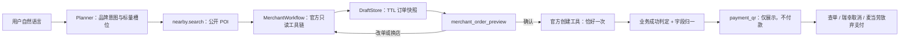

# 麦当劳 / 瑞幸 MCP 全业务流程设计（2026-08-12）

> 状态：实施基线。本文承接
> [`2026-08-11-payment-infrastructure-and-merchant-mcp.md`](2026-08-11-payment-infrastructure-and-merchant-mcp.md)
> 的“二期下单”余项；若两者冲突，以本文对商户工作流、写安全和交互的裁决为准。

## 1. 目标与验收边界

本期把已经接入的麦当劳、瑞幸官方 MCP 从“只读工具在线”推进为可由自然语言完成的业务闭环：

- 麦当劳：选店、选品、商品确认、计价、创建未支付订单、展示支付入口、查单；不代用户付款。
- 瑞幸：选店、选品、糖冰等规格确认、预览、创建未支付订单、展示支付入口、查单、二次确认取消；不代用户付款。
- HMI：候选选择、订单预览、上下文正确的确认、支付入口、查单/取消或放弃支付动作可用。
- 意图：品牌下单、营养查询、附近门店、查单、取消、demo 咖啡不得互相串域。
- 安全：确认前不得调用创建/取消；写调用不得自动重放；超时不得假称确定失败；支付链接和持久化结果都必须白名单化。

本期不做：

- 最终支付或代扣。
- 麦当劳远程取消（官方 29 个工具没有取消能力）；用户只能放弃支付，等待商户自动关闭未支付单。
- 多乘员独立商户账号。当前 `LUCKIN_MCP_TOKEN` / `MCD_MCP_TOKEN` 都是服务级单账号凭证，PoC 只允许持有网关权威 `merchant.write` scope 的已认证主用户在当前会话使用账号型商户工作流；非空默认 `user_id`、声纹身份或客户端自报 meta 都不构成授权。
- 把全仓 `Intent.slots` 从 `map<string,string>` 改成任意 JSON。

## 2. 现状与不能直接放行的原因

当前 `servers.yaml` 只准入：

- `mcd.menu -> list-nutrition-foods`
- `mcd.order_status -> query-order`
- `luckin.order_status -> queryOrderDetailInfo`

2026-08-12 对官方端点只读 `initialize + tools/list` 的实时结果：

- 麦当劳 `mcd-mcp 1.0.0`，29 个工具。
- 瑞幸 `luckyordermcpmaster 1.0.0`，8 个工具。

不能只把其余工具写入白名单：

1. 麦当劳 `items[] / roundList[] / modification`、瑞幸 `productList[] / attrOperationParam` 是嵌套对象，Planner 与 Intent wire 都会把槽位转成字符串。
2. 瑞幸把业务 JSON 放在 `content[].text`，现有 `parse_tool_result()` 只读 `structuredContent`，结构数据会被丢掉。
3. 官方 schema 全部 `additionalProperties:false`，现有桥却向真实第三方附加 `_owner_user_id`。
4. 两家创建工具都没有上游幂等参数，不能在响应丢失后重放写请求。
5. HTTP timeout 当前被包装成普通 `McpError`，写路径会误报“确定没发出去”；404 重握手也会自动重放 `tools/call`。
6. 写工具准入没有真正强制确认、幂等模式和可用补偿；支付 host 空列表当前反而放行任意 HTTPS。
7. 当前确认发生在预览之前，用户看不到最终门店、商品、规格和金额。

## 3. 总体方案

采用“用户级复合 intent + 桥内确定性 workflow”。Planner 只处理自然语言字段和字符串引用；官方 tool code、SKU、嵌套请求体、金额判断全部在桥内完成。

### 3.1 用户能力面

对 Planner 暴露：

| intent | 类型 | 用户语义 |
|---|---|---|
| `mcd.menu` | 读 | 通用营养、热量查询，保持现状 |
| `mcd.order` | 工作流写 | 麦当劳选店、选品、预览并创建未支付订单 |
| `mcd.order_status` | 读 | 按订单号或同商户最近订单查状态 |
| `luckin.order` | 工作流写 | 瑞幸选店、选品、规格、预览并创建未支付订单 |
| `luckin.order_status` | 读 | 按订单号或同商户最近订单查状态 |
| `luckin.order_cancel` | 工作流写 | 二次确认后取消同商户订单 |

不把 `queryShopList`、`searchProductForMcp`、`createOrder` 等官方工具直接注册为 capability；它们只作为工作流的内部依赖接受 schema 准入。

### 3.2 门店与位置

- `nearby.search` 仍是“附近门店”的唯一用户级能力，避免新增 Agent 侵占地理搜索职责。
- 传给瑞幸的经纬度必须来自用户选择的公开门店 POI，不得来自车机 `location.precise` 上下文。
- Executor 在解析 `slot_refs` 时为下游 step 写入不可由 Planner 生成的 `_trusted_slot_refs` meta，记录生产 step intent 与引用路径；瑞幸 workflow 只接受同一个 `nearby.search` 结果项的 `name/lng/lat` 三元组。用户文本或 Planner 自填的 `location_source` 不构成可信证明。
- 瑞幸 workflow 用该公开坐标调用 `queryShopList`，再按店名/距离确定官方 `deptId`；多家同名或置信不足时返回最多 3 家候选，不静默猜测。
- 麦当劳优先使用用户显式门店或官方常用门店；官方关键词找店失败时要求用户选店，不伪造 `storeCode`。
- 门店打烊、商品售罄、无法匹配官方门店都给出明确下一步，不降级成 demo 商户。

### 3.3 商品与规格

- LLM 只提供 `item_query`、`quantity`、`temperature`、`ice`、`sweetness`、`milk`、`pickup_mode` 等自然字段。
- workflow 只能从官方菜单返回中选择商品 ID、SKU 和属性 ID。
- 多商品命中时展示最多 3 项候选并说明价格；用户选择后重新查询详情。
- 未说规格时允许采用官方默认，但预览必须逐项明确，用户可在确认前修改。
- 麦当劳套餐 `roundList/modification`、瑞幸 `switchProduct.attrOperationParam` 都由确定性 builder 依据官方详情构造，拒绝 LLM 自造 code。

2026-08-12 只读真机已锁定关键结果路径：

- 麦当劳菜单 code：`query-meals.data.categories[*].meals[*].code`，展示信息按 code 关联同响应的 `query-meals.data.meals[productCode]`；`query-meal-detail.data` 本身就是商品详情对象；试算金额：`calculate-price.data.price`（整数分）；取餐方式：`calculate-price.data.takeWayList[*].code`。麦当劳业务成功 envelope 为 `success=true && code=200`，不能沿用瑞幸的 `code=0`。
- 麦当劳官方 `create-order` outputSchema：订单号 `data.orderId`，支付入口 `data.payH5Url`，订单详情金额候选 `data.orderDetail.realTotalAmount`（元字符串）。支付 locator 必须是 `data.payH5Url`，旧注释的 `payH5Url` 少一层。
- 瑞幸预览：门店 `data.shopInfo`，商品 `data.productInfoList[]`，规格摘要 `additionDesc`，原价 `totalInitialPrice`，优惠 `privilegeMoney`，当前应付候选 `discountPrice`。
- 瑞幸 `switchProduct` 会返回新 SKU；后续 preview/create 必须使用最后一次 switch 响应的 `skuCode`，不能沿用 search 的初始值。

## 4. 订单快照与确认

新增 `MerchantDraftStore`：

- 生产使用现有 Redis，默认 TTL 10 分钟；Redis 无状态持久化符合“短确认窗口”语义。
- key 使用已认证 `user_id + session_id + merchant` 的摘要建立归属，value 是服务端生成的随机 `checkout_token` 对应快照；value 不保存 user/session 明文。
- store 同时维护该用户/会话/商户的唯一 current pointer。现有确认恢复不会把 Agent `data` 写回 step slots，因此标准确认轮用 `(user_id, session_id, merchant)` 原子消费 current draft；显式带 token 的卡片动作仍须校验同一归属。新预览覆盖旧 pointer，旧草稿只能等待 TTL，不能被确认。
- 快照至少含 `merchant/store/items/fulfillment/price/discount/payable/currency/upstream_args/schema_digest/created_at`。
- 返回给 Planner 的只有字符串 `checkout_token` 和人类可读摘要；HMI 卡可以持有 token，但不显示它。token 不是确认授权，`confirmed=true` 与会话归属校验仍不可缺。
- 确认时必须按当前用户、会话、商户取回同一快照；过期、缺失、schema 变化或重新计价变化时，重新预览并再次确认。
- 确认摘要和金额由确定性 formatter 生成，不交给 LLM 改写。
- 草稿登记为 `merchant_draft` 个人数据目标。除 draft/current 外维护带完整性 marker 的用户摘要索引；create/cancel 原子消费草稿时同时建立 owner 操作租约，Ledger/远程写前再次校验并续租。删除先立写 fence：租约在飞时只 NACK 为 `503 + pending/retryable`，租约释放后重试；无在飞操作时再逐值复核 owner、用 cursor SCAN 修复缺索引孤儿，并经二次扫描证明为零，索引中误混的 foreign key 不构成跨用户删除授权。成功删除保留覆盖草稿 TTL 的 `privacy_deleted` 墓碑，删除开始前已在飞、ACK 后才到达的旧 `put` 仍会被拒绝。Planner 待确认/焦点态另登记为 `planner_pending_session`：owner 与 session 都参与摘要 key，读取/清理必须匹配认证 owner；挂起步本身不重复保存 token、卡片和 data，已完成依赖只投影下游 `slot_refs` 实际引用且安全的标量，话术、动作、卡片、URI/QR/token/payment id/联系人字段不持久，旧记录恢复时再次最小化。HMI 的 Memory 全量 ForgetUser 必须携带 `AUTH_TOKENS` 中 Bearer 且 body owner 与其一致；Memory 删除成功后，本批只额外协调 `merchant_draft` 与 `planner_pending_session` 两类短期状态。内部 request/reply 用 mesh 私钥派生的域隔离 HMAC，帧带 target、nonce、时间窗并将响应绑定请求摘要；cloud/MCP responder 仅在共享 Redis 实际可达时安装，缺 key、伪 ACK、重放、在飞租约或任一 adapter 未收口都 fail-closed。该协调不是全 privacy registry 跨域删除 saga；Task Ledger、支付/可观测等仍按既有后置项处理，`mcp_demo_order` 仍是外部引用，只能显式 unlink/生命周期清理，不能随 `privacy_user_all` 冒充物理删除。TTL 只负责故障兜底，不替代可证明的删除。

首次 `mcd.order` / `luckin.order` 调用只执行只读工具链并返回：

- `status=NEED_CONFIRM`
- `speech`：门店、商品、规格、数量、取餐方式、实付金额、确认后只创建未支付订单。
- `ui_card.type=merchant_order_preview`
- 创建工具调用次数严格为 0。

确认请求携带 `confirmed=true` 后，workflow 才消费快照并调用一次创建工具。

`merchant_order_preview` 卡本身不发送确认动作；它与全局 `ConfirmBubble` 共同显示，由全局确认按钮沿现有 `App.confirm -> dispatch(..., true)` 链回复。卡内选店、选品、修改、查单、取消入口都是普通 `send_text`，首帧必须为 `is_confirmation=false`，需要写时由 Agent 再返回 `NEED_CONFIRM`。

## 5. 写安全模型

### 5.1 准入

写能力必须同时满足：

- 高层 capability `require_confirm=true`。
- 每个内部工具的实时 schema 指纹与仓库声明相同。
- `idempotency_mode` 明确为 `upstream` 或 `local_at_most_once`。
- `upstream` 必须声明真实存在于 schema 的 `idempotency_key_arg`。
- `local_at_most_once` 必须声明 `retry_policy=never`、`timeout_outcome=uncertain`，并依赖 Task Ledger + single-flight。
- `compensate_policy=tool` 时，补偿工具本身也必须完成 schema 准入；不是“名字在白名单里”即可。
- `compensate_policy=abandon_unpaid` 时，确认摘要必须明确“不支付会自动失效”。
- 取消一类终态写操作使用 `compensate_policy=terminal`，仍要求二次确认但不虚构反向补偿。
- 声明 `pay_url_locator` 时 `pay_url_hosts` 必须非空，否则整条创建 workflow 拒载。

### 5.2 调用语义

- `_owner_user_id` 只保留在本地 Ledger；只有明确声明 `forward_owner=true` 的 demo server 可以传给上游。
- 官方账号型工具在出站前检查网关注入的 `granted_scopes`：查询要求 `merchant.read`，预览/创建/取消要求 `merchant.write`。edge gateway 会剥离客户端伪造 scope 后只按已验证 token 注入；cloud 将其解析成 `PlanContext.granted_permissions`，`Clients._merge_meta()` 再从该可信集合重建下游 `granted_scopes`，并覆盖 Planner、偏好或 step meta 中的同名值。匿名模式 scope 为空，必须拒绝真实账号调用。
- 工具参数按实时 JSON Schema 的 `required` 和 workflow 的条件必填逐项校验，不以“任一槽位存在”代替。
- HTTP 客户端区分 connect failure、read timeout、HTTP status、MCP error；不在异常中输出 URL、headers 或 token。
- 读调用可在 404 会话失效后重握手重试；写调用一律 `retry_on_session_loss=false`。
- 写超时或连接在发送后断开统一进入 `uncertain`；禁止自动重试，提示用户先去商户 App 核对。
- 麦当劳可额外显示 `order-list` 的最近订单供人工判断，但不得把相似订单自动认成刚才那单。

## 6. 响应归一、账本与支付链接

`parse_tool_result()` 在 `structuredContent` 为空且仅有一个文本块时，只接受“完整、顶层为 object 的 JSON”作为补充 `data`；普通文案不猜结构。

每个工作流声明或实现：

- `success_predicate`：MCP `isError=false` 之外，再校验商户业务 code/status/success。
- `result_map`：归一为 `order_id/status/amount_cents/pay_url/merchant/store/items/cancelled`。
- 金额单位转换必须由 codec 确定性完成。
- Ledger `result_ref` 只保存白名单字段；不保存手机号、地址、优惠券、原始响应或支付 URL。
- 卡片保留字段 `type/server/tool/merchant/_prov` 最后写入，外部 payload 不能覆盖。

瑞幸 create 的订单号、金额、支付路径及域名没有出现在 preview 中，不能猜测；必须由获准的首笔未支付真实订单只记录“字段路径、类型、host”后再锁入 schema/fixture。首笔探针本身仍需经过已验证的 preview 参数，并在响应丢失时禁止重放。

支付链接：

- 第一层使用每个 server 的 `pay_url_hosts`；空列表语义改为拒绝。
- 第二层仍由 payment-gateway 的 `PAYMENT_EXTERNAL_PAY_HOSTS` 校验。
- 任一层失败都不输出原始 URL/二维码，只提示去官方 App 支付。
- 网关登记失败时同样不回退泄露原始 URL；订单已创建的事实仍如实说明。
- HMI 有 `qr_svg` 时显示二维码；没有时只显示“打开安全支付链接”，不能继续写“扫码支付”。

## 7. HMI 交互

新增/升级三类卡：

1. `merchant_choices`：门店或商品候选，最多 3 项，按钮发送带品牌和具体名称的自然语义。
2. `merchant_order_preview`：品牌标识、门店、商品、规格、数量、取餐方式、优惠、实付；卡内只提供普通“修改订单”，创建确认/取消由紧邻的全局确认条承载。
3. `payment_qr` / `mcp_order`：显示品牌、订单号、金额、状态；提供“查订单”。瑞幸提供“取消订单”，麦当劳提供本地“放弃支付”。

确认区不再把所有 `NEED_CONFIRM` 都写成“已泊车 · 危险操作”。它根据卡片类型显示：

- 商户创建：“确认订单信息后创建未支付订单，扫码后才会付款”。
- 瑞幸取消：“取消后可能无法恢复，请确认”。
- 车控危险动作继续使用原安全提示。

按钮动作必须复用现有上行通道；确认按钮发送 `is_confirmation=true`，候选/修改/查单/取消按钮发送明确自然语言，不新增绕过 Planner 的业务写通道。现有 `App.tsx`、WebSocket、gateway 与 proto 已具备这条分工，本期不修改；商户交互只补卡片 `onAction`、类型和确认文案。

视觉方向沿用现有 Aurora 车机语言，商户卡采用高对比、驾驶中一眼可扫的收据式层级，不引入与全局 HMI 冲突的新字体或装饰。

## 8. 意图与对抗边界

每个新 active intent 至少补 2 正例、2 硬负例、1 对照；现有“未接入下单”案例保留 case id 并翻转金标，不删除尺子。

必须覆盖：

- “巨无霸多少热量” -> `mcd.menu`，禁止 `mcd.order`。
- “麦当劳点一个巨无霸套餐” -> `mcd.order`，禁止 `shop.order` / `mcd.order_status`。
- “附近麦当劳” -> `nearby.search`，禁止下单。
- “瑞幸生椰拿铁少冰半糖” -> `nearby.search` + `luckin.order`。
- “瑞幸那单好了吗” -> `luckin.order_status`。
- “取消刚才的瑞幸” -> `luckin.order_cancel`。
- “取消麦当劳订单” -> 明确无远程取消能力；未支付可放弃，不伪装成取消成功。
- 无品牌“来杯咖啡”不得落到真实麦当劳/瑞幸账号。

对抗语料扩容必须同步、有理由地调整 `suites.yaml` 的规模上界及 catalog 预算哨兵；不能为了保持旧数字而少写边界。

## 9. 验证矩阵

### 9.1 单元与离线集成

- JSON-in-text 严格解析及非法文本拒绝。
- 远程 MCP 不发送 `_owner_user_id` 或未知字段；demo 保持 owner 隔离。
- 官方全部依赖工具 schema 指纹锁定，补偿两阶段准入。
- typed request builder、金额换算、业务成功谓词和结果白名单。
- 门店/商品歧义、打烊、售罄、默认规格、改单、草稿过期。
- 确认前 create=0，确认后 create=1；重复确认仍为 1。
- timeout/404 对写不重试，Ledger 记录 `uncertain`。
- 恶意/空支付 host 不出链接。
- HMI 卡、上下文确认文案、按钮上行 payload。

### 9.2 真栈

在营业时间、工作树干净、根 Compose 全栈下验证：

1. 官方 `initialize/tools/list` 指纹仍匹配。
2. 麦当劳：自然语句 -> 真实门店/菜单/计价 -> 浏览器确认 -> 创建一笔未支付订单 -> 付款卡 -> 查同一订单；不付款。
3. 瑞幸：自然语句 -> 真实门店/商品/规格/预览 -> 浏览器确认 -> 创建未支付订单 -> 付款卡 -> 查单 -> 再次确认取消 -> 取消终态。
4. 重复确认、断线重发不得双下单；两个商户最近订单不得串账。
5. 观测和日志不得出现 token、完整支付 URL、优惠券或个人信息。

真实验证最多产生三笔未支付订单：一笔瑞幸用于首次锁定 create locator/host，随后立即查单并取消；一笔瑞幸用于浏览器整链，确认后取消；一笔麦当劳用于浏览器整链，不付款并等待商户自动失效。若首笔瑞幸响应已足以在同一运行实例安全重放支付卡展示且查询结果保留支付入口，则复用该订单，把总数降为两笔；不得为了方便增加更多订单。

### 9.3 浏览器

复用 HMI CDP：

- 截图门店/商品候选、订单预览、确认态和支付卡。
- 抓取确认点击上行帧，证明 `is_confirmation=true`。
- 验证无“已泊车”商户误文案；无 SVG 时不假称可扫码。
- 验证查单、瑞幸取消、麦当劳放弃支付按钮的真实语义。

## 10. 实施与提交顺序

1. MCP 传输、准入、隐私和写语义硬化。
2. 草稿存储、通用工作流骨架和商户 codec。
3. 麦当劳完整 workflow。
4. 瑞幸完整 workflow。
5. capability、意图资产、对抗语料与文档契约。
6. HMI 商户交互和浏览器测试。
7. 离线全链、真栈、浏览器与全量回归；更新实施证据。

每批遵循红灯测试 -> 最小实现 -> 分组回归 -> 规格审查 -> 代码质量审查 -> commit。最终只在全部新证据完成后推送 `main`。

## 11. 实施记录与真实验证偏差（2026-08-12）

### 11.1 已落地能力

- MCP 传输/准入硬化完成：严格 JSON-in-text、schema 指纹、隐藏低层工具、写 no-retry、
  timeout uncertain、两阶段补偿准入、owner 不出域、空支付 host fail-closed。
- `MerchantWorkflow` 已承载两家官方工具链；嵌套商品/规格参数、金额、业务成功判据和结果
  白名单均为确定性实现。Redis 草稿按用户/会话/商户隔离，确认原子消费，并已登记
  `merchant_draft` / `planner_pending_session` 隐私目标及 owner-scoped、在飞操作感知的清除路径；Task Ledger 与
  single-flight 共同落实 `local_at_most_once`。
- 麦当劳已支持选店、选品、详情/计价、预览、确认创建未支付订单、支付入口与查单；官方
  工具面无远程取消，用户只能放弃支付并等待自动失效。
- 瑞幸已支持公开门店坐标接地、选品与规格、预览、确认创建未支付订单、支付入口、查单，
  以及再次确认取消。
- HMI 已有商户候选、收据式预览、上下文确认、支付链接/订单卡和查单/取消动作。整个流程
  只创建未支付订单，不代用户付款。

### 11.2 真栈证据与订单清理

官方只读清单仍为麦当劳 29 工具、瑞幸 8 工具；两家只读预览均取得真实营业门店、商品/规格
和商户计价。浏览器已留存麦当劳支付链接卡与瑞幸预览卡。真实创建总数为 **5 笔**：瑞幸
3 笔、麦当劳 2 笔；三笔瑞幸均已取消，两笔麦当劳均由商户自动取消，且没有执行最终付款。

这比 §9.2 原定最多 3 笔多 2 笔。原因是首次真实响应需要锁定 create locator/host，随后浏览器
链路又暴露确定性拒绝与跨轮卡片覆盖问题，验证过程中各产生额外未支付单。此处记录的是已发生
事实，不修改原预算来制造“符合计划”的假象；后续不再用新订单重复同类验证，只做只读终态核验。

### 11.3 证据限制与收口结果

- 旧版 C9 只要求收到非通用搜索回复；当官方响应已经明确“已取消”时，LLM 重述仍可能说
  “没查到/待回传”。这两张旧图是缺陷证据，不是终态验收证据。
- C9 已改为必须显式提供并命中 `CDP_MERCHANT_EXPECTED_STATUS`。最终只读浏览器复验中，
  瑞幸精确命中“已取消”，麦当劳精确命中“订单已取消”，查询帧均为
  `is_confirmation=false`；两家严格 C9 均通过。
- 两家 token/账号仍是服务级全局凭证；多乘员独立商户账号与 token 自动刷新未做。
  支付链接第二层白名单依赖 payment-gateway 运行时安全配置；空配置必须 fail-closed。
- 浏览器复验必须由网关认证的主用户 token 显式授予 `merchant.read,merchant.write`，且 HMI
  `VITE_WS_TOKEN` 与其匹配；不得把商户权限加入匿名 PoC 默认 scope。
- 本节不记录 token、订单号、完整支付 URL、优惠券、地址等敏感字段。
- 最终冻结工作树执行 `python -m pytest --import-mode=importlib -q`：
  **5408 passed / 14 skipped / 0 failed**，退出码 0，用时 23m25s。聚焦回归：
  mcp-bridge **385 passed**；隐私/旅程 manifest **168 passed**；HMI node **253/253**，
  Vite production build 通过。Redis 7 隔离 DB15 实测 TTL、动作错配不删除、并发唯一消费、
  owner 删除幂等、在飞操作返回 pending，且不影响对照用户。合成 Docker 真栈另证明：活跃租约
  存在时 ForgetUser 返回 `503 + pending/retryable`；精确释放后同 owner 重试返回 200，Planner
  会话与商户草稿均为零、旧租约不可再授权。该取证没有调用 create/cancel/query/payment 等
  商户业务工具，也没有增加真实订单。
