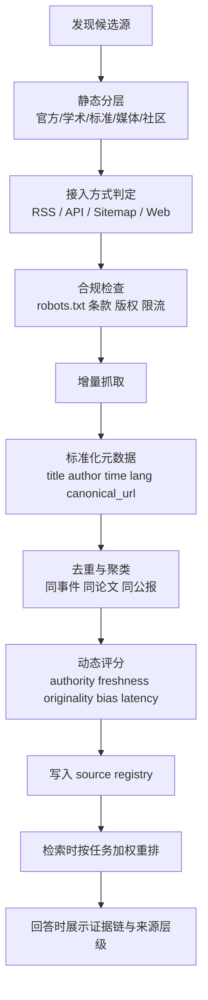

# 座舱 Agent 的 Deep Research 与联网搜索 source_quality 名单与评分策略报告

## 执行摘要

这份报告面向“通用新闻 + 技术/学术 + 政府数据”场景，给出的核心结论是：你的座舱 agent 不应把“新闻媒体站点”当成唯一主源，而应采用**多层源池**结构，把**政府/官方机构、官方统计与开放数据、标准组织、学术基础设施、原创新闻媒体、厂商文档、社交信号源**分层纳入，并在检索、重排、证据融合和最终回答阶段分别赋予不同权重。官方/原始站点与正式学术基础设施最适合作为 A+/A 层证据源；原创新闻媒体多数应落在 A 或 B；社交媒体与社区信号更适合作为**发现线索源**而不是**终局事实源**。这一判断与公开可验证的源特征一致：例如世界银行、WHO、Eurostat、FRED、Crossref、PubMed、arXiv、ClinicalTrials.gov、IETF/NIST/ISO 等都提供正式数据接口、标准文档或长期稳定的元数据服务；Reuters、FT、Guardian、SCMP、China Daily、人民网、新华社、财新等则更适合承担“快速事件发现”与“报道交叉验证”的角色。citeturn10search13turn10search0turn10search2turn9search3turn9search4turn8search0turn6search2turn6search0turn33search0turn25search4turn11search2turn11search3turn30search0turn1search0turn3search0turn12search12turn4search13turn5search10turn29search0turn5search4

从工程上看，建议你把 source_quality 做成**“静态分层 + 动态得分 + 场景化上限/下限”**三段式系统：先基于来源类型、是否官方/原始、是否同行评审、是否正式 API/RSS、是否长期稳定域名来给出静态层级；再结合近 30/90 天更新频率、可抓取性、速率限制、全文可得性、重复率、地理/语言覆盖、引用关系、政治偏向风险、延迟与错误率做动态打分；最后在不同任务里加场景约束，例如“宏观经济问题提高官方统计权重”“医学问题提高 PubMed/WHO/ClinicalTrials.gov 权重”“技术实现问题提高厂商文档权重”“突发新闻允许社交信号入池但不得单独出现在最终证据”。Crossref、OpenAlex、PubMed、World Bank、WHO、FRED、Eurostat、ClinicalTrials.gov、GitHub、Stack Exchange、YouTube 等官方文档都清晰展示了这一类接口在元数据结构、速率限制、认证方式和更新机制上的差异，这些差异非常适合直接进入你的质量模型。citeturn8search0turn7search18turn6search14turn10search14turn10search2turn9search14turn9search23turn33search3turn18search0turn26search5turn17search3

本报告整理了**超过 50 个可直接纳入名单的中英文/国际源**，并给出每个源的：域名、来源类型、国家/语言、是否有 RSS 或 API、接入门槛、建议层级、可信度证据、更新频率和示例端点。需要提前说明的是：并不是所有高价值源都有开放 RSS 或免注册 API；Reuters、FT、部分专业数据库和部分官方数据接口在生产上可能需要鉴权、订阅、API key 或企业协议；另外，若你希望把“全文抓取”而不是“元数据 + 落地页返回”作为默认策略，则版权、robots.txt、速率限制和站点条款必须纳入硬性合规检查。RFC 9309 明确 robots.txt 是爬虫访问控制协议，但**并不是授权机制**；因此工程上应同时处理 robots、网站条款、版权许可与付费墙。citeturn30search10turn1search0turn9search14turn17search5turn25search0turn25search3

如果只做第一期 MVP，我建议你优先落地三层名单：**第一层 A+/A 主证据源**纳入政府/官方统计、标准组织、学术基础设施与少量头部原创媒体；**第二层 B 扩展源**纳入技术博客、行业组织、开放知识基础设施与区域媒体；**第三层 C 信号源**纳入 Reddit、Hacker News、Mastodon/ATProto、Stack Exchange、YouTube 等，只作为发现与召回增强，不直接单独支撑最终结论。这样能在不牺牲时效的前提下，显著提高回答的可解释性、可追溯性与“证据链稳健度”。citeturn17search0turn34search18turn18search3turn26search8turn26search0turn35search4

## 源类别与分层原则

### 建议纳入的源类别与优先级

| 源类别 | 建议优先级 | 在座舱 agent 中的角色 | 进入高层级的理由 |
|---|---|---|---|
| 政府/官方机构 | 高 | 政策、法规、统计、公报、白皮书、口径定义 | 原始发布、正式域名、长期稳定、争议小；如 WHO、World Bank、Eurostat、gov.cn、stats.gov.cn 等均提供正式数据或官方信息入口。 citeturn10search2turn10search13turn9search8turn20search7turn20search17 |
| 学术期刊/预印本/学术基础设施 | 高 | 论文、预印本、引文关系、元数据、研究趋势 | arXiv、PubMed、Crossref、OpenAlex、Semantic Scholar、OpenReview 等提供规范元数据与程序访问。 citeturn6search0turn6search2turn8search0turn7search18turn8search7turn6search7 |
| 行业协会/标准组织 | 高 | 标准、规范、最佳实践、协议、术语定义 | IETF、NIST、ISO、3GPP、IEEE SA、OASIS、W3C 均属标准或规范源，对技术事实最有约束力。 citeturn25search4turn11search7turn11search8turn11search4turn13search10turn31search0turn13search3 |
| 数据提供者/开放知识基础设施 | 高 | 可结构化数据、变更流、开放指标、抓取基础设施 | FRED、ClinicalTrials.gov、GDELT、Common Crawl、Wikimedia APIs 等有明确 API 或数据分发机制。 citeturn9search4turn33search0turn24search5turn24search16turn27search2 |
| 原创新闻媒体 | 高 | 快速发现事件、综合采访、脉络解释 | Reuters、FT、Guardian、财新、SCMP、China Daily、人民网、新华社等提供高时效报道；但不是所有结论都应直接视为原始事实。 citeturn30search0turn1search0turn3search0turn5search4turn12search12turn4search13turn5search10turn29search0 |
| 技术博客/厂商文档 | 中 | 产品变更、SDK/API 接入、实现细节、发布说明 | 对“怎么接”“最新参数”“限流策略”最重要，但不适合替代通用事实源。 citeturn36search4turn37search15turn38search13turn15search2turn14search3 |
| 社交媒体信号源 | 低 | 线索发现、异常事件先验、社区反馈、开发者噪声 | 更新快但真伪不稳，应只做召回增强与预警，不应单独支撑最终回答。 citeturn17search10turn34search18turn18search3turn26search8turn26search0turn35search4 |

### 建议的 source_quality 分层标准

| 层级 | 定义 | 适用源 | 处理策略 |
|---|---|---|---|
| A+ | 原始发布者或正式标准/官方统计/高质量学术基础设施；元数据完整；API/RSS 稳定；证据链强 | 政府数据、标准组织、PubMed/Crossref/arXiv/FRED/World Bank/WHO 等 | 允许直接作为最终证据主干；回答中优先展示 |
| A | 头部原创新闻媒体、重要学术平台、重要厂商官方文档 | Reuters、FT、Guardian、Nature、Science、OpenAI/Anthropic/Google 官方 docs | 可直接参与最终证据，但最好与 A+/同类交叉 |
| B | 高质量二级来源、区域媒体、行业组织、开放知识基础设施 | SCMP、DW、CNCF、Wikimedia API、Common Crawl、GDELT | 适合召回与补充，不宜在高风险场景单独定论 |
| C | 社区/开发者信号、问答/论坛、社交协议流 | Reddit API、Hacker News、Stack Exchange、Mastodon/ATProto | 只做发现与预警；默认不得单独出现在最终答案 |
| D | 来源不明、频繁失效、低元数据质量、内容农场或明显偏见高风险 | 未列入正式白名单的低质站 | 默认禁止进入主证据池 |

## 初始纳入名单与采集策略

### 建议第一批上线的高优先级名单

| 优先顺位 | 源 | 类别 | 建议层级 | 为什么先接 |
|---|---|---|---|---|
| P0 | `worldbank.org` / `api.worldbank.org` | 官方数据 | A+ | 指标型问题覆盖面广，API 清晰，适合结构化回答。 citeturn10search13turn10search14 |
| P0 | `who.int` | 官方机构/健康数据 | A+ | 全球公共卫生与事件通告强源，GHO 与 Athena/OData 完整。 citeturn10search2turn10search11turn20search6 |
| P0 | `stats.gov.cn` / `data.stats.gov.cn` | 中国官方统计 | A+ | 中文场景刚需，且官方 RSS 已公开。 citeturn20search0turn20search2turn20search17 |
| P0 | `Crossref` | 学术元数据 | A+ | 研究对象、DOI、资助信息、引用关系检索高价值。 citeturn8search0turn8search9 |
| P0 | `PubMed` / `PMC` | 学术基础设施 | A+ | 医学与生命科学检索稳定；有 E-utilities 与 OAI-PMH。 citeturn6search2turn6search6turn6search22 |
| P0 | `arxiv.org` | 预印本 | A+ | AI/CS 领域更新快，API/OAI-PMH 齐全。 citeturn6search0turn6search12 |
| P0 | `ietf.org` / `datatracker.ietf.org` | 标准组织 | A+ | 网络协议/feeds/HTTP/robots 规范主源。 citeturn25search4turn13search22turn25search3 |
| P0 | `reuters.com` | 原创新闻媒体 | A | 全球突发新闻“发现层”首选之一。 citeturn30search0turn30search12 |
| P0 | `ft.com` | 原创新闻媒体 | A | 商业与宏观金融报道强，myFT 与 RSS 体系成熟。 citeturn1search0turn1search15 |
| P0 | `theguardian.com` | 原创新闻媒体 | A | 开放 Content API 适合机器集成。 citeturn3search0turn3search4 |
| P1 | `OpenAlex` | 学术/开放知识 | A | 文献、机构、作者、变更文件都适合做知识图谱。 citeturn7search18turn7search15 |
| P1 | `FRED` | 经济数据 | A+ | 固定格式、公共 API、时间序列友好。 citeturn9search4turn9search19 |
| P1 | `Eurostat` | 官方数据 | A+ | 欧盟统计稳定，更新节奏明确。 citeturn9search3turn9search23 |
| P1 | `IMF Data` | 官方数据 | A+ | 国际宏观数据库重要补充。 citeturn9search2turn9search22 |
| P1 | `ClinicalTrials.gov` | 官方科研数据 | A+ | 临床试验源头数据可用于医学 deep research。 citeturn33search0turn33search13 |
| P1 | `people.com.cn` | 中文新闻媒体 | A | 中文时政与官方口径发现层价值高，RSS 明确。 citeturn5search0turn5search10turn5search6 |
| P1 | `chinadaily.com.cn` | 中文/英文新闻媒体 | A | 中英双语、官方 RSS 公开。 citeturn4search13turn4search1 |
| P1 | `english.news.cn` | 官方通讯社 | A | 中国相关英文快讯与官方叙事源。 citeturn29search0 |
| P1 | `SCMP` | 国际中文/英文媒体 | B+ | 国际视角、RSS 公开，适合区域新闻补充。 citeturn12search12 |
| P1 | `OpenAI/Anthropic/Google AI docs` | 厂商文档 | A | 技术实现与模型/工具接入必须接官方 docs。 citeturn36search4turn37search15turn38search13 |

### 建议的采集与索引流程



### 每类源的采集建议

| 类别 | 抓取频率 | 增量策略 | 默认抓取粒度 | 建议元数据字段 |
|---|---|---|---|---|
| 政府/官方机构 | 15 分钟到 6 小时 | 按 RSS/API `updated_at` 或公报编号增量 | 摘要 + 落地页；对公报/统计表保留全文 | `source_id, title, org, country, issued_at, effective_at, lang, doc_type, dataset_id, series_id, canonical_url` |
| 学术/预印本 | 30 分钟到 12 小时 | DOI/PMID/arXiv ID/OAI-PMH cursor | 元数据优先，全文按许可拉取 | `doi, pmid, arxiv_id, version, journal, cited_by, abstract, authors, affiliations, published_at` |
| 新闻媒体 | 5 分钟到 30 分钟 | RSS GUID / canonical URL / 首发时间增量 | 标题 + 摘要 + 首屏正文段落；全文视版权 | `headline, deck, published_at, updated_at, newsroom, section, tags, canonical_url` |
| 标准组织 | 12 小时到 7 天 | 标准编号/版本号增量 | 全文元数据 + 摘要，正文可缓存片段 | `standard_id, version, status, released_at, obsoletes, language, section_refs` |
| 数据提供者 | 5 分钟到 24 小时 | API 游标/时间窗口/版本清单 | 结构化 JSON/CSV | `dataset, series, unit, geography, freq, source_note, last_refreshed` |
| 厂商文档 | 30 分钟到 24 小时 | changelog / release notes / sitemap | 全文索引 | `product, doc_type, api_version, model_name, deprecated, last_updated` |
| 社交信号 | 1 分钟到 15 分钟 | 按事件流/分页窗口 | 只存元数据与原始链接，不当作最终事实 | `platform, post_id, author, created_at, engagement, language, external_urls` |

## 全量源目录

下表给出**可直接导入 source list 的首批白名单**。其中“建议层级”是本报告建议，不等同于真理；真正上线时还应叠加你自己的运行时指标。表中“示例端点”优先给公开 RSS/API；若未见公开端点，则明确标注“—”。个别收费/API key 源建议仍纳入白名单，因为它们的可信度与原创性很高。  

### 新闻媒体

| 域名/源 | 来源类型 | 国家/语言 | RSS/API | 可访问性 | 建议层级 | 可信度理由与证据 | 更新频率 | 示例端点 |
|---|---|---|---|---|---|---|---|---|
| `reuters.com` | 原创国际新闻 | 英国/国际；英文为主 | 有；Reuters Connect RSS 需鉴权 | 站点部分免费，专业内容/接口偏付费 | A | Reuters 自称“全球最大的多媒体新闻提供商”；Reuters Connect 提供 authenticated RSS。 citeturn30search0turn30search10turn30search12 | 分钟级 | `https://liaison.reuters.com/page/rss-feeds-tech-notes` |
| `ft.com` | 原创商业新闻 | 英国；英文 | 有 RSS / myFT | 多数核心内容需订阅 | A | FT 官方提供 RSS/help/myFT feed，属于高原创金融报道。 citeturn1search0turn1search6turn1search15 | 分钟到小时级 | `https://www.ft.com/news-feed?format=rss` |
| `theguardian.com` | 原创新闻媒体 | 英国；英文 | 有 RSS 与 Open Platform API | 免费 + API key | A | Guardian 官方提供 Content API 与 RSS；机器接入友好。 citeturn3search0turn3search4turn3search11 | 分钟到小时级 | `https://content.guardianapis.com/search?api-key=test` |
| `scmp.com` | 区域/国际新闻 | 中国香港；英文/繁中 | 有 RSS | 部分免费，部分订阅 | B+ | SCMP 官方 RSS 页公开；适合亚洲与中国议题补充。 citeturn12search12 | 分钟到小时级 | `https://www.scmp.com/rss/91/feed` |
| `chinadaily.com.cn` | 新闻媒体 | 中国；中英双语 | 有 RSS | 免费 | A | China Daily 官方 RSS 帮助页公开多类 feed。 citeturn4search13turn4search1 | 小时级 | `http://www.chinadaily.com.cn/rss/china_rss.xml` |
| `people.com.cn` | 国家重点新闻网站 | 中国；中文/多语 | 有 RSS/OPML | 免费 | A | 人民网明确给出 RSS/OPML；官方介绍其为国家重点新闻网站、多语种站。 citeturn5search0turn5search5turn5search6turn5search10 | 分钟到小时级 | `http://www.people.com.cn/rss/politics.xml` |
| `english.news.cn` / `news.cn` | 官方通讯社 | 中国；英文/中文 | 未见统一公开 RSS 列表 | 免费 | A | 新华英文站明确为 Xinhua 官方英文新闻入口，权威性高。 citeturn29search0 | 分钟到小时级 | `https://english.news.cn/` |
| `thepaper.cn` | 中文新闻媒体 | 中国；中文 | 能观察到 RSS 链接形态，但公开目录不完备 | 免费 | B+ | 搜索结果可见 `from=rss` 链接，说明存在 feed 产出；原创调查与时政更新较快。 citeturn4search11turn4search17 | 分钟到小时级 | `—（建议运行时探测栏目 RSS）` |
| `caixin.com` / `english.caixin.com` | 财经新闻/数据库 | 中国；中英双语 | 未见标准公开 RSS；有数据库产品 | 核心内容付费/订阅 | A- | 财新英文站提供深度报道；财新数据库说明其为专业金融数据库。 citeturn5search4turn5search17 | 分钟到天级 | `https://database.caixin.com/` |
| `dw.com` | 公共广播新闻 | 德国；多语 | 有 RSS | 免费 | B+ | DW 属德国对外广播体系，DW Act 明确其法律地位；公开 RSS feed 可见。 citeturn3search9turn32search9 | 小时级 | `https://rss.dw.com/rdf/rss-en-all` |

### 学术期刊、预印本与学术基础设施

| 域名/源 | 来源类型 | 国家/语言 | RSS/API | 可访问性 | 建议层级 | 可信度理由与证据 | 更新频率 | 示例端点 |
|---|---|---|---|---|---|---|---|---|
| `arxiv.org` | 预印本平台 | 美国；英文为主 | 有 API/OAI-PMH | 免费 | A+ | arXiv 官方文档说明提供公共 API 与 OAI-PMH，且元数据可每日同步。 citeturn6search0turn6search4turn6search12 | 日更/实时检索 | `http://export.arxiv.org/api/query?search_query=all:agent&start=0&max_results=5` |
| `api.crossref.org` / `crossref.org` | DOI/引文元数据 | 国际；多语元数据 | 有 REST API | 免费为主；高配服务付费 | A+ | Crossref REST API 是学术元数据主基础设施之一，含 DOI、基金、ORCID/ROR 等。 citeturn8search0turn8search2turn8search9 | 持续更新 | `https://api.crossref.org/works?query.title=agent&rows=5` |
| `pubmed.ncbi.nlm.nih.gov` | 医学文献检索 | 美国；英文为主 | 有 E-utilities；有公告 RSS | 免费 | A+ | PubMed 官方帮助页与 E-utilities 文档均公开。 citeturn6search2turn6search10turn6search14 | 持续更新 | `https://eutils.ncbi.nlm.nih.gov/entrez/eutils/esearch.fcgi?db=pubmed&term=agent` |
| `pmc.ncbi.nlm.nih.gov` | 全文开放库 | 美国；英文为主 | 有 OAI-PMH / 开发者资源 | 免费 | A+ | PMC 官方开发者页与 OAI-PMH 文档明确支持机器访问。 citeturn6search6turn6search22 | 持续更新 | `https://pmc.ncbi.nlm.nih.gov/oai/oai.cgi` |
| `medrxiv.org` / `api.medrxiv.org` | 预印本 | 国际；英文为主 | 有 API/RSS/TDM | 免费 | A | medRxiv 明确提供 API、subject RSS、机器访问与 TDM 资源。 citeturn7search1turn7search4turn7search16 | 日更 | `https://api.medrxiv.org/details/medrxiv/7d/0/json` |
| `openreview.net` | 学术评审/会务平台 | 国际；英文 | 有 API/数据检索文档 | 免费为主 | A | OpenReview 官方说明其推进开放科学与评审流程，文档给出 venue 数据检索方法。 citeturn6search19turn6search7 | 会期高频 | `https://api2.openreview.net/notes?invitation=ICLR.cc/2026/Conference/-/Blind_Submission` |
| `api.openalex.org` / `openalex.org` | 开放学术图谱 | 国际；多语元数据 | 有 API / 变更文件 | 免费 + 配额；高额付费扩容 | A | OpenAlex 官方文档描述 freemium API、rate-limit endpoint 与 change files。 citeturn7search8turn7search18turn7search21turn7search15 | 持续更新 | `https://api.openalex.org/works?search=agent&per-page=5` |
| `semanticscholar.org` | 学术图谱 | 美国；英文 | 有 Academic Graph API | 免费/需遵守许可 | A | Allen Institute 的 Semantic Scholar 提供正式 REST API 与许可协议。 citeturn8search7turn8search3turn8search12 | 持续更新 | `https://api.semanticscholar.org/graph/v1/paper/search?query=agent&limit=5` |
| `nature.com` | 顶级期刊/科学新闻 | 英国/国际；英文 | 有 RSS/alerts | 混合，部分付费 | A | Nature 首页和具体期刊页均公开 RSS/alerts。 citeturn22search5turn22search0turn22search25turn22search30 | 日更 | `https://www.nature.com/nature.rss` |
| `science.org` | 顶级期刊/科学新闻 | 美国；英文 | 有 RSS | 混合，部分付费 | A | Science/AAAS 官方提供 alerts 与 RSS feeds。 citeturn22search6turn22search11turn22search16turn22search21 | 日更 | `https://www.science.org/rss/news_current.xml` |
| `doaj.org` | 开放获取期刊目录 | 国际；多语元数据 | 有 API/数据导出 | 免费 | A | DOAJ 自述为 open/global/trusted，并提供 API/公开数据。 citeturn23search0turn23search5turn23search7turn23search16 | 持续更新 | `https://doaj.org/api/search/articles/agent` |

### 政府、官方机构与官方统计

| 域名/源 | 来源类型 | 国家/语言 | RSS/API | 可访问性 | 建议层级 | 可信度理由与证据 | 更新频率 | 示例端点 |
|---|---|---|---|---|---|---|---|---|
| `english.www.gov.cn` / `gov.cn` | 国务院官网 | 中国；中英 | 未见统一公开 API；英文站稳定 | 免费 | A+ | 国务院英文站明确为中国政府信息与政策入口。 citeturn20search7turn21search0 | 日更/事件驱动 | `https://english.www.gov.cn/` |
| `stats.gov.cn` | 国家统计局 | 中国；中英 | 有 RSS | 免费 | A+ | 国家统计局官方 RSS 页面公开多个 feed；中文站为官方门户。 citeturn20search0turn20search13turn20search17 | 日更/按发布日历 | `https://www.stats.gov.cn/sj/zxfb/rss.xml` |
| `data.stats.gov.cn` | 国家数据平台 | 中国；中文 | 公开数据门户；接口文档不完备 | 免费 | A+ | 国家数据平台覆盖分省月/季/年及部门数据。 citeturn20search2 | 按统计口径更新 | `https://data.stats.gov.cn/` |
| `who.int` | 国际组织 | 国际；多语 | 有 GHO OData/Athena API | 免费 | A+ | WHO GHO 提供 1000+ health topics 指标，官方 OData/Athena API 明确。 citeturn10search2turn10search11turn10search16 | 日更到月更 | `https://ghoapi.azureedge.net/api/Indicator` |
| `api.worldbank.org` / `data.worldbank.org` | 官方开放数据 | 国际；多语 | 有 Indicators API | 免费 | A+ | 世界银行 Indicators API 覆盖近 16,000 时间序列。 citeturn10search0turn10search13turn10search14turn10search9 | 日更到月更 | `https://api.worldbank.org/v2/country/all/indicator/SP.POP.TOTL?format=json` |
| `data.imf.org` / `sdmxcentral.imf.org` | IMF 数据服务 | 国际；英文 | 有 SDMX API | 免费 | A+ | IMF Data APIs 明确支持 SDMX 2.1/3.0。 citeturn9search2turn9search22turn9search12 | 周更到月更 | `https://sdmxcentral.imf.org/ws/public/sdmxapi/rest/data` |
| `ec.europa.eu/eurostat` | 欧盟统计 | 欧盟；英法德 | 有 Statistics API / SDMX | 免费 | A+ | Eurostat 明确提供 REST Statistics API，且官网说明数据每日两次更新。 citeturn9search3turn9search8turn9search23 | 每日两次（若有新数据） | `https://ec.europa.eu/eurostat/api/dissemination/statistics/1.0/data/demo_pjan` |
| `api.data.gov` / `data.gov` | 美国政府数据目录与 API 网关 | 美国；英文 | 有 Catalog API / API key | 免费 | A+ | api.data.gov 是 GSA 提供的联邦 API 入口，Catalog API 文档明确。 citeturn9search0turn9search5turn9search15 | 持续更新 | `https://api.gsa.gov/technology/datagov/v4/datasets` |
| `data.un.org` | 联合国统计数据 | 国际；英文 | 有 UNdata API | 免费 | A+ | 联合国统计司公开 UNdata API manual。 citeturn10search3turn10search7turn10search25 | 月更到年更 | `https://data.un.org/ws/rest/data/DF_UNDATA,DF_POP` |
| `gov.hk` / `news.gov.hk` | 香港特区政府/政府新闻 | 中国香港；中英 | 有 RSS | 免费 | A+ | GovHK 与 news.gov.hk 都公开 RSS 帮助与 feed 列表。 citeturn28search0turn28search10turn28search5 | 日更 | `https://www.news.gov.hk/eng/rss/index.xml` |

### 行业协会与标准组织

| 域名/源 | 来源类型 | 国家/语言 | RSS/API | 可访问性 | 建议层级 | 可信度理由与证据 | 更新频率 | 示例端点 |
|---|---|---|---|---|---|---|---|---|
| `ietf.org` / `datatracker.ietf.org` | 互联网标准组织 | 国际；英文 | 文档检索/Datatracker | 免费 | A+ | IETF 说明 RFC 是其核心输出；Datatracker 是标准工作前端。 citeturn25search4turn25search14 | 标准进程驱动 | `https://datatracker.ietf.org/doc/html/rfc9309` |
| `w3.org` / `validator.w3.org` | Web 标准组织 | 国际；英文 | 有 feed validator；若干 feed 资源 | 免费 | A | W3C 提供 Atom/RSS 验证与 feed 相关规范材料。 citeturn13search3turn11search21turn13search18 | 规范更新驱动 | `https://validator.w3.org/feed/` |
| `nist.gov` / `csrc.nist.gov` | 美国国家标准与网络安全 | 美国；英文 | 有 RSS | 免费 | A+ | NIST RSS feeds 与 CSRC publications 均公开。 citeturn11search2turn11search7turn11search12 | 日更到月更 | `https://www.nist.gov/coo/nist-rss-feeds` |
| `iso.org` | 国际标准化组织 | 国际；英文等 | 有 RSS | 部分免费，标准正文常收费 | A+ | ISO insights/member news 页面显示 RSS 与持续更新。 citeturn11search3turn11search18turn11search8 | 周更 | `https://www.iso.org/insights` |
| `3gpp.org` | 通信标准组织 | 国际；英文 | 有 newsletter/news | 免费为主 | A+ | 3GPP 公开规范系列与 news/events 入口。 citeturn11search4turn11search9 | 版本发布驱动 | `https://www.3gpp.org/specifications-technologies/specifications-by-series` |
| `standards.ieee.org` | IEEE Standards Association | 国际；英文 | 有 newsletter/blog feed | 混合，标准正文常收费 | A | IEEE SA 新闻页明确有 newsletter 与 Beyond Standards RSS。 citeturn13search0turn13search5turn13search10 | 周更到月更 | `https://standards.ieee.org/news/` |
| `oasis-open.org` / `docs.oasis-open.org` | 开放标准联盟 | 国际；英文 | 文档仓库公开；未见统一公共 feed | 免费为主 | A | OASIS 自述为 established non-profit open standards 组织，docs 公开规范文档。 citeturn31search0turn31search12turn31search13 | 标准进程驱动 | `https://docs.oasis-open.org/` |
| `cncf.io` | 行业基金会/技术生态 | 国际；英文 | Blog/RSS | 免费 | B+ | CNCF 作为 Linux Foundation 旗下基金会，维护大量云原生项目。 citeturn31search2turn31search14turn12search7 | 日更到周更 | `https://www.cncf.io/blog/` |

### 数据提供者与开放知识基础设施

| 域名/源 | 来源类型 | 国家/语言 | RSS/API | 可访问性 | 建议层级 | 可信度理由与证据 | 更新频率 | 示例端点 |
|---|---|---|---|---|---|---|---|---|
| `gdeltproject.org` | 全球新闻事件/文本数据 | 美国；多语数据 | 有 JSON API | 免费 | B+ | GDELT 提供实时 JSON APIs（DOC/GEO/TV 等）。 citeturn24search5turn24search0turn24search10 | 近实时 | `https://api.gdeltproject.org/api/v2/doc/doc?query=AI&mode=ArtList&format=json` |
| `commoncrawl.org` / `index.commoncrawl.org` | 开放网页抓取基础设施 | 美国；多语网页 | 有索引 API/CDXJ | 免费 | B+ | Common Crawl 为 501(c)(3) 非营利，免费开放网页语料并提供索引。 citeturn24search16turn24search1turn24search21 | 月更/批次 | `https://index.commoncrawl.org/CC-MAIN-2026-26-index?url=example.com/*&output=json` |
| `api.wikimedia.org` / `mediawiki.org` | 开放知识 API | 国际；多语 | 有 REST / Analytics / Feed APIs | 免费 | B+ | Wikimedia 官方 API catalog 完整，含 featured article feeds 等。 citeturn27search0turn27search2turn27search8 | 持续更新 | `https://api.wikimedia.org/core/v1/wikipedia/en/page/AI/html` |
| `wikidata.org` / `query.wikidata.org` | 知识图谱 | 国际；多语 | 有 REST / Query Service | 免费 | B+ | Wikidata 数据访问文档与 Query Service 公开。 citeturn27search3turn27search7turn27search10 | 持续更新 | `https://query.wikidata.org/sparql` |
| `fred.stlouisfed.org` / `api.stlouisfed.org` | 经济时间序列 | 美国；英文 | 有 FRED API | 免费 + API key | A+ | FRED 官方 API 支持 JSON/XML，适合时序检索。 citeturn9search4turn9search9turn9search14turn9search19 | 日更到月更 | `https://api.stlouisfed.org/fred/series/search?search_text=inflation&file_type=json&api_key=YOUR_KEY` |
| `clinicaltrials.gov` | 临床试验数据库 | 美国；英文 | 有 v2 API | 免费 | A+ | ClinicalTrials.gov 官方提供 v2 API 与 OpenAPI 规范。 citeturn33search0turn33search3turn33search13 | 持续更新 | `https://clinicaltrials.gov/api/query/studies?expr=agent&fmt=json` |
| `docs.github.com` / `api.github.com` | 开发活动/代码生态 | 美国；英文 | 有 REST API / feeds | 免费 + 限流 | B+ | GitHub 官方 docs 公开 events/feeds/Atom 支持。 citeturn18search0turn18search5turn18search10 | 近实时 | `https://api.github.com/events` |

### 技术博客与厂商文档

| 域名/源 | 来源类型 | 国家/语言 | RSS/API | 可访问性 | 建议层级 | 可信度理由与证据 | 更新频率 | 示例端点 |
|---|---|---|---|---|---|---|---|---|
| `platform.openai.com` | 官方 API 文档 | 美国；英文 | 有 API reference | 免费文档，API 调用付费 | A | OpenAI Platform 官方 docs 与 API reference 明确。 citeturn36search1turn36search4turn36search6 | 高频更新 | `https://platform.openai.com/docs/api-reference` |
| `openai.com/news` | 官方产品/研究动态 | 美国；英文 | 新闻页公开；RSS 可运行时探测 | 免费 | A | OpenAI News 为官方动态入口。 citeturn36search2 | 日更到周更 | `https://openai.com/news/` |
| `docs.anthropic.com` | 官方开发文档 | 美国；英文/部分多语 | 有 docs/release notes | 免费文档，API 调用付费 | A | Claude Platform Docs 提供 API、release notes、connectors 等。 citeturn14search1turn37search2turn37search15 | 高频更新 | `https://docs.anthropic.com/en/release-notes/api` |
| `anthropic.com/engineering` | 官方工程博客 | 美国；英文 | 工程博客页 | 免费 | A- | Anthropic 工程博客聚焦可靠 AI 系统与工程实践。 citeturn37search0turn37search4 | 周更到月更 | `https://www.anthropic.com/engineering` |
| `developers.googleblog.com` | Google 开发者博客 | 美国；英文 | 可订阅；Blog feed 体系成熟 | 免费 | A- | Google Developers Blog 明确鼓励订阅并发布开发者更新。 citeturn38search2 | 日更到周更 | `https://developers.googleblog.com/` |
| `ai.google.dev` | Gemini / Google AI 官方文档 | 美国；英文 | 有 REST API reference/changelog | 免费文档，调用按配额 | A | Gemini API docs、reference、release notes 与 grounding 文档完整。 citeturn38search1turn38search13turn38search17turn38search21 | 高频更新 | `https://ai.google.dev/api` |
| `aws.amazon.com/blogs/machine-learning` | AWS 官方技术博客 | 美国；英文 | 有 feed | 免费 | A- | AWS ML Blog 提供官方技术实践与 feed。 citeturn15search2turn14search14 | 日更到周更 | `https://aws.amazon.com/blogs/machine-learning/feed/` |
| `cloud.google.com/blog` | Google Cloud 官方博客 | 美国；英文 | 有按主题 RSS | 免费 | A- | Cloud Blog 公开说明 weekly updates，且主题页可见 RSS。 citeturn38search0turn38search7turn38search3 | 周更 | `https://cloud.google.com/blog/topics/threat-intelligence` |
| `learn.microsoft.com` | Microsoft 官方文档 | 美国；多语 | 有 RSS connector / RSS feed docs | 免费 | A- | Microsoft Learn 既提供 RSS connector，也有 RSS/Atom 使用文档。 citeturn14search3turn14search18 | 高频更新 | `https://learn.microsoft.com/en-us/connectors/rss/` |

### 社交媒体信号源

| 域名/源 | 来源类型 | 国家/语言 | RSS/API | 可访问性 | 建议层级 | 可信度理由与证据 | 更新频率 | 示例端点 |
|---|---|---|---|---|---|---|---|---|
| `redditinc.com` / `reddit.com` | 社区讨论信号 | 美国；多语 | 有 Data API/开发者条款 | 商业用途受条款限制 | C | Reddit 官方开发者条款、Data API 条款与更新说明公开。 citeturn17search0turn17search5turn17search10turn17search19 | 秒级到分钟级 | `https://oauth.reddit.com/r/worldnews/new` |
| `news.ycombinator.com` / `hacker-news.firebaseio.com` | 开发者社区信号 | 美国；英文 | 有官方 API | 免费 | C | Y Combinator 官方博客宣布 HN official API；GitHub 文档说明 near real-time public data。 citeturn34search18turn18search2 | 近实时 | `https://hacker-news.firebaseio.com/v0/topstories.json` |
| `docs.joinmastodon.org` | 联邦社交协议文档 | 国际；英文 | 有 REST API | 免费 | C | Mastodon 官方文档说明其公开 REST API，可读取 public data。 citeturn18search3turn18search8turn18search17 | 近实时 | `https://mastodon.social/api/v1/timelines/public` |
| `atproto.com` | AT Protocol / 社交 firehose | 国际；英文 | 有 XRPC / firehose | 免费为主 | C | AT Protocol 官方文档明确说明 public firehose、XRPC、streaming data。 citeturn26search4turn26search8turn26search17turn26search29 | 近实时 | `wss://jetstream1.us-east.bsky.network/subscribe` |
| `api.stackexchange.com` | 开发者问答信号 | 国际；英文为主 | 有官方 API | 免费 + 节流 | C | Stack Exchange API docs 公开 questions/search/throttles。 citeturn26search0turn26search5turn26search9turn26search24 | 分钟级 | `https://api.stackexchange.com/2.3/questions?site=stackoverflow` |
| `developers.google.com/youtube/v3/docs` | 视频平台信号/API | 美国；多语 | 有 YouTube Data API | 免费配额 + 政策约束 | C | YouTube Data API 文档与政策明确；适合发现“官方频道发布”。 citeturn17search3turn17search8turn35search7turn35search9 | 近实时 | `https://www.googleapis.com/youtube/v3/search?part=snippet&q=agent` |

## source_quality 评分算法与机器化落地建议

### 建议的特征项与权重

下面是一个兼顾“可信度、时效、可用性、可抓取性”的通用公式。它不是唯一答案，但很适合座舱 agent 的 source registry 做第一版：

| 特征项 | 权重 | 说明 |
|---|---:|---|
| 域名权威 `authority_score` | 0.24 | 官方机构、正式标准组织、学术基础设施、头部原创媒体更高 |
| 更新频率 `freshness_score` | 0.14 | 最近 30/90 天发文间隔、更新时间规律性 |
| 内容原创性 `originality_score` | 0.12 | 一手公报/论文/采访/原始数据 > 改写/转载 |
| 引用与被引 `citation_impact_score` | 0.12 | DOI 引用量、Crossref/OpenAlex 被引、外链/引用网络 |
| 接入门槛 `access_score` | 0.08 | 开放 RSS/API、摘要可得、全文可得、是否强付费墙 |
| 地理/语言覆盖 `coverage_score` | 0.08 | 是否补足中文、英文、区域差异与全球视角 |
| 可抓取性 `crawlability_score` | 0.08 | robots 允许度、sitemap/feed、canonical、稳定 ID |
| 延迟与可用性 `latency_score` | 0.06 | 接口响应、失败率、429/5xx 情况 |
| 元数据质量 `metadata_score` | 0.04 | 是否有 title/time/lang/author/section/tags/DOI 等 |
| 许可清晰度 `license_score` | 0.04 | API terms、版权声明、可否缓存标题摘要 |
| 政治偏向/立场风险 `bias_risk` | -0.08 | 对意见型内容、宣传型内容和极化话题做惩罚 |
| 垃圾/不稳定风险 `spam_risk` | -0.08 | 域名历史波动、内容农场特征、过度 SEO、假站风险 |

### 分层阈值与场景化上限

建议阈值如下：

| score | tier | 说明 |
|---:|---|---|
| `>= 92` | A+ | 默认主证据源 |
| `84 - 91.99` | A | 高可信，可参与最终答案 |
| `72 - 83.99` | B | 适合扩展与交叉验证 |
| `58 - 71.99` | C | 只做发现/召回增强 |
| `< 58` | D | 默认不纳入白名单 |

同时建议加**硬规则**：

- 官方机构、正式标准组织、官方统计、PubMed/Crossref/arXiv/FRED/World Bank/WHO 这类源，如果 `authority_score >= 90` 且 `license_score >= 60`，可设置 **A 的保底**。
- 社交信号源默认**封顶 B 或 C**，即使流量和时效很高，也不能因为“快”而把它升成 A+。
- 强付费墙并不必然降级，但要在 `access_score` 上扣分，并在采集策略上改成“元数据 + 外链返回”模式。
- 运行期若出现连续 429、403 或 robots 禁止，应动态下调 `crawlability_score` 和 `latency_score`。Crossref、OpenAlex、Reddit、YouTube 等官方文档都明确提到速率限制或开发者政策，这些应直接进入运行时评分。 citeturn8search2turn8search11turn7search21turn17search0turn35search7

### 伪代码

```python
def calc_source_quality(s):
    base = (
        0.24 * s.authority_score +
        0.14 * s.freshness_score +
        0.12 * s.originality_score +
        0.12 * s.citation_impact_score +
        0.08 * s.access_score +
        0.08 * s.coverage_score +
        0.08 * s.crawlability_score +
        0.06 * s.latency_score +
        0.04 * s.metadata_score +
        0.04 * s.license_score -
        0.08 * s.bias_risk -
        0.08 * s.spam_risk
    )

    # hard floors
    if s.category in {"government", "official_stats", "standards", "academic_infra"} \
       and s.authority_score >= 90 and s.license_score >= 60:
        base = max(base, 84.0)

    # hard caps
    if s.category in {"social_signal", "community_forum"}:
        base = min(base, 79.9)

    if s.requires_login and not s.has_public_metadata:
        base -= 5

    if s.api_has_rate_limit and s.recent_429_ratio > 0.10:
        base -= 6

    if s.robots_disallow_fulltext:
        s.fulltext_mode = False
        s.snippet_mode = True

    if base >= 92:
        tier = "A+"
    elif base >= 84:
        tier = "A"
    elif base >= 72:
        tier = "B"
    elif base >= 58:
        tier = "C"
    else:
        tier = "D"

    return round(max(0, min(base, 100)), 2), tier
```

### SQL 示例

```sql
WITH scored AS (
  SELECT
      source_id,
      domain,
      category,
      0.24 * authority_score +
      0.14 * freshness_score +
      0.12 * originality_score +
      0.12 * citation_impact_score +
      0.08 * access_score +
      0.08 * coverage_score +
      0.08 * crawlability_score +
      0.06 * latency_score +
      0.04 * metadata_score +
      0.04 * license_score -
      0.08 * bias_risk -
      0.08 * spam_risk
      + CASE
          WHEN category IN ('government','official_stats','standards','academic_infra')
               AND authority_score >= 90
               AND license_score >= 60
          THEN GREATEST(0, 84 - (
              0.24 * authority_score +
              0.14 * freshness_score +
              0.12 * originality_score +
              0.12 * citation_impact_score +
              0.08 * access_score +
              0.08 * coverage_score +
              0.08 * crawlability_score +
              0.06 * latency_score +
              0.04 * metadata_score +
              0.04 * license_score -
              0.08 * bias_risk -
              0.08 * spam_risk
          ))
          ELSE 0
        END
      + CASE
          WHEN requires_login = 1 AND has_public_metadata = 0 THEN -5
          ELSE 0
        END
      + CASE
          WHEN recent_429_ratio > 0.10 THEN -6
          ELSE 0
        END
      AS raw_score
  FROM source_registry
)
SELECT
    source_id,
    domain,
    category,
    LEAST(
      CASE WHEN category IN ('social_signal','community_forum')
           THEN 79.9 ELSE raw_score END
    , 100.0) AS source_quality_score,
    CASE
      WHEN LEAST(CASE WHEN category IN ('social_signal','community_forum')
                      THEN 79.9 ELSE raw_score END, 100.0) >= 92 THEN 'A+'
      WHEN LEAST(CASE WHEN category IN ('social_signal','community_forum')
                      THEN 79.9 ELSE raw_score END, 100.0) >= 84 THEN 'A'
      WHEN LEAST(CASE WHEN category IN ('social_signal','community_forum')
                      THEN 79.9 ELSE raw_score END, 100.0) >= 72 THEN 'B'
      WHEN LEAST(CASE WHEN category IN ('social_signal','community_forum')
                      THEN 79.9 ELSE raw_score END, 100.0) >= 58 THEN 'C'
      ELSE 'D'
    END AS source_quality_tier
FROM scored;
```

### 示例 RSS/API 调用与返回样例

下面给出几种最适合 agent 落地的调用方式。字段名是根据官方文档整理的**最小可用片段**，具体字段会因 endpoint 不同而变化。citeturn8search0turn10search14turn7search8turn6search2

```bash
# Crossref REST API
curl "https://api.crossref.org/works?query.title=agent&rows=2"
```

```json
{
  "status": "ok",
  "message-type": "work-list",
  "message": {
    "items": [
      {
        "DOI": "10.xxxx/xxxx",
        "title": ["..."],
        "published-print": {"date-parts": [[2026, 6, 1]]},
        "publisher": "..."
      }
    ]
  }
}
```

```bash
# World Bank Indicators API
curl "https://api.worldbank.org/v2/country/all/indicator/SP.POP.TOTL?format=json&per_page=2"
```

```json
[
  {"page":1,"pages":1000,"per_page":"2","total":2000},
  [
    {
      "indicator":{"id":"SP.POP.TOTL","value":"Population, total"},
      "country":{"id":"CN","value":"China"},
      "date":"2024",
      "value": 1409670000
    }
  ]
]
```

```bash
# OpenAlex Works
curl "https://api.openalex.org/works?search=deep+research&per-page=2"
```

```json
{
  "meta": {"count": 12345, "page": 1, "per_page": 2},
  "results": [
    {
      "id": "https://openalex.org/W123",
      "display_name": "...",
      "publication_year": 2026,
      "cited_by_count": 12
    }
  ]
}
```

```bash
# PubMed E-utilities
curl "https://eutils.ncbi.nlm.nih.gov/entrez/eutils/esearch.fcgi?db=pubmed&term=agent&retmode=json"
```

```json
{
  "esearchresult": {
    "count": "1234",
    "idlist": ["12345678", "12345679"]
  }
}
```

## 抓取、索引与合规注意事项

首先，**robots.txt 必须先于抓取执行**。RFC 9309 明确 robots exclusion protocol 的作用是让服务拥有者控制自动客户端访问哪些 URI、如何缓存和处理错误；同时 RFC 也明确指出，这些规则**不是授权机制**。对工程实现而言，这意味着：你既要遵守 robots，也不能把“robots 没禁止”曲解为“就一定可以全文商用缓存”。citeturn25search0turn25search3

其次，版权与使用条款应该被做成**强制前置检查**。Reuters 明确有 terms of use，Reuters Connect 的 RSS 明确是 authenticated RSS；FT 有 copyright 与 myFT/RSS 体系；Guardian 的 Content API 需要 key；YouTube API 有单独开发者政策；Reddit 也有独立的 Developer Terms 与 Data API Terms。工程上建议把源分成四种抓取模式：**元数据可缓存+摘要可显示**、**仅标题/链接可缓存**、**全文可索引但不可回显**、**禁止持久化仅可即时展示**。不要试图用统一抓取器处理所有站点。citeturn30search10turn30search12turn1search4turn1search15turn3search4turn35search7turn17search0turn17search5

再次，限流、认证与故障降级要纳入统一调度器。Crossref 从 2025 年调整 REST API rate limits；OpenAlex 公开了 rate-limit endpoint 与 429 处理建议；api.data.gov、FRED、YouTube、Reddit 等都要求 API key 或遵守调用政策。建议调度层统一记录 `429_ratio`、`p95_latency_ms`、`error_rate`、`retry_after`，把它们直接回灌到 source_quality 动态评分里；同时提供三种降级路径：**API -> RSS -> sitemap -> web 页面摘要**。citeturn8search2turn8search11turn7search5turn7search21turn9search5turn9search14turn35search7turn17search0

在去重与事实聚类方面，建议至少做四层处理：其一，`canonical_url` 去重；其二，`title + published_at ± 6h + lang` 近重复聚类；其三，新闻事件级聚类，把 Reuters/Guardian/SCMP/人民网/新华社等同题报道并到同一事件簇；其四，论文级聚类，把 DOI、PMID、arXiv ID、OpenAlex ID、Crossref DOI 映射到统一 work entity。对于多语源，务必保存原始语言、翻译语言、地区、发布时间和更新时间，避免把转载、翻译稿、新闻简报与原始公报混成一个事实源。arXiv、Crossref、PubMed、OpenAlex、World Bank、WHO 等源的 ID/元数据体系都足以支撑这种实体归一。 citeturn6search12turn8search0turn6search2turn7search8turn10search14turn10search2

最后，时间线同步是很多 agent 系统最容易出错的地方。建议统一存 UTC 时间，同时保留 `source_local_time`、`first_seen_at`、`published_at`、`updated_at` 四个时间字段；对新闻网站的“ago”相对时间要在采集时立刻转绝对值；对统计/公报/标准则要区分“发布日期”和“生效日期”。Eurostat 官网页明确给出数据每日两次更新；PubMed、OpenAlex、Crossref、ClinicalTrials.gov 等则更适合基于游标/分页或变更文件做增量。citeturn9search23turn6search14turn7search18turn8search9turn33search3

## 开放问题与局限

本报告已经覆盖了**50+ 个高置信源**，但仍有几类局限需要明确说明。第一，部分高价值媒体与数据库虽然应当纳入白名单，但**不一定适合默认全文抓取**，例如 Reuters、FT、财新等；它们更适合以 metadata-first、snippet-first 或授权接入的方式进入系统。第二，一些中文站点（如部分媒体和部门站）真实存在 RSS 痕迹，但未必有完整、稳定、公开的 feed 目录，因此表中对这些源有时写成“建议运行时探测”；这不是对其价值的怀疑，而是对接口稳定性的保守表述。第三，社交信号源的价值主要在“先发现”，而不是“定事实”；如果你的产品目标是高可信答复，就不应让 Reddit/HN/Mastodon/ATProto/Stack Exchange/YouTube 单独成为最终证据。citeturn30search10turn1search15turn5search17turn4search11turn17search0turn34search18turn18search3turn26search8turn26search0turn35search4

如果你接下来要把这份名单直接转成数据库，我建议最少落三张表：`source_registry`、`source_endpoint_registry`、`source_runtime_metrics`。前两张存静态白名单与端点，后一张存抓取成功率、限流、延时、近 30/90 天更新频率、重复率和投诉/合规状态；最终 `source_quality_score` 由静态数据与运行时数据共同计算。就第一期落地而言，这份报告中的 P0/P1 列表已经足够作为座舱 agent 的**初始 source list 与评分模块种子数据**。