# cockpit-agent v2 升级方案与路线图

> **2026-09-26 采纳更新**：本文保留原研究快照与建议状态；项目已按
> [统一路线图](../roadmap.md)、[目标架构](../architecture/cockpit-agent-v2-target-architecture.md)和
> [实施方案](../design/2026-09-26-cockpit-agent-v2-implementation-plan.md)采纳并拆解。
> 新增实现尚未开始。实施以最新代码为准，重点差异是稳定 goal 身份不重开 PLANNER_GOALS、
> Jev RAG 接点需覆盖 09-26 的目录路由/主语承接/词法首页保留；原排期不是交付承诺。


**文档状态：建议稿，不代表已实现或已批准执行。**

**研究截止：2026-09-26。**

**本次读取到的 main：`5a2f4c9d674fb27c98539f1d57ff8cc93bca4c76`。**

**评审方式：GitHub 文档、代码与提交记录静态核对；官方资料及研究原文核验；未运行仓库测试、未连接车辆、未修改仓库或部署。**

## 0. 决策摘要

建议保留现有云边协同、Manifest/Registry、gRPC、DAG、有界循环、VAL、语音主链、记忆与主动服务，将项目升级为：

> **面向座舱与车辆服务的可验证 Agent Runtime：能理解、能编排、能持续执行，也能说明哪些已完成、哪些未完成、哪些无法确认。**

不是重写为“更大的多 Agent 系统”，也不是立刻开发整车自动驾驶智能体。主线顺序是：

`冻结基线 → 语义/任务/结果契约 → 车辆状态可信化 → 持久执行和授权 → 可选端侧规划 → 真实车辆服务集成 → 工程化试点`

与上一轮方向判断相比，优先级作三项调整：

1. **可靠性先于端侧大模型。** 当前多意图归属、确认挂起后的结果表达、信号时效等问题，不会因为接入更强模型自动消失。
2. **扩展既有对象，不另起一套底座。** `Step.kind` 已有 `agent/tool/edge_fast`，已有 Task Ledger、Outcome Verifier、MCP 桥；不把它们作为“待新建能力”。
3. **联邦上下文视图先于统一大数据库。** World State 表示有来源、有时效、有权限的状态视图，不等于学习式世界模型，也不应该成为所有数据的第二真相源。

## 1. 已核验的现状与差距

| 现有代码/文档 | 本次观察 | v2 决策 |
|---|---|---|
| `AGENTS.md` | 项目定位仍是 Phase 1 工程化 PoC；真实 CAN/SOME-IP、量产身份体系、完整隐私治理等仍有边界 | 把“可运行 PoC”“可集成平台”“量产系统”分开验收 |
| `orchestrator/cloud/models.py` | 已有 Step、依赖、槽引用、读写效果、权限、确认、来源原话、验证声明 | 原位增强，保持兼容，不另建第二套计划结构 |
| 同上 | `covers` 已标记步骤覆盖哪些诉求，但目前是进程内字段，空值不据此判漏 | 持久化稳定 goal_id；完整性判定结合用户原话与执行记录，不信模型单方自报 |
| 2026-09-26 最近提交 | 手册步骤曾被整句里的后备箱请求干扰；确认挂起路径只保留前序回答首句/短摘要，容易丢失内容 | 明确步骤消费范围，采用结构化结果集合，不依赖提示词格式修复核心展示问题 |
| `orchestrator/cloud/state_mirror.py` | 单车字典，事件缺 vehicle_id；整体更新时间，默认整体陈旧阈值 180 秒 | 多车命名空间、逐信号时效、来源序号与重启 epoch；不能把任意新消息当所有信号都新鲜 |
| `orchestrator/cloud/verify.py` | 已有 schema/state_match 与 SAT/UNSAT/UNKNOWN | 增加观测时效与动作关联；UNKNOWN 不提升为“已完成” |
| `agents/_sdk/ledger.py` | 已有跨轮任务账本、预算、心跳和取消；模块明确允许账本不可达时 best-effort 降级 | 区分只读研究任务与必须持久化的副作用任务，不能一律 fail-open |
| `orchestrator/edge/nlu.py` | 模式只允许 off/shadow，识别尚未接执行 | 保留影子机制，按领域和风险逐级放量 |
| `agents/mcp_bridge/src/admission.py` | 已有 schema 指纹等准入组件 | 补身份、委托、返回数据隔离与版本兼容，不重做桥 |

提交 SHA、部署版本、移动端安装包版本必须分别登记。仓库文档中的 release 记录可能落后于最新提交，本次不将任何记录视为现场运行状态的证明。

## 2. 外部依据及采用范围

### 2.1 产业技术路线

| 资料 | 核验内容 | 本项目采用方式 |
|---|---|---|
| Qualcomm《How Snapdragon Chassis Agents Bring Agentic AI to the AI-Defined Vehicle》 | 白皮书展示端云 Agent、领域 MCP、A2A、SOA 分层；图 2 在 PDF 第 7 页 | 保留确定性车辆服务，Agent/MCP 位于其上；不推导出所有厂商均采用同一实现 |
| 吉利 Full-Domain AI 2.0，2026-04-27 | 官方披露 WAM、“1+2+N”、Super Eva 舱驾域协同方向 | 优先增加能源、车况、导航之间的上下文协同；不把座舱 Agent 扩展为制动/转向控制器 |
| 蔚来当前 NOMI 技术页 | NOMI Intelligence 4.0、端到端交互、真实及模拟数据优化 | 保留语音交互实验与执行主链分离；扩展真实失败轨迹回流 |
| Cerence CES 2026 路线，稿件发布于 2025-12-18 | 混合、模块化、多模型、多模态端侧及车辆维护 Agent | 模型、部署、车型适配解耦；优先车辆健康与服务场景 |
| Cerence/BYD，2026-04-08 | 宣布 xUI 面向 BYD 全球车型部署计划，包含多步对话和跨服务编排 | 参考国际化、车型差异和多语言能力，不将宣布计划写成独立核实的交付结论 |
| AOSP AAOS SDV/VSIDL 文档，页面更新 2026-09-24 | protobuf 服务定义、SOA、SOME/IP 映射、VHAL 集成与隔离运行环境 | 保留接口边界，先做一种可验证适配；暂不自研车载操作系统或 Hypervisor |

这些材料的证据性质不同：参考白皮书、官方产品披露、开发者规范不是同一级别的量产证据。

### 2.2 研究转化

| 研究 | 采用的思想 | 限制与实验 |
|---|---|---|
| Huawei Noah’s Ark，*From Fixed Keys to Readable Schemas*，2026-09-08 | 端侧工具选择应感知当车可用 Schema；固定标签与动态 Schema 各有边界 | 研究语料为英文、合成、单轮，时延是宿主代理测试；需中文、多轮、ASR 和目标板验证 |
| BMW/TUM，*Diversity-Guided Search-Based Testing of LLM Applications*，2026-09-19 | 优化失败类型的覆盖，而不是只累计失败条数；包含汽车导航及车控原型 | 采用测试生成和失败聚类方法，不移植其分数为本项目质量指标 |
| MAGE，*Memory as Execution State Management*，2026-06-04 | 长任务记忆应保留执行状态及路径，隔离失效分支 | 在现有 Task Ledger/SessionState 上做对照实验，不新增独立“记忆指挥 Agent”作为必经点 |
| MINTEval，2026-05，采用当前 v2 标题 | 测试多目标、事实更新、跨记忆干扰 | 纳入偏好覆盖、实体修改、多人隔离、跨会话汇总评测 |
| τ²-Bench，2025-06-09 | 用户和 Agent 都能改变环境 | 加入触屏改温度、乘员改导航、确认前车辆状态改变等共享环境用例 |
| CaMeL，2025 | 用系统控制流/数据流约束抵御外源提示注入 | 外部页面、手册、工具结果是数据，不得自动升级为授权和控制指令；借鉴方法不等于继承论文证明 |
| Xiaomi-GUI-0，v2 2026-07-01 | 真机、异常页面和失败恢复轨迹的重要性 | 后期只对没有 API 的低风险 App 做 GUI 适配实验，不用来绕过车控或支付接口 |
| *Visual and Cognitive Demands of an LLM-Powered In-vehicle Conversational Agent*，2026-01 | 语音交互仍需衡量驾驶认知负荷 | 主动服务有打扰预算；复杂任务可延后或转交副驾/手机；语音免手持不等于无分心 |

## 3. 目标架构

```mermaid
flowchart TB
    UI[HMI / Android / 语音与可选视觉] --> IN[输入归属与会话协调]
    IN --> G[Goal / Task / Step 契约]
    G --> SEL[预算与部署策略]
    SEL --> T0[T0 确定性快路径]
    SEL --> T1E[T1 Edge 有界规划 可选]
    SEL --> T1C[T1 Cloud DAG]
    SEL --> T2[T2 有界再规划]
    T0 --> EXEC[统一契约的确定性执行]
    T1E --> EXEC
    T1C --> EXEC
    T2 --> EXEC
    REG[Manifest / Capability Registry] --> SEL
    REG --> EXEC
    CTX[带时效与权限的联邦上下文视图] --> SEL
    CTX --> EXEC
    EXEC --> V[车端 Policy / VAL 最终门禁]
    V --> AD[车辆适配器]
    AD --> VEH[VHAL / OEM SOA / SOME-IP / 仿真]
    EXEC --> ECO[受控外部服务适配器]
    ECO --> MCP[MCP / 可选 A2A]
    VEH --> OBS[状态观测与执行回执]
    OBS --> VERIFY[Outcome Verifier]
    ECO --> VERIFY
    VERIFY --> LEDGER[任务及操作账本]
    LEDGER --> RES[结构化 ResultBundle]
    RES --> UI
    LEDGER --> CTX
    CTX --> PRO[主动服务与驾驶注意力策略]
    PRO --> UI
```



图中的“统一”是统一语义和测试，不是一个云端单点。车端最终权限与状态门禁不依赖云端可用。

执行复杂度和运行位置是两个维度：

| 模式 | 含义 | 允许的放置位置 |
|---|---|---|
| T0 | 明确、稳定的确定性能力 | 车端 |
| T1 | 一次产出有界计划，确定性执行 | 云；满足门槛后也可车端 |
| T2 | 根据中间结果再规划，受时间/步数/副作用预算约束 | 默认云端，暂不扩展车端自由循环 |

因此 T1e 是 T1 的车端部署档，不是复制一份拥有不同安全语义的 Planner。

## 4. 工作包 A：能力契约与语义归属（最高优先级）

### 4.1 Capability Contract v2

在现有 Manifest/proto 上增量增加或收严字段，而非改变所有 Agent 目录与名字：

- 明确 `effect=read|write`，新增写能力未声明时拒绝准入；旧能力通过迁移清单逐个补齐。
- 明确输入输出类型、单位、枚举、座位/区域、范围、车型/配置/软件版本约束。
- 区分能力是否存在、是否当前可用、是否对当前主体授权。
- 声明 `preconditions`、`verification`、幂等策略、重试策略与可选补偿动作。
- 发布包绑定模型版本、提示词、能力目录、安全策略、知识索引和协议版本。
- 自然语言能力描述变化同样触发路由回归。Schema 未变不代表行为未变。

候选能力检索只是缩小模型上下文，不能把“检索没召回”直接解释为“车不支持”。先区分能力不存在与候选召回遗漏，必要时扩大召回或澄清。

### 4.2 Step-owned context

保留 `origin_text` / `safety_origin_text` 的区别，增加步骤消费范围和稳定 goal_id。以下是语义草案，不是当前接口：

```yaml
step_id: s2
goal_ids: [g2]
origin_turn_id: turn-104
input_scope:
  utterance_ref: utterance-104
  clause_ids: [clause-2]
  resolved_question: 空调有哪些工作模式
  interpretation_kind: explicit_question
capability_ref:
  id: manual.query
  version: pinned-version
context_view_ref: ctx-view-104-s2
authorization_ref: null
```

分句、指代解析和 speech-act 可以借助模型，但这些推断**本身不授予写权限**。服务端需保留原始证据、解析版本、校验结论；模型、Agent 和客户端都不能伪造授权原点。

对于“打开后备箱，再告诉我空调有哪些模式”：后备箱步骤持有自己的操作原点，手册步骤只消费空调问题；二者的授权和回答范围不能互相污染。

### 4.3 ResultBundle

```yaml
task_id: task-001
completed:
  - goal_id: g2
    step_id: s2
    answer_facts_ref: manual-facts-19
    citations: [manual-page-ref]
pending:
  - goal_id: g1
    step_id: s1
    reason: user_confirmation
    confirmation_ref: confirm-71
failed: []
unknown: []
```

HMI、Android、TTS 是同一个结果集合的不同投影。短播报允许摘要，但不能从任务记录里删掉已完成的兄弟步骤；长答案可以在卡片保留并允许追问。禁止依赖“取首句/截 60 字”作为任务结果契约。

**验收：** 混合问句/命令/否定/补槽/确认/取消时，目标不遗漏，答案不串域，问题不变成执行；三条执行通道及两端显示使用同一结论。

## 5. 工作包 B：Vehicle Context View 与信号可信性

### 5.1 不建第二真相源

| 数据 | 权威来源 | 视图策略 |
|---|---|---|
| 实时车态 | 车端车辆服务 | 逐信号版本、时效、质量和权限 |
| 用户偏好/关系 | 既有 Memory | 有来源、有效期、所有者与同意状态 |
| 活跃任务 | Task Ledger/执行方 | 当前计划版本、已完成、挂起与撤销 |
| 导航/订单 | 对应服务 | 引用其真实状态，不用 LLM 摘要代替 |
| 图像/声音证据 | 授权采集组件 | 时间对齐、短期引用、默认不持久化原始内容 |

### 5.2 信号信封

```yaml
vehicle_id: vehicle-A
source: oem_vehicle_service
source_epoch: boot-015
source_seq: 921
signal: cabin.hvac.driver.target_temperature
value: 22
unit: degC
observed_at: source-time
received_at: trusted-ingress-time
valid_until: policy-derived-expiry
quality: valid
operation_id: optional-correlated-operation
provenance: actual_vehicle  # simulated 必须显式标记
```

权限中的 tenant/user/vehicle 来自认证映射，不接受消息载荷自己宣称的身份。跨源时钟可能不一致，时效裁决必须考虑时钟偏差与可信接收时间；不能只信设备任意上报时间。

变更范围包括事件生产者、主题/路由、网关、编排镜像、场景服务、观测服务及测试。不把“增加 vehicle_id”当单文件修复。

### 5.3 两种时效要求

普通解释类问题可以明确说明数据截至何时；用于执行许可的车速、挡位等前置条件必须在车端临近执行时重新读取，读取失败不放行相关写操作。具体 TTL 应由车型接口和风险分析确定，不能把 180 秒当通用安全阈值。

**验收：** 两辆虚拟车并行时状态零混用；新电量事件不能给旧挡位刷新时效；乱序/重复/重启序号均可处理；同意撤销后新视图立即收紧。

## 6. 工作包 C：持久任务、操作账本与安全执行

### 6.1 扩展现有 Ledger，不替换所有业务

为任务增加稳定 goal_id、plan_revision、step 状态、operation_id、结果证据引用、预算、截止时间、取消和恢复策略。执行方保留事实权威；云端可以索引与汇总，不能对同一任务形成两个无协调写入者。

- 只读且允许丢失的实验任务，可保留明确告知的 best-effort 档。
- 对用户承诺可恢复/可取消的任务，以及有副作用的工作流，提交前必须具备所需持久性。
- 断网车控不能依赖云端 PostgreSQL；车端使用经过验证的本地日志实现相同操作契约，云端做被动同步。
- 不强制把整个云栈搬到车机，不强制增加工作流产品；先验证当前 PG/本地日志方案是否足够。

### 6.2 操作身份与确认

区分两类键：现有同参步骤指纹用于去重/复用判断；操作 UUID 用于一次真实执行的身份。它们不替代彼此，更不能把短指纹当安全令牌。

确认对象绑定：认证主体、车辆、操作 ID、计划版本、能力版本、参数摘要、有效期。用户在手机或 HMI 确认后原子消费；过期、参数改变或计划撤销后旧确认失效。最终 VAL 在执行点复核前置条件，确认不覆盖车辆硬联锁。

### 6.3 状态与恢复

建议区分：`planned → awaiting_approval → admitted → submitted → applied/observed → verified`，并允许 `failed/cancelled/unknown`。具体枚举经 RFC 确定，不要求现在全部替换原 StepStatus。

网络 ACK、目标状态匹配、动作因果证明是三件事。车窗原本已经打开，不代表本次调用确实执行成功；数据源不支持因果关联时只能报告当前状态已满足，不能伪造执行证据。

采用 **至少一次投递 + 接收端幂等 + 对账**。车辆/商户不支持幂等或查单时，不承诺 exactly-once。不可逆操作在超时后进入待核实，不盲目重试。补偿是新的受控动作，不是物理世界的事务回滚。

### 6.4 安全策略分层

`认证与委托 → 能力/参数校验 → 原话授权证据 → 当前状态前置条件 → 用户确认 → 车端再次校验 → 执行 → 回执/结果校验`

外部工具返回、网页、手册内容、图像文字都不能新造授权、扩大权限、替换目标车辆或绕过确认。采用数据标签和允许流向限制，结合沙箱/网络出口控制，而不是只增加一个“安全审核 LLM”。

**验收：** 执行后落库前断电、重复投递、确认重放、客户端重连、计划改参、状态改变和未知结果都有明确、安全且不虚报的结局。

## 7. 工作包 D：端侧有界规划

### 7.1 模型职责

T0 保留确定性高频通道。现有 NLU 首先服务识别/路由，不直接全量接管写操作。T1e 只做受控工具选择和短计划，不承担长篇闲聊、开放搜索或无限反思循环。

首批可以试验：本地状态只读、离线手册检索路由、媒体检索/控制，以及通过门禁的明确舒适性操作。初期限定最多 2–4 步；这只是实验预算，最终由实测调整。

### 7.2 实验矩阵

| 方案 | 要回答的问题 |
|---|---|
| 既有规则/分类器 | 稳定基线是否已经足够 |
| 小模型 + 固定能力表示 | 在稳定车型能力面上是否更快、更省 |
| 小模型 + 裁剪后的 Schema | 对新车型、功能上下线、缺失能力是否更稳健 |
| 云模型对照组 | 增加端侧复杂度究竟换来多少离线覆盖/延迟收益 |

报告必须包含：功能+参数完全正确率、域外误执行率、风险—覆盖曲线、未见能力表现、冷/热启动 P50/P95/P99、峰值内存、长时温升下表现、语音链路抢占影响。置信度不得直接视为实际正确概率。

### 7.3 放量过程

`离线评测 → shadow → read-only → 限定低风险操作 → 按车型灰度`

没有充分证据就停留在 shadow；失败不阻塞其他工作包。整个链路的离线性还取决于 ASR/TTS、鉴权、车型目录和本地状态，不能仅凭规划在本地就写“离线语音可用”。

手机/PC 可先做逻辑与性能原型，但不能把它们的时延或 TOPS 换算成 8295/8255 等目标平台结论。

## 8. 工作包 E：记忆、多模态、S2S 与主动服务

### 8.1 记忆

继续利用既有 Memory/关系图谱，优先补消费语义：显式偏好修改覆盖旧事实、同名实体消歧、任务结束后的工作记忆失效、家庭共享与个人私有分离。模型摘要不作为授权和执行证据。

对未知声纹使用不暴露个人敏感记忆的视图；声纹只辅助个性化，不升级账号/车辆控制权限。跨端延续任务必须通过同一认证用户和明确车辆绑定，不靠对话文本声称“我是车主”。

### 8.2 多模态

图像应有来源、采集时刻、目标区域和 TTL。用户说“这个灯是什么意思”时，先定位当前仪表/屏幕证据，再查车型知识；拿不到或太旧就追问。采用时间关联的证据引用，不默认持续录像上传。

VLM 可以解释可见内容，不能凭单帧生成制动、转向等安全关键控制，也不能凭缺失日志断言某次智驾行为的真实原因。

### 8.3 S2S 与交互

继续保持语音模型与执行权分离。澄清、确认、取消、工具调用回到主链。区分停止播报、取消任务、停止设备动作三个语义；打断声音不等于已经回滚执行。

两端基于相同 ResultBundle 展示：已完成事实、等待确认、剩余目标和未知状态。音频焦点、电话占用、续接、重连、前后台切换纳入验收，不以首音频低延迟掩盖任务完成慢。

### 8.4 主动服务

复用现有主动引擎，加“是否值得现在打扰”的策略：驾驶任务负荷、建议有效期、频控、同类去重、用户静音偏好。先建议、后经正常授权链执行。紧急安全功能不依赖本项目的云 LLM 作唯一裁决。

## 9. 工作包 F：MCP/A2A 和车辆适配

### 9.1 协议选择

- 内部保持 gRPC/proto。A2A 是语义互通协议，并不与 gRPC 天然对立；不能仅按“快/慢”粗暴分界。
- MCP 承担工具适配，不接管 VAL。原有快路径不必为了“标准化”增加一次 MCP 往返。
- 现有 MCP 桥增加 token audience、最小 scope、用户/车辆绑定、逐调用授权、状态句柄归属、网络出口与返回结果隔离。
- A2A 作为有真实合作对象时启用的边界适配器。规范 v1.0 已发布，需按所选版本建立 conformance fixture；Task、取消、deadline、认证和错误均映射到既有任务契约。

### 9.2 车辆接口

在 VAL 后新增可替换驱动：

```text
VAL
 ├─ SimulatedVehicleDriver
 ├─ AAOS/OEMServiceDriver
 └─ SomeIpDriver（获得车型接口资料后）
```

驱动至少明确：能力发现、读取、订阅、执行、结果查询；底层不支持某能力要声明 unavailable，不伪造成功。

COVESA VSS 可作为信号语义映射参考，VHAL 是 Android 的车辆属性访问接口，VSIDL 是服务接口描述/中间件体系；三者不等价，也不自动提供项目的授权政策。手机陪伴 App 不因 Android 系统就拥有 AAOS VHAL 权限，真实集成依赖 OEM 服务和授权。

### 9.3 首批新增业务

1. **能源—导航—充电协同**：真实 SOC/能耗估计、路线与充电站可用性约束一起校验；不把粗糙预测说成保证到达。
2. **车辆健康—车书—服务预约**：解释故障/告警、引用手册、提供预约建议；不能把“解释了告警”说成“排除故障”。
3. **驾驶状态只读解释**：消费 OEM 提供的结构化事件；未知原因诚实说明。暂不开放模型控制转向、制动、动力。

## 10. 工作包 G：仿真与评测闭环

### 10.1 没有真实硬件仍可完成的部分

建立有状态车辆服务替身，而不是返回固定 OK 的 Mock。包含车型能力差异、状态迁移、控制前置条件、信号发布、网络和设备故障。所有数据标记 simulated，与真实 Provider 测试隔离。

必测故障：消息乱序、重复、丢失；车端/云端断连；局部信号停止更新；动作生效但 ACK 丢失；执行后进程崩溃；确认前挡位改变；用户手动覆盖；两车同用户并发；视觉引用过期；MCP 返回恶意指令。

仿真能验证协议与逻辑，不能验证真实总线时序、声学性能、NPU 资源或车规隔离。

### 10.2 五层测试

| 层 | 核心内容 | 裁判 |
|---|---|---|
| 契约 | proto/Manifest/持久化/协议适配往返，版本兼容 | 确定性断言 |
| 理解 | 问句/命令/否定/条件、多意图、未见能力和 ASR 扰动 | 标注目标 + 结构化结果 |
| 任务 | 多轮、改口、取消、确认、重启与并发 | Goal/Step/操作记录及状态 |
| 安全 | 权限、隐私、注入、状态新鲜度、跨车/跨人、重放 | 不可违反的系统规则 |
| 体验/运行 | 声学、时延、模型成本、资源、温升、HMI/手机一致性 | 仪器/日志 + 人评 |

采用失败多样性搜索与变形测试，训练/评测按底层意图家族、车型、时间和用户隔离，避免同一句改几个字跨集合。LLM 可生成候选和辅助评价非安全表达，但不能独自证明写操作安全或结果完成。

### 10.3 建议门槛（项目目标，不是已达成数据）

- 合同和安全必过集：每次发布全通过，任何新误执行、越权、串车、确认重放直接阻断。
- 固定核心旅程：首批 200 条，每条独立重复 5 次；至少 95% 的旅程 5 次均完整达标。这个目标只适用于冻结的测试边界，不代表开放场景性能。
- 单独报告拒绝过多造成的能力损失，不能通过“全部不执行”获得好看的安全指标。
- 负样本与对抗集单列规模、分布和置信区间。零失败不等于零风险；高度相关的合成样本尤其不能当独立统计证据。
- 性能门槛在 R0 冻结：区分语音结束→ASR 定稿、规划、授权、VAL ACK、状态生效、首音频和完整回答。现有快路径不得显著退化。
- T1e 的发布条件是风险不恶化且离线覆盖/延迟/成本有足够收益；在目标设备实测前不承诺固定毫秒数或 CPU/NPU 占用。
- 三类模型/提示词/目录变更一起过门禁；“单测很多”不替代真实多轮成功率。

## 11. 24 周路线图

**估算假设：3–5 名稳定投入的工程/算法/测试人员，能取得至少一种目标板或 OEM 集成环境；不含 OEM 排期、认证和供应商等待。按实际启动周计时，不是交付承诺。**

| 阶段 | 时间 | 主要交付 | 退出门槛 | 阻塞后的策略 |
|---|---|---|---|---|
| R0 基线与高优先级修复 | W1–W2 | 固定 release/model/catalog/知识索引；测量体系；近期混合问句与回答归属残留修复；失败分类 | 基线可重跑，部署/代码/设备身份明确，关键场景无新增误执行 | 不扩大新功能；保持当前稳定发布 |
| R1 契约与上下文 | W3–W6 | Goal/Step/ResultBundle；能力效果与车型约束；带身份/逐信号时效的状态事件；兼容迁移 | 双端结果一致；两车仿真隔离；问句不触发写；老链路兼容 | 关闭新写能力，保留只读影子 |
| R2 可验证持久运行时 | W7–W10 | Ledger 扩展、本地操作日志契约、确认绑定、前置条件、对账与恢复、故障注入套件 | 重放/断电/超时/撤销场景均有明确结果；不虚报成功 | 有副作用任务禁止降级成无账本执行 |
| R3 端侧有界智能 | W11–W14 | 模型/表示对照；端侧预算调度；shadow/read-only 档；离线能力矩阵 | 目标平台收益与风险过门禁；没有收益就保持 shadow | 不阻塞 R4 车辆服务主线 |
| R4 车辆服务与生态 | W15–W18 | 能源/健康两个完整旅程；一种真实或 OEM 沙箱适配；MCP 加固；有合作对象才做 A2A | 请求、真实接口、状态和呈现闭环；数据源可追溯 | 未取得硬件时保留标注的仿真验收，不宣称实车完成 |
| R5 集成试点与硬化 | W19–W24 | 目标板冷启动/休眠恢复/压力/故障验证；多人多端；灰度回滚；车型接入指南 | 试点 DoD 通过、已知边界明确、回退演练可执行 | 保持 PoC/集成版本称谓，量产另立项目 |

关键依赖：`R0 → R1 → R2 → R4/R5`；R3 的模型实验在 R1 后可准备，但写能力放量依赖 R2。不能让“最新模型接入”阻塞结构性可靠性修复。

如果实际是个人或 1–2 人维护，首个 8–12 周只承诺 R0、R1 和 R2 的核心子集。A2A、GUI Agent、完整量产硬件适配进入后续队列；不按 24 周全量范围承诺个人交付。

## 12. 可分配的 PR/Issue 工作清单

以下是建议的新任务编号，不是仓库已有 Issue。

| 编号 | 范围/建议落点 | 内容 | 依赖 | 完成定义 |
|---|---|---|---|---|
| CA2-01 | `test/`, `docs/reviews/` | 冻结可重跑基线和证据目录 | 无 | 同一版本两次运行可比较，skip 和失败不隐藏 |
| CA2-02 | `runtime/`, cloud models | 原话/步骤范围/安全原点契约 | 01 | 混合句、否定、引用标题、补槽四类不串扰 |
| CA2-03 | cloud models/planning | 稳定 goal_id 与 covers 持久化 | 02 | 挂起恢复后目标覆盖不丢失 |
| CA2-04 | engine + HMI/mobile | ResultBundle 与确认挂起结果保留 | 02,03 | 已完成答案不因首句截断消失 |
| CA2-05 | proto/Registry/Manifest | effect、车型能力、单位与版本约束 | 01 | 全链往返无字段丢失，新写能力缺声明拒绝 |
| CA2-06 | edge/gateway/state mirror | 车辆事件身份和逐信号时效 | 01 | 两车、乱序、局部陈旧测试全过 |
| CA2-07 | Context 注入与隐私策略 | 权限化状态视图与来源引用 | 05,06 | 未授权字段在进入模型前剔除 |
| CA2-08 | `agents/_sdk/ledger.py` 等 | Task/Operation 生命周期增强 | 03 | 任务事实与会话缓存分工明确 |
| CA2-09 | security + VAL | 一次确认绑定操作/参数/版本/车辆 | 05,08 | 重放、过期、改参、换车均拒绝 |
| CA2-10 | `orchestrator/cloud/verify.py` | 时效与动作关联验证、未知结果表达 | 06,08 | ACK/当前状态/执行证据不混淆 |
| CA2-11 | driver/本地日志新增适配 | 断网日志、去重、恢复对账 | 08–10 | 云不可达时不丢操作身份 |
| CA2-12 | 仿真和故障注入 | 有状态车辆替身、共享环境改变 | 06 | 系统重启、消息丢失、用户覆盖可重现 |
| CA2-13 | `orchestrator/edge/` | T1e 规划后端和预算接口 | 05,07,12 | 与云端计划验证语义一致 |
| CA2-14 | 模型评测 | 固定表示/Schema/规则对照 | 01,13 | 风险—覆盖—资源三维报告 |
| CA2-15 | `memory/`, 任务上下文 | 时间修订、跨人隔离、旧计划失效 | 03,07 | 长期偏好更正与多目标干扰集通过 |
| CA2-16 | 语音/多模态/前端 | S2S 交接、打断语义、视觉时效 | 04,07 | 声音停止不伪报任务取消，旧帧不作当前事实 |
| CA2-17 | `agents/mcp_bridge/` | 身份委托、句柄归属、注入与出口限制 | 05,09 | 恶意工具输出不能扩大能力和授权 |
| CA2-18 | 车辆适配 | 一种 AAOS/OEM 服务驱动 | 05,06,09,10 | 读/订阅/写/确认/验证走完整链 |
| CA2-19 | 能源与健康旅程 | 导航充电、告警解释与预约 | 07,08,18 | 两个完整可复现用户旅程 |
| CA2-20 | 可选 A2A 边界 | 合作服务任务/取消/认证映射 | 08,17,真实合作需求 | 协议 fixture 与本地任务一致 |
| CA2-21 | 测试数据飞轮 | 多样性搜索、holdout、真实错误回流 | 01 起贯穿 | 每次修复有家族回归，非仅加一条正则 |
| CA2-22 | 发布与资源 | 兼容矩阵、灰度、设备压力、回滚 | 主线完成 | 可演示完整回退与已知风险处理 |

建议并行度：同一时间最多三个主题包——运行时契约、测试/仿真、模型影子。不要让多个编码 Agent 同时修改核心模型和确认逻辑而没有接口冻结。

## 13. 三条黄金验收旅程

### 旅程 A：混合问题与执行

用户：“座椅加热是什么？把空调设为 22 度，后备箱先别动。”

期望：回答定义；只发出明确授权的空调操作；不触发座椅加热，不触发后备箱；结果说明与真实车态一致。接着用户问“刚才做了什么”，只引用本次已记录动作。

### 旅程 B：等待确认时世界改变

用户提出需要确认的动作；系统等待期间，用户触屏改设置/车辆变为不满足前置条件。用户随后确认旧卡片。

期望：旧确认不能越过新状态门禁；已失效计划不执行；说明原因并保留已完成的其他目标；跨端重复点击不会二次执行。

### 旅程 C：能源、导航、记忆与网络故障

用户：“去公司，找顺路快充，别选我上次不喜欢的那家。”执行中充电站不可用、云网断开，随后车辆/客户端重启。

期望：路线与能源数据有来源/时效；个人偏好实际影响候选；不可用候选剔除；已发生导航操作不重复；未知状态诚实表达；断网仍能使用声明的本地基础能力。

## 14. 暂不纳入关键路径

不自研基础大模型，不训练自动驾驶世界模型，不让多个 Agent 自由协商控制车辆，不把所有服务改成 A2A，不把每个原子工具部署成独立服务，不为了架构名词全量上 Kubernetes，不让 GUI 自动操作绕过车辆/支付权限，不在真实车辆在线试错学习。

安全与量产评估需要 OEM 侧的风险分析、系统边界、资源隔离和验证证据。“LLM 不直连 CAN”是必要约束之一，不等于整个系统已达到任何汽车安全等级。

## 15. 参考资料与证据入口

以下为本次阅读到的原始来源；访问日为 2026-09-26。动态网页的访问日期不等于发布时间。

### 仓库（固定快照）

- [提交快照](https://github.com/SuperdeMan/cockpit-agent/commit/5a2f4c9d674fb27c98539f1d57ff8cc93bca4c76)
- [AGENTS.md](https://github.com/SuperdeMan/cockpit-agent/blob/5a2f4c9d674fb27c98539f1d57ff8cc93bca4c76/AGENTS.md)
- [models.py](https://github.com/SuperdeMan/cockpit-agent/blob/5a2f4c9d674fb27c98539f1d57ff8cc93bca4c76/orchestrator/cloud/models.py)
- [state_mirror.py](https://github.com/SuperdeMan/cockpit-agent/blob/5a2f4c9d674fb27c98539f1d57ff8cc93bca4c76/orchestrator/cloud/state_mirror.py)
- [verify.py](https://github.com/SuperdeMan/cockpit-agent/blob/5a2f4c9d674fb27c98539f1d57ff8cc93bca4c76/orchestrator/cloud/verify.py)
- [ledger.py](https://github.com/SuperdeMan/cockpit-agent/blob/5a2f4c9d674fb27c98539f1d57ff8cc93bca4c76/agents/_sdk/ledger.py)
- [nlu.py](https://github.com/SuperdeMan/cockpit-agent/blob/5a2f4c9d674fb27c98539f1d57ff8cc93bca4c76/orchestrator/edge/nlu.py)
- [MCP admission](https://github.com/SuperdeMan/cockpit-agent/blob/5a2f4c9d674fb27c98539f1d57ff8cc93bca4c76/agents/mcp_bridge/src/admission.py)

### 官方技术资料

- [Qualcomm Agentic AI 白皮书](https://www.qualcomm.com/content/dam/qcomm-martech/dm-assets/documents/agentic-ai-whitepaper.pdf)
- [Geely Full-Domain AI 2.0](https://newsroom.geely.com/geely-full-domain-ai-auto-china-2026)
- [NIO Full Stack / NOMI](https://www.nio.com/innovation)
- [Cerence CES 2026](https://investors.cerence.com/news-events/press-releases/detail/361/cerence-ai-set-to-showcase-agentic-ai-and-llm-powered-innovations-at-ces-2026)
- [Cerence/BYD 公告](https://investors.cerence.com/_assets/_01b9dd83418dda77056dfc036ff38602/cerence/news/2026-04-08_Cerence_AI_to_Power_Intelligent_LLM_Powered_In_374.pdf)
- [AOSP VHAL](https://source.android.com/docs/automotive/vhal)
- [AAOS SDV](https://source.android.com/docs/automotive/sdv/sdv-system-architecture)
- [VSIDL](https://source.android.com/docs/automotive/sdv/core-areas/vsidl)
- [COVESA VSS](https://covesa.github.io/vehicle_signal_specification/)
- [MCP Security Best Practices](https://modelcontextprotocol.io/specification/latest/basic/security_best_practices)
- [A2A v1.0 变更](https://a2a-protocol.org/latest/whats-new-v1/)

### 研究原文

- [Vehicle Agent Function Calls](https://arxiv.org/html/2609.09476v1)
- [Diversity-Guided Search-Based Testing](https://arxiv.org/html/2609.23209v1)
- [MAGE / Execution State Memory](https://arxiv.org/abs/2606.06090)
- [MINTEval](https://arxiv.org/abs/2605.18565)
- [τ²-Bench](https://arxiv.org/abs/2506.07982)
- [CaMeL](https://arxiv.org/abs/2503.18813)
- [Xiaomi-GUI-0 v2](https://arxiv.org/html/2606.31410v2)
- [In-vehicle LLM Cognitive Demands](https://arxiv.org/html/2601.15034v1)
