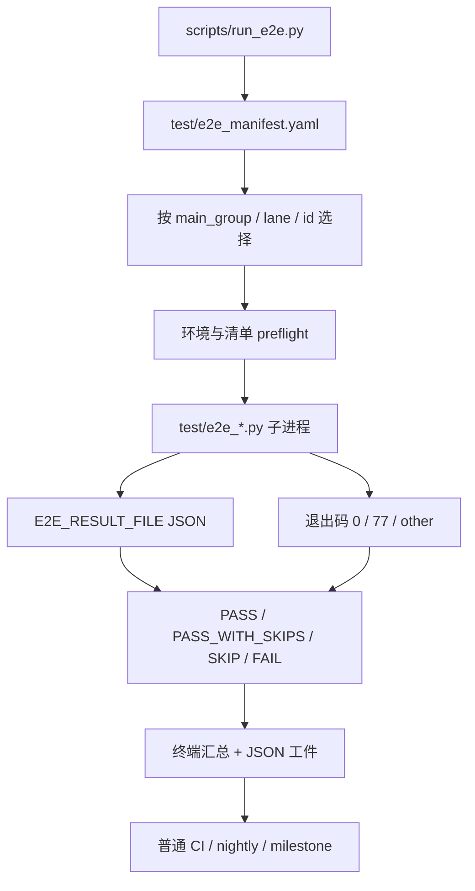

# M-A 可信尺子设计：E2E 结果真实性与验收基线

> 日期：2026-07-28
> 状态：已获用户书面认可，进入实施计划与开发（2026-07-28）
> 上位规格：`docs/superpowers/specs/2026-07-28-acceptance-residuals-program-design.md`
> 审计来源：`docs/reviews/2026-07-26-acceptance-review-m0a-m4.md`
> 基准提交：`77f5e93`

## 1. 结论

M-A 先修验收尺子，不改业务能力。最终只有一个目录执行器
`scripts/run_e2e.py` 和一份清单 `test/e2e_manifest.yaml`。现有
`scripts/run_e2e.ps1` 与 `scripts/run_e2e.sh` 保留为 thin wrapper，只能原样转发
参数和退出码，不能再持有脚本数组、结果解释或平台分支。所有 `test/e2e_*.py`
都由同一清单登记并接受同一套结果协议：

- 子进程退出码 `0` 表示已执行的断言没有失败；
- 子进程退出码 `77` 表示整个脚本未执行；
- 其他退出码均表示失败；
- 退出码为 `0` 但仅执行了部分覆盖时，必须显示为
  `PASS_WITH_SKIPS`，不得显示为 `PASS`。

清单使用五个、且仅五个主分组：

1. `default`
2. `security`
3. `provider_probe`
4. `acoustic_probe`
5. `manual_inspection`

每个 E2E 脚本恰好属于一个主分组，可以另带 `ci`、`nightly`、
`milestone` 等 lane 标签。`nightly` 是筛选标签，不是第六个主分组；
`full` 表示所选范围内无过滤的完整执行，不是分组。

M-A 同时补上四类此前会产生假绿的证据：

- `e2e-*` 测试数据的运行级隔离与精确清理；
- 声纹 A/B 双向隔离、双 `accept` 识别和 `ForgetUser`；
- GDPR 删除的非平凡前置与对照用户；
- 动态 manifest 词汇源加 AST 源码守卫。

旅程报告增加可复算 metadata 和 digest。只有 provider 锁定、无过滤、
语料全集被选择且相关 tracked inputs 干净的 full run 才能写 canonical。
普通 CI 对结构、结果协议和源码红线硬门禁，对 canonical 陈旧只告警；
里程碑收官把同一陈旧判定升级为阻断。

## 2. 问题与真实起点

基准提交下存在以下结构缺口：

- PowerShell 和 shell runner 分别维护脚本数组，清单会漂移；
- 当前 PowerShell runner 只认识 `0=PASS`、非零 `FAIL`；
- 声纹、视觉、S2S 等脚本把环境缺失用退出码 `0` 表达，汇总会显示绿色
  `PASS`；
- 当前 35 个 `test/e2e_*.py` 中有脚本没有进入任何 runner，包括
  `e2e_auth.py`、`e2e_mtls.py` 等安全面；
- `e2e_voiceprint.py` 只有单向记忆隔离，B 识别回落 `primary` 仍可通过，
  且没有 `ForgetUser` 场景；
- `e2e_memory_graph.py` 没有先证明删除目标确实有数据，空表也能让 GDPR
  断言成立；
- Verifier、Proactive Governor、S2S session 的源码红线依赖固定黑名单，
  新增 Agent、intent 或主动消息类型时不会自动扩大保护范围；
- journeys 报告分母排除了 skip，覆盖下降不可见；
- `--force-report` 允许局部运行覆盖 canonical；
- canonical 没有足以判断“对应哪份代码和语料”的完整 metadata 与 digest。

M-A 不把历史绿色输出当作新基线。实施后必须用新 runner 重新生成结果。

### 2.1 历史已修与误判更正

总体验收报告发布后的代码复核已经确认三项不应重复实现：

- Skill `few_shots` 已由 `orchestrator/cloud/skills.py` 解析并渲染进注入块，
  `orchestrator/cloud/tests/test_skills.py` 已有消费方契约；
- `PLANNER_TOOLCALL` 在 `orchestrator/cloud/planning.py` 的每次 `build()` 调用中读取，
  热切换不要求重建 builder；
- cloud-gateway 首次调用 planner 返回 `UNAVAILABLE` 时，重试仍发生在
  `gateway/cloud/main.go` 同一次 `Handle` 入口内，没有重新穿过外层幂等闸。

M-A 对这三项只做当前源码和定向测试复核，并把
`docs/reviews/2026-07-26-acceptance-review-m0a-m4.md` 对应条目标为“历史已修”或
“误判更正”。不得为了制造改动量重写业务实现。若实施时证据不再成立，应按新回归判红并报告，
不能沿用本规格的历史结论强行改绿。

三项的报告定位不得混写：`few_shots` 是报告 §7 的 P2-06 主卡，状态为“历史已修”；
`PLANNER_TOOLCALL` 须重启和 cloud-gateway 重试绕过幂等是报告其他段落的判断，状态为“误判
更正”，不新增、合并或占用 §7 的 13 张主卡。

## 3. 目标

1. 建立一个跨 Windows、Linux 使用相同代码路径的 E2E 执行入口。
2. 让未执行、部分执行和完整通过在机器与人类输出中均可区分。
3. 让任何新增或遗漏的 `test/e2e_*.py` 都在 CI 自动变红。
4. 让测试写入的持久数据只属于本次 `e2e-*` 命名空间，失败后也能精确清理。
5. 让声纹验收真正证明“识别正确、双向隔离、删除正确”。
6. 让 GDPR 用例先建立非零敏感数据，再证明目标被删且对照用户不受影响。
7. 让领域字面量红线随 manifest 和生产方自动增长，不再人工维护漏项黑名单。
8. 让 journeys canonical 可追溯、可复算、不可被局部运行覆盖。
9. 把普通 CI 与里程碑验收的 stale 策略明确区分。

## 4. 非目标

- 不在 M-A 修 Turn 说话人、places、reminder、routine 或 Edge 快路径的
  occupant 归属；这些属于 M-B。
- 不改声纹阈值、margin、模板算法或真人声学模型。
- 不把假麦克风或合成音频结果宣称为真人识别率。
- 不新增 proto、数据库表或业务数据迁移。
- 不修改根 `.env`、密钥、token 或 CI secret。
- 不把真实 provider、真麦克风和人工巡检强塞进普通 PR CI。
- 不把 `manual_inspection` 的人工观察结果伪装成自动化断言。
- 不用总 E2E 脚本数、通过率或“无报错”替代逐项断言。
- 不在本规格固定 35 这个历史数量；清单完整性由动态发现保证。

## 5. 总体结构



边界原则：

- `test/e2e_manifest.yaml` 是“有哪些 E2E、如何分类、允许什么环境缺口”的唯一
  真相源。
- `runtime/privacy_registry.py` 是生产 privacy adapter/target 的唯一注册表；manifest 的
  `privacy.targets` 只是验收视图，`--check` 必须逐字段校验两者同步。生产服务不得读取
  `test/e2e_manifest.yaml` 或依赖 `test/` 包；里程碑筛选统一调用
  `targets_for_milestone("M-A"|"M-B"|"M-C"|"M-D")`，不做字符串大小比较。
- `scripts/run_e2e.py` 是“怎样选择、执行、归一结果、汇总退出”的唯一实现。
- 每个 E2E 脚本仍拥有自己的业务断言，但不得自行把 skip 打成 pass。
- Makefile、CI 可以直接调用 Python runner；人工兼容命令可以经过 PS/sh thin wrapper。
  三个入口最终都进入同一 Python 实现，wrapper 不得维护第二份脚本数组。

## 6. `test/e2e_manifest.yaml` 契约

### 6.1 顶层结构

```yaml
schema_version: 1

groups:
  default:
    automated: true
  security:
    automated: true
  provider_probe:
    automated: true
  acoustic_probe:
    automated: true
  manual_inspection:
    automated: false

lanes:
  ci:
    stale_policy: warn
  nightly:
    stale_policy: warn
  milestone:
    stale_policy: error

non_secret_config_keys:
  - LLM_PROVIDER
  - LLM_MODEL_PRIMARY
  - MINIMAX_LLM_MODEL
  - QWEN_MODEL_PRIMARY
  - PLANNER_TOOLCALL
  - SKILLS_MODE
  - REQUIRE_REAL_PROVIDERS
  - MEMORY_WEIGHTING
  - S2S_PROVIDER
  - S2S_MODEL
  - VISION_PROVIDER
  - VOICEPRINT_PROVIDER

privacy:
  owner_columns: [user_id, occupant_id]
  personal_content_columns: [user_text, speech, prompt_tail, content_head, msg, attrs, note, error]
  sql_sources: ["**/*.sql", "**/migrations/**/*.py", "**/pg_store.py", "**/db.py", "**/store.py"]
  registry_symbol: PERSONAL_DATA_TARGETS
  targets:
    - id: memory_item
      backend: postgres
      adapter_key: memory
      lifecycle: deletable
      enforced_from: M-A
      owner_fields: [user_id, occupant_id]
      seed_case: gdpr_ma_memory_item_seed
      count_probe: gdpr_ma_memory_item_count
      read_probe: gdpr_ma_memory_item_read
      delete_action: forget_user
      verify_case: gdpr_ma_memory_item_verify
    - id: memory_relation
      backend: postgres
      adapter_key: memory
      lifecycle: deletable
      enforced_from: M-A
      owner_fields: [user_id, occupant_id]
      seed_case: gdpr_ma_memory_relation_seed
      count_probe: gdpr_ma_memory_relation_count
      read_probe: gdpr_ma_memory_relation_read
      delete_action: forget_user
      verify_case: gdpr_ma_memory_relation_verify
    - id: voiceprint
      backend: postgres
      adapter_key: memory
      lifecycle: deletable
      enforced_from: M-A
      owner_fields: [user_id, occupant_id]
      seed_case: gdpr_ma_voiceprint_seed
      count_probe: gdpr_ma_voiceprint_count
      read_probe: gdpr_ma_voiceprint_read
      delete_action: forget_user
      verify_case: gdpr_ma_voiceprint_verify
    - id: profile_identity
      backend: redis_or_memory
      adapter_key: memory
      lifecycle: deletable
      enforced_from: M-A
      owner_fields: [user_id, occupant_id]
      seed_case: gdpr_ma_profile_identity_seed
      count_probe: gdpr_ma_profile_identity_count
      read_probe: gdpr_ma_profile_identity_read
      delete_action: forget_user
      verify_case: gdpr_ma_profile_identity_verify
    - id: session_history
      backend: redis_or_memory
      adapter_key: memory
      lifecycle: deletable
      enforced_from: M-A
      owner_fields: [user_id, occupant_id]
      seed_case: gdpr_ma_session_history_seed
      count_probe: gdpr_ma_session_history_count
      read_probe: gdpr_ma_session_history_read
      delete_action: forget_user
      verify_case: gdpr_ma_session_history_verify
    - id: observability_raw_content
      backend: sqlite
      adapter_key: observability
      storage_variants: [turns, spans, llm_calls, logs]
      lifecycle: retained_audit
      enforced_from: M-B
      owner_fields: [user_id, occupant_id]
      seed_case: gdpr_mb_observability_seed
      count_probe: gdpr_mb_observability_count
      read_probe: gdpr_mb_observability_read
      retention_reason: diagnostic_metrics_without_raw_owner_content
      retain_or_redact_action: observability_redact_owner
      verify_case: gdpr_mb_observability_verify

canonical_inputs:
  - compose.yaml
  - go.mod
  - go.sum
  - deploy/**
  - scripts/**
  - test/e2e_manifest.yaml
  - test/**/*.py
  - test/fixtures/**
  - test/journeys/**/*.yaml
  - agents/**
  - orchestrator/**
  - gateway/**
  - llm-gateway/**
  - memory/**
  - proactive/**
  - registry/**
  - runtime/**
  - observability/**
  - security/**
  - skills/**
  - models/**
  - payment-gateway/**
  - proto/**
  - hmi/**

tests:
  - id: e2e_voiceprint
    path: test/e2e_voiceprint.py
    command: [python, test/e2e_voiceprint.py]
    main_group: default
    lanes: [nightly, milestone]
    timeout_s: 300
    skip_policy:
      mode: forbid
      reasons: []
    isolation:
      persistent_data: true
      signed_identity: true
      memory_sessions: 4
```

示例只定义 schema 形态，不代替实施时对全部脚本逐一归类。最终 manifest 必须逐项冻结
每个脚本的 lane、timeout、profile、skip policy、`signed_identity`、`persistent_data`、
`memory_sessions` 和 nightly child args；不能把这些决定留给 runner 现场推断。

### 6.2 五个主分组

| 主分组 | 含义 | 典型成员 | 结果用途 |
|---|---|---|---|
| `default` | 有机器断言、使用标准根 Compose 配置、不要求特殊安全 profile 或真人硬件 | WebSocket、memory、ledger、proactive、journeys、声纹隔离 | 默认本地与里程碑主验收 |
| `security` | 需要 auth、mTLS 等替代启动 profile | `e2e_auth.py`、`e2e_mtls.py` | 安全 profile 专项 |
| `provider_probe` | 直接验证真实外部 provider、模型或凭证 | real providers、planner toolcall、S2S provider probe、vision provider probe | 凭证环境专项 |
| `acoustic_probe` | 依赖真实音频设备、真人声学样本或声学测量 | voiceprint acoustic probe | 真麦专项，不代替功能断言 |
| `manual_inspection` | 主要输出 trace、链路或视觉工件供人工判断 | observability 深巡检脚本 | 人工巡检证据，不计自动通过率 |

归类规则：

- 每个 `test/e2e_*.py` 必须且只能出现一次，且只有一个 `main_group`。
- 一个脚本可以有多个 lane 标签，但 lane 不改变它的主分组。
- `nightly` 只允许出现在 `lanes` 中。
- `full` 不允许出现在 `groups` 或测试的 `main_group` 中。
- `command` 必须是参数数组，不接受 shell 字符串，避免平台转义差异。
- `path` 必须位于仓库 `test/` 下，解析后不得越出仓库。
- pytest 形态的 E2E 也必须登记，例如 command 可以是
  `[python, -m, pytest, test/e2e_real_providers.py, -q, -s]`。
- manifest 只记录环境变量名和能力要求，不记录 secret 值。

### 6.3 动态清单完整性

`scripts/run_e2e.py --check` 必须动态扫描 `test/e2e_*.py` 并验证：

1. 扫描结果与 manifest 的 `path` 集合完全相等；
2. `id`、`path` 均不重复；
3. 每项恰有一个合法 `main_group`；
4. 所有 lane、skip reason 和 command 形态合法；
5. manifest 中不存在已经删除或改名的脚本；
6. 五个主分组名称逐字匹配本规格，不允许临时增加第六组；
7. `nightly` 和 `full` 没有被误写成主分组；
8. 动态发现的个人数据目标全部登记在 `privacy.targets`，且没有指向已删除存储的陈旧项；
9. 每个 privacy target 的 id 唯一，且 lifecycle 只能是
   `deletable|retained_audit|external_reference`；所有 target 都有 owner 字段、count/read
   probe 和 verify case；`deletable` 还必须有可解析的 `seed_case` 与 `delete_action`，
   其余两类必须有 `retention_reason` 与明确的 retain/redact action；
10. `non_secret_config_keys` 不包含名称匹配 `KEY`、`TOKEN`、`SECRET`、`PASSWORD`
    或 manifest secret registry 的变量。

协议 helper 固定放在不命中 inventory glob 的 `test/support/e2e.py`；不得把 helper 放到
`test/e2e_*.py` 后再新增 exclusion。inventory 的真值集合没有例外。

任一失败都属于清单协议失败，普通 CI 必须硬阻断。

## 7. `scripts/run_e2e.py` CLI 契约

### 7.1 选择参数

```text
python scripts/run_e2e.py --check
python scripts/run_e2e.py --group default
python scripts/run_e2e.py --lane nightly --full
python scripts/run_e2e.py --id e2e_voiceprint
python scripts/run_e2e.py --group security --profile mtls
python scripts/run_e2e.py --milestone M-A --lane milestone --full --canonical \
  --provider minimax --model MiniMax-M3
```

语义：

- 不带选择参数时等价于 `--group default --full`。
- `--group` 按唯一主分组筛选。
- runner 的 `--lane` 按 manifest lane 标签筛选，可以跨主分组；例如
  `--lane milestone` 只选择标记为里程碑必跑的脚本。
- `--id` 是局部运行，永远不是 full。
- `--full` 表示把当前 group/lane 选择范围内的全部登记脚本跑完；它不表示
  “忽略环境要求”，也不是主分组。
- `--profile` 只选择 manifest 已声明兼容的运行 profile。
- `--milestone M-A|M-B|M-C|M-D` 决定 privacy `enforced_from`、当期必做 case 与报告标签；
  milestone lane 必须显式提供，普通 CI/nightly 不得假冒某个里程碑。
- `--canonical` 只影响 journeys canonical 写入资格，不改变选集。
- `--provider` 传给需要 provider lock 的脚本；manifest 不保存凭证。
- `--model` 与 `--provider` 共同锁定 canonical 的实际大脑；省略 model 时不能写 canonical。
- 选择结果为空时退出 `2`，不得显示空集通过。

runner lane 与 journeys 语料过滤是两个命名空间。`test/e2e_journeys.py` 自身现有的
`--lane mock|live` 是 journey corpus filter，只能出现在该测试的 child args 中；runner
不得把自己的 `--lane milestone` 原样转发成 child `--lane milestone`。下文所说 canonical
“无 lane 过滤”，专指 journeys 子脚本没有 `mock|live` corpus filter，不禁止 runner 使用
`--lane milestone` 选择里程碑脚本。

### 7.2 执行行为

runner 对每个子脚本：

1. 生成唯一 run/test namespace；
2. 创建独立结果文件和工件目录；
3. 注入标准环境变量；
4. 按 manifest command 启动子进程；
5. 到达 `timeout_s` 后终止该子进程树并记 `FAIL(timeout)`；
6. 同时读取退出码和结构化结果文件；
7. 校验两者一致性；
8. 即使前项失败，也继续执行其余已选脚本；
9. 最后统一输出人类汇总和 JSON 汇总。

runner 不解释脚本打印文本中的“PASS”或“SKIP”。终端文本只供阅读，结构化结果和
退出码才是协议。

### 7.3 标准环境变量

| 变量 | 含义 |
|---|---|
| `E2E_RUN_ID` | 本次 runner 唯一 ID，格式以 `e2e-` 开头 |
| `E2E_TEST_ID` | manifest 中的测试 ID |
| `E2E_USER_ID` | 当前脚本独占用户，格式 `e2e-<run>-<test>` |
| `E2E_SESSION_PREFIX` | 当前脚本所有 session 的强制前缀 |
| `E2E_RESULT_FILE` | 子脚本必须原子写入的 JSON 路径 |
| `E2E_ARTIFACT_DIR` | 当前脚本独占工件目录 |
| `E2E_LANE` | 当前选择的 lane；无 lane 时为空 |
| `E2E_PROFILE` | 当前运行 profile |
| `E2E_IDENTITY_TOKEN` | runner 为当前 `E2E_USER_ID` 预签的短期 WS token；不得写日志、结果或工件 |
| `E2E_CONTROL_USER_ID` | 仅需要 WS 对照用户的脚本使用；格式仍在本 run namespace |
| `E2E_CONTROL_IDENTITY_TOKEN` | runner 为对照用户预签的短期 WS token；child 永远拿不到签名 secret |
| `E2E_MEMORY_SESSION_IDS` | runner 为 manifest 声明的抽取会话预签的 JSON 数组；child 不得自行扩容 |
| `E2E_STACK_LEASE_ID` | 当前共享栈 lease 的不透明 ID；只用于并发协调 |
| `E2E_STACK_LEASE_ROLE` | `owner` 或 `child`；child 检测到 secret 或重建企图必须失败 |

子脚本需要多个用户、occupant 或 session 时，只能在这些值后追加稳定后缀，例如
`-control`、`-a`、`-b`，不能换成 `u1` 或历史用户。

### 7.4 Profile epoch

单个 `--profile auth|mtls|real` 是局部筛选；`--milestone ... --lane milestone --full` 则必须
按 manifest 自动串行运行 `root/real`、`auth`、`mtls` epoch，不能因为 profile 不同漏掉
security case，也不能同时让两个 runner 重建共享栈：

- `root/real` 使用根 Compose 默认服务形态；real 仍逐 entry 做 provider/credential preflight；
- `auth` 临时设置 `AUTH_REQUIRED=true`、`PERMISSIONS_FAIL_OPEN=false`，生成本 run 的普通
  auth token 与 channel token；普通 token 必须映射到 synthetic user，不复用 `u1`；
- `mtls` 先通过 `scripts/gen-certs.ps1` 生成 gitignored 证书，再临时设置 `GRPC_TLS=on`
  重建全 mesh；其 WebSocket 请求仍使用签名 synthetic identity；
- epoch secret 只存在进程环境和 ACL 受限临时文件；不得出现在命令回显、结果或工件；
- auth/mTLS 或 child 失败后仍必须恢复无临时环境的根 Compose 默认栈；恢复失败覆盖原结果。

identity stack lease 是 profile coordinator 的唯一 owner。milestone 不允许通过手工预先切栈来
绕过 profile 记录，也不把 profile unavailable 变成 skip。

## 8. 子脚本结果协议

### 8.1 结果文件

每个脚本必须向 `E2E_RESULT_FILE` 原子写入：

```json
{
  "schema_version": 1,
  "test_id": "e2e_voiceprint",
  "run_id": "e2e-20260728-...",
  "status": "pass_with_skips",
  "counts": {
    "selected": 12,
    "executed": 10,
    "passed": 10,
    "failed": 0,
    "skipped": 2
  },
  "skip_reasons": [
    {
      "case_id": "vp-real-mic",
      "code": "hardware_unavailable",
      "detail": "未连接真麦克风"
    }
  ],
  "artifacts": []
}
```

`status` 只允许：

- `pass`
- `pass_with_skips`
- `skip`
- `fail`

`detail` 不得包含 token、密钥、完整音频内容或用户数据。

### 8.2 退出码与状态映射

| 子脚本退出码 | 结果文件条件 | runner 显示 | 含义 |
|---:|---|---|---|
| `0` | `executed>0`、`failed=0`、`skipped=0`、status=`pass` | `PASS` | 完整执行且全过 |
| `0` | `executed>0`、`failed=0`、`skipped>0`、status=`pass_with_skips` | `PASS_WITH_SKIPS` | 已执行部分全过，但覆盖不完整 |
| `77` | `executed=0`、`skipped>=1`、status=`skip` | `SKIP` | 整个脚本未执行 |
| 其他 | 无论结果文件声明什么状态 | `FAIL` | 断言、异常、超时或协议失败；结果文件只用于补充失败诊断 |

以下组合一律升级为 `FAIL(result_protocol)`：

- 退出 `0` 但结果文件缺失、损坏或 test/run ID 不匹配；
- 退出 `0` 但 `executed=0`；
- 退出 `0` 但 `failed>0`；
- 退出 `0` 时 status/counts 不精确匹配 `PASS` 或 `PASS_WITH_SKIPS` 两个合法组合之一；
- 退出 `77` 时结果文件缺失/损坏、`executed>0`、`skipped=0` 或 status 不是 `skip`；
- 退出非零且非 `77`，却声明 `pass`、`pass_with_skips` 或 `skip`；
- counts 不能满足
  `selected = executed + skipped`、`executed = passed + failed`；
- skip reason 没有稳定 code；
- 脚本在 cleanup 失败后仍声明通过。

`PASS_WITH_SKIPS` 只有一条合法编码：子进程退出 `0`，`executed>0`、`failed=0`、
`skipped>0` 且 status 精确为 `pass_with_skips`。它是非通过态的部分覆盖结果，不得计入
`PASS` 数或通过率分子。

### 8.3 skip 策略

skip 必须来自 manifest 声明的稳定原因，例如：

- `credential_unavailable`
- `profile_unavailable`
- `provider_unavailable`
- `hardware_unavailable`
- `data_unavailable`

禁止使用“异常”“失败了”“暂时不跑”作为 skip reason。业务断言失败、provider 返回错误、
识别结果错误、超时和清理失败都必须是 `FAIL`。

分组默认策略：

- `default`：skip 禁止；选入该 lane 后出现 `SKIP` 或
  `PASS_WITH_SKIPS` 即让 runner 失败。
- `security`：只有未选对应 profile 时可以不入选；已选并完成 preflight 后不允许 skip。
- `provider_probe`：允许 manifest 声明的凭证或 provider 不可用 skip，但必须明确显示，
  不计入 pass。
- `acoustic_probe`：允许硬件不可用 skip，不计入 pass。
- `manual_inspection`：可以完成自动采集后进入 `PASS_WITH_SKIPS`，但必须列出仍需人工判断的
  项目，且不进入自动通过率。
- `milestone` lane：无论主分组为何，`SKIP` 和 `PASS_WITH_SKIPS` 均阻断。

### 8.4 runner 自身退出码

| runner 退出码 | 含义 |
|---:|---|
| `0` | 所选脚本均满足当前 lane 的结果与 stale 策略 |
| `1` | 至少一个脚本失败，或出现当前 lane 不允许的 skip/部分覆盖 |
| `2` | manifest、选择、preflight 或结果协议错误 |
| `3` | `stale_policy=error` 下 canonical 陈旧或不合法 |

## 9. `e2e-*` 数据隔离契约

### 9.1 命名

所有 E2E 创建的持久身份和业务键都必须以本次 `E2E_RUN_ID` 派生：

- `user_id`：`e2e-<run>-<test>[-a|-b|-control]`
- `session_id`：`e2e-<run>-<test>-session-<n>`
- `trace_id`、task id、reminder id、ledger idempotency key 和 MCP operation key：
  包含同一 run/test namespace
- display name、记忆 sentinel 和关系实体：包含短 run suffix，避免与历史行混淆

测试不得继续借用 `u1`、真实用户、上一轮最新一行或“表里任意一条记录”作为删除目标。
安全 profile 必须把测试 token 映射到本次 synthetic user，不能为了走鉴权而回用默认用户。

Edge Gateway 的匿名回退身份恒为 `AUTH_DEFAULT_USER_ID`，而 S2S E2E 又直接连接
llm-gateway；两者都不能靠客户端裸传 `user_id` 承载按 run 动态生成的 synthetic user。M-A
因此增加一个**默认关闭、只接受签名测试身份**的入口，而不是信任客户端上传 owner：

- `E2E_IDENTITY_ENABLED` 缺省 `false`；关闭时测试 token 与普通未知 token完全等价；
- `E2E_IDENTITY_SECRET` 是 32 字节随机值，只由本次 identity stack lease owner 与 Gateway
  进程持有，不交给 child，不写根 `.env`、代码、日志或 artifact；
- payload 是 UTF-8 canonical JSON（键排序、无多余空白），只含 `run_id`、`user_id`、
  `vehicle_id`、`scopes`、`iat` 和 `exp`；签名输入是 ASCII
  `e2e.v1.<payload_base64url>`，签名为 HMAC-SHA256 的无 padding base64url，最终 token 固定为
  `e2e.v1.<payload_base64url>.<signature_base64url>`；
- Edge Gateway 与 llm-gateway 共享测试向量并使用常量时间校验 HMAC，拒绝过期、非
  `e2e-*` user、超长有效期和畸形 token；
  gate 开启且 token 以 `e2e.v1.` 开头时，任一验证失败必须在 WebSocket upgrade 前返回
  `401`，不得落回 anonymous/`AUTH_DEFAULT_USER_ID`；
- manifest 允许的 child `timeout_s` 上限固定为 1800 秒，签名宽限固定为 120 秒，因此 token
  最大 TTL 固定为 1920 秒；runner 必须在每个 child 真正启动前即时签发
  `iat=now, exp=iat+timeout_s+120`，不得在排队/选集阶段提前签发，也不得用 `min()` 截掉宽限；
- verifier 固定检查 `iat<=now+5s`、`now<exp`、`0<exp-iat<=1920`；仅允许 `iat` 因秒级取整最多领先
  verifier 墙钟 5 秒，超过即拒绝。最大 TTL 必须由签名内的 `exp-iat` 判断，不能用
  `exp-now`，否则超长 token 等到剩余 1920 秒后会被错误接受；
- Edge Gateway 与 llm-gateway 的边界向量必须证明 `exp-iat=1920` 可接受、1921 被拒，
  `issued_at+timeout_s+119` 仍有效、`now==exp` 已过期；fake clock 不依赖墙钟等待；
- runner 只把当前 user 的 `E2E_IDENTITY_TOKEN` 交给 child；需要对照用户经 WS 时另行预签并
  注入 `E2E_CONTROL_USER_ID/E2E_CONTROL_IDENTITY_TOKEN`，child 永远拿不到 secret；
- Edge WebSocket 在 upgrade 时验签；`/api/s2s` 在 `session.start` 创建会话前验签，并以
  token user 覆盖客户端 `user_id`。gate 开启时只有裸 `user_id` 不构成测试身份；
- runner 通过根 `compose.yaml` 把随机 secret 注入 Edge Gateway 与 llm-gateway，测试结束后
  以默认环境重建两者恢复关闭态；恢复失败把整轮升级为
  `FAIL(identity_cleanup)`，不得修改实际根 `.env`；
- 单 runner 自己是 identity stack lease owner；并发验收由外层协调进程只生成一次 secret、
  只重建一次 Gateway，两个 runner 继承同一 lease、各自签不同 run/user，只有 lease owner 在
  全部 runner 退出后恢复关闭态，避免彼此重建踢掉另一轮；
- 对外并发入口固定为
  `python scripts/run_e2e.py --milestone M-A --parallel-isolation 2 --id e2e_memory --id e2e_voiceprint`；
  内部 child 参数固定为 `--lease-child`、`--lease-id`、`--token-bundle`。bundle 位于 ACL
  受限的临时目录，只含已签 token/session，不含 secret；child 无权重建或恢复服务；
- destructive setup 前，child 必须收到 Gateway 返回的 `e2e_identity_ack`，并逐字验证
  run/user/vehicle 等于预签 payload；没有 owner 自证不得执行任何写入或删除；
- 普通 `AUTH_TOKENS`、`AUTH_REQUIRED` 与匿名回退行为保持不变。

这样 synthetic identity 仍由 Gateway 裁决，客户端不能靠 meta 伪造 owner 或 scopes。

### 9.2 生命周期

每个会写持久数据的脚本必须执行：

1. setup 前查询本 namespace，断言目标表为零；
2. 只创建本 namespace 的数据；
3. 在断言中按精确 user/run/test key 查询；
4. 在 `finally` 中调用公开删除接口或测试专用精确清理；
5. cleanup 后再次断言本 namespace 的行数为零；
6. cleanup 失败把整个脚本置为 `FAIL`。

允许保留日志和脱敏报告工件，不允许保留数据库、Redis、声纹模板、提醒、Ledger、
MCP operation 或会话原文。

### 9.3 爆炸半径

- 禁止 `DELETE` 无 `WHERE`。
- 禁止按“最新一行”“全部 u1”“全部测试前缀”做跨运行清理。
- 禁止清空共享 Redis DB、重建整个数据库或删除非本 run 的容器卷。
- GDPR 用例删除的是本 run 的目标用户；对照用户必须保留到断言完成，再单独清理。
- 并发运行两个 runner 时，任一 runner 都不能读、改、删另一 run 的数据。

显式测试记忆抽取的脚本仍使用 `e2e-*` namespace。抽取开关必须由测试能力声明控制，
不能再用“看见 e2e 前缀就一律不抽取”的隐含规则使验收静默失效。

### 9.4 声明式抽取能力

`AppendTurnRequest` 不增加客户端可伪造的测试布尔字段。identity stack lease owner 另生成
32 字节 `E2E_CAPABILITY_SECRET`，只注入 Memory 进程；runner 为 manifest 声明的
`memory_sessions` 逐个预签：

```text
domain = "e2emem.v1"
payload = canonical JSON(run_id,user_id,session_id,capability="memory_extraction",exp)
session_id = "e2e-mem.v1." + base64url_no_pad(payload) + "." +
             base64url_no_pad(HMAC-SHA256(secret, domain + "." + payload_part))
```

Memory 只有在默认关闭的 `E2E_CAPABILITY_ENABLED=true`、签名有效、未过期且 payload user 与
`AppendTurnRequest.user_id` 精确一致时，才允许该 synthetic session 进入真实抽取；普通
`e2e-*` session 继续跳过昂贵抽取。child 只能通过 `E2E_MEMORY_SESSION_IDS` 消费预签 session，
拿不到 secret。篡改、过期、跨 user/run 重放都保持“未获抽取能力”，不能触发抽取，也不能
扩大生产调用权限。lease owner 同时负责 Edge Gateway、llm-gateway 与 Memory 的单次重建和
最终恢复；恢复任一服务失败都升级为 cleanup failure。

## 10. 声纹真值验收

`e2e_voiceprint` 仍属于自动化功能验收；真人声学质量留在
`acoustic_probe`。功能验收必须使用两份已知不同、且与注册/识别走同一 PCM 通路的样本。

### 10.1 前置

1. 创建本 run 独占用户 U；
2. 注册乘员 A，期望 `occupant_id=primary`；
3. 注册乘员 B，期望 `occupant_id=occ-*` 且不等于 A；
4. 分别写入仅属于 A、B 的唯一 sentinel；
5. 确认 A、B 各自至少有一条记忆，且声纹模板各一条。

### 10.2 必做断言

| 断言 | 通过条件 |
|---|---|
| A 识别 | decision 必须等于 `accept`，occupant 必须精确等于 A |
| B 识别 | decision 必须等于 `accept`，occupant 必须精确等于 B |
| A 自有召回 | A 能召回 A sentinel |
| B 自有召回 | B 能召回 B sentinel |
| A→B 隔离 | A 召回不到 B sentinel |
| B→A 隔离 | B 召回不到 A sentinel |
| 乘员级 Forget | `ForgetUser(user_id=U, occupant_id=B)` 后 B 的 memory、relation、voiceprint 为零，A 保持非零 |
| 用户级 Forget | `ForgetUser(user_id=U)` 后 U 的 memory、relation、voiceprint、profile 与 session 原文均为零 |
| 不提权 | A、B 发起同一危险动作都必须经过相同确认闸 |

`ambiguous`、`below_threshold`、`too_short` 或回落 `primary` 是产品运行期的安全降级，
但在这组“已知可识别样本”的验收里都必须判红。不能再用“没有认错别人”替代“识别成功”。

隔离必须同时验证存储查询和用户可见召回。仅查数据库不能证明消费链使用了正确 occupant；
仅看 LLM 话术又可能受采样影响。两层证据缺一不可。

`DeleteVoiceprint` 只验证模板管理，不替代 `ForgetUser` 的被遗忘权验收。

## 11. GDPR 非平凡删除

### 11.1 测试数据

创建目标用户 T 和对照用户 C，二者都属于本 run。M-A 尚未有跨服务隐私编排器时，
`ForgetUser(T)` 只作为 memory-domain bootstrap 删除动作；从 M-B 上线起，所有里程碑与程序
最终验收必须改用 `POST /api/privacy/delete` 的 `level=user_all`，不得继续用旧 RPC 冒充全域
删除。执行当期声明的 user-all 删除动作前必须证明：

- 遍历本次 manifest 中所有 `lifecycle=deletable` 且 `enforced_from` 不晚于当前里程碑的 target，
  分别执行其 `seed_case`；
- 每个 deletable target 对 T 的 `count_probe > 0`，且 `read_probe` 能读到本 target 的唯一 sentinel；
- 每个 deletable target 对 C 也建立非零记录和不同 sentinel；
- M-A 初始 inventory 至少包含非零的 `memory_item`、`memory_relation`、`voiceprint`、
  profile/`identity.name` 和会话原文/session 索引；
- M-B、M-C、M-D 新增的 places、reminders、routine、delivery、Ledger、report、operation 等
  target 必须在对应里程碑按其冻结的 lifecycle 进入遍历；`deletable` 做非零删除证明，
  `retained_audit/external_reference` 做规定的 retain/redact/外部处置证明，不能只保留 M-A
  的五项固定断言。

任一 deletable target 的 T 或 C 前置未建立，整组测试必须 `FAIL(precondition)`，不能跳过该
target，也不能执行删除后拿零值通过。

### 11.2 删除后断言

当期 user-all 删除动作成功后：

- 每个 deletable target 对 T 的 `count_probe == 0`，`read_probe` 不再返回 T 的 sentinel；
- M-A 初始 inventory 中 T 的 memory、relation、voiceprint、profile、session 全部为零，且
  Recall、QueryRelations、ExportUser 和 context 读取均不能再返回已删数据；
- 每个 deletable target 对 C 的删除前后计数与 sentinel 保持一致；
- 第二次调用同一 user-all 删除动作幂等成功，仍为零，不影响 C；
- cleanup 最后再删除 C，并证明本 run 无残留。

计数必须按精确 `user_id` 查询，不允许 `ORDER BY created_at DESC LIMIT 1` 推断目标。
删除条数只是辅助信息，最终以所有消费面不可读和持久层归零共同判定。

### 11.3 个人数据目标 inventory

`test/e2e_manifest.yaml::privacy.targets` 是隐私删除契约的目标清单。每项都必须声明
`lifecycle=deletable|retained_audit|external_reference`、`enforced_from=M-A|M-B|M-C|M-D`、
`adapter_key`、owner 字段、count/read probe 和 verify case。`enforced_from` 只决定哪一个里程碑开始执行该
target 的 seed/delete/retain 验收，**不延后分类义务**：M-A 动态发现的 reminder、scene、
Ledger 等现存 owner 存储必须立即如实分类，不能因为适配器在后续里程碑才实现而漏登记或假标
retained。字段要求按分类固定：

| lifecycle | 必需额外字段 | 验收含义 |
|---|---|---|
| `deletable` | `seed_case`、`delete_action` | 从 `enforced_from` 起每个里程碑 seed 为非零，并验证删除后持久层归零、消费面不可读 |
| `retained_audit` | `retention_reason`、`retain_or_redact_action` | 验证只保留获准审计字段，owner 内容按声明脱敏，不伪装成物理删除 |
| `external_reference` | `retention_reason`、`retain_or_redact_action` | 验证本系统删除 owner 映射/缓存，并明确外部商户数据的用户可见处置口径 |

只有 `deletable` 属于本节“删除前必须全部 seed”的集合；另两类不能悄悄漏掉，必须有明确保留/
脱敏理由和验证动作，也不能被默认分类用来逃避删除测试。

基准代码中已经存在的目标必须在 M-A 一次性登记如下；下列 case/action id 是跨里程碑稳定
标识，不在实施时重新命名：

| target | adapter | lifecycle / enforced | seed | count | read | action | verify |
|---|---|---|---|---|---|---|---|
| `memory_item` | memory | deletable / M-A | `gdpr_ma_memory_item_seed` | `gdpr_ma_memory_item_count` | `gdpr_ma_memory_item_read` | `forget_user` | `gdpr_ma_memory_item_verify` |
| `memory_relation` | memory | deletable / M-A | `gdpr_ma_memory_relation_seed` | `gdpr_ma_memory_relation_count` | `gdpr_ma_memory_relation_read` | `forget_user` | `gdpr_ma_memory_relation_verify` |
| `voiceprint` | memory | deletable / M-A | `gdpr_ma_voiceprint_seed` | `gdpr_ma_voiceprint_count` | `gdpr_ma_voiceprint_read` | `forget_user` | `gdpr_ma_voiceprint_verify` |
| `profile_identity` | memory | deletable / M-A | `gdpr_ma_profile_identity_seed` | `gdpr_ma_profile_identity_count` | `gdpr_ma_profile_identity_read` | `forget_user` | `gdpr_ma_profile_identity_verify` |
| `session_history` | memory | deletable / M-A | `gdpr_ma_session_history_seed` | `gdpr_ma_session_history_count` | `gdpr_ma_session_history_read` | `forget_user` | `gdpr_ma_session_history_verify` |
| `profile_places` | memory | deletable / M-B | `gdpr_mb_profile_places_seed` | `gdpr_mb_profile_places_count` | `gdpr_mb_profile_places_read` | `privacy_user_all` | `gdpr_mb_profile_places_verify` |
| `reminder_item` | reminder | deletable / M-B | `gdpr_mb_reminder_item_seed` | `gdpr_mb_reminder_item_count` | `gdpr_mb_reminder_item_read` | `privacy_user_all` | `gdpr_mb_reminder_item_verify` |
| `reminder_shared_state` | reminder | deletable / M-B | `gdpr_mb_reminder_state_seed` | `gdpr_mb_reminder_state_count` | `gdpr_mb_reminder_state_read` | `privacy_user_all` | `gdpr_mb_reminder_state_verify` |
| `scene_item` | scene | deletable / M-B | `gdpr_mb_scene_item_seed` | `gdpr_mb_scene_item_count` | `gdpr_mb_scene_item_read` | `privacy_user_all` | `gdpr_mb_scene_item_verify` |
| `observability_raw_content` | observability | retained_audit / M-B | `gdpr_mb_observability_seed` | `gdpr_mb_observability_count` | `gdpr_mb_observability_read` | `observability_redact_owner` | `gdpr_mb_observability_verify` |
| `task_ledger` | ledger | deletable / M-C | `gdpr_mc_task_ledger_seed` | `gdpr_mc_task_ledger_count` | `gdpr_mc_task_ledger_read` | `privacy_user_all` | `gdpr_mc_task_ledger_verify` |
| `proactive_process_queue` | proactive | deletable / M-C | `gdpr_mc_proactive_queue_seed` | `gdpr_mc_proactive_queue_count` | `gdpr_mc_proactive_queue_read` | `privacy_user_all` | `gdpr_mc_proactive_queue_verify` |
| `payment_order` | payment | retained_audit / M-D | `gdpr_md_payment_order_seed` | `gdpr_md_payment_order_count` | `gdpr_md_payment_order_read` | `payment_redact_owner` | `gdpr_md_payment_order_verify` |
| `planner_pending_session` | cloud_session | deletable / M-D | `gdpr_md_planner_pending_seed` | `gdpr_md_planner_pending_count` | `gdpr_md_planner_pending_read` | `privacy_user_all` | `gdpr_md_planner_pending_verify` |
| `merchant_draft` | mcp | deletable / M-D | `gdpr_md_merchant_draft_seed` | `gdpr_md_merchant_draft_count` | `gdpr_md_merchant_draft_read` | `privacy_user_all` | `gdpr_md_merchant_draft_verify` |
| `mcp_demo_order` | mcp | external_reference / M-D | `gdpr_md_mcp_external_seed` | `gdpr_md_mcp_external_count` | `gdpr_md_mcp_external_read` | `mcp_external_unlink` | `gdpr_md_mcp_external_verify` |

`observability_raw_content` 覆盖 SQLite 的 `turns/spans/llm_calls/logs` 四个 storage
variant，`retention_reason` 固定为 `diagnostic_metrics_without_raw_owner_content`。M-B 必须：

- 给四表补 `user_id/occupant_id` 归属并从请求上下文贯通事件；任何无法确定 owner 的事件在
  入库前清空 `user_text/speech/prompt_tail/content_head/msg/attrs/note/error`，不能以空 owner
  保存原文；
- 对升级前已存在、owner 为空的 legacy 行一次性清空上述原文字段和直接 `session_id` 引用，
  只保留时间、状态、耗时、token 数、模型、service 与随机 trace id 等不可反查 owner 的诊断字段；
- `observability_redact_owner` 对 L3/L4 原子清空目标 owner 的 `user_id/occupant_id`、直接
  `session_id` 引用和全部原文字段；只保留不能反查原 owner 的聚合诊断字段与随机 trace 关联。
  `badcase=1` 只豁免普通保留期清理，不得豁免用户删除/脱敏；count/planned/redacted 统一按
  “四表中至少一个原文字段或 owner 引用非空的行数”计，不按字段数重复计数；每个脱敏行同时
  计入 redacted 与 retained 并携固定 reason，明示“行保留、owner 映射与原文移除”；
  seed/count/read/verify 必须覆盖四表并证明目标 owner 已不可反查、对照 owner 原文不变。

`merchant_draft` 是 2026-08-12 新增的真实商户确认快照：Redis value 不存 user/session 明文，
但仍含商品、规格、金额、公开门店坐标与上游参数，故不能因 TTL 10 分钟而排除在个人数据清单外。
它以带完整性 marker 的 owner 摘要索引、写 fence、操作租约与 privacy-only cursor SCAN 支持
`privacy_user_all` 删除：租约在飞时返回 pending，释放后重试；索引不构成删除授权，必须逐值复核
owner 并二次扫描证明清零后才 ACK。

`planner_pending_session` 覆盖 `planner:sess:*`、owner/fence 索引与 `planner:focus:*`。
挂起步的 token、卡片与 data 不重复入库，但 pending plan、已完成依赖和焦点仍属于短期个人数据；
Memory 全量 ForgetUser 成功后，本批分别经 MCP（共享 Redis 商户草稿）与 Cloud（共享 Redis
Planner 挂起/焦点）两个 responder 额外协调这两类短期状态，两个 adapter
只有在共享 Redis 可达时才响应；任一 adapter 未完成或商户操作在飞时对外只报
`pending/retryable`。它不包含 reminder/scene/observability/ledger/proactive/payment/demo 等其余
registry 目标，也不替代仍后置的全 privacy registry 跨域删除 saga。

`payment_order` 与 `mcp_demo_order` 的 seed 字段用于建立非零保留/外部引用前置，不把它们纳入
物理删除集合。前者的 `retention_reason` 固定为
`financial_audit_and_chargeback_window`，后者固定为
`external_merchant_is_system_of_record`。M-B 以后新增的 `research_report`、
`proactive_delivery`、`mcp_operation` 等存储必须在创建它们的同一变更中追加 inventory、
adapter 与稳定 case id。

需要先停手或等待外部终态的 deletable target 可以在第一次 user-all 调用返回 `pending`，但不能
计入 deleted 或让测试提前通过；验收必须驱动声明的 fence/reconcile 条件，使用同一 privacy
operation 重试，最终持久层归零。关联非终态 MCP operation 的 Ledger 按 M-D 明确返回
pending/retained，隐私删除本身不授权取消外部订单。

M-A 先登记并实测当前 `ForgetUser` memory-domain 的 memory item、relation、voiceprint、
profile/identity 和 session history，并把结果明确标为 bootstrap 范围。M-B 扩展全局 privacy
API 时，manifest 的 program-level 删除动作必须切换为 `/api/privacy/delete level=user_all`；
places、reminders、routine 以及其他 OwnerKey/owner-shared state 必须在同一变更中完成 lifecycle
分类、管理适配器与全局删除/脱敏断言。

完整性门禁同时从三类来源动态发现“待分类候选”：

- SQL、migration 和 Postgres store 中带 `user_id` 或 `occupant_id` 所有权列的表；
- SQL/SQLite 中即使没有 owner 列、但持久化
  `personal_content_columns` 任一原文列的表；这类模块还必须暴露 `PERSONAL_DATA_TARGETS`，
  明确 storage variants、owner 补齐/无 owner 脱敏策略与稳定 probe，不能因为缺 owner 而逃过发现；
- Redis、内存 KV、对象存储等非 SQL 模块暴露的 `PERSONAL_DATA_TARGETS` 常量。

发现集合中的每个候选都必须在 `privacy.targets` 有且仅有一个分类；新增个人数据表或 key
family 但未登记时，`scripts/run_e2e.py --check` 退出 `2`，普通 CI 硬阻断。删除存储但保留
陈旧登记同样失败。门禁不因为表里出现 `user_id` 就擅自决定其法律生命周期，但任何“保留”
分类都必须显式、可审计，不能成为逃避删除测试的默认值。
不能靠把列改名、把 SQL 拼成动态字符串或不声明非 SQL key family 规避 inventory；相应存储
适配层必须提供可静态读取的注册信息。

每个里程碑必须从 manifest 动态取得所有 `enforced_from` 不晚于当前里程碑且
`lifecycle=deletable` 的目标，对 T 与 C **逐项**运行 seed、count、read、delete、verify；
`retained_audit/external_reference` 同样从其 `enforced_from` 开始执行对应验证。程序最终里程碑
必须覆盖清单中的全部目标。任何已到 enforcement 里程碑的目标未建立非零前置、未执行或仅验证
存储/消费面之一，都判 `FAIL(precondition)`。

`scripts/run_e2e.py --check` 从 M-A 起就要求所有动态发现目标有且仅有一个分类、合法的
`enforced_from` 和精确的未来 case/action 标识；只对已到 enforcement 里程碑的目标要求这些
case/action 当前可执行。这样 M-A 可以先实测 memory-domain，同时 reminder/scene/Ledger 已被
清单锁定到 M-B/M-C/M-D，不会永久留在 GDPR 验收之外。

## 12. 动态 manifest + AST 源码守卫

### 12.1 要守的边界

M-A 固化三条已有架构红线：

1. Outcome Verifier 不写任何具体 Agent、intent 或领域特殊判定；
2. Proactive Governor 不写任何具体业务生产方或主动消息类型分支；
3. S2S session 层不理解车控、导航、天气、提醒等领域，只处理协议、会话和 escalate。

### 12.2 动态领域词汇

守卫每次运行时重新构建领域指纹，不维护固定业务黑名单：

- 从全部 `agents/*/manifest.yaml` 提取 agent id、capability intent、声明式业务类型；
- 从 `orchestrator/edge/knowledge/commands.yaml` 提取对象和操作的规范名；
- 用 AST 从主动消息生产方调用点提取传给统一发布接口的 `type` 常量；
- 从已登记 Skill/route manifest 提取会进入规划层的规范 intent；
- 对新增、删除或改名的 manifest 自动重算集合。

只提取结构化字段，不把整段 description 的普通中文词全部加入集合，避免守卫因自然语言
重叠而失去可用性。

### 12.3 AST 检查

守卫对 Verifier、Governor 和 S2S session 的生产源码调用 `ast.parse`，检查所有可执行
字符串节点，包括：

- `ast.Constant` 字符串；
- `ast.JoinedStr` 的静态片段；
- list、tuple、set、dict 中的字符串；
- `match` pattern、比较式和函数参数中的字符串。

注释和 docstring 不参与判定。守卫比较规范化后的完整 intent、agent id、消息 type 和
命名空间片段，不用原始源码切片或行号区间，因而代码重排、增加注释或换行不能让测试空转。

失败信息必须同时报告：

- 动态指纹值；
- 指纹来源 manifest/生产方文件；
- 命中的中央模块文件和行号；
- 所违反的边界名称。

新增一个临时 Agent manifest 和一个对应中央分支，必须在完全不修改守卫代码的情况下触发
失败。删除中央分支后守卫恢复通过。这是动态性验收，不允许用追加固定 token 通过。

协议级常量，如 `failed`、`timeout`、`escalate`、`count`，不属于领域词汇；如确有结构性
重名，以字段来源和命名空间规则消歧，不建立逐业务例外名单。

## 13. journeys metadata、digest 与 canonical

### 13.1 报告计数

journeys JSON 和 Markdown 都必须单列：

- `selected`
- `executed`
- `pass`
- `fail`
- `skip`

通过率只允许写成 `pass/selected`，旁边同时列 skip；不得再用排除 skip 的分母。回归级、
目标级、lane、suite 和 scorecard 都遵守同一口径。

### 13.2 必需 metadata

canonical JSON 至少包含：

```json
{
  "schema_version": 2,
  "runner_version": "1.0",
  "run_id": "e2e-...",
  "generated_at": "2026-07-28T00:00:00+08:00",
  "code_sha": "40-hex-sha",
  "provider": "minimax",
  "model": "MiniMax-M3",
  "provider_revision": "provider-catalog-revision",
  "capability_revision": "sha256:...",
  "capability_source": "bootstrap_static | gateway_rpc",
  "provider_lock": {
    "locked": true,
    "drift_detected": false
  },
  "selection": {
    "runner_lane": "milestone",
    "runner_group": null,
    "runner_ids": [],
    "full": true
  },
  "scope": {
    "full": true,
    "journey_filters": {
      "ids": [],
      "suites": [],
      "lanes": [],
      "levels": [],
      "other": []
    },
    "declared": 33,
    "selected": 33
  },
  "canonical_input_state": {
    "dirty": false,
    "dirty_paths": [],
    "untracked_input_paths": []
  },
  "counts": {
    "executed": 33,
    "pass": 32,
    "fail": 1,
    "skip": 0
  },
  "digests": {
    "algorithm": "sha256",
    "journey_corpus": "...",
    "e2e_manifest": "...",
    "runner": "...",
    "tracked_inputs": "...",
    "non_secret_config": "..."
  },
  "tracked_input_count": 123
}
```

字段语义：

- `runner_version` 是结果协议和选择语义版本，不等同于 runner 文件 digest；
- `model` 是本次实际服务模型，不是环境默认值；
- `provider_revision` 是 LLM Gateway provider catalog 的稳定 revision；服务没有原生 revision
  时，只对规范化后的非敏感 provider 身份、模型与能力配置计算 SHA-256，secret 的值、长度、
  存在性及其 hash 都不得参与；
- `capability_revision` 是本次锁定 provider/model capability 响应的规范化 SHA-256，至少覆盖
  tool-calling 支持位和模型能力位；
- M-D 的 `GetCapabilities` 尚未上线时，M-A 使用当前 Gateway/Planner 非敏感静态能力配置生成
  `capability_source=bootstrap_static` 的 revision；M-D 上线后强制切为 `gateway_rpc`，不得再回退
  静态推断。source 本身进入 metadata 与 stale 判定，因此 M-D 会自然要求刷新最终 canonical；
- `non_secret_config` 只对 manifest `non_secret_config_keys` 白名单中实际生效的公开配置做
  规范化 SHA-256。secret 的原文、长度、存在性和 hash 均不得进入输入；
- `selection` 记录 runner 实际选择；canonical 的合法值固定为
  `runner_lane=milestone`、`runner_group=null`、空 `runner_ids`、`full=true`；
- `scope.journey_filters` 记录 child 最终解析后的全部 corpus filter，不只记录命令行显式参数；
  canonical 时五类列表都必须为空，`declared == selected`；
- `canonical_input_state` 只描述 manifest 展开后的 canonical input 集。`dirty_paths` 包含其中
  staged/unstaged 的 tracked 文件，`untracked_input_paths` 包含落入这些 glob 的未跟踪文件；
  与 canonical inputs 无关的用户文件不阻断写入；
- `tracked_input_count` 必须等于实际参与 `tracked_inputs` digest 的正整数文件数，示例数值不
  是冻结基线；
- 报告还要保留时延、每条 journey 状态、首损轮和 trace id。

### 13.3 digest 算法

所有 digest 使用 SHA-256：

1. 展开 manifest `canonical_inputs`；
2. 只纳入 git tracked 普通文件；
3. 同一文件被多个 glob 命中时按规范化路径去重；
4. 路径统一为仓库相对 POSIX 路径；
5. 按路径字典序排序；
6. 文本换行规范为 LF，二进制按原字节；
7. 对每项编码 `path + NUL + byte_length + NUL + content`；
8. 依序喂给 SHA-256。

`journey_corpus` 只覆盖 `test/journeys/**/*.yaml`；
`e2e_manifest` 只覆盖 manifest；
`runner` 覆盖 `scripts/run_e2e.py`、`test/e2e_journeys.py` 及二者通过仓库内 import 直接或间接
到达的 Python 源码闭包；最少必须包含 `test/eval_common.py`。若静态 import 解析遇到动态模块，
该模块必须显式进入 manifest 的 runner dependency 列表，否则 `--check` 失败；
`tracked_inputs` 覆盖 `canonical_inputs` 全集；
`non_secret_config` 对按 key 排序后的有效公开配置
`key + NUL + value` 序列计算，不读取或派生任何 secret。

canonical 输出文件自身不进入 digest，避免自引用。报告必须记录展开后的文件数；调试工件可
另存路径清单，但 canonical 不嵌入整份源码。

### 13.4 canonical 写入资格

只有同时满足以下条件才允许覆盖
`docs/reviews/eval/journeys_report.{json,md}`：

1. 通过 `scripts/run_e2e.py ... --canonical` 发起；
2. runner 选择精确为 `--lane milestone --full`，不得同时使用 `--group`、`--id` 或其他缩小
   manifest 选集的参数，且必须显式提供当前 `--milestone M-A|M-B|M-C|M-D`；
3. journeys 子脚本最终解析后的 `id/suite/lane/level/other` corpus filter 全为空；不仅检查
   CLI，还必须检查环境变量、默认覆盖和 wrapper 转发后的最终值；
4. `scope.declared == scope.selected`；
5. provider 和 model 明确锁定，provider/capability revision 与 non-secret config digest
   在运行前后相同，全程没有漂移；
6. manifest `canonical_inputs` 展开的每个输入都是 tracked 普通文件，且该输入集无
   staged/unstaged 修改、无落入 glob 的 untracked 文件；
7. `canonical_input_state.dirty=false`，两个路径数组为空，并与独立 git 扫描结果一致；
8. 结果文件完整，metadata 和五类 digest 可复算。

回归或目标失败不阻止诚实报告落盘，但 runner 仍按 gate 规则返回非零。这样 canonical 可以
记录真实红灯，却不能把红灯说成收官通过。

局部运行、过滤运行、dirty-input 运行和 provider 未锁定运行只能写
`E2E_ARTIFACT_DIR/journeys_report.{json,md}`。现有 `--force-report` 被移除，不能存在任何
绕过 full-only 规则的同义参数。

### 13.5 stale 判定

canonical 在以下任一条件成立时为 stale：

- 报告缺少 schema v2 必需 metadata；
- 记录的 `code_sha` 不是当前 HEAD 的祖先；
- 当前复算的任一 digest 与报告不一致；
- manifest `canonical_inputs` 展开失败、出现未跟踪输入或文件数不一致；
- 当前 canonical input 集存在 staged/unstaged 修改，或
  `canonical_input_state` 与独立 git 扫描结果不一致；
- provider lock 元数据不完整或曾漂移；
- model、provider revision、capability revision、capability source、runner version 或
  non-secret config digest
  缺失；里程碑环境可达时，任一值与当前锁定运行时不一致；
- 上次报告不是精确的 milestone/full runner 选择，或记录了任一 journey corpus filter；
- canonical 报告自身 JSON/Markdown 的 run id 或摘要不一致。

只提交 canonical 报告和说明文档不会改变 `tracked_inputs` digest，因此报告提交后的新 HEAD
不会仅因 SHA 不相等就自动 stale；祖先关系和 digest 共同决定新鲜度。

普通 CI 没有 live stack 时仍可复算四类文件 digest，并校验 runtime metadata 的字段与格式；
它把当前 model/provider/capability/config 是否一致标为 `runtime_freshness=unverified` warning，
不能声称 fresh。里程碑必须连接锁定运行时重取这些值，`unverified` 在 milestone 等同 stale。

## 14. CI 与里程碑门禁

### 14.1 普通 CI

普通 PR CI 固定执行：

```text
python scripts/run_e2e.py --check --stale-policy warn
python scripts/run_e2e.py --lane ci --full --stale-policy warn
```

第一步检查 manifest、privacy inventory、结果协议和 stale；第二步实际执行全部 `ci` lane
脚本。两步任一缺失都不算普通 CI 门禁落地。以下为硬门禁：

- manifest schema 与动态 inventory；
- runner/result 协议单测；
- 数据隔离辅助函数单测；
- 动态 manifest + AST 源码守卫；
- journeys metadata/digest/canonical 写入资格单测；
- CI lane 中实际被选中的确定性 E2E 的断言结果。

canonical stale 在普通 CI 输出明确 warning，内容包含陈旧原因、报告 code SHA、当前 SHA 和
不一致 digest，但不因真实 provider 或全栈暂不可用阻塞普通代码提交。

warning 不是绿色新鲜证明。CI 摘要必须分开显示“结构门禁通过”和
“canonical stale warning”，不得合成一个 PASS。

### 14.2 nightly

`nightly` 通过 lane 标签选择，不新增主分组：

```text
python scripts/run_e2e.py --lane nightly --full --stale-policy warn
```

nightly 汇总所有 `PASS_WITH_SKIPS`、`SKIP` 和 `FAIL`，并保存 JSON 工件。只有 manifest
明确允许的 provider/hardware 缺失可以保持为非通过态 skip；断言失败始终让 job 非零。
nightly 不覆盖 canonical。

### 14.3 里程碑

每个 M-A、M-B、M-C、M-D 收官使用：

```text
python scripts/run_e2e.py --milestone M-X --lane milestone --full \
  --canonical --provider <locked-provider> --model <locked-model> \
  --stale-policy error
```

里程碑门禁要求：

- 选集完整；
- 不存在 `SKIP` 或 `PASS_WITH_SKIPS`；
- regression journeys 全绿；
- target 红灯按当前里程碑 DoD 裁决，不能静默忽略；
- provider 无漂移；
- canonical 写入后立即复算 digest；
- `--stale-policy error` 检查通过。

`locked-provider/model` 必须从运行中 Gateway 的只读
`GET http://localhost:50059/api/llm/providers` 响应 `active.provider/active.model` 取得，
不得从根 `.env` 的启动默认值推断。runner 在 full run 前后重复查询并拒绝漂移。M-A 至 M-C
的 capability source 是 `bootstrap_static`；M-D `GetCapabilities` 上线后必须是
`gateway_rpc`。

canonical inputs 本身必须先提交，不能在 dirty 工作区生成 canonical。每个里程碑固定采用
两提交顺序：

1. 完成实现、测试与普通文档回写，显式暂存并提交；
2. 证明所有 canonical inputs staged/unstaged 都为空；
3. 查询 runtime active，执行完整、无 `--id` 的 canonical milestone run；
4. 只暂存 canonical、验收证据和落地记录并作第二个提交；
5. 两个提交都成功后才推送。

以下四个受保护用户文件不属于 canonical glob，也不得被读取、改写或进入任一提交：
`docs/reviews/badcase/2026-07-26.md`、
`docs/reviews/badcase/2026-07-27.md`、
`docs/design/README.md`、
`docs/design/2026-07-28-intent-accuracy-data-flywheel.md`。局部 child 或
`python test/e2e_journeys.py --level regression` 只能诊断，不能刷新 canonical。

canonical 陈旧、缺失或无法复算时，里程碑状态必须是 blocked，不能引用上一里程碑的数字宣布
当前里程碑完成。

## 15. 失败语义

| 失败 | 分类 | 行为 |
|---|---|---|
| 新增 E2E 未登记 | manifest protocol | runner 退出 `2`，CI 硬阻断 |
| 一个脚本属于两个主分组 | manifest protocol | runner 退出 `2` |
| collector 等标准依赖不可达 | preflight | `default` 运行退出 `2`，不启动一串 SKIP |
| 凭证未提供 | declared skip | provider probe 为 `SKIP`；milestone 阻断 |
| provider 请求返回错误 | test failure | `FAIL`，不能改写成 credential skip |
| 部分 case 因数据缺失未跑 | partial coverage | `PASS_WITH_SKIPS`，普通通过数不增加 |
| 子脚本异常或超时 | test failure | `FAIL`，其余脚本继续 |
| cleanup 失败 | isolation failure | 原结果升级 `FAIL` |
| 声纹回落 primary | assertion failure | `FAIL` |
| GDPR 前置为零 | precondition failure | `FAIL`，不执行平凡删除证明 |
| 新个人数据目标未登记 | privacy inventory | runner 退出 `2`，普通 CI 硬阻断 |
| milestone 有 deletable 目标未 seed | privacy precondition | `FAIL(precondition)`，不允许收官 |
| 新 manifest intent 写入中央模块 | architecture failure | AST guard 失败，CI 硬阻断 |
| 局部 journeys 请求 canonical | report protocol | 拒绝覆盖，只写工件，runner 退出 `2` |
| ordinary CI 检出 stale | freshness warning | CI 不失败，但醒目标注 |
| milestone 检出 stale | freshness failure | runner 退出 `3`，里程碑阻断 |

## 16. 验收矩阵

| ID | 场景 | 操作 | 必须观察到 |
|---|---|---|---|
| MA-01 | 动态 inventory | 临时增加一个 `test/e2e_new.py` 不登记 | `--check` 退出 `2` 并点名遗漏路径 |
| MA-02 | 唯一主分组 | 给同一路径写两条或非法 group | manifest 校验失败 |
| MA-03 | 五组与 lane 分离 | 把 `nightly` 或 `full` 写成 main_group | manifest 校验失败 |
| MA-04 | 完整通过 | fake child 写完整 result 后退出 `0` | 汇总为 `PASS` |
| MA-05 | 整体跳过 | fake child 写 skip result 后退出 `77` | 汇总为 `SKIP`，不计 pass |
| MA-06 | 部分覆盖 | fake child 10 过、2 skip、退出 `0` | 汇总为 `PASS_WITH_SKIPS` |
| MA-07 | 协议矛盾 | child 退出 `0` 但无结果文件 | 汇总为 `FAIL(result_protocol)` |
| MA-08 | 跨平台单一入口 | Windows 与 Linux 对同一 manifest dry-run | 选择顺序和命令参数一致 |
| MA-09 | 隔离并发 | 两个 run 并发写 memory/ledger/reminder | namespace 不交叉，互不清理 |
| MA-10 | 失败清理 | 中途故意触发断言失败 | finally 精确清除本 run 数据；失败仍保留 |
| MA-11 | 声纹双 accept | A/B 注册后分别 identify | 两次均 `decision=accept` 且 occupant 精确匹配 |
| MA-12 | 声纹双向隔离 | A/B 分别写 sentinel 并交叉 recall | 各自可读，A→B 与 B→A 均不可读 |
| MA-13 | occupant Forget | `ForgetUser(U,B)` | B 的 memory/relation/voiceprint 为零，A 非零 |
| MA-14 | user Forget | `ForgetUser(U)` | U 的 memory/relation/voiceprint/profile/session 全零 |
| MA-15 | GDPR 非平凡 | T/C 均先建非零敏感数据，再删 T | T 全零、C 计数与 sentinel 不变 |
| MA-16 | GDPR 幂等 | 对 T 再次 Forget | 成功且不影响 C |
| MA-17 | 动态源码守卫 | 临时新增 Agent manifest intent，并在 Verifier 写对应分支 | 不改守卫代码即失败并报告两端来源 |
| MA-18 | AST 防空转 | 对中央模块只重排行、加注释或换行 | 守卫结论不变 |
| MA-19 | journeys 分母 | 构造 8 pass、1 fail、1 skip | 报告为 pass 8 / selected 10，并单列 fail 1、skip 1 |
| MA-20 | 局部不覆盖 | runner 选中 journeys，但 child args 带 journey `--id` 后请求 `--canonical` | canonical mtime/hash 不变，局部工件存在 |
| MA-21 | full canonical | 锁 provider、无过滤、输入干净全跑 | canonical metadata 完整，digest 可复算 |
| MA-22 | provider 漂移 | full run 中切换 provider | 不写 canonical，runner 非零 |
| MA-23 | 普通 CI stale | 修改一个 canonical input 后执行 warn 策略 | 结构门禁继续，明确 stale warning |
| MA-24 | 里程碑 stale | 同一变更执行 error 策略 | 退出 `3`，里程碑阻断 |
| MA-25 | 报告提交不自陈旧 | 仅提交 canonical 输出 | code SHA 为祖先且 digest 相同，fresh |
| MA-26 | wrapper 单源 | PS/sh wrapper 分别执行相同 dry-run 与故意失败项 | 选集、输出和退出码一致；wrapper 无脚本数组 |
| MA-27 | 普通 CI 双步 | 让 `--check` 通过但 `ci` lane 一个断言失败 | 第二步非零，普通 CI 被阻断 |
| MA-28 | 运行时 metadata | full run 更换公开配置值，secret 保持不变 | model/revision/version 均在报告中，non-secret config digest 改变且无 secret 派生物 |
| MA-29 | lane/filter 命名空间 | runner 精确用 `--lane milestone --full`，journeys child 的 CLI/环境/默认最终均无 corpus filter | 可取得 canonical 资格；任一来源加入 `id/suite/lane/level/other` filter 后资格被拒 |
| MA-30 | privacy inventory | 临时新增带 `user_id` 的个人数据表但不登记 | `--check` 退出 `2` 并点名存储目标 |
| MA-31 | GDPR 当期全目标 seed | milestone 遍历所有 enforcement 已生效的 deletable privacy target | 每项删除前非零、删除后目标为零且对照不变；未来目标已分类但不假执行 |
| MA-32 | 历史更正 | 复核 few_shots、PLANNER_TOOLCALL、gateway retry 三项 | 定向证据通过，只更新验收报告状态，业务实现无重复改动 |
| MA-33 | canonical dirty input | staged 与 unstaged 各修改一个 canonical input 后请求 canonical | 两次均拒绝覆盖，metadata/诊断点名 dirty path；普通 CI warning、milestone 退出 `3` |
| MA-34 | canonical untracked scope | 在 canonical glob 内增加未跟踪输入，再仅保留 glob 外用户 badcase 文件 | 前者拒绝 canonical；后者不阻断，且报告的 input state 与独立 git 扫描一致 |
| MA-35 | privacy lifecycle schema | 分别使用非法 `active`、缺 deletable seed、缺 retained reason | `--check` 均退出 `2` 并点名 target 与缺失字段 |
| MA-36 | 测试身份 fail-closed | gate 开启后分别篡改 Edge WS 与 S2S `e2e.v1` token | Edge upgrade 前 `401`、S2S 创建 session 前关闭；两者都不落回 `u1` |
| MA-37 | profile epoch | milestone full 依次运行 root/real、auth、mTLS，并在 auth child 中故意失败 | mTLS 仍按策略执行或明确聚合失败；最终默认栈恢复一次，secret 不出现在工件 |
| MA-38 | 声明式抽取 | 普通、有效签名、篡改、过期、跨 user 五类 synthetic session | 仅有效签名触发真实抽取，其余继续跳过且不扩大权限 |
| MA-39 | 无 owner 的原文存储 | 临时增加 SQLite `user_text` 表但不登记 target/归属策略 | `--check` 退出 `2`；登记后必须有 owner 补齐、无 owner 脱敏动作和稳定 probe |
| MA-40 | 签名 token 寿命边界 | fake clock 运行 timeout=1800 child 的 1920/1921 秒边界 | token 覆盖完整 child timeout+120；`exp-iat=1920` 可签发、1921 拒绝，`now==exp` 过期、未来 iat>5s 拒绝 |

## 17. 迁移顺序

### 阶段 1：冻结并登记 inventory

- 动态扫描当前全部 `test/e2e_*.py`；
- 建立 `test/e2e_manifest.yaml`，为每个脚本分配唯一主分组与 lane；
- 先让 `--check` 对遗漏、重复和非法分组硬失败；
- 用 manifest 生成 dry-run 清单，与当前两个 runner 的并集对账。

### 阶段 2：统一 runner 与结果协议

- 新增 `scripts/run_e2e.py`；
- 给 E2E 脚本接入统一结果写入辅助函数；
- 把环境缺失从退出 `0` 改为 `77`；
- 把 case 级跳过汇总为 `PASS_WITH_SKIPS`；
- Makefile 和 CI 改为直接调用 Python runner；
- 把 `run_e2e.sh`、`run_e2e.ps1` 固定收缩为长期保留的 thin wrapper：只定位仓库根、
  调用 `scripts/run_e2e.py`、原样转发全部参数和退出码，不保留脚本数组或状态映射。

### 阶段 3：数据与高风险 E2E

- 注入 `e2e-*` run namespace；
- 先迁移 memory、memory graph、voiceprint、ledger、reminder、MCP 等持久化脚本；
- 实装 cleanup 后置校验；
- 补声纹双向、双 accept、occupant/user Forget；
- 补 GDPR 目标/对照用户的非零前置；
- 建立 privacy inventory 动态发现门禁；M-B 以后新增 places、reminders、routine 或
  owner-shared state 时，要求存储与 target 登记同一变更落地。

### 阶段 4：动态源码守卫

- 从 manifest 和生产方 AST 构建领域指纹；
- 替换 Verifier、Governor、S2S 的固定黑名单测试；
- 用临时新增 manifest intent 的变异测试证明自动扩张；
- 保留现有行为测试，源码守卫不替代运行时断言。

### 阶段 5：journeys 与门禁

- 升级报告 schema、计数和 digest；
- 移除 `--force-report`；
- 增加 full-only canonical 写入资格；
- 普通 CI 接 `--check --stale-policy warn` 和 `--lane ci --full --stale-policy warn`
  两个硬门禁步骤；
- nightly 使用 lane 标签；
- 里程碑接 `--stale-policy error` 并重跑 fresh canonical。

迁移完成的判据不是“新 runner 能启动”，而是旧 runner 不再拥有清单、全部脚本都能产生合法
结果、验收矩阵全绿。

## 18. 回滚

M-A 不改业务 schema 或 proto，回滚以 runner、测试和 CI 为单位：

- 新 runner 本身故障时，回滚整个 M-A runner/manifest 提交；不得临时恢复“退出 0 即 PASS”
  的错误语义。
- manifest 分类错误时只修 manifest 并重跑 `--check`，不复制一份 shell 数组救急。
- 某 E2E 尚未迁移结果协议时，该脚本保持 `FAIL(result_protocol)`，不能通过兼容模式静默放行。
- 数据隔离改造失败时，停止该 lane，先用精确 run namespace 清理；不得清空共享数据库或 Redis。
- 新 journeys 运行无 canonical 资格或结果异常时，保留上一份有效 canonical，不覆盖它；新结果
  只留在工件目录并明确标为 non-canonical。
- stale 检查误报时，可以回滚 stale 判定实现，但里程碑保持 blocked，直到旧、新算法对同一
  tracked input 集得出一致结果。
- 动态源码守卫误报时，以收窄结构化字段或 AST 规范化规则修复；不得退回固定领域黑名单。

回滚后仍必须保留用户已有的未跟踪 badcase 文件，不做删除、覆盖或宽泛暂存。

## 19. M-A 完成定义

只有同时满足以下条件才可关闭 M-A：

1. `scripts/run_e2e.py` 是唯一清单执行器，PS/sh 只保留参数与退出码透传的 thin wrapper；
2. `test/e2e_manifest.yaml` 覆盖动态发现到的全部 E2E，且每项恰有一个五分组主归属；
3. `0/77/other` 与 `PASS_WITH_SKIPS` 协议经过 runner 单测和真脚本验证；
4. 默认和 milestone lane 不再把 skip 显示为绿色 PASS；
5. 所有持久化 E2E 使用 `e2e-*` run namespace，失败后无跨运行残留；
6. 声纹双 accept、A/B 双向隔离、occupant/user `ForgetUser` 全绿；
7. privacy inventory 中每个 target 都有合法 lifecycle、`enforced_from` 与分类必需字段；
   无 owner 但持久化原文的 SQL/SQLite 同样被动态发现，`observability_raw_content` 已登记
   M-B 的 OwnerKey、legacy 脱敏和四表 probe 契约；每个
   里程碑动态遍历所有 enforcement 已生效的 target：deletable 为目标/对照用户逐项建立非零
   前置并验证消费面不可读与持久层归零，retained/external 执行声明的脱敏/解除映射并验证保留
   理由；最终里程碑覆盖全部目标；新增个人数据目标漏登记硬失败；
8. 三条中央零领域字面量守卫由动态 manifest/生产方加 AST 驱动；
9. journeys 报告显式计入 skip，runner selection、最终 journey filters、canonical input dirty
   状态、runtime revision、metadata 与 digest 均可复算；
10. 局部、过滤、canonical-input dirty 或 provider 漂移运行无法覆盖 canonical；
11. 普通 CI 的 `--check` 与 `--lane ci --full` 两步都已硬门禁，并报告 stale warning；
12. 里程碑 stale blocking 经过正反测试；
13. 使用新 runner 取得新鲜全量证据，且 canonical 对应最终 tracked input digest；
14. 全量 Python、HMI、Dashboard 测试无回归；
15. few_shots、PLANNER_TOOLCALL、gateway retry 三项完成历史证据复核，只更正验收报告；
16. Edge WS 与 direct S2S 都由同一签名向量裁决 synthetic owner，错误 token 不回落默认用户；
17. root/real、auth、mTLS profile epoch 全部执行并在任一失败后恢复默认根 Compose；
18. 每个 signed child 的 token 在启动前即时签发并严格覆盖 `timeout_s+120`，1920/1921 秒边界
    经 Python/Go/llm-gateway 共享向量验证；
19. 用户已有未跟踪文件保持原样。

### 19.1 2026-07-31 一次性收口裁决

上面的完成定义是 M-A 设计时采用的最高强度流程。实际执行已多次覆盖同一全量选集，最后一个
全量 run 为 31/34、0 skip；三条残项随后分别取得定向真栈证据，且 journeys 的目标级最终
20/20。修复后的 journeys 仍有一条与本批无关、前一轮曾通过的天气省略追问采样红灯。

产品负责人明确要求停止继续重复重型全量流程，按“最后全量覆盖 + 失败项定向复验 + 相关单测”
结束 M-A。因此本次仅豁免第 13 条的“最终再取得一次 canonical promotion”，不回写或伪造
canonical，不削弱 runner 对今后 canonical 的资格判断，也不把这个一次性裁决外推到 M-B
以后。实际证据和未 promotion 事实记录在
`docs/reviews/2026-07-26-acceptance-review-m0a-m4.md` §9。
