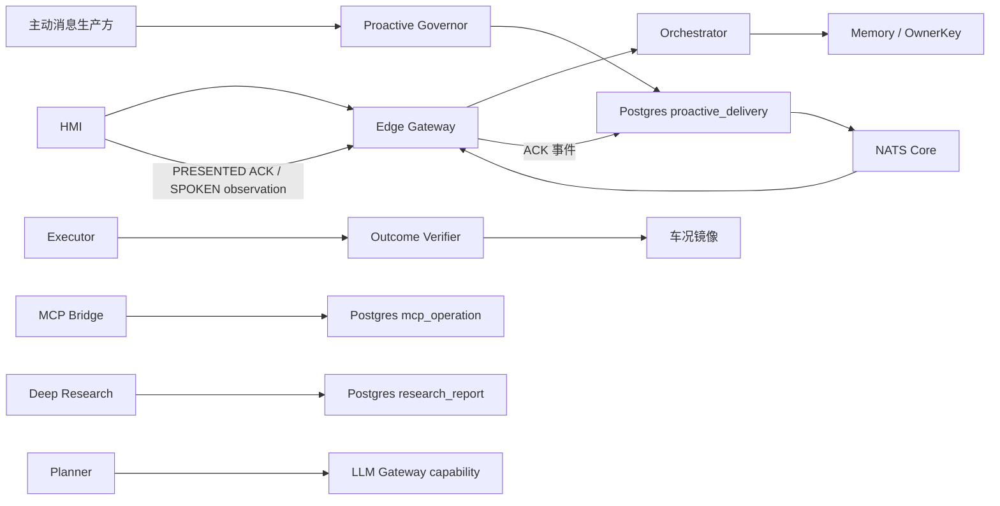

# M0a→M4 验收余项闭环总设计

> 日期：2026-07-28
> 状态：已获用户逐节批准，等待书面规格复核
> 基准提交：`77f5e93`
> 来源：`docs/reviews/2026-07-26-acceptance-review-m0a-m4.md`

## 1. 结论

采用“按用户风险纵切、四个里程碑交付”的方式关闭 2026-07-26 总体验收报告仍开放的 P1/P2，并同时处理与这些卡同根、否则无法真实验收的结构缺口。

不采用按技术域集中开发或一次性大爆炸合入。前者会推迟跨层验证，后者会放大回滚半径和外部 provider 方差。本轮每个风险切片都必须同时具备：

1. 能暴露原缺口的失败契约；
2. 最小正确实现；
3. 真实消费方；
4. 定向单测、集成测试和真栈证据；
5. 文档与验收状态更正。

## 2. 审计后的真实起点

实施前新鲜基线为：

- Python：`2323 passed, 7 skipped`；
- 验收相关定向测试：`438 passed`；
- 根 `compose.yaml` 真栈核心服务处于运行态；
- `main` 与 `origin/main` 均指向 `77f5e93`；
- 工作区已有两个用户未跟踪文件：
  - `docs/reviews/badcase/2026-07-26.md`
  - `docs/reviews/badcase/2026-07-27.md`

这两个文件不属于本轮改动，不得删除、覆盖或误暂存。

报告发布后的主干已经关闭：

- Skill `few_shots` 解析与注入；
- golden `expect_*` 消费方；
- `eval_skills` CI 阻断；
- Skill hybrid retrieval、holdout、ablation 与 T2 继承。

报告中两条判断经当前代码复核不成立：

- `PLANNER_TOOLCALL` 从实现之初就在每轮 `build()` 读取，不是 7 月 27 日后才修；
- cloud-gateway 的首次 `Handle` UNAVAILABLE 重试发生在同一入口函数内，不会重新经过幂等闸。

本轮只更正这些文档口径，不重复实现。

## 3. 范围

### 3.1 纳入

- E2E `PASS/PASS_WITH_SKIPS/SKIP/FAIL` 真实性、runner 单一清单、journeys canonical 新鲜度；
- 动态源码边界守卫、GDPR 非平凡删除、声纹双向隔离；
- Turn 说话人、places、reminder、routine、Edge 快路径的 occupant 归属；
- HMI 精确查看和四级删除语义；
- 声纹注册事务与重名约束；
- 主动消息 durable delivery、ACK、断线重投、深调研结果通知；
- Deep Research 报告资源、任务控制面与多轮缓存的 occupant 归属；
- S2S 声道仲裁、位置提醒二次条件与重新布防；
- Verifier 对 transport-uncertain 的失败后核验；
- Task Ledger 多实例原子幂等；
- MCP 查询、取消、补偿与外部业务状态；
- 已路由 MCP step 的声明式补槽、枚举校验与稳定幂等键；
- provider/model tool-calling 能力协商与热切换。

### 3.2 不纳入

- 跨乘员共享记忆；
- 声纹在线模板巩固、真人阈值再标定、语音注册入口；
- `vp_*` nightly 阈值流水线；
- 视觉多轮帧驻留和指代解析；
- 重叠对话式全双工；
- JetStream、多区域消息系统；
- 未经用户授权的 MCP 自动补偿；
- `sim.adas.*` 演示域。

### 3.3 验收报告追踪

报告 §7 恰有 13 张主卡：P1 六张、P2 七张。以下逐卡追踪，不用“同根处理”代替主卡状态。

| 卡号 | 2026-07-26 报告 §7 原始余项 | 处置 | 书面规格与最终证据 |
|---|---|---|---|
| P1-01 | 记忆写侧说话人标注 | 本轮实现 | M-B：Turn owner、exchange、OWNER_ONLY 抽取 |
| P1-02 | `profile.places` occupant 维度 | 本轮实现 | M-B：`memory_item place.*` 真相源与迁移 |
| P1-03 | MCP 订单查询/取消入口 | 本轮实现 | M-D：operation journal、status/cancel/compensate |
| P1-04 | 主动消息 × S2S 治理器侧方案 + 深调研推送持久化/重投 | 本轮实现 | M-C：durable delivery、speech channel、HMI ACK |
| P1-05 | Verifier `FAILED` 步查镜像改判 | 本轮实现 | M-C：`EXEC_UNKNOWN + state_match` |
| P1-06 | journeys canonical 全量重跑机制化 | 本轮实现 | M-A：单一清单、输入摘要、里程碑门禁 |
| P2-01 | HMI memory identity/删除语义 | 本轮实现 | M-B：只读受管身份与 L1-L4 删除 |
| P2-02 | enroll 原子性与重名检查 | 本轮实现 | M-B：名称规范化、唯一约束、事务 |
| P2-03 | SKIP 第三态显示 | 本轮实现 | M-A：`0/77/other` 与 `PASS_WITH_SKIPS` 协议 |
| P2-04 | 源码铁律黑名单改白名单/AST | 本轮实现 | M-A：动态 manifest 词汇源 + AST/import 边界 |
| P2-05 | location 提醒补 conditions | 本轮实现 | M-C：三态 `within_m` 与二次核验 |
| P2-06 | `few_shots` 契约实现或从文档删除 | 历史已修，只更正文档 | M-A 校验当前消费方并更新验收状态 |
| P2-07 | toolcall provider 能力位 | 本轮实现 | M-D：`GetCapabilities`、revision 协商 |

报告其他段落的同根伴随项和历史陈述单独追踪，不占用上述 13 张主卡：

| 伴随项或历史陈述 | 处置 | 书面规格与最终证据 |
|---|---|---|
| routine 建议信封无 owner | 同根伴随项，本轮实现 | M-B：owner 固定的主动建议信封；M-C：按 owner 持久投递 |
| reminder、Edge、Ledger 并发等同根缺口 | 同根伴随项，本轮实现 | 分别由 M-B、M-D 负责并纳入真栈矩阵 |
| `PLANNER_TOOLCALL` 须重启、cloud-gateway 重试绕过幂等 | 当前代码复核为误判，只更正文档 | M-A 保存复核证据；不制造重复实现 |

## 4. 总体架构

保持现有服务拓扑，新增五个边界清晰的业务真相源。

| 真相源 | 职责 |
|---|---|
| `OwnerKey=(user_id, occupant_id)` | 所有个性化数据的逻辑归属；数据库唯一性继续处于 tenant 命名空间内 |
| `proactive_delivery` | 主动消息接管、策略延后、重投、`PRESENTED` 通知合同和独立 `SPOKEN` 观测 |
| `research_report` | Deep Research 不可变完整报告工件；Ledger 与通知只保存 opaque ref/摘要 |
| `mcp_operation` | 外部订单与写操作的长生命周期业务状态 |
| LLM Gateway capability catalog | 当前 provider/model 的实际 tool-calling 能力 |

Task Ledger 继续表达“用户任务是否仍在处理”，NATS Core 继续表达“低延迟传输”。两者都不被扩张为通用业务真相源。

## 5. 全局不变量

1. `occupant_id` 只用于个性化，不参与鉴权。
2. 缺失 occupant 的旧数据或旧调用只能兼容为 `primary`，不能表示共享。
3. NATS publish 或 Gateway broadcast 成功不叫 delivered；只有 HMI `PRESENTED` ACK 才满足通知合同，`SPOKEN` 仅是独立播报观测。
4. 跨服务采用“至少一次 + 稳定 ID + 幂等消费”，不声称 exactly-once。
5. Proto 与数据库只做追加式演进；本轮不删除旧列、旧 field number 或 legacy places KV。
6. Governor、Verifier、Orchestrator 和 S2S session 层继续保持零领域字面量。
7. Verifier 只能纠正 transport/timeout 导致的不确定结果，不能覆盖确定失败。
8. MCP `submitted` 不等于业务完成，cancel accepted 不等于 cancelled。
9. HMI 现有防混音逻辑保留为末端保险。
10. 真栈只经根 `compose.yaml` 或 `make up`；不修改实际根 `.env`。

## 6. 四个里程碑

### M-A：可信尺子

建立单一 E2E 清单和完整结果协议，修复 destructive E2E 数据隔离、动态源码守卫、GDPR 前置与 canonical 新鲜度。后续里程碑不在不可信尺子上宣称完成。

清单主分组固定且仅允许 `default`、`security`、`provider_probe`、`acoustic_probe`、
`manual_inspection` 五个；`ci/nightly/milestone` 是 lane，`full` 是当前选集的完整执行标志，
二者都不是主分组。子脚本按 `0 / 77 / other` 归一为执行成功 / 整体 SKIP / FAIL；退出 `0`
但存在 case skip 时只能是 `PASS_WITH_SKIPS`。

规格：`2026-07-28-acceptance-residuals-ma-test-truth-design.md`

### M-B：多乘员隔离

完成 Turn owner、OWNER_ONLY 历史、places、reminder、Edge 轮次、HMI 精确删除与声纹事务；证明 A/B 双向隔离和 occupant 级删除。

规格：`2026-07-28-acceptance-residuals-mb-occupant-isolation-design.md`

### M-C：可靠触达与执行

以 Postgres durable delivery 接管关键主动消息，补 HMI ACK、断线重投、S2S 延后、location pending 和 Verifier transport-uncertain。

规格：`2026-07-28-acceptance-residuals-mc-reliable-delivery-design.md`

### M-D：外部生态闭环

完成 Ledger 原子幂等、MCP operation journal、查询/取消/补偿、声明式补槽和 provider tool capability。

规格：`2026-07-28-acceptance-residuals-md-external-ecosystem-design.md`

依赖顺序为 M-A → M-B → M-C → M-D。M-D 的 provider capability 可以独立开发，但仍在 M-D 统一验收，避免重复刷新 canonical。

## 7. 迁移与回滚

所有 schema 变更执行四阶段：

1. 只读 preflight，输出冲突和影响行数；
2. 对受影响表做本地 `pg_dump`，备份不进入 git；
3. 部署兼容新旧结构的代码和追加式 DDL；
4. backfill 验证后再建立约束。

发现活跃 Ledger 重复项或存量声纹重名时，迁移立即停止并报告，不自动删除、合并或改名。

回滚只回滚应用行为，不执行降级 DDL。新增表、列、索引和 proto 字段保留；places dual-read 和 HMI 末端防线保留至少一个稳定版本。

## 8. 验证与交付

每个风险切片固定执行：

1. 失败契约；
2. 受影响模块测试；
3. HMI/Dashboard 前端测试；
4. 全量 pytest；
5. 根 Compose 定向重建；
6. 真栈 E2E、并发或故障注入；
7. 架构、conventions、验收报告更新；
8. 独立提交并推送。

每个里程碑结束运行完整 regression journeys，并只在 provider 锁定、无过滤、相关 tracked inputs 干净时刷新 canonical。

实施分支为 `codex/acceptance-m0a-m4-residuals`。暂存必须使用显式文件路径，不得使用会吸入用户未跟踪文件的宽泛命令。

## 9. 程序级完成定义

只有同时满足下列条件，2026-07-26 验收余项才能整体关闭：

- 四个里程碑规格中的必做验收全部通过；
- 全量 Python/HMI/Dashboard 测试无回归；
- M-A runner 保持五个精确主分组，区分 lane/full，并按 `0/77/other` 与
  `PASS_WITH_SKIPS` 对 skip 和部分覆盖诚实呈现；
- 多乘员、主动可靠性、Verifier、MCP 与 provider 热切均有真栈证据；
- 里程碑 canonical 对应最终 tracked input digest；
- 验收报告逐项标注“已修、历史已修、误判更正、明确后置”，不遗留含糊状态；
- 分支提交已推送，工作区用户文件保持原样。
